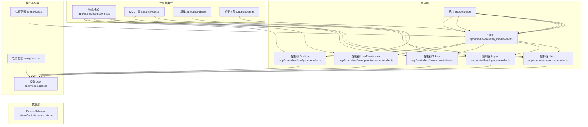
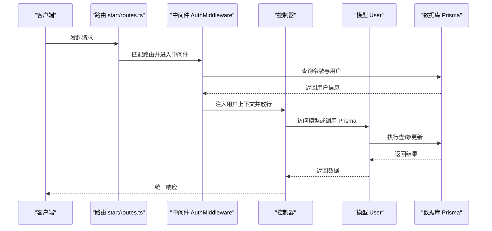
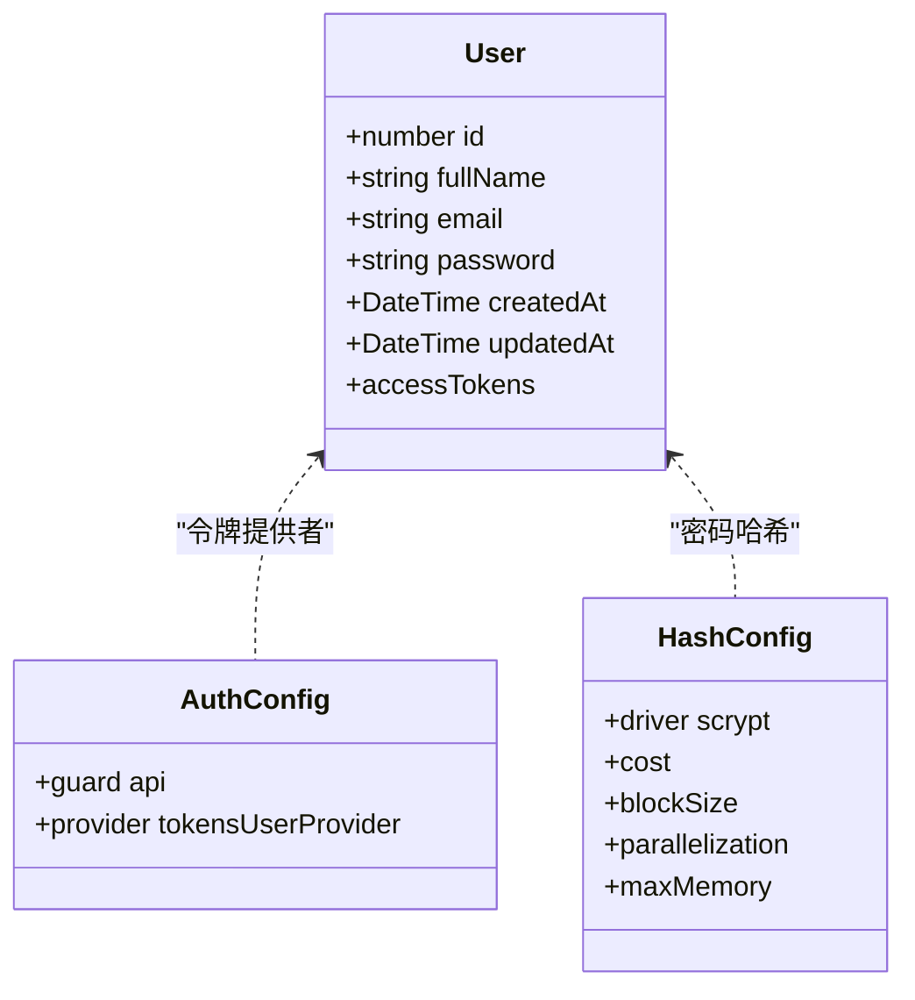
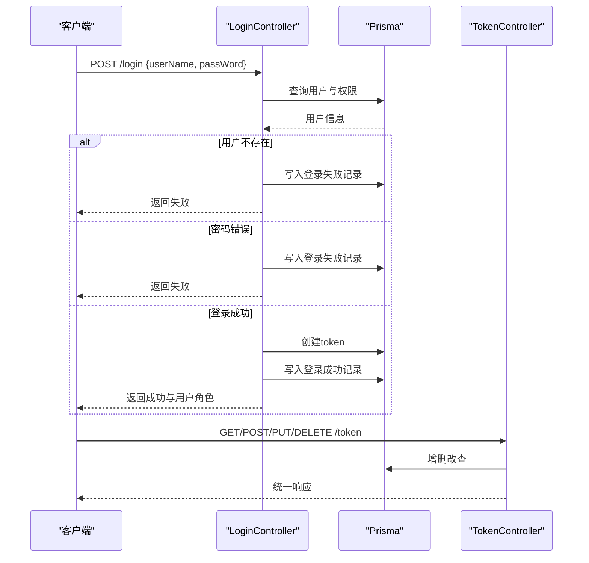
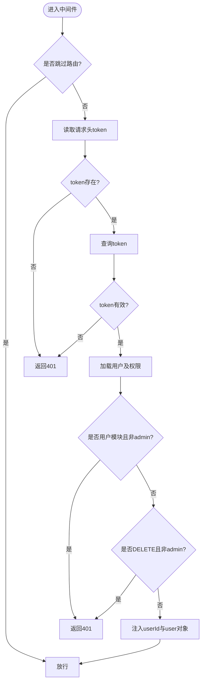
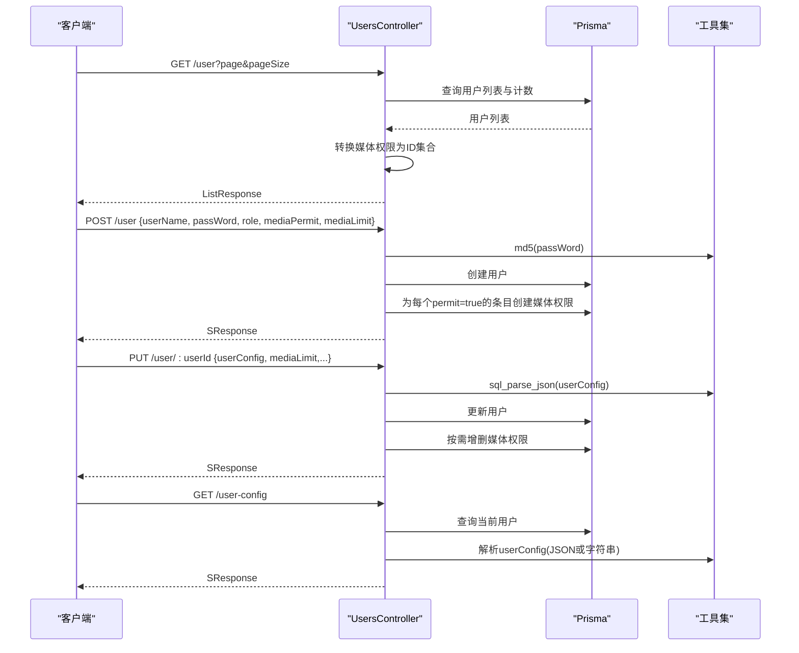
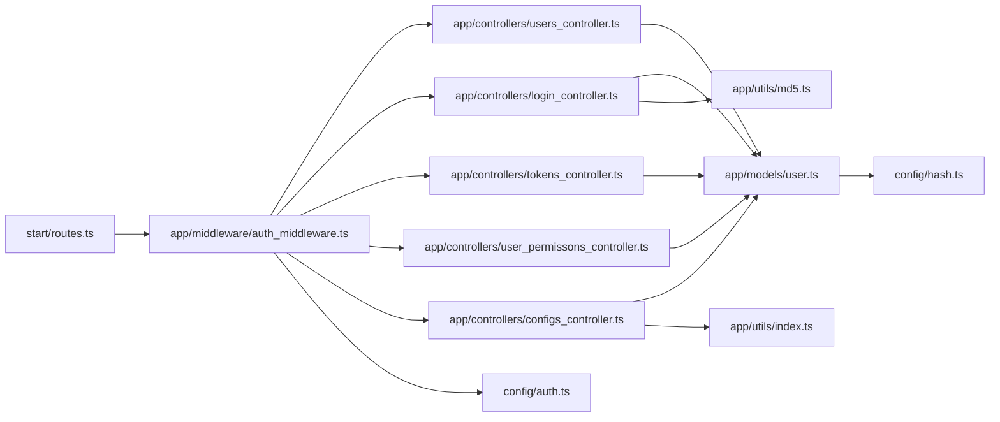
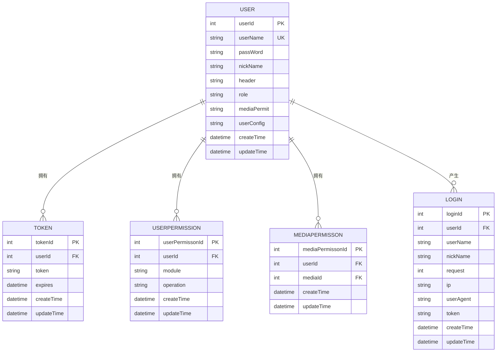

# 用户管理系统

<cite>
**本文引用的文件**
- [app/models/user.ts](file://app/models/user.ts)
- [app/controllers/users_controller.ts](file://app/controllers/users_controller.ts)
- [app/controllers/login_controller.ts](file://app/controllers/login_controller.ts)
- [app/controllers/user_permissons_controller.ts](file://app/controllers/user_permissons_controller.ts)
- [app/controllers/tokens_controller.ts](file://app/controllers/tokens_controller.ts)
- [app/controllers/configs_controller.ts](file://app/controllers/configs_controller.ts)
- [app/middleware/auth_middleware.ts](file://app/middleware/auth_middleware.ts)
- [app/interfaces/response.ts](file://app/interfaces/response.ts)
- [app/utils/md5.ts](file://app/utils/md5.ts)
- [app/utils/index.ts](file://app/utils/index.ts)
- [app/type/http.ts](file://app/type/http.ts)
- [config/auth.ts](file://config/auth.ts)
- [config/hash.ts](file://config/hash.ts)
- [start/routes.ts](file://start/routes.ts)
- [prisma/sqlite/schema.prisma](file://prisma/sqlite/schema.prisma)
</cite>

## 目录
1. [简介](#简介)
2. [项目结构](#项目结构)
3. [核心组件](#核心组件)
4. [架构总览](#架构总览)
5. [详细组件分析](#详细组件分析)
6. [依赖关系分析](#依赖关系分析)
7. [性能考量](#性能考量)
8. [故障排查指南](#故障排查指南)
9. [结论](#结论)
10. [附录](#附录)

## 简介
本文件系统性阐述 SManga Adonis 的用户管理系统，覆盖用户模型设计、认证与授权机制、权限控制、用户配置管理以及用户 CRUD 的完整实现。文档同时给出 API 接口说明、请求/响应格式、错误处理策略与安全建议，并通过图示展示关键流程，帮助开发者快速理解与正确使用。

## 项目结构
围绕用户管理的关键文件组织如下：
- 模型层：用户模型定义与认证混入
- 控制器层：用户、登录、令牌、用户权限、配置等控制器
- 中间件层：统一鉴权与权限拦截
- 配置层：认证守卫与哈希算法配置
- 数据层：Prisma SQLite Schema（含用户、令牌、媒体权限、用户权限等）
- 工具层：通用响应格式、MD5 加密、SQL JSON 序列化等

图表来源
- [start/routes.ts:1-241](file://start/routes.ts#L1-L241)
- [app/middleware/auth_middleware.ts:1-87](file://app/middleware/auth_middleware.ts#L1-L87)
- [app/controllers/users_controller.ts:1-160](file://app/controllers/users_controller.ts#L1-L160)
- [app/controllers/login_controller.ts:1-115](file://app/controllers/login_controller.ts#L1-L115)
- [app/controllers/tokens_controller.ts:1-61](file://app/controllers/tokens_controller.ts#L1-L61)
- [app/controllers/user_permissons_controller.ts:1-66](file://app/controllers/user_permissons_controller.ts#L1-L66)
- [app/controllers/configs_controller.ts:1-119](file://app/controllers/configs_controller.ts#L1-L119)
- [app/models/user.ts:1-33](file://app/models/user.ts#L1-L33)
- [config/auth.ts:1-28](file://config/auth.ts#L1-L28)
- [config/hash.ts:1-25](file://config/hash.ts#L1-L25)
- [prisma/sqlite/schema.prisma:368-400](file://prisma/sqlite/schema.prisma#L368-L400)
- [app/interfaces/response.ts:1-64](file://app/interfaces/response.ts#L1-L64)
- [app/utils/md5.ts:1-22](file://app/utils/md5.ts#L1-L22)
- [app/utils/index.ts:163-179](file://app/utils/index.ts#L163-L179)
- [app/type/http.ts:1-15](file://app/type/http.ts#L1-L15)

章节来源
- [start/routes.ts:1-241](file://start/routes.ts#L1-L241)
- [app/middleware/auth_middleware.ts:1-87](file://app/middleware/auth_middleware.ts#L1-L87)
- [app/models/user.ts:1-33](file://app/models/user.ts#L1-L33)
- [config/auth.ts:1-28](file://config/auth.ts#L1-L28)
- [config/hash.ts:1-25](file://config/hash.ts#L1-L25)
- [prisma/sqlite/schema.prisma:368-400](file://prisma/sqlite/schema.prisma#L368-L400)

## 核心组件
- 用户模型与认证
  - 使用 Lucid 模型与认证混入，基于 Scrypt 哈希进行密码校验，支持访问令牌提供者。
  - 字段包含基础信息与时间戳，密码字段序列化时隐藏。
- 登录与令牌
  - 登录控制器负责用户凭据校验、生成 UUID 令牌、记录登录日志与返回用户角色。
  - 令牌控制器提供令牌的增删改查。
- 权限与访问控制
  - 中间件统一拦截请求，校验 token、解析用户并注入上下文；对特定模块与 DELETE 请求进行角色限制。
  - 用户权限模型支持按模块与操作粒度的细粒度控制。
- 用户配置管理
  - 提供客户端用户配置读取与服务端全局配置读写接口，支持 JSON 存储与跨数据库兼容。
- 统一响应格式
  - 统一的响应包装类，便于前端一致处理。

章节来源
- [app/models/user.ts:1-33](file://app/models/user.ts#L1-L33)
- [app/controllers/login_controller.ts:1-115](file://app/controllers/login_controller.ts#L1-L115)
- [app/controllers/tokens_controller.ts:1-61](file://app/controllers/tokens_controller.ts#L1-L61)
- [app/middleware/auth_middleware.ts:1-87](file://app/middleware/auth_middleware.ts#L1-L87)
- [app/controllers/user_permissons_controller.ts:1-66](file://app/controllers/user_permissons_controller.ts#L1-L66)
- [app/controllers/configs_controller.ts:1-119](file://app/controllers/configs_controller.ts#L1-L119)
- [app/interfaces/response.ts:1-64](file://app/interfaces/response.ts#L1-L64)

## 架构总览
用户管理采用“路由 -> 中间件 -> 控制器 -> 模型/Prisma”的分层架构，认证通过访问令牌守卫实现，权限通过中间件与用户权限模型共同保障。

图表来源
- [start/routes.ts:194-200](file://start/routes.ts#L194-L200)
- [app/middleware/auth_middleware.ts:23-84](file://app/middleware/auth_middleware.ts#L23-L84)
- [app/models/user.ts:32-33](file://app/models/user.ts#L32-L33)
- [prisma/sqlite/schema.prisma:357-365](file://prisma/sqlite/schema.prisma#L357-L365)

## 详细组件分析

### 用户模型与认证
- 设计要点
  - 使用认证混入 withAuthFinder，指定 uid 为邮箱、密码列名为 password。
  - 密码使用 Scrypt 哈希，配置位于 config/hash.ts。
  - 访问令牌提供者绑定到 User 模型的 accessTokens。
- 安全与复杂度
  - Scrypt 参数可配置，兼顾安全性与性能。
  - 密码字段序列化隐藏，避免泄露。

图表来源
- [app/models/user.ts:8-33](file://app/models/user.ts#L8-L33)
- [config/auth.ts:5-15](file://config/auth.ts#L5-L15)
- [config/hash.ts:3-14](file://config/hash.ts#L3-L14)

章节来源
- [app/models/user.ts:1-33](file://app/models/user.ts#L1-L33)
- [config/hash.ts:1-25](file://config/hash.ts#L1-L25)
- [config/auth.ts:1-28](file://config/auth.ts#L1-L28)

### 登录与令牌流程
- 登录流程
  - 校验用户是否存在与密码是否匹配（MD5）。
  - 创建访问令牌并记录登录日志，返回用户角色与登录信息。
- 令牌管理
  - 提供令牌的增删改查接口，便于维护与审计。

图表来源
- [app/controllers/login_controller.ts:34-93](file://app/controllers/login_controller.ts#L34-L93)
- [app/controllers/tokens_controller.ts:13-61](file://app/controllers/tokens_controller.ts#L13-L61)
- [app/utils/md5.ts:19-21](file://app/utils/md5.ts#L19-L21)
- [prisma/sqlite/schema.prisma:148-160](file://prisma/sqlite/schema.prisma#L148-L160)
- [prisma/sqlite/schema.prisma:357-365](file://prisma/sqlite/schema.prisma#L357-L365)

章节来源
- [app/controllers/login_controller.ts:1-115](file://app/controllers/login_controller.ts#L1-L115)
- [app/controllers/tokens_controller.ts:1-61](file://app/controllers/tokens_controller.ts#L1-L61)
- [app/utils/md5.ts:1-22](file://app/utils/md5.ts#L1-L22)

### 权限控制与中间件
- 中间件职责
  - 校验 token 是否存在与有效。
  - 注入用户上下文，提取媒体限制与模块限制。
  - 对非管理员用户限制特定模块与 DELETE 请求。
- 角色与模块权限
  - 用户角色用于判断是否允许用户模块操作。
  - 用户权限模型支持模块与操作维度的细粒度控制。

图表来源
- [app/middleware/auth_middleware.ts:23-84](file://app/middleware/auth_middleware.ts#L23-L84)
- [prisma/sqlite/schema.prisma:368-382](file://prisma/sqlite/schema.prisma#L368-L382)
- [prisma/sqlite/schema.prisma:389-400](file://prisma/sqlite/schema.prisma#L389-L400)

章节来源
- [app/middleware/auth_middleware.ts:1-87](file://app/middleware/auth_middleware.ts#L1-L87)
- [app/type/http.ts:1-15](file://app/type/http.ts#L1-L15)
- [prisma/sqlite/schema.prisma:368-400](file://prisma/sqlite/schema.prisma#L368-L400)

### 用户 CRUD 与配置管理
- 用户 CRUD
  - 列表/详情：支持分页与媒体权限映射。
  - 创建：校验必填字段，密码以 MD5 存储，批量写入媒体权限。
  - 更新：可选更新密码、用户配置（JSON 序列化）、角色与媒体权限。
  - 删除：删除用户。
- 用户配置
  - 客户端配置读取：根据当前用户返回其 userConfig。
  - 服务端配置写入：仅管理员可修改，涉及定时任务重建等副作用。

图表来源
- [app/controllers/users_controller.ts:8-160](file://app/controllers/users_controller.ts#L8-L160)
- [app/utils/md5.ts:19-21](file://app/utils/md5.ts#L19-L21)
- [app/utils/index.ts:163-179](file://app/utils/index.ts#L163-L179)
- [prisma/sqlite/schema.prisma:368-382](file://prisma/sqlite/schema.prisma#L368-L382)

章节来源
- [app/controllers/users_controller.ts:1-160](file://app/controllers/users_controller.ts#L1-L160)
- [app/controllers/configs_controller.ts:1-119](file://app/controllers/configs_controller.ts#L1-L119)
- [app/utils/md5.ts:1-22](file://app/utils/md5.ts#L1-L22)
- [app/utils/index.ts:163-179](file://app/utils/index.ts#L163-L179)

### API 接口说明
- 登录
  - POST /login
  - 请求体：{ userName, passWord }
  - 响应：统一响应，包含登录记录与用户角色
- 用户管理
  - GET /user
  - GET /user/:userId
  - POST /user
  - PUT /user/:userId
  - DELETE /user/:userId
- 用户配置
  - GET client-user-config
  - PUT serve-config
  - PUT user-config
- 令牌管理
  - GET /token
  - GET /token/:tokenId
  - POST /token
  - PUT /token/:tokenId
  - DELETE /token/:tokenId
- 用户权限
  - GET /user-permission
  - GET /user-permission/:userPermissonId
  - POST /user-permission
  - PUT /user-permission/:userPermissonId
  - DELETE /user-permission/:userPermissonId

章节来源
- [start/routes.ts:120-126](file://start/routes.ts#L120-L126)
- [start/routes.ts:194-200](file://start/routes.ts#L194-L200)
- [start/routes.ts:232-235](file://start/routes.ts#L232-L235)
- [start/routes.ts:35-35](file://start/routes.ts#L35-L35)

## 依赖关系分析
- 组件耦合
  - 控制器依赖 Prisma 与工具集；模型依赖认证混入与哈希配置。
  - 中间件依赖 Prisma 查询用户与权限，并向控制器注入上下文。
- 外部依赖
  - AdonisJS 认证与哈希、Prisma ORM、SQLite 数据库。
- 可能的循环依赖
  - 当前结构清晰，未发现循环导入。

图表来源
- [start/routes.ts:1-241](file://start/routes.ts#L1-L241)
- [app/middleware/auth_middleware.ts:1-87](file://app/middleware/auth_middleware.ts#L1-L87)
- [app/controllers/users_controller.ts:1-160](file://app/controllers/users_controller.ts#L1-L160)
- [app/controllers/login_controller.ts:1-115](file://app/controllers/login_controller.ts#L1-L115)
- [app/controllers/tokens_controller.ts:1-61](file://app/controllers/tokens_controller.ts#L1-L61)
- [app/controllers/user_permissons_controller.ts:1-66](file://app/controllers/user_permissons_controller.ts#L1-L66)
- [app/controllers/configs_controller.ts:1-119](file://app/controllers/configs_controller.ts#L1-L119)
- [app/models/user.ts:1-33](file://app/models/user.ts#L1-L33)
- [config/auth.ts:1-28](file://config/auth.ts#L1-L28)
- [config/hash.ts:1-25](file://config/hash.ts#L1-L25)
- [app/utils/index.ts:1-313](file://app/utils/index.ts#L1-L313)
- [app/utils/md5.ts:1-22](file://app/utils/md5.ts#L1-L22)

章节来源
- [start/routes.ts:1-241](file://start/routes.ts#L1-L241)
- [app/middleware/auth_middleware.ts:1-87](file://app/middleware/auth_middleware.ts#L1-L87)
- [app/models/user.ts:1-33](file://app/models/user.ts#L1-L33)
- [config/auth.ts:1-28](file://config/auth.ts#L1-L28)
- [config/hash.ts:1-25](file://config/hash.ts#L1-L25)

## 性能考量
- 哈希成本
  - Scrypt 参数影响 CPU 与内存占用，建议在生产环境评估并适当调整。
- 查询优化
  - 用户列表分页查询与计数并行执行，减少往返。
  - 权限更新采用按需增删，避免全量覆盖。
- 缓存与并发
  - 可结合 Redis 或应用层缓存优化频繁查询。
  - 令牌查询应建立索引，确保高并发下的低延迟。

## 故障排查指南
- 401 未授权
  - 检查请求头是否携带 token，确认 token 未过期。
  - 确认用户角色是否满足模块或 DELETE 请求要求。
- 登录失败
  - 核对用户名与密码是否正确；确认密码存储为 MD5。
  - 查看登录记录表中失败原因与 IP、UA。
- 配置读写异常
  - 确认服务端配置文件路径与权限。
  - 检查 JSON 序列化/反序列化逻辑与数据库客户端类型。

章节来源
- [app/middleware/auth_middleware.ts:32-54](file://app/middleware/auth_middleware.ts#L32-L54)
- [app/controllers/login_controller.ts:44-66](file://app/controllers/login_controller.ts#L44-L66)
- [app/controllers/configs_controller.ts:97-117](file://app/controllers/configs_controller.ts#L97-L117)
- [app/utils/index.ts:163-179](file://app/utils/index.ts#L163-L179)

## 结论
SManga Adonis 的用户管理系统以清晰的分层架构与统一的响应格式为基础，结合访问令牌与中间件实现了可靠的认证与权限控制。通过 Prisma 的模型设计与工具集的支持，用户 CRUD、登录流程、配置管理与权限控制均具备良好的可维护性与扩展性。建议在生产环境中进一步强化安全配置与性能优化。

## 附录
- 数据模型概览（用户相关）
  - 用户：用户基本信息、角色、媒体权限策略、用户配置、关联登录与令牌。
  - 令牌：用户访问令牌，用于中间件校验。
  - 用户权限：按模块与操作的细粒度权限。
  - 媒体权限：用户对媒体库的访问限制。

图表来源
- [prisma/sqlite/schema.prisma:357-365](file://prisma/sqlite/schema.prisma#L357-L365)
- [prisma/sqlite/schema.prisma:389-400](file://prisma/sqlite/schema.prisma#L389-L400)
- [prisma/sqlite/schema.prisma:238-249](file://prisma/sqlite/schema.prisma#L238-L249)
- [prisma/sqlite/schema.prisma:148-160](file://prisma/sqlite/schema.prisma#L148-L160)
- [prisma/sqlite/schema.prisma:368-382](file://prisma/sqlite/schema.prisma#L368-L382)