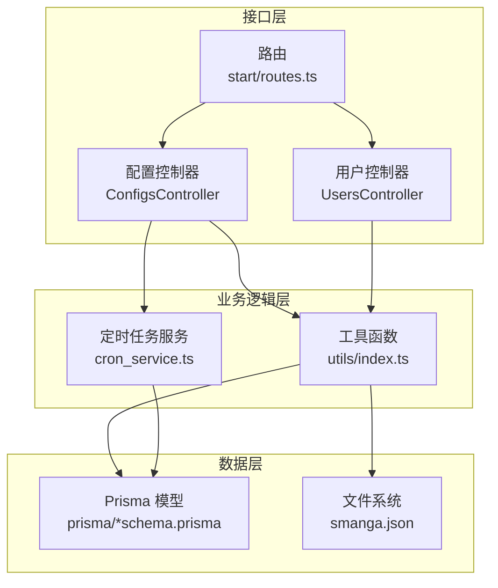
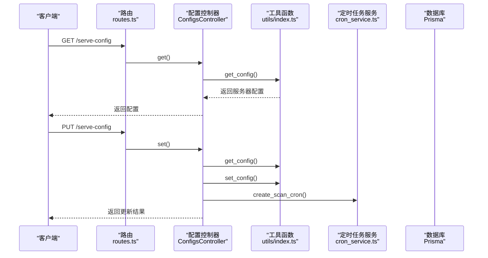
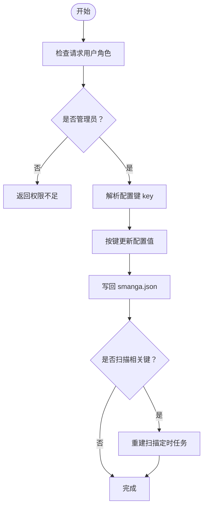
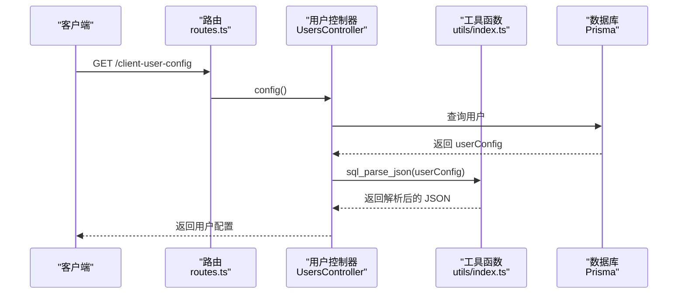
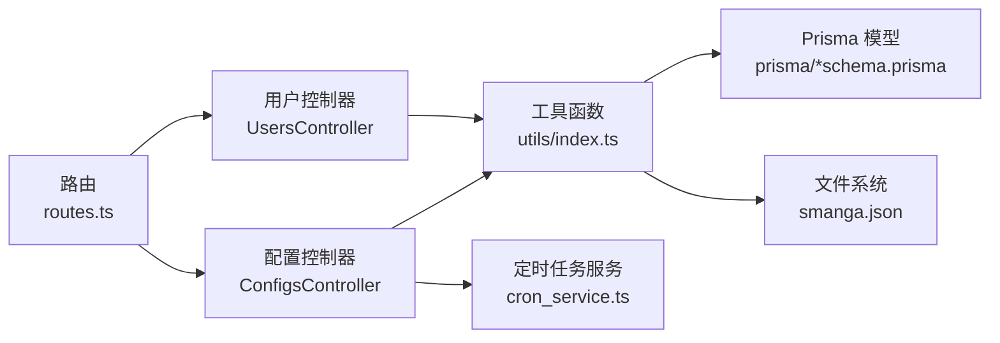

# 用户配置管理

<cite>
**本文引用的文件**
- [app/controllers/configs_controller.ts](file://app/controllers/configs_controller.ts)
- [app/controllers/users_controller.ts](file://app/controllers/users_controller.ts)
- [app/utils/index.ts](file://app/utils/index.ts)
- [app/services/cron_service.ts](file://app/services/cron_service.ts)
- [start/routes.ts](file://start/routes.ts)
- [app/middleware/auth_middleware.ts](file://app/middleware/auth_middleware.ts)
- [data-example/config/smanga.json](file://data-example/config/smanga.json)
- [prisma/sqlite/schema.prisma](file://prisma/sqlite/schema.prisma)
- [prisma/mysql/schema.prisma](file://prisma/mysql/schema.prisma)
- [prisma/pgsql/schema.prisma](file://prisma/pgsql/schema.prisma)
</cite>

## 目录
1. [简介](#简介)
2. [项目结构](#项目结构)
3. [核心组件](#核心组件)
4. [架构总览](#架构总览)
5. [详细组件分析](#详细组件分析)
6. [依赖关系分析](#依赖关系分析)
7. [性能考量](#性能考量)
8. [故障排查指南](#故障排查指南)
9. [结论](#结论)
10. [附录](#附录)

## 简介
本文件系统性阐述 SManga Adonis 的“用户配置管理”能力，覆盖以下方面：
- 用户个性化配置的数据结构与持久化方式（用户级 userConfig 字段）
- 服务器端全局配置（smanga.json）的读取、更新与生效机制
- 配置项分类与默认值管理策略
- 配置读取流程、更新机制、配置继承与同步策略
- 配置验证与默认值处理、JSON 格式处理与跨数据库差异
- 实际使用场景与最佳实践

## 项目结构
围绕用户配置管理的关键文件与职责如下：
- 配置控制器：负责对外提供配置读取、服务器配置更新、用户配置更新接口
- 工具层：负责配置文件读取、写入、JSON 序列化/反序列化适配
- 服务层：基于配置调度定时任务（扫描、同步、封面生成、清理）
- 路由与中间件：暴露 REST 接口并进行鉴权与权限控制
- 数据模型：用户模型包含 userConfig 字段，支持 SQLite/MySQL/PostgreSQL 的 JSON 存储差异

图表来源
- [start/routes.ts:231-235](file://start/routes.ts#L231-L235)
- [app/controllers/configs_controller.ts:9-118](file://app/controllers/configs_controller.ts#L9-L118)
- [app/controllers/users_controller.ts:147-158](file://app/controllers/users_controller.ts#L147-L158)
- [app/utils/index.ts:94-115](file://app/utils/index.ts#L94-L115)
- [app/services/cron_service.ts:16-89](file://app/services/cron_service.ts#L16-L89)
- [prisma/sqlite/schema.prisma:368-386](file://prisma/sqlite/schema.prisma#L368-L386)

章节来源
- [start/routes.ts:231-235](file://start/routes.ts#L231-L235)
- [app/controllers/configs_controller.ts:9-118](file://app/controllers/configs_controller.ts#L9-L118)
- [app/controllers/users_controller.ts:147-158](file://app/controllers/users_controller.ts#L147-L158)
- [app/utils/index.ts:94-115](file://app/utils/index.ts#L94-L115)
- [app/services/cron_service.ts:16-89](file://app/services/cron_service.ts#L16-L89)
- [prisma/sqlite/schema.prisma:368-386](file://prisma/sqlite/schema.prisma#L368-L386)

## 核心组件
- 配置控制器（ConfigsController）
  - 提供服务器端配置读取与更新接口
  - 仅管理员可修改服务器配置
  - 修改扫描类配置后自动重建定时任务
- 用户控制器（UsersController）
  - 提供客户端用户配置读取接口
  - 支持更新用户配置字段 userConfig
- 工具函数（utils/index.ts）
  - 读取/写入 smanga.json
  - 统一 JSON 序列化/反序列化适配（SQLite 以字符串存储 JSON，其他数据库可直接存储 JSON）
- 定时任务服务（cron_service.ts）
  - 基于配置调度扫描、同步、封面生成、清理等周期任务
- 路由与中间件
  - 暴露 REST 接口
  - 鉴权与权限校验（管理员）

章节来源
- [app/controllers/configs_controller.ts:9-118](file://app/controllers/configs_controller.ts#L9-L118)
- [app/controllers/users_controller.ts:147-158](file://app/controllers/users_controller.ts#L147-L158)
- [app/utils/index.ts:94-115](file://app/utils/index.ts#L94-L115)
- [app/services/cron_service.ts:16-89](file://app/services/cron_service.ts#L16-L89)
- [start/routes.ts:231-235](file://start/routes.ts#L231-L235)
- [app/middleware/auth_middleware.ts:17-85](file://app/middleware/auth_middleware.ts#L17-L85)

## 架构总览
用户配置管理涉及三层交互：
- 服务器配置（全局）：存储于 smanga.json，通过配置控制器读取/更新
- 用户配置（个人）：存储于用户表 user.userConfig，通过用户控制器读取/更新
- 定时任务：根据服务器配置动态调度，确保配置变更即时生效

图表来源
- [start/routes.ts:231-235](file://start/routes.ts#L231-L235)
- [app/controllers/configs_controller.ts:10-95](file://app/controllers/configs_controller.ts#L10-L95)
- [app/utils/index.ts:94-115](file://app/utils/index.ts#L94-L115)
- [app/services/cron_service.ts:16-43](file://app/services/cron_service.ts#L16-L43)

## 详细组件分析

### 服务器配置（smanga.json）管理
- 读取流程
  - 从平台特定路径读取 smanga.json 并解析为对象
  - 用于后续配置项读取与任务调度
- 更新流程
  - 仅管理员可调用
  - 支持逐项更新（如扫描间隔、同步间隔、压缩参数等）
  - 更新后写回 smanga.json
  - 若涉及扫描相关配置，重建定时任务
- 配置项分类
  - 数据库连接（sql）
  - 图像处理（imagick）
  - 扫描（scan）
  - 调试（debug）
  - SSL（ssl）
  - 压缩（compress）
  - 队列（queue）
  - 同步（sync）

图表来源
- [app/controllers/configs_controller.ts:16-95](file://app/controllers/configs_controller.ts#L16-L95)
- [app/utils/index.ts:94-115](file://app/utils/index.ts#L94-L115)
- [app/services/cron_service.ts:16-43](file://app/services/cron_service.ts#L16-L43)

章节来源
- [app/controllers/configs_controller.ts:10-95](file://app/controllers/configs_controller.ts#L10-L95)
- [data-example/config/smanga.json:1-54](file://data-example/config/smanga.json#L1-L54)
- [app/utils/index.ts:94-115](file://app/utils/index.ts#L94-L115)
- [app/services/cron_service.ts:16-43](file://app/services/cron_service.ts#L16-L43)

### 用户配置（user.userConfig）管理
- 读取流程
  - 通过用户控制器读取当前用户的 userConfig
  - 使用统一 JSON 解析适配函数处理存储差异
- 更新流程
  - 支持更新用户配置字段
  - 写入前统一转换为数据库可接受的 JSON 形态
- 数据模型差异
  - SQLite：userConfig 以字符串存储 JSON
  - MySQL/PostgreSQL：userConfig 以 JSON 类型存储
- 默认值与继承
  - 未设置时返回空对象
  - 前端可根据自身需求合并默认值

图表来源
- [start/routes.ts:232](file://start/routes.ts#L232)
- [app/controllers/users_controller.ts:147-158](file://app/controllers/users_controller.ts#L147-L158)
- [app/utils/index.ts:163-179](file://app/utils/index.ts#L163-L179)
- [prisma/sqlite/schema.prisma:378](file://prisma/sqlite/schema.prisma#L378)
- [prisma/mysql/schema.prisma:380](file://prisma/mysql/schema.prisma#L380)
- [prisma/pgsql/schema.prisma:379](file://prisma/pgsql/schema.prisma#L379)

章节来源
- [app/controllers/users_controller.ts:147-158](file://app/controllers/users_controller.ts#L147-L158)
- [app/utils/index.ts:163-179](file://app/utils/index.ts#L163-L179)
- [prisma/sqlite/schema.prisma:368-386](file://prisma/sqlite/schema.prisma#L368-L386)
- [prisma/mysql/schema.prisma:370-388](file://prisma/mysql/schema.prisma#L370-L388)
- [prisma/pgsql/schema.prisma:369-387](file://prisma/pgsql/schema.prisma#L369-L387)

### 配置项验证与默认值管理
- 验证
  - 服务器配置更新接口对非管理员返回权限错误
  - 用户配置更新接口通过数据库约束保证字段完整性
- 默认值
  - 服务器配置默认值来源于示例配置文件
  - 用户配置默认值为空对象，前端自行合并
- JSON 处理
  - 统一使用 sql_parse_json 函数处理存储差异
  - 字符串与对象之间的双向转换

章节来源
- [app/controllers/configs_controller.ts:18-20](file://app/controllers/configs_controller.ts#L18-L20)
- [app/utils/index.ts:163-179](file://app/utils/index.ts#L163-L179)
- [data-example/config/smanga.json:1-54](file://data-example/config/smanga.json#L1-L54)

### 配置同步策略
- 服务器配置
  - 写回 smanga.json 后立即生效
  - 扫描相关配置变更触发定时任务重建
- 用户配置
  - 直接写入数据库，立即生效
  - 前端拉取最新配置并合并本地缓存

章节来源
- [app/controllers/configs_controller.ts:84-95](file://app/controllers/configs_controller.ts#L84-L95)
- [app/controllers/users_controller.ts:97-106](file://app/controllers/users_controller.ts#L97-L106)
- [app/services/cron_service.ts:16-43](file://app/services/cron_service.ts#L16-L43)

### 配置示例与分类
- 示例配置（摘自示例文件）
  - 数据库连接、图像处理、扫描、调试、SSL、压缩、队列、同步
- 用户配置建议
  - 界面偏好、功能开关、自定义选项等
  - 建议前端维护默认值清单，与后端返回的 userConfig 合并

章节来源
- [data-example/config/smanga.json:1-54](file://data-example/config/smanga.json#L1-L54)

## 依赖关系分析
- 控制器依赖工具函数进行配置读写与 JSON 适配
- 配置控制器依赖定时任务服务以响应扫描类配置变更
- 用户控制器依赖工具函数进行 JSON 适配
- 路由与中间件共同保障接口访问的安全性与权限控制

图表来源
- [start/routes.ts:231-235](file://start/routes.ts#L231-L235)
- [app/controllers/configs_controller.ts:9-118](file://app/controllers/configs_controller.ts#L9-L118)
- [app/controllers/users_controller.ts:147-158](file://app/controllers/users_controller.ts#L147-L158)
- [app/utils/index.ts:94-115](file://app/utils/index.ts#L94-L115)
- [app/services/cron_service.ts:16-89](file://app/services/cron_service.ts#L16-L89)
- [prisma/sqlite/schema.prisma:368-386](file://prisma/sqlite/schema.prisma#L368-L386)

章节来源
- [start/routes.ts:231-235](file://start/routes.ts#L231-L235)
- [app/controllers/configs_controller.ts:9-118](file://app/controllers/configs_controller.ts#L9-L118)
- [app/controllers/users_controller.ts:147-158](file://app/controllers/users_controller.ts#L147-L158)
- [app/utils/index.ts:94-115](file://app/utils/index.ts#L94-L115)
- [app/services/cron_service.ts:16-89](file://app/services/cron_service.ts#L16-L89)
- [prisma/sqlite/schema.prisma:368-386](file://prisma/sqlite/schema.prisma#L368-L386)

## 性能考量
- 配置读取
  - 服务器配置读取为轻量文件 I/O，建议在应用启动时缓存
- 配置更新
  - 写回 smanga.json 为同步 I/O，建议避免频繁更新
  - 扫描类配置变更重建定时任务，注意任务数量与并发
- JSON 处理
  - 统一的 sql_parse_json 可减少数据库类型差异带来的开销
- 数据库存储
  - SQLite 以字符串存储 JSON，写入成本较低；MySQL/PostgreSQL 直接存储 JSON，查询更高效

## 故障排查指南
- 权限不足
  - 服务器配置更新需管理员身份，否则返回权限错误
- 配置写入失败
  - 检查 smanga.json 文件权限与磁盘空间
  - 确认路径与平台匹配（Windows/Linux）
- 定时任务未生效
  - 确认扫描类配置键是否正确
  - 检查定时任务服务是否正常运行
- 用户配置读取异常
  - 确认 userConfig 是否为合法 JSON
  - 检查数据库类型与存储差异（SQLite/MySQL/PostgreSQL）

章节来源
- [app/controllers/configs_controller.ts:18-20](file://app/controllers/configs_controller.ts#L18-L20)
- [app/utils/index.ts:94-115](file://app/utils/index.ts#L94-L115)
- [app/services/cron_service.ts:16-43](file://app/services/cron_service.ts#L16-L43)
- [app/controllers/users_controller.ts:147-158](file://app/controllers/users_controller.ts#L147-L158)

## 结论
SManga Adonis 的用户配置管理采用“服务器配置 + 用户配置”的双轨模式：
- 服务器配置（smanga.json）集中管理全局行为，支持热更新与定时任务联动
- 用户配置（user.userConfig）面向个人偏好，支持跨数据库的 JSON 存储差异
- 通过统一的工具函数与严格的权限控制，确保配置安全、一致与可维护

## 附录
- 接口一览
  - GET /serve-config：读取服务器配置
  - PUT /serve-config：更新服务器配置（管理员）
  - GET /client-user-config：读取当前用户配置
  - PUT /user-config：更新当前用户配置
- 配置项建议
  - 服务器配置：扫描间隔、同步间隔、压缩参数、队列并发等
  - 用户配置：界面主题、分页大小、排序方式、功能开关等

章节来源
- [start/routes.ts:231-235](file://start/routes.ts#L231-L235)
- [app/controllers/configs_controller.ts:10-118](file://app/controllers/configs_controller.ts#L10-L118)
- [app/controllers/users_controller.ts:147-158](file://app/controllers/users_controller.ts#L147-L158)