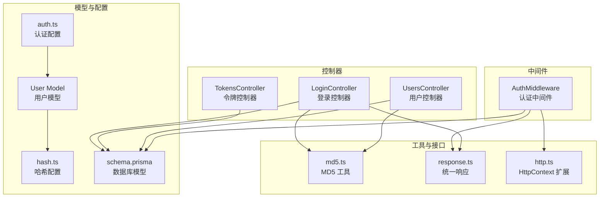
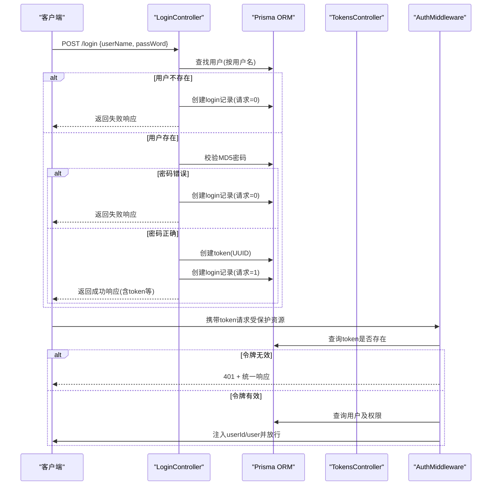
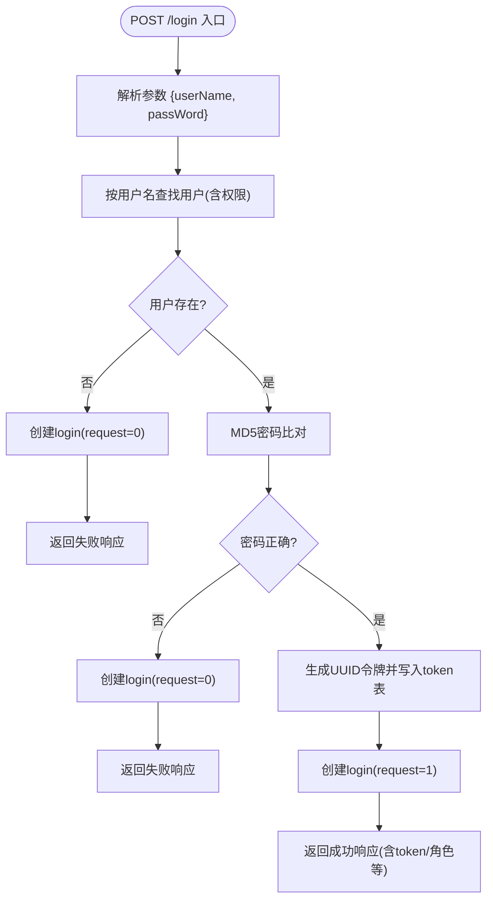
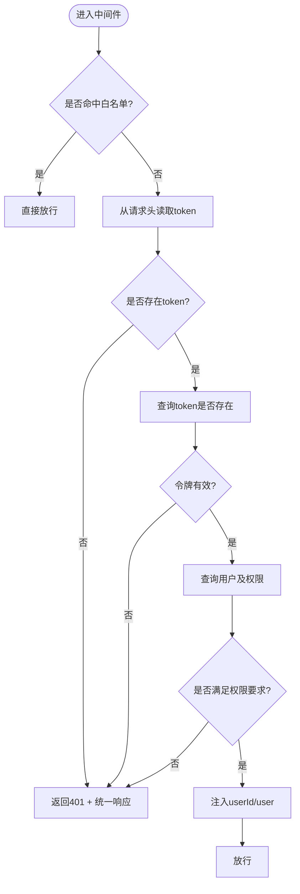
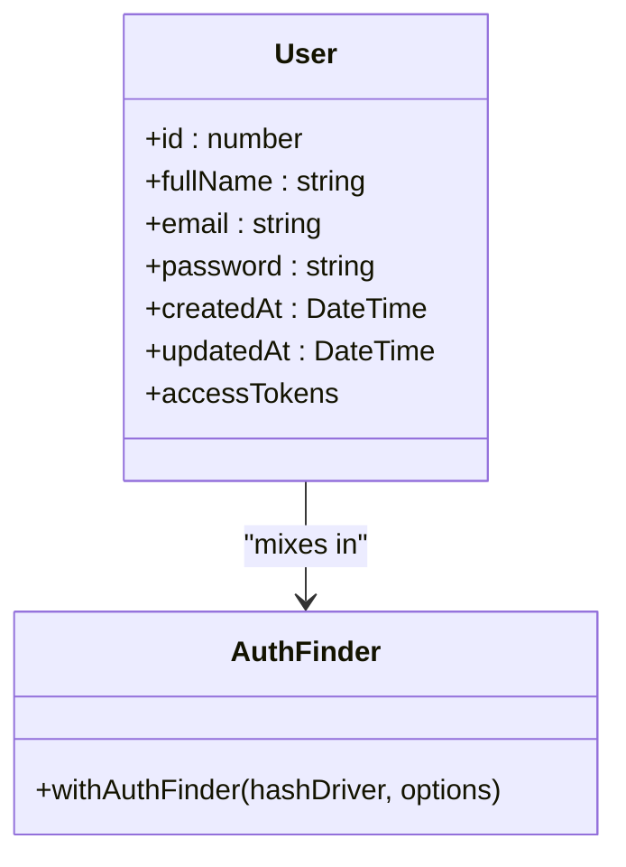
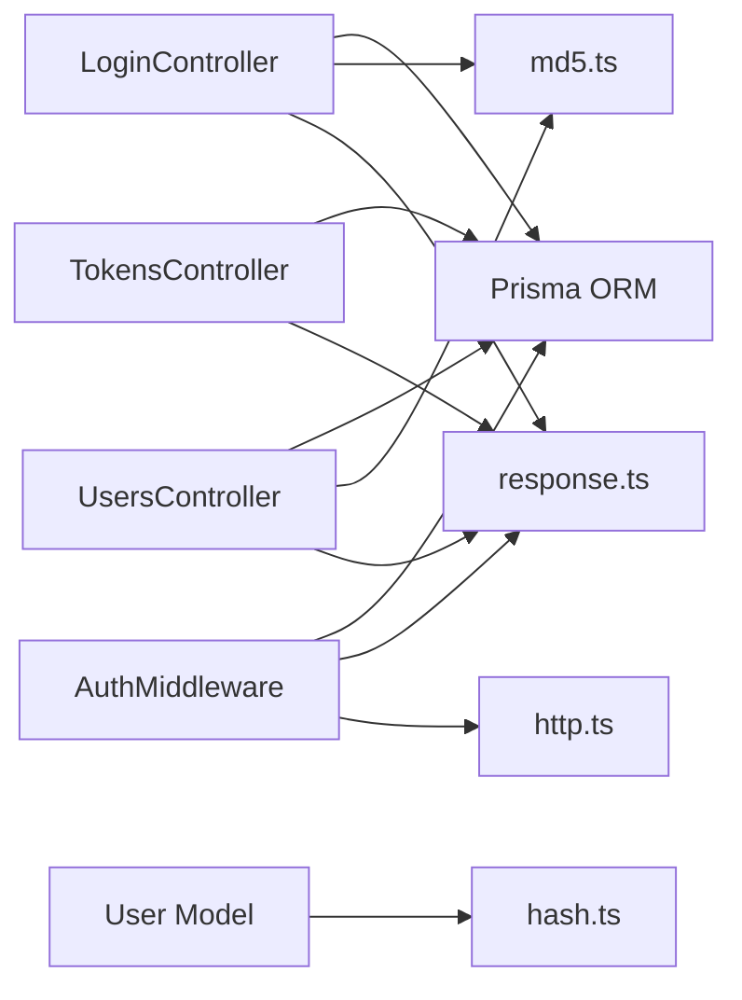
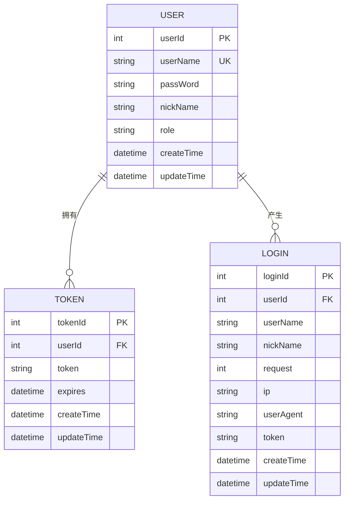

# 认证系统

<cite>
**本文引用的文件**
- [app/controllers/login_controller.ts](file://app/controllers/login_controller.ts)
- [app/controllers/tokens_controller.ts](file://app/controllers/tokens_controller.ts)
- [app/controllers/users_controller.ts](file://app/controllers/users_controller.ts)
- [app/middleware/auth_middleware.ts](file://app/middleware/auth_middleware.ts)
- [app/models/user.ts](file://app/models/user.ts)
- [app/utils/md5.ts](file://app/utils/md5.ts)
- [app/interfaces/response.ts](file://app/interfaces/response.ts)
- [app/type/http.ts](file://app/type/http.ts)
- [config/auth.ts](file://config/auth.ts)
- [config/hash.ts](file://config/hash.ts)
- [start/routes.ts](file://start/routes.ts)
- [prisma/sqlite/schema.prisma](file://prisma/sqlite/schema.prisma)
</cite>

## 目录
1. [简介](#简介)
2. [项目结构](#项目结构)
3. [核心组件](#核心组件)
4. [架构总览](#架构总览)
5. [详细组件分析](#详细组件分析)
6. [依赖关系分析](#依赖关系分析)
7. [性能考量](#性能考量)
8. [故障排查指南](#故障排查指南)
9. [结论](#结论)
10. [附录](#附录)

## 简介
本文件系统性梳理 SManga Adonis 的认证与授权体系，覆盖以下主题：
- 用户登录验证机制：用户名密码校验、MD5 密码比对、登录记录与令牌生成
- JWT 令牌生成与验证流程：令牌模型、中间件校验、权限控制
- 密码加密存储策略：MD5 存储与 Scrypt 对比建议
- 登录控制器实现：请求参数解析、用户查找、令牌签发、会话管理
- 认证中间件工作原理：路由白名单、令牌提取、用户权限注入
- 令牌验证流程、过期处理与刷新机制现状与改进建议
- API 接口说明、请求/响应格式、错误处理策略与安全考虑
- 实际代码示例路径（以文件+行号定位），便于最佳实践与常见场景参考

## 项目结构
认证相关的关键目录与文件如下：
- 控制器层：登录控制器、令牌控制器、用户控制器
- 中间件层：认证中间件
- 模型层：用户模型（含访问令牌提供者）
- 配置层：认证配置、哈希配置
- 数据模型：Prisma schema 定义了 user、token、login 等核心表
- 工具与接口：MD5 工具、统一响应格式、HTTP 类型扩展

图表来源
- [app/controllers/login_controller.ts:1-115](file://app/controllers/login_controller.ts#L1-L115)
- [app/controllers/tokens_controller.ts:1-61](file://app/controllers/tokens_controller.ts#L1-L61)
- [app/controllers/users_controller.ts:1-160](file://app/controllers/users_controller.ts#L1-L160)
- [app/middleware/auth_middleware.ts:1-87](file://app/middleware/auth_middleware.ts#L1-L87)
- [app/models/user.ts:1-33](file://app/models/user.ts#L1-L33)
- [config/auth.ts:1-28](file://config/auth.ts#L1-L28)
- [config/hash.ts:1-25](file://config/hash.ts#L1-L25)
- [prisma/sqlite/schema.prisma:148-160](file://prisma/sqlite/schema.prisma#L148-L160)
- [prisma/sqlite/schema.prisma:357-365](file://prisma/sqlite/schema.prisma#L357-L365)
- [prisma/sqlite/schema.prisma:368-386](file://prisma/sqlite/schema.prisma#L368-L386)

章节来源
- [start/routes.ts:120-126](file://start/routes.ts#L120-L126)
- [config/auth.ts:1-28](file://config/auth.ts#L1-L28)
- [config/hash.ts:1-25](file://config/hash.ts#L1-L25)

## 核心组件
- 登录控制器（LoginController）：负责登录入口、用户查找、密码校验（MD5）、令牌签发、登录记录写入与统一响应
- 认证中间件（AuthMiddleware）：拦截请求，从请求头提取令牌、查询令牌有效性、注入用户信息与权限、处理无权限与令牌错误
- 用户模型（User）：基于 Lucid withAuthFinder，结合 Scrypt 哈希驱动，定义访问令牌提供者
- 令牌控制器（TokensController）：令牌的 CRUD 管理（供后台维护使用）
- 用户控制器（UsersController）：用户创建/更新时使用 MD5 存储密码（当前实现）
- MD5 工具（md5.ts）：提供 MD5 加密函数
- 统一响应（response.ts）：标准化返回结构
- HTTP 类型扩展（http.ts）：向 HttpContext 注入 userId 与 user 字段

章节来源
- [app/controllers/login_controller.ts:34-93](file://app/controllers/login_controller.ts#L34-L93)
- [app/middleware/auth_middleware.ts:23-85](file://app/middleware/auth_middleware.ts#L23-L85)
- [app/models/user.ts:8-33](file://app/models/user.ts#L8-L33)
- [app/controllers/tokens_controller.ts:13-61](file://app/controllers/tokens_controller.ts#L13-L61)
- [app/controllers/users_controller.ts:52-85](file://app/controllers/users_controller.ts#L52-L85)
- [app/utils/md5.ts:19-21](file://app/utils/md5.ts#L19-L21)
- [app/interfaces/response.ts:18-33](file://app/interfaces/response.ts#L18-L33)
- [app/type/http.ts:12-14](file://app/type/http.ts#L12-L14)

## 架构总览
认证系统采用“令牌 + 中间件”的模式：
- 登录流程：客户端提交用户名/密码 → 服务端查找用户 → MD5 密码比对 → 生成 UUID 令牌 → 写入 token 表与 login 登录记录 → 返回统一响应
- 请求流程：客户端携带 token 请求受保护资源 → 中间件从请求头提取 token → 查询 token 是否存在 → 注入用户与权限 → 放行或返回 401
- 权限控制：中间件根据用户角色与模块权限进行细粒度控制

图表来源
- [app/controllers/login_controller.ts:34-93](file://app/controllers/login_controller.ts#L34-L93)
- [app/controllers/tokens_controller.ts:33-40](file://app/controllers/tokens_controller.ts#L33-L40)
- [app/middleware/auth_middleware.ts:23-85](file://app/middleware/auth_middleware.ts#L23-L85)

## 详细组件分析

### 登录控制器（LoginController）
职责与流程要点：
- GET /login：列出登录记录
- GET /login/:loginId：查询单条登录记录
- POST /login：核心登录逻辑
  - 参数解析：接收 userName、passWord
  - 用户查找：按用户名唯一查找，并包含用户权限关联
  - 用户不存在：创建 login 记录（request=0），返回失败响应
  - 密码校验：使用 MD5 对比；不一致则创建 login 记录（request=0），返回失败响应
  - 密码正确：生成 UUID 令牌并写入 token 表，同时写入 login 记录（request=1），返回成功响应（包含用户角色等）
- PUT /login/:loginId、DELETE /login/:loginId：更新与删除登录记录

图表来源
- [app/controllers/login_controller.ts:34-93](file://app/controllers/login_controller.ts#L34-L93)

章节来源
- [app/controllers/login_controller.ts:14-115](file://app/controllers/login_controller.ts#L14-L115)
- [app/utils/md5.ts:19-21](file://app/utils/md5.ts#L19-L21)
- [app/interfaces/response.ts:18-33](file://app/interfaces/response.ts#L18-L33)

### 认证中间件（AuthMiddleware）
职责与流程要点：
- 路由白名单：跳过 /deploy、/test、/login、/file、/analysis 等无需认证的路由
- 令牌提取：从请求头读取 token
- 令牌校验：查询 token 表是否存在该令牌
- 用户与权限注入：查出用户及其媒体/模块权限，注入到 request.userId 与 request.user
- 权限控制：
  - /user 路由（除 /user-config）仅 admin 可访问
  - DELETE 方法且非 admin 触发无权限
- 错误处理：未携带 token 或令牌无效返回 401 + 统一响应

图表来源
- [app/middleware/auth_middleware.ts:23-85](file://app/middleware/auth_middleware.ts#L23-L85)
- [app/interfaces/response.ts:18-33](file://app/interfaces/response.ts#L18-L33)
- [app/type/http.ts:12-14](file://app/type/http.ts#L12-L14)

章节来源
- [app/middleware/auth_middleware.ts:17-87](file://app/middleware/auth_middleware.ts#L17-L87)
- [app/type/http.ts:12-14](file://app/type/http.ts#L12-L14)

### 用户模型与令牌提供者（User）
- 使用 withAuthFinder 与 Scrypt 哈希驱动，支持基于 uid/email 的认证
- accessTokens 使用 DbAccessTokensProvider.forModel(User)，用于令牌持久化与查询
- 当前登录流程中使用 MD5 存储密码，与 User 模型的 Scrypt 不一致，存在安全风险

图表来源
- [app/models/user.ts:8-33](file://app/models/user.ts#L8-L33)

章节来源
- [app/models/user.ts:13-33](file://app/models/user.ts#L13-L33)
- [config/hash.ts:7-12](file://config/hash.ts#L7-L12)

### 令牌控制器（TokensController）
- 提供 /token 的列表、详情、新增、更新、删除接口
- 用于后台运维与调试，便于查看/管理令牌状态

章节来源
- [app/controllers/tokens_controller.ts:13-61](file://app/controllers/tokens_controller.ts#L13-L61)

### 用户控制器（UsersController）
- 用户创建/更新时使用 MD5 存储密码（当前实现）
- 与 User 模型的 Scrypt 哈希策略不一致，建议统一为 Scrypt

章节来源
- [app/controllers/users_controller.ts:52-85](file://app/controllers/users_controller.ts#L52-L85)
- [config/hash.ts:7-12](file://config/hash.ts#L7-L12)

### MD5 工具与统一响应
- md5.ts：提供 MD5 加密函数，用于密码比对与存储
- response.ts：统一响应结构（code/message/data/error/status）

章节来源
- [app/utils/md5.ts:19-21](file://app/utils/md5.ts#L19-L21)
- [app/interfaces/response.ts:18-33](file://app/interfaces/response.ts#L18-L33)

## 依赖关系分析
- 登录控制器依赖 Prisma 查询用户与写入 token/login，依赖 MD5 工具与统一响应
- 认证中间件依赖 Prisma 查询 token 与用户，依赖统一响应与 HTTP 类型扩展
- 用户模型依赖 Scrypt 哈希配置，但登录流程仍使用 MD5，存在策略不一致
- 令牌控制器与用户控制器均依赖 Prisma 与统一响应

图表来源
- [app/controllers/login_controller.ts:8-12](file://app/controllers/login_controller.ts#L8-L12)
- [app/middleware/auth_middleware.ts:8-11](file://app/middleware/auth_middleware.ts#L8-L11)
- [app/models/user.ts:2-6](file://app/models/user.ts#L2-L6)
- [config/hash.ts:3-14](file://config/hash.ts#L3-L14)
- [app/controllers/tokens_controller.ts:9-11](file://app/controllers/tokens_controller.ts#L9-L11)
- [app/controllers/users_controller.ts:2-5](file://app/controllers/users_controller.ts#L2-L5)

章节来源
- [app/controllers/login_controller.ts:8-12](file://app/controllers/login_controller.ts#L8-L12)
- [app/middleware/auth_middleware.ts:8-11](file://app/middleware/auth_middleware.ts#L8-L11)
- [app/models/user.ts:2-6](file://app/models/user.ts#L2-L6)
- [config/hash.ts:3-14](file://config/hash.ts#L3-L14)
- [app/controllers/tokens_controller.ts:9-11](file://app/controllers/tokens_controller.ts#L9-L11)
- [app/controllers/users_controller.ts:2-5](file://app/controllers/users_controller.ts#L2-L5)

## 性能考量
- 令牌查询：中间件每次请求均需查询 token 表，建议在高并发场景引入缓存（如 Redis）短期缓存有效 token，降低数据库压力
- 密码校验：MD5 速度较快但安全性较低，建议迁移至 Scrypt 并配合盐值策略
- 权限注入：中间件一次性查询用户与权限并注入，避免后续多次查询
- 白名单路由：减少不必要的中间件开销

## 故障排查指南
- 401 令牌错误
  - 现象：返回统一响应，状态为 token error
  - 可能原因：未携带 token、token 不存在、token 已被删除
  - 排查步骤：确认请求头是否包含 token；检查 token 表是否存在；检查登录记录
- 无权限操作
  - 现象：返回统一响应，状态为 permisson error
  - 可能原因：非 admin 访问 /user 下受保护接口；DELETE 方法且非 admin
  - 排查步骤：确认用户角色；确认访问方法与路由
- 登录失败
  - 现象：返回失败响应（用户不存在或密码错误）
  - 可能原因：用户名不存在；MD5 密码不匹配
  - 排查步骤：核对用户名；确认密码 MD5 值；检查 login 记录

章节来源
- [app/middleware/auth_middleware.ts:34-54](file://app/middleware/auth_middleware.ts#L34-L54)
- [app/middleware/auth_middleware.ts:63-76](file://app/middleware/auth_middleware.ts#L63-L76)
- [app/controllers/login_controller.ts:44-66](file://app/controllers/login_controller.ts#L44-L66)

## 结论
- 当前实现采用“用户名+MD5 密码+UUID 令牌”的简单认证方案，满足基础需求
- 与用户模型的 Scrypt 哈希策略不一致，存在安全风险，建议统一为 Scrypt
- 中间件具备基本的权限控制能力，可进一步细化模块权限与操作权限
- 建议引入令牌缓存、过期时间与刷新机制，提升安全性与可用性

## 附录

### API 接口说明
- 登录
  - POST /login
  - 请求参数：userName、passWord
  - 成功响应：包含登录记录与用户角色
  - 失败响应：用户不存在或密码错误
- 获取登录记录
  - GET /login
  - GET /login/:loginId
- 管理令牌
  - GET /token
  - GET /token/:tokenId
  - POST /token
  - PUT /token/:tokenId
  - DELETE /token/:tokenId
- 用户管理（与认证相关）
  - POST /user（创建用户时使用 MD5 存储密码）
  - PUT /user/:userId（更新用户时可修改密码）

章节来源
- [start/routes.ts:120-126](file://start/routes.ts#L120-L126)
- [app/controllers/login_controller.ts:14-115](file://app/controllers/login_controller.ts#L14-L115)
- [app/controllers/tokens_controller.ts:13-61](file://app/controllers/tokens_controller.ts#L13-L61)
- [app/controllers/users_controller.ts:52-85](file://app/controllers/users_controller.ts#L52-L85)

### 数据模型概览（与认证相关）
- user：用户主表，包含用户名、密码、角色等
- token：令牌表，保存用户令牌
- login：登录记录表，记录登录尝试与结果

图表来源
- [prisma/sqlite/schema.prisma:368-386](file://prisma/sqlite/schema.prisma#L368-L386)
- [prisma/sqlite/schema.prisma:357-365](file://prisma/sqlite/schema.prisma#L357-L365)
- [prisma/sqlite/schema.prisma:148-160](file://prisma/sqlite/schema.prisma#L148-L160)

### 安全与最佳实践建议
- 密码策略统一：将登录控制器与用户控制器的密码存储策略统一为 Scrypt，并引入随机盐值
- 令牌过期与刷新：为 token 表增加 expires 字段并在中间件中校验；提供刷新接口
- 传输安全：强制 HTTPS，避免明文传输 token
- 速率限制：对 /login 接口增加频率限制，防止暴力破解
- 审计日志：完善 login 表字段（如登录时间、UA、IP），便于审计与风控