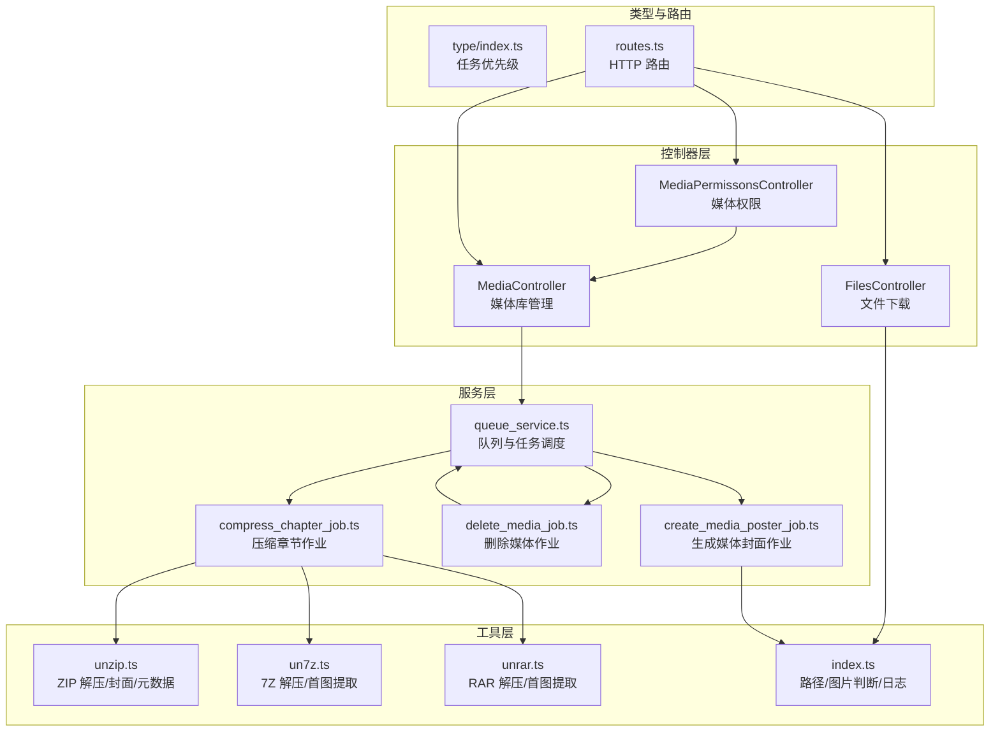
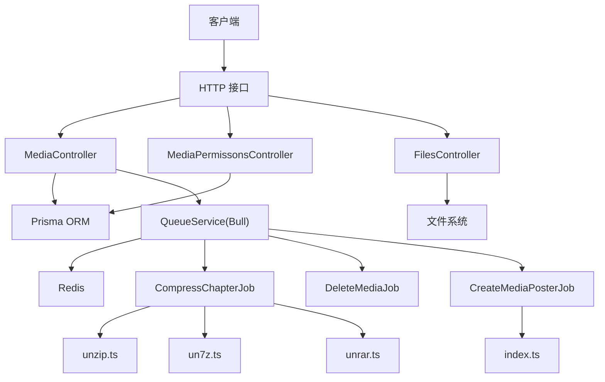
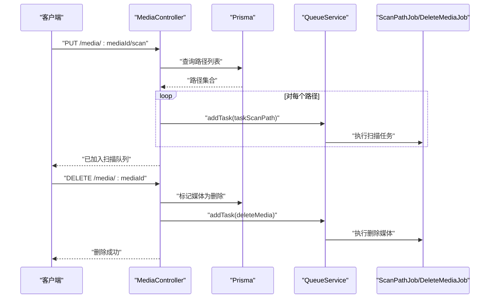
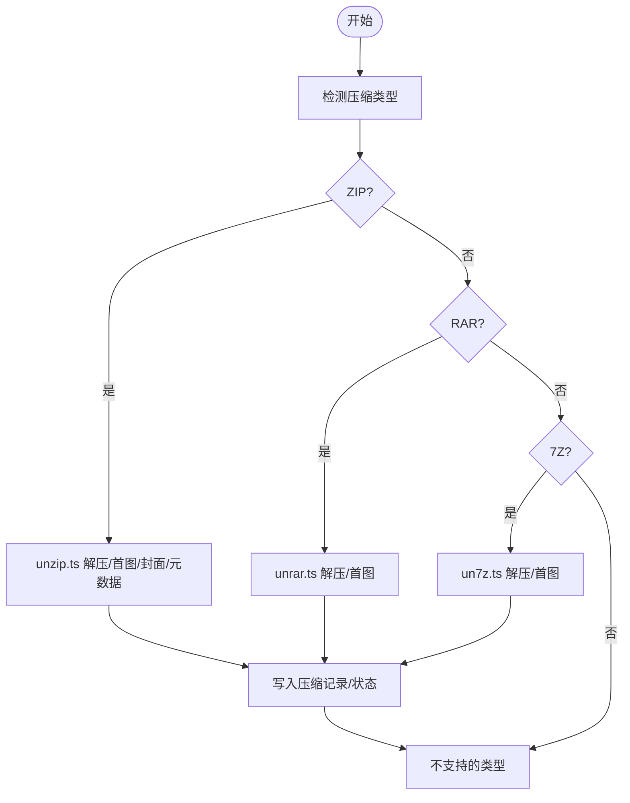
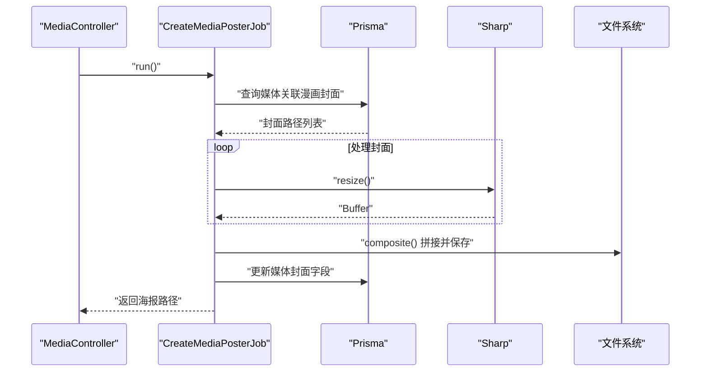
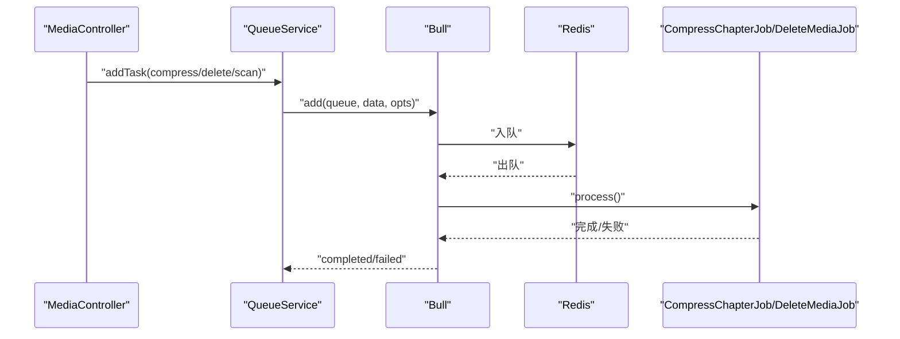
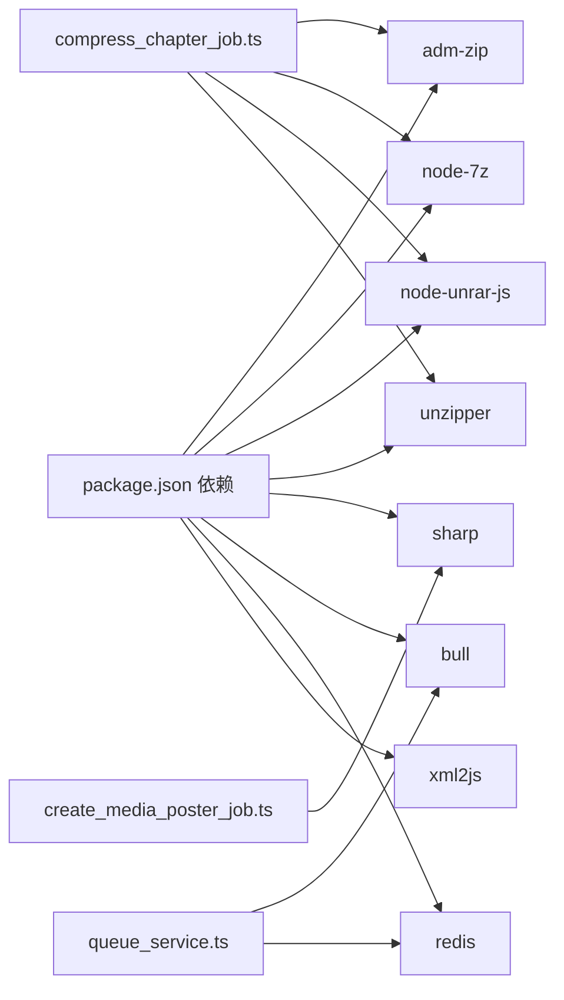

# 媒体文件管理

<cite>
**本文引用的文件**
- [app/controllers/media_controller.ts](file://app/controllers/media_controller.ts)
- [app/controllers/media_permissons_controller.ts](file://app/controllers/media_permissons_controller.ts)
- [app/controllers/files_controller.ts](file://app/controllers/files_controller.ts)
- [app/utils/unzip.ts](file://app/utils/unzip.ts)
- [app/utils/un7z.ts](file://app/utils/un7z.ts)
- [app/utils/unrar.ts](file://app/utils/unrar.ts)
- [app/utils/index.ts](file://app/utils/index.ts)
- [app/services/compress_chapter_job.ts](file://app/services/compress_chapter_job.ts)
- [app/services/delete_media_job.ts](file://app/services/delete_media_job.ts)
- [app/services/create_media_poster_job.ts](file://app/services/create_media_poster_job.ts)
- [app/services/queue_service.ts](file://app/services/queue_service.ts)
- [app/type/index.ts](file://app/type/index.ts)
- [start/routes.ts](file://start/routes.ts)
- [package.json](file://package.json)
</cite>

## 目录
1. [简介](#简介)
2. [项目结构](#项目结构)
3. [核心组件](#核心组件)
4. [架构总览](#架构总览)
5. [详细组件分析](#详细组件分析)
6. [依赖关系分析](#依赖关系分析)
7. [性能考量](#性能考量)
8. [故障排查指南](#故障排查指南)
9. [结论](#结论)
10. [附录](#附录)

## 简介
本文件面向 SManga Adonis 的媒体文件管理能力，系统性阐述媒体文件的存储策略、压缩处理与访问控制机制；覆盖 ZIP、7Z、RAR、PDF、IMG 等格式的处理方式；详述文件解压缩流程（含异步任务创建、执行与状态监控）、媒体权限控制（用户权限验证、媒体访问限制与文件安全保护）、文件上传/下载与缓存管理、文件路径管理与临时清理、存储空间优化策略，以及压缩文件处理的全流程（状态跟踪、错误处理与重试机制）。

## 项目结构
围绕媒体文件管理的关键模块与文件组织如下：
- 控制器层：媒体库管理、媒体权限、文件下载等
- 工具层：多格式解压工具（ZIP/7Z/RAR）、通用路径与图片判断
- 服务层：压缩章节作业、删除媒体作业、生成媒体封面作业、队列服务
- 类型与路由：任务优先级枚举、HTTP 路由定义
- 依赖：Bull 队列、Redis、Sharp 图像处理、node-7z、node-unrar-js、adm-zip、unzipper 等

图表来源
- [app/controllers/media_controller.ts:1-206](file://app/controllers/media_controller.ts#L1-L206)
- [app/controllers/media_permissons_controller.ts:1-61](file://app/controllers/media_permissons_controller.ts#L1-L61)
- [app/controllers/files_controller.ts:1-55](file://app/controllers/files_controller.ts#L1-L55)
- [app/utils/unzip.ts:1-168](file://app/utils/unzip.ts#L1-L168)
- [app/utils/un7z.ts:1-141](file://app/utils/un7z.ts#L1-L141)
- [app/utils/unrar.ts:1-118](file://app/utils/unrar.ts#L1-L118)
- [app/utils/index.ts:1-313](file://app/utils/index.ts#L1-L313)
- [app/services/compress_chapter_job.ts:1-71](file://app/services/compress_chapter_job.ts#L1-L71)
- [app/services/delete_media_job.ts:1-39](file://app/services/delete_media_job.ts#L1-L39)
- [app/services/create_media_poster_job.ts:1-92](file://app/services/create_media_poster_job.ts#L1-L92)
- [app/services/queue_service.ts:1-267](file://app/services/queue_service.ts#L1-L267)
- [app/type/index.ts:1-49](file://app/type/index.ts#L1-L49)
- [start/routes.ts:1-241](file://start/routes.ts#L1-L241)

章节来源
- [start/routes.ts:134-142](file://start/routes.ts#L134-L142)
- [app/controllers/media_controller.ts:1-206](file://app/controllers/media_controller.ts#L1-L206)
- [app/controllers/media_permissons_controller.ts:1-61](file://app/controllers/media_permissons_controller.ts#L1-L61)
- [app/controllers/files_controller.ts:1-55](file://app/controllers/files_controller.ts#L1-L55)
- [app/utils/unzip.ts:1-168](file://app/utils/unzip.ts#L1-L168)
- [app/utils/un7z.ts:1-141](file://app/utils/un7z.ts#L1-L141)
- [app/utils/unrar.ts:1-118](file://app/utils/unrar.ts#L1-L118)
- [app/utils/index.ts:1-313](file://app/utils/index.ts#L1-L313)
- [app/services/compress_chapter_job.ts:1-71](file://app/services/compress_chapter_job.ts#L1-L71)
- [app/services/delete_media_job.ts:1-39](file://app/services/delete_media_job.ts#L1-L39)
- [app/services/create_media_poster_job.ts:1-92](file://app/services/create_media_poster_job.ts#L1-L92)
- [app/services/queue_service.ts:1-267](file://app/services/queue_service.ts#L1-L267)
- [app/type/index.ts:1-49](file://app/type/index.ts#L1-L49)

## 核心组件
- 媒体库控制器：负责媒体库列表、详情、创建、更新、删除、生成封面、批量扫描等操作；内置基于用户角色与媒体权限表的访问控制。
- 媒体权限控制器：提供媒体权限记录的增删改查接口。
- 文件下载控制器：提供静态资源下载与 APK 下载能力，包含基础校验与 MIME/附件响应。
- 解压工具集：统一处理 ZIP、7Z、RAR 的解压、首图提取、封面与元数据解析。
- 作业与队列：压缩章节、删除媒体、生成媒体封面等异步任务通过 Bull+Redis 调度，支持优先级、重试与超时。
- 路由与类型：定义媒体相关 API 路由与任务优先级枚举。

章节来源
- [app/controllers/media_controller.ts:8-206](file://app/controllers/media_controller.ts#L8-L206)
- [app/controllers/media_permissons_controller.ts:13-61](file://app/controllers/media_permissons_controller.ts#L13-L61)
- [app/controllers/files_controller.ts:6-55](file://app/controllers/files_controller.ts#L6-L55)
- [app/utils/unzip.ts:10-168](file://app/utils/unzip.ts#L10-L168)
- [app/utils/un7z.ts:12-141](file://app/utils/un7z.ts#L12-L141)
- [app/utils/unrar.ts:7-118](file://app/utils/unrar.ts#L7-L118)
- [app/services/compress_chapter_job.ts:6-71](file://app/services/compress_chapter_job.ts#L6-L71)
- [app/services/delete_media_job.ts:12-39](file://app/services/delete_media_job.ts#L12-L39)
- [app/services/create_media_poster_job.ts:9-92](file://app/services/create_media_poster_job.ts#L9-L92)
- [app/services/queue_service.ts:17-267](file://app/services/queue_service.ts#L17-L267)
- [app/type/index.ts:3-16](file://app/type/index.ts#L3-L16)
- [start/routes.ts:134-142](file://start/routes.ts#L134-L142)

## 架构总览
媒体文件管理采用“控制器-服务-工具-队列”的分层架构，结合数据库与 Redis/Bull 实现异步任务编排与状态跟踪。

图表来源
- [app/controllers/media_controller.ts:1-206](file://app/controllers/media_controller.ts#L1-L206)
- [app/controllers/media_permissons_controller.ts:1-61](file://app/controllers/media_permissons_controller.ts#L1-L61)
- [app/controllers/files_controller.ts:1-55](file://app/controllers/files_controller.ts#L1-L55)
- [app/services/queue_service.ts:1-267](file://app/services/queue_service.ts#L1-L267)
- [app/services/compress_chapter_job.ts:1-71](file://app/services/compress_chapter_job.ts#L1-L71)
- [app/services/delete_media_job.ts:1-39](file://app/services/delete_media_job.ts#L1-L39)
- [app/services/create_media_poster_job.ts:1-92](file://app/services/create_media_poster_job.ts#L1-L92)
- [app/utils/unzip.ts:1-168](file://app/utils/unzip.ts#L1-L168)
- [app/utils/un7z.ts:1-141](file://app/utils/un7z.ts#L1-L141)
- [app/utils/unrar.ts:1-118](file://app/utils/unrar.ts#L1-L118)
- [app/utils/index.ts:1-313](file://app/utils/index.ts#L1-L313)

## 详细组件分析

### 媒体库控制器（访问控制与扫描）
- 访问控制：根据用户角色与媒体权限表进行过滤，管理员或拥有媒体权限的用户可查看对应媒体库。
- 批量扫描：向队列提交扫描任务，按路径批量加入扫描队列。
- 生成封面：调用作业生成媒体封面并回写媒体封面字段。

图表来源
- [app/controllers/media_controller.ts:187-204](file://app/controllers/media_controller.ts#L187-L204)
- [app/services/queue_service.ts:103-141](file://app/services/queue_service.ts#L103-L141)
- [app/services/delete_media_job.ts:19-37](file://app/services/delete_media_job.ts#L19-L37)

章节来源
- [app/controllers/media_controller.ts:8-206](file://app/controllers/media_controller.ts#L8-L206)
- [app/services/delete_media_job.ts:1-39](file://app/services/delete_media_job.ts#L1-L39)
- [app/services/queue_service.ts:1-267](file://app/services/queue_service.ts#L1-L267)

### 媒体权限控制器（权限记录管理）
- 提供媒体权限记录的列表、详情、创建、更新、删除接口，支撑媒体访问控制。

章节来源
- [app/controllers/media_permissons_controller.ts:1-61](file://app/controllers/media_permissons_controller.ts#L1-L61)

### 文件下载控制器（上传/下载/缓存）
- 下载图片/文件：校验路径存在性，设置合适的 Content-Type 或附件响应，流式返回文件内容。
- APK 下载：根据操作系统选择路径，设置附件并返回文件内容。

章节来源
- [app/controllers/files_controller.ts:6-55](file://app/controllers/files_controller.ts#L6-L55)
- [app/utils/index.ts:9-18](file://app/utils/index.ts#L9-L18)

### 解压工具集（ZIP/7Z/RAR/IMG 处理）
- ZIP：支持全量解压、首图提取（顺序/带 cover 名称优先）、封面提取、ComicInfo.xml 元数据解析。
- 7Z：支持全量解压、列出内容、首图提取（优先 cover 名称）。
- RAR：支持全量解压、首图提取（优先 cover 名称）。
- IMG：统一的图片格式判断与路径/缓存/封面/元数据路径管理。

图表来源
- [app/services/compress_chapter_job.ts:32-62](file://app/services/compress_chapter_job.ts#L32-L62)
- [app/utils/unzip.ts:10-168](file://app/utils/unzip.ts#L10-L168)
- [app/utils/unrar.ts:7-118](file://app/utils/unrar.ts#L7-L118)
- [app/utils/un7z.ts:12-141](file://app/utils/un7z.ts#L12-L141)

章节来源
- [app/utils/unzip.ts:1-168](file://app/utils/unzip.ts#L1-L168)
- [app/utils/unrar.ts:1-118](file://app/utils/unrar.ts#L1-L118)
- [app/utils/un7z.ts:1-141](file://app/utils/un7z.ts#L1-L141)
- [app/services/compress_chapter_job.ts:1-71](file://app/services/compress_chapter_job.ts#L1-L71)

### 生成媒体封面作业（海报拼接）
- 从媒体关联的漫画中选取封面，使用 Sharp 进行缩放与拼接，生成固定尺寸的海报并回写媒体封面字段。

图表来源
- [app/services/create_media_poster_job.ts:22-92](file://app/services/create_media_poster_job.ts#L22-L92)
- [app/utils/index.ts:44-52](file://app/utils/index.ts#L44-L52)

章节来源
- [app/services/create_media_poster_job.ts:1-92](file://app/services/create_media_poster_job.ts#L1-L92)
- [app/utils/index.ts:1-313](file://app/utils/index.ts#L1-L313)

### 队列服务与任务调度（异步任务、优先级、重试）
- 任务分类：scan/sync/compress 等队列；支持按任务名称自动路由到对应队列。
- 优先级：通过枚举定义不同任务的优先级，确保关键任务优先执行。
- 重试与超时：指数退避重试，最大延迟上限；统一超时配置。
- 去重：针对扫描/删除等任务，检查等待/执行中的同名任务以避免重复。

图表来源
- [app/services/queue_service.ts:175-264](file://app/services/queue_service.ts#L175-L264)
- [app/type/index.ts:3-16](file://app/type/index.ts#L3-L16)
- [app/services/compress_chapter_job.ts:31-71](file://app/services/compress_chapter_job.ts#L31-L71)
- [app/services/delete_media_job.ts:29-36](file://app/services/delete_media_job.ts#L29-L36)

章节来源
- [app/services/queue_service.ts:1-267](file://app/services/queue_service.ts#L1-L267)
- [app/type/index.ts:1-49](file://app/type/index.ts#L1-L49)

## 依赖关系分析
- 压缩处理依赖外部库：adm-zip（ZIP）、node-7z（7Z）、node-unrar-js（RAR）、unzipper（ZIP 流式读取）。
- 图像处理依赖 sharp；队列依赖 bull+redis；路由通过 @adonisjs/core 定义。
- 数据访问通过 Prisma；任务通过队列服务封装。

图表来源
- [package.json:62-88](file://package.json#L62-L88)
- [app/services/compress_chapter_job.ts:1-71](file://app/services/compress_chapter_job.ts#L1-L71)
- [app/services/create_media_poster_job.ts:1-92](file://app/services/create_media_poster_job.ts#L1-L92)
- [app/services/queue_service.ts:1-267](file://app/services/queue_service.ts#L1-L267)

章节来源
- [package.json:1-100](file://package.json#L1-L100)

## 性能考量
- 异步解压与扫描：通过队列并发控制与优先级，避免阻塞主线程；建议根据硬件与磁盘 I/O 调整并发数与超时。
- 图像处理：使用 Sharp 进行缩放与拼接，建议限制同时处理的图片数量，避免内存峰值过高。
- 缓存与路径：统一管理 meta/poster/cache/compress 等目录，减少路径拼接与 IO 开销。
- 去重与幂等：扫描/删除任务具备去重逻辑，避免重复执行造成资源浪费。
- 错误与重试：指数退避重试降低瞬时失败影响，建议结合监控告警定位异常。

## 故障排查指南
- 解压失败：检查压缩包完整性与格式支持；查看队列失败回调与日志；确认外部库安装与版本兼容。
- 权限不足：确认用户角色与媒体权限表记录；核对控制器中的权限过滤逻辑。
- 文件不存在：下载接口需校验文件存在性；建议增加更友好的错误提示。
- 队列堆积：检查 Redis 连接与队列处理速度；调整并发与重试参数；关注 failed 事件日志。
- 封面生成失败：检查漫画封面路径有效性与 Sharp 处理链；确认目标目录可写。

章节来源
- [app/services/queue_service.ts:41-47](file://app/services/queue_service.ts#L41-L47)
- [app/controllers/media_controller.ts:12-16](file://app/controllers/media_controller.ts#L12-L16)
- [app/controllers/files_controller.ts:17-22](file://app/controllers/files_controller.ts#L17-L22)
- [app/services/create_media_poster_job.ts:86-88](file://app/services/create_media_poster_job.ts#L86-L88)

## 结论
SManga Adonis 的媒体文件管理以队列化与模块化为核心，实现了对多格式压缩包的统一处理、严格的媒体访问控制、稳定的异步任务调度与良好的扩展性。通过合理的路径管理、缓存策略与错误重试机制，系统在保证性能的同时兼顾了可靠性与可维护性。

## 附录

### 支持的文件格式与处理方式
- ZIP：全量解压、首图提取（顺序/cover 优先）、封面提取、ComicInfo.xml 解析。
- 7Z：全量解压、列出内容、首图提取（cover 优先）。
- RAR：全量解压、首图提取（cover 优先）。
- IMG：图片格式判断与路径/缓存/封面/元数据路径管理。

章节来源
- [app/utils/unzip.ts:10-168](file://app/utils/unzip.ts#L10-L168)
- [app/utils/un7z.ts:12-141](file://app/utils/un7z.ts#L12-L141)
- [app/utils/unrar.ts:7-118](file://app/utils/unrar.ts#L7-L118)
- [app/utils/index.ts:24-28](file://app/utils/index.ts#L24-L28)

### 文件上传/下载与缓存管理
- 下载：校验路径存在性，设置 Content-Type 或附件响应，流式返回文件。
- 缓存：统一管理 cache 目录；压缩解压产物存放于 compress 目录；封面生成于 poster 目录。
- 清理：提供压缩缓存清理任务；删除媒体时触发路径删除任务。

章节来源
- [app/controllers/files_controller.ts:6-55](file://app/controllers/files_controller.ts#L6-L55)
- [app/utils/index.ts:64-82](file://app/utils/index.ts#L64-L82)
- [app/services/queue_service.ts:135-137](file://app/services/queue_service.ts#L135-L137)

### 压缩文件处理流程（状态跟踪、错误处理与重试）
- 状态跟踪：压缩完成后通过 upsert 写入压缩记录并更新状态。
- 错误处理：捕获异常并抛出，交由队列框架进行重试与失败回调。
- 重试机制：指数退避，最大延迟上限，避免雪崩效应。

章节来源
- [app/services/compress_chapter_job.ts:31-71](file://app/services/compress_chapter_job.ts#L31-L71)
- [app/services/queue_service.ts:252-260](file://app/services/queue_service.ts#L252-L260)