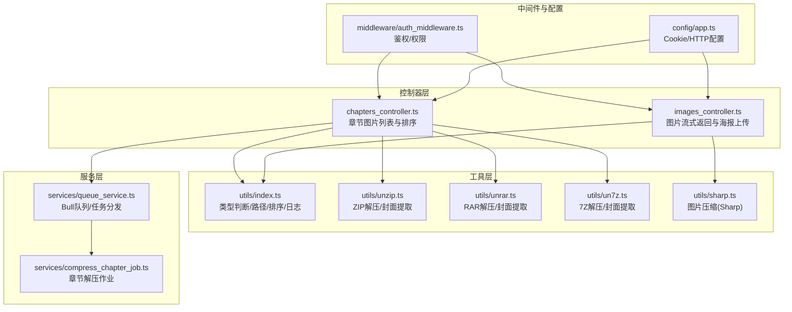
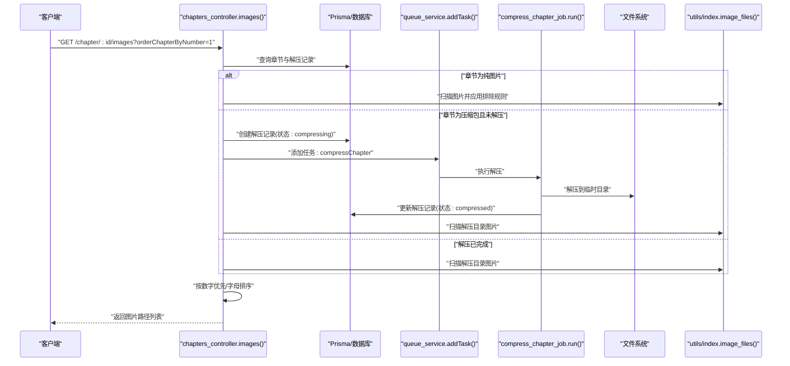
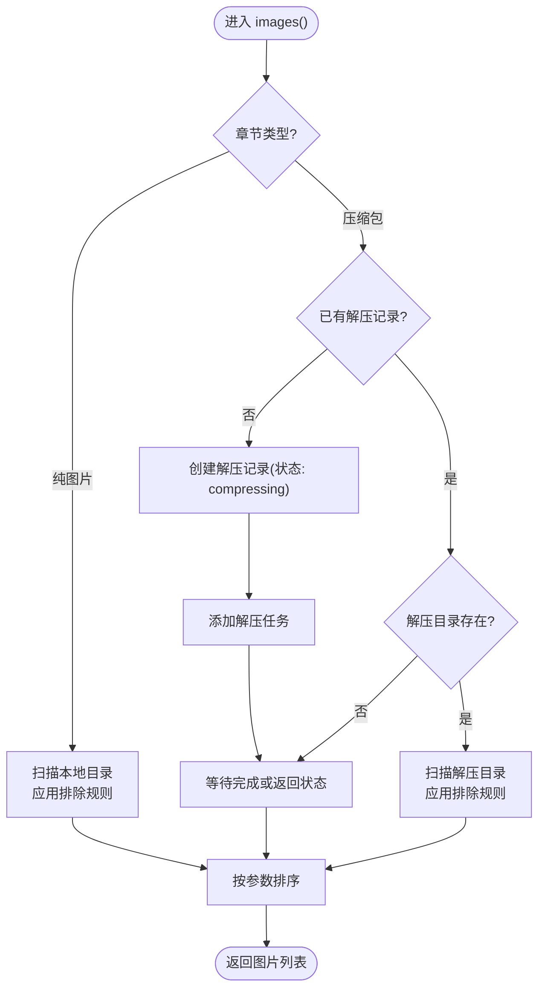
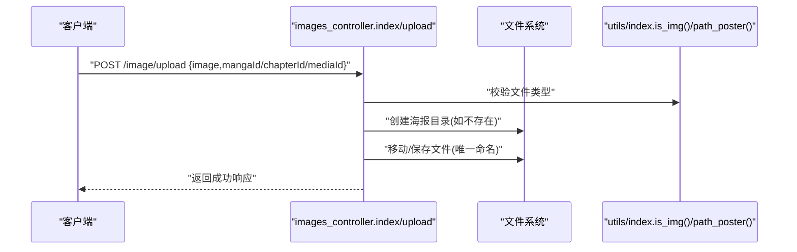
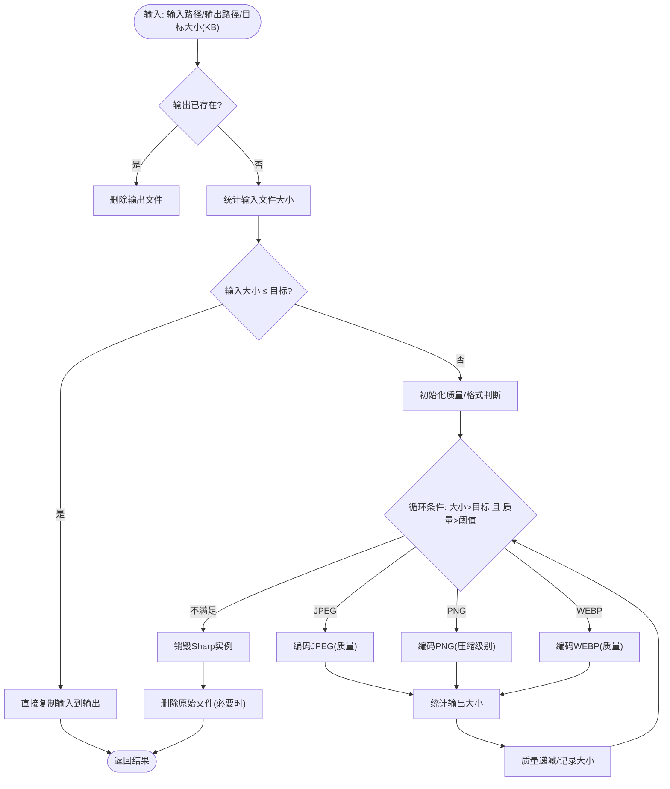
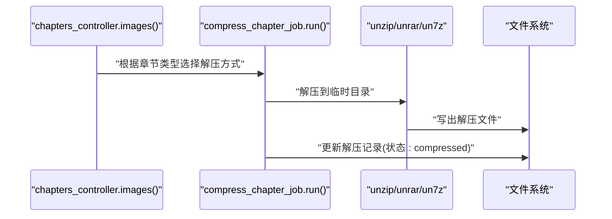
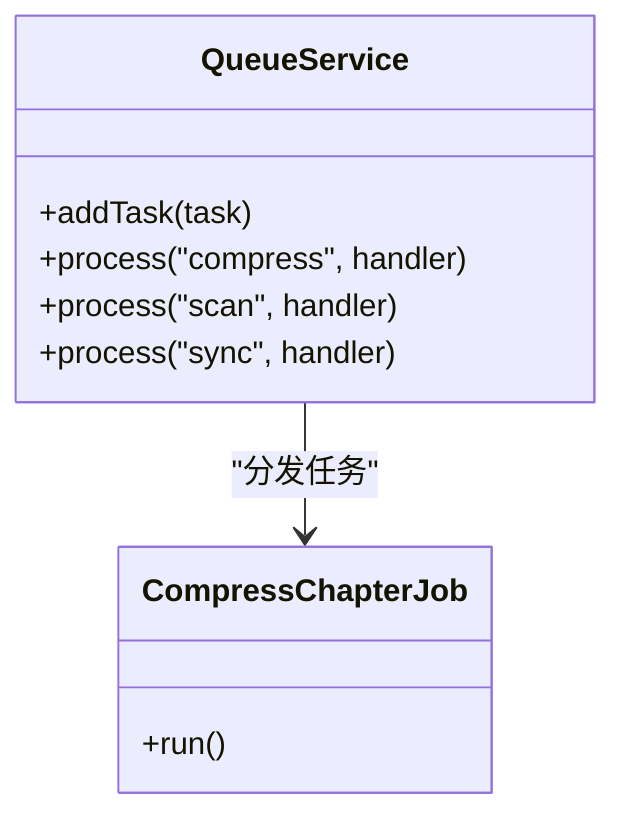
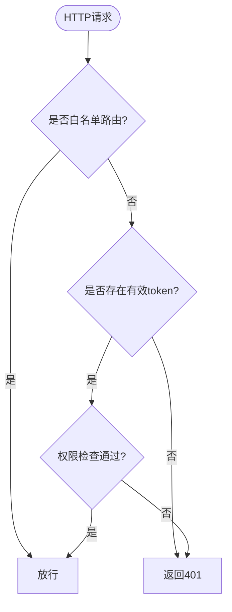
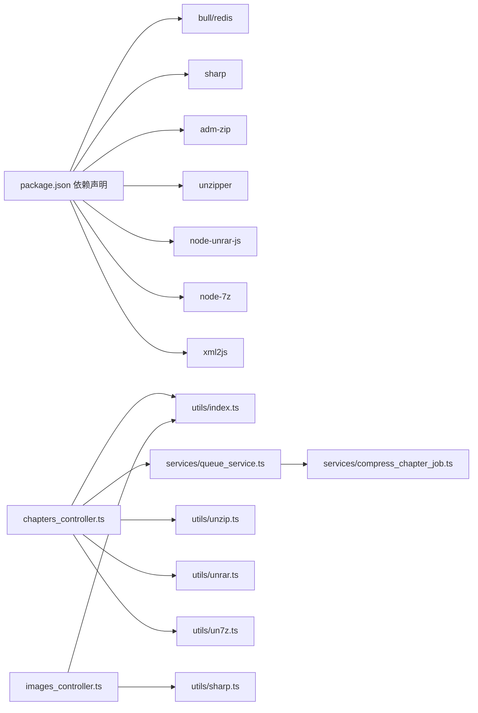

# 章节图片处理

<cite>
**本文引用的文件**
- [app/controllers/chapters_controller.ts](file://app/controllers/chapters_controller.ts)
- [app/controllers/images_controller.ts](file://app/controllers/images_controller.ts)
- [app/utils/index.ts](file://app/utils/index.ts)
- [app/utils/sharp.ts](file://app/utils/sharp.ts)
- [app/utils/unzip.ts](file://app/utils/unzip.ts)
- [app/utils/unrar.ts](file://app/utils/unrar.ts)
- [app/utils/un7z.ts](file://app/utils/un7z.ts)
- [app/services/compress_chapter_job.ts](file://app/services/compress_chapter_job.ts)
- [app/services/queue_service.ts](file://app/services/queue_service.ts)
- [app/interfaces/response.ts](file://app/interfaces/response.ts)
- [app/middleware/auth_middleware.ts](file://app/middleware/auth_middleware.ts)
- [config/app.ts](file://config/app.ts)
- [package.json](file://package.json)
</cite>

## 目录
1. [简介](#简介)
2. [项目结构](#项目结构)
3. [核心组件](#核心组件)
4. [架构总览](#架构总览)
5. [详细组件分析](#详细组件分析)
6. [依赖关系分析](#依赖关系分析)
7. [性能与优化](#性能与优化)
8. [故障排查指南](#故障排查指南)
9. [结论](#结论)
10. [附录](#附录)

## 简介
本文件面向 SManga Adonis 的“章节图片处理”能力，系统化阐述图片文件的自动识别、排序与处理机制，覆盖以下关键点：
- 支持的图片格式与处理方式（JPG、PNG、GIF、BMP、SVG、WEBP、AVIF、APNG 等）
- 图片文件的自动发现与过滤（目录遍历、文件类型判断、排除规则）
- 图片排序算法（数字优先排序与字母排序）
- 图片缓存策略、压缩优化与性能调优
- 图片访问控制、防盗链与安全验证
- 错误处理、异常恢复与日志记录

## 项目结构
围绕章节图片处理的相关模块主要分布在控制器、工具函数、服务与中间件层，形成清晰的职责分离：
- 控制器：负责对外接口与业务流程编排
- 工具函数：提供通用能力（路径、类型判断、排序、日志等）
- 解压工具：支持 ZIP/RAR/7Z 的章节解压与封面提取
- 压缩服务：基于 Bull 队列的任务调度与执行
- 中间件：统一鉴权与权限校验

图表来源
- [app/controllers/chapters_controller.ts:180-369](file://app/controllers/chapters_controller.ts#L180-L369)
- [app/controllers/images_controller.ts:8-114](file://app/controllers/images_controller.ts#L8-L114)
- [app/utils/index.ts:24-260](file://app/utils/index.ts#L24-L260)
- [app/utils/unzip.ts:10-168](file://app/utils/unzip.ts#L10-L168)
- [app/utils/unrar.ts:7-118](file://app/utils/unrar.ts#L7-L118)
- [app/utils/un7z.ts:12-141](file://app/utils/un7z.ts#L12-L141)
- [app/services/queue_service.ts:34-141](file://app/services/queue_service.ts#L34-L141)
- [app/services/compress_chapter_job.ts:31-71](file://app/services/compress_chapter_job.ts#L31-L71)
- [app/middleware/auth_middleware.ts:23-85](file://app/middleware/auth_middleware.ts#L23-L85)
- [config/app.ts:18-40](file://config/app.ts#L18-L40)

章节来源
- [app/controllers/chapters_controller.ts:180-369](file://app/controllers/chapters_controller.ts#L180-L369)
- [app/controllers/images_controller.ts:8-114](file://app/controllers/images_controller.ts#L8-L114)
- [app/utils/index.ts:24-260](file://app/utils/index.ts#L24-L260)
- [app/utils/unzip.ts:10-168](file://app/utils/unzip.ts#L10-L168)
- [app/utils/unrar.ts:7-118](file://app/utils/unrar.ts#L7-L118)
- [app/utils/un7z.ts:12-141](file://app/utils/un7z.ts#L12-L141)
- [app/services/queue_service.ts:34-141](file://app/services/queue_service.ts#L34-L141)
- [app/services/compress_chapter_job.ts:31-71](file://app/services/compress_chapter_job.ts#L31-L71)
- [app/middleware/auth_middleware.ts:23-85](file://app/middleware/auth_middleware.ts#L23-L85)
- [config/app.ts:18-40](file://config/app.ts#L18-L40)

## 核心组件
- 章节图片列表与排序：负责根据章节类型与状态，自动发现图片文件、应用排除规则、按需排序并返回结果。
- 图片流式返回与海报上传：提供图片文件流式传输与海报上传能力，支持类型校验与保存策略。
- 图片压缩与优化：基于 Sharp 的多格式压缩，支持 JPEG/PNG/WEBP 的质量与压缩级别调节。
- 解压与封面提取：对 ZIP/RAR/7Z 进行解压，支持按名称优先选择封面与排序。
- 队列与任务：通过 Bull 队列异步执行章节解压与清理任务，具备重试、超时与回退策略。

章节来源
- [app/controllers/chapters_controller.ts:180-369](file://app/controllers/chapters_controller.ts#L180-L369)
- [app/controllers/images_controller.ts:8-114](file://app/controllers/images_controller.ts#L8-L114)
- [app/utils/sharp.ts:12-89](file://app/utils/sharp.ts#L12-L89)
- [app/utils/unzip.ts:10-168](file://app/utils/unzip.ts#L10-L168)
- [app/utils/unrar.ts:7-118](file://app/utils/unrar.ts#L7-L118)
- [app/utils/un7z.ts:12-141](file://app/utils/un7z.ts#L12-L141)
- [app/services/queue_service.ts:34-141](file://app/services/queue_service.ts#L34-L141)

## 架构总览
章节图片处理的整体流程如下：
- 请求进入章节控制器，依据章节类型与状态决定是否需要解压
- 若为纯图片章节，直接扫描本地目录；若为压缩包章节，触发解压任务或等待解压完成
- 解压完成后，扫描图片文件并应用排除规则
- 根据请求参数选择排序方式（数字优先或字母排序）
- 返回图片路径列表；图片流式读取由图片控制器提供

图表来源
- [app/controllers/chapters_controller.ts:180-369](file://app/controllers/chapters_controller.ts#L180-L369)
- [app/services/queue_service.ts:175-264](file://app/services/queue_service.ts#L175-L264)
- [app/services/compress_chapter_job.ts:31-71](file://app/services/compress_chapter_job.ts#L31-L71)
- [app/utils/index.ts:235-260](file://app/utils/index.ts#L235-L260)

## 详细组件分析

### 组件一：章节图片列表与排序
- 自动识别与过滤
  - 对于纯图片章节，直接扫描目录并匹配支持的图片扩展名
  - 对于压缩包章节，先创建解压记录，再异步解压至临时目录，最后扫描解压目录
  - 应用路径配置中的排除规则，过滤不希望返回的图片
- 排序算法
  - 数字优先排序：从文件名提取连续数字拼接后比较
  - 字母排序：按本地化字符串比较
- 状态管理
  - 未解压：返回状态“compressing”
  - 解压中：等待任务完成
  - 已解压：返回状态“compressed”
  - 超时：删除解压记录并返回失败状态

图表来源
- [app/controllers/chapters_controller.ts:180-369](file://app/controllers/chapters_controller.ts#L180-L369)
- [app/utils/index.ts:235-260](file://app/utils/index.ts#L235-L260)

章节来源
- [app/controllers/chapters_controller.ts:180-369](file://app/controllers/chapters_controller.ts#L180-L369)
- [app/utils/index.ts:235-260](file://app/utils/index.ts#L235-L260)

### 组件二：图片流式返回与海报上传
- 流式返回
  - 校验文件存在性与类型，设置合适的 Content-Type，使用流式读取返回
- 海报上传
  - 校验上传文件类型，根据 mangaId/chapterId/mediaId 决定保存目录与命名
  - 保存为固定扩展名的 JPEG 文件，确保唯一性与可检索性

图表来源
- [app/controllers/images_controller.ts:8-114](file://app/controllers/images_controller.ts#L8-L114)
- [app/utils/index.ts:24-52](file://app/utils/index.ts#L24-L52)

章节来源
- [app/controllers/images_controller.ts:8-114](file://app/controllers/images_controller.ts#L8-L114)
- [app/utils/index.ts:24-52](file://app/utils/index.ts#L24-L52)

### 组件三：图片压缩与优化（Sharp）
- 支持格式：JPEG、PNG、WEBP
- 两套策略
  - 循环降低质量直至达到目标大小
  - 基于初始文件大小预估质量，一次性压缩
- 后处理：删除原始文件，保留压缩产物；对特定缓存目录的临时文件进行清理

图表来源
- [app/utils/sharp.ts:12-89](file://app/utils/sharp.ts#L12-L89)
- [app/utils/sharp.ts:91-167](file://app/utils/sharp.ts#L91-L167)

章节来源
- [app/utils/sharp.ts:12-89](file://app/utils/sharp.ts#L12-L89)
- [app/utils/sharp.ts:91-167](file://app/utils/sharp.ts#L91-L167)

### 组件四：解压与封面提取（ZIP/RAR/7Z）
- ZIP：使用 AdmZip 全量解压；支持按名称包含“cover”的图片优先提取
- RAR：使用 node-unrar-js 提取；优先封面，否则首个图片
- 7Z：使用 node-7z 列表与挑选提取；优先封面，否则首个图片
- 公共逻辑：扫描压缩包内图片，按本地化顺序排序，优先“cover”命名

图表来源
- [app/services/compress_chapter_job.ts:31-71](file://app/services/compress_chapter_job.ts#L31-L71)
- [app/utils/unzip.ts:10-168](file://app/utils/unzip.ts#L10-L168)
- [app/utils/unrar.ts:7-118](file://app/utils/unrar.ts#L7-L118)
- [app/utils/un7z.ts:12-141](file://app/utils/un7z.ts#L12-L141)

章节来源
- [app/services/compress_chapter_job.ts:31-71](file://app/services/compress_chapter_job.ts#L31-L71)
- [app/utils/unzip.ts:10-168](file://app/utils/unzip.ts#L10-L168)
- [app/utils/unrar.ts:7-118](file://app/utils/unrar.ts#L7-L118)
- [app/utils/un7z.ts:12-141](file://app/utils/un7z.ts#L12-L141)

### 组件五：队列与任务调度
- 队列配置：并发度、最大重试次数、超时时间来自配置
- 任务分类：scan/sync/compress 三类队列，章节解压归入 compress 队列
- 重试策略：指数回退，带抖动，限制最大延迟
- 任务去重：针对特定场景（如扫描/删除）检测同名任务是否已在等待/执行

图表来源
- [app/services/queue_service.ts:34-141](file://app/services/queue_service.ts#L34-L141)
- [app/services/compress_chapter_job.ts:31-71](file://app/services/compress_chapter_job.ts#L31-L71)

章节来源
- [app/services/queue_service.ts:34-141](file://app/services/queue_service.ts#L34-L141)
- [app/services/compress_chapter_job.ts:31-71](file://app/services/compress_chapter_job.ts#L31-L71)

### 组件六：访问控制与安全
- 鉴权中间件：拦截未登录或无效 token 的请求；部分路由白名单放行
- 权限校验：管理员角色或媒体权限范围内的用户可访问对应资源
- Cookie 安全：生产环境启用 secure；sameSite/lax；httpOnly

图表来源
- [app/middleware/auth_middleware.ts:23-85](file://app/middleware/auth_middleware.ts#L23-L85)
- [config/app.ts:32-39](file://config/app.ts#L32-L39)

章节来源
- [app/middleware/auth_middleware.ts:23-85](file://app/middleware/auth_middleware.ts#L23-L85)
- [config/app.ts:32-39](file://config/app.ts#L32-L39)

## 依赖关系分析
- 第三方库
  - Bull/Redis：任务队列与持久化
  - Sharp：图片压缩与编码
  - AdmZip/unzipper/node-unrar-js/node-7z：压缩包解压
  - xml2js：解析 ComicInfo.xml
- 内部模块耦合
  - 控制器依赖工具函数与队列服务
  - 解压工具与章节控制器配合，共同完成图片发现
  - 响应格式统一由公共接口定义

图表来源
- [package.json:62-87](file://package.json#L62-L87)
- [app/controllers/chapters_controller.ts:180-369](file://app/controllers/chapters_controller.ts#L180-L369)
- [app/controllers/images_controller.ts:8-114](file://app/controllers/images_controller.ts#L8-L114)
- [app/utils/index.ts:24-260](file://app/utils/index.ts#L24-L260)
- [app/utils/unzip.ts:10-168](file://app/utils/unzip.ts#L10-L168)
- [app/utils/unrar.ts:7-118](file://app/utils/unrar.ts#L7-L118)
- [app/utils/un7z.ts:12-141](file://app/utils/un7z.ts#L12-L141)
- [app/services/queue_service.ts:34-141](file://app/services/queue_service.ts#L34-L141)
- [app/services/compress_chapter_job.ts:31-71](file://app/services/compress_chapter_job.ts#L31-L71)
- [app/utils/sharp.ts:12-89](file://app/utils/sharp.ts#L12-L89)

章节来源
- [package.json:62-87](file://package.json#L62-L87)
- [app/controllers/chapters_controller.ts:180-369](file://app/controllers/chapters_controller.ts#L180-L369)
- [app/controllers/images_controller.ts:8-114](file://app/controllers/images_controller.ts#L8-L114)
- [app/utils/index.ts:24-260](file://app/utils/index.ts#L24-L260)
- [app/utils/unzip.ts:10-168](file://app/utils/unzip.ts#L10-L168)
- [app/utils/unrar.ts:7-118](file://app/utils/unrar.ts#L7-L118)
- [app/utils/un7z.ts:12-141](file://app/utils/un7z.ts#L12-L141)
- [app/services/queue_service.ts:34-141](file://app/services/queue_service.ts#L34-L141)
- [app/services/compress_chapter_job.ts:31-71](file://app/services/compress_chapter_job.ts#L31-L71)
- [app/utils/sharp.ts:12-89](file://app/utils/sharp.ts#L12-L89)

## 性能与优化
- 图片扫描
  - 采用深度优先遍历目录，支持排除规则减少无效 IO
  - 建议：对超大目录启用分页或增量扫描
- 解压与缓存
  - 异步解压，完成后标记状态；可选自动清理缓存目录
  - 建议：合理设置队列并发与超时，避免资源争用
- 压缩策略
  - 预估质量一次性压缩适合快速场景；循环压缩适合严格控制大小
  - 建议：结合业务需求选择策略，必要时对 WEBP/JPEG/PNG 分别设定目标大小
- 流式传输
  - 图片以流式返回，避免内存峰值；建议配合 CDN 与缓存头优化
- 日志与监控
  - 统一日志接口与数据库落盘，便于追踪异常与性能瓶颈

章节来源
- [app/utils/index.ts:235-260](file://app/utils/index.ts#L235-L260)
- [app/services/queue_service.ts:24-32](file://app/services/queue_service.ts#L24-L32)
- [app/utils/sharp.ts:12-89](file://app/utils/sharp.ts#L12-L89)
- [app/utils/log.ts:10-74](file://app/utils/log.ts#L10-L74)

## 故障排查指南
- 常见问题与定位
  - 章节不存在/路径错误：检查章节记录与物理路径
  - 解压超时：查看队列任务状态与 Redis 连通性
  - 图片为空：确认压缩包内是否存在图片、排除规则是否过于严格
  - 类型不支持：确认文件扩展名与 is_img 规则
- 错误处理与恢复
  - 控制器返回统一响应对象，包含状态码与状态描述
  - 队列任务失败会记录错误并按指数回退重试
  - 解压失败抛出异常，上层捕获后返回失败状态
- 日志记录
  - 统一日志接口写入数据库，便于审计与问题复现

章节来源
- [app/controllers/chapters_controller.ts:180-369](file://app/controllers/chapters_controller.ts#L180-L369)
- [app/services/queue_service.ts:45-47](file://app/services/queue_service.ts#L45-L47)
- [app/utils/log.ts:60-72](file://app/utils/log.ts#L60-L72)
- [app/interfaces/response.ts:18-33](file://app/interfaces/response.ts#L18-L33)

## 结论
SManga Adonis 的章节图片处理能力通过“控制器编排 + 工具函数 + 任务队列”的组合，实现了对多种压缩格式的章节解压、图片自动发现与排序、以及图片压缩与流式传输。整体设计具备良好的扩展性与可维护性，建议在生产环境中结合 CDN、缓存与合理的队列配置进一步提升性能与稳定性。

## 附录
- 支持的图片格式与处理要点
  - JPEG/JPG：支持质量压缩
  - PNG：支持压缩级别
  - WEBP：支持质量压缩
  - GIF/BMP/SVG/AVIF/APNG：类型判断与上传校验，具体处理视业务需求扩展
- 排序参数
  - orderChapterByNumber=true：数字优先排序
  - 其他：按本地化字符串排序

章节来源
- [app/utils/index.ts:24-28](file://app/utils/index.ts#L24-L28)
- [app/controllers/chapters_controller.ts:361-368](file://app/controllers/chapters_controller.ts#L361-L368)
- [app/utils/sharp.ts:40-60](file://app/utils/sharp.ts#L40-L60)