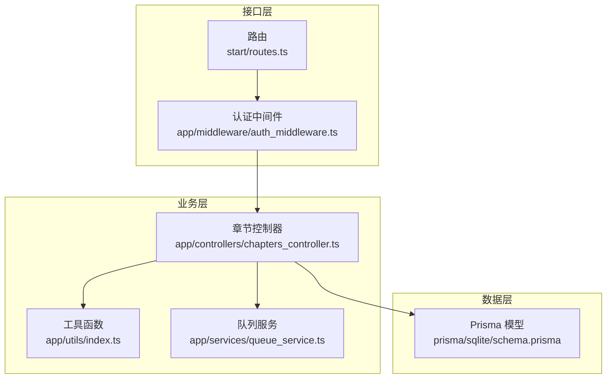
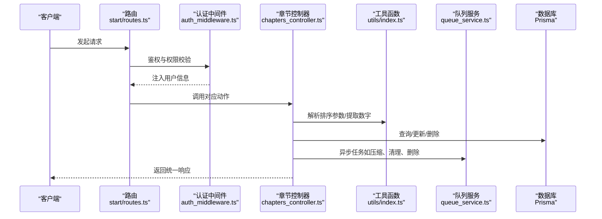
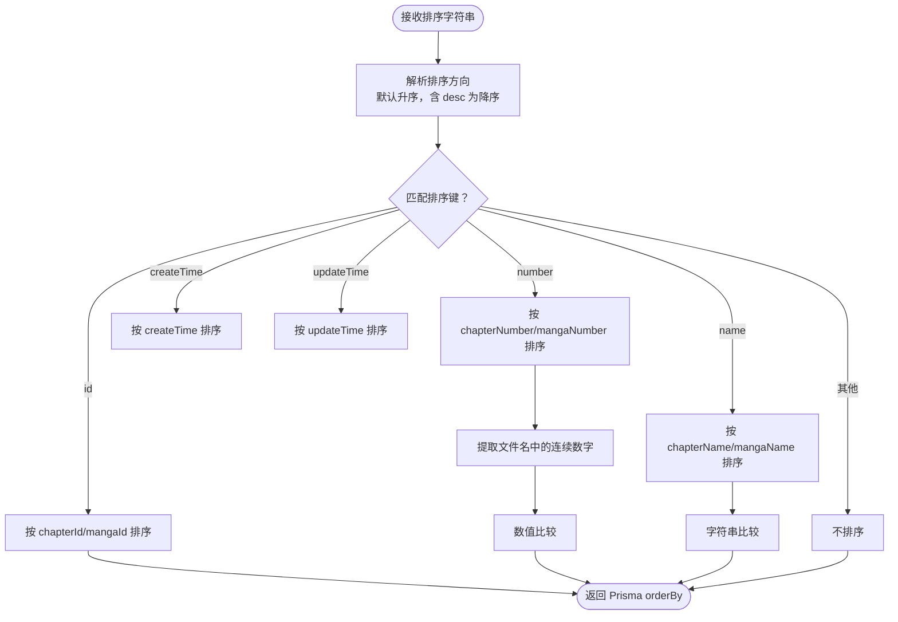
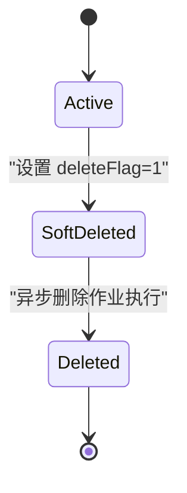
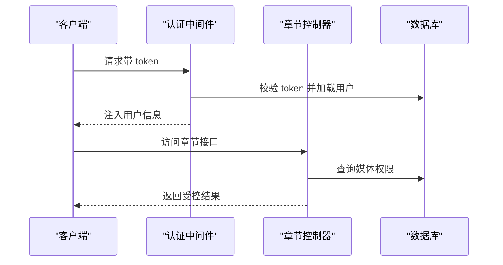
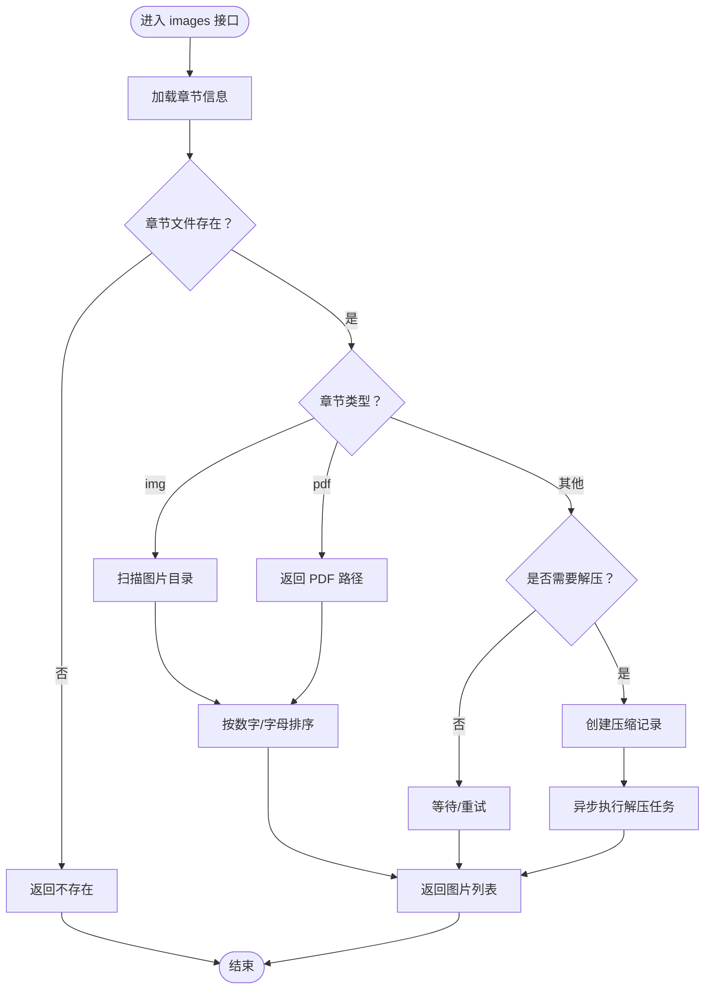
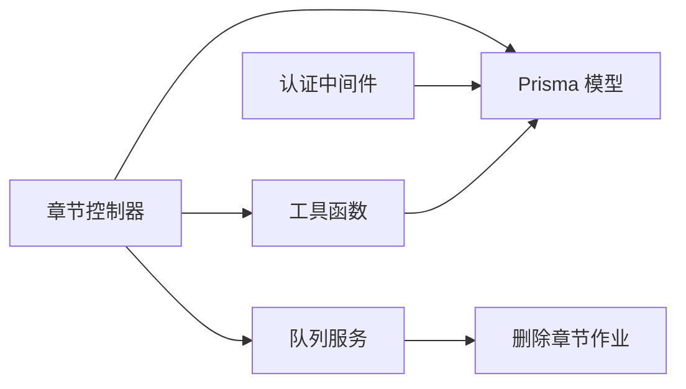

# 章节基础管理

<cite>
**本文引用的文件**
- [chapters_controller.ts](file://app/controllers/chapters_controller.ts)
- [routes.ts](file://start/routes.ts)
- [auth_middleware.ts](file://app/middleware/auth_middleware.ts)
- [index.ts](file://app/utils/index.ts)
- [response.ts](file://app/interfaces/response.ts)
- [schema.prisma](file://prisma/sqlite/schema.prisma)
- [media_permissons_controller.ts](file://app/controllers/media_permissons_controller.ts)
- [user_permissons_controller.ts](file://app/controllers/user_permissons_controller.ts)
- [queue_service.ts](file://app/services/queue_service.ts)
- [delete_chapter_job.ts](file://app/services/delete_chapter_job.ts)
</cite>

## 目录
1. [简介](#简介)
2. [项目结构](#项目结构)
3. [核心组件](#核心组件)
4. [架构总览](#架构总览)
5. [详细组件分析](#详细组件分析)
6. [依赖关系分析](#依赖关系分析)
7. [性能考量](#性能考量)
8. [故障排查指南](#故障排查指南)
9. [结论](#结论)
10. [附录](#附录)

## 简介
本文件面向 SManga Adonis 的“章节基础管理”功能，系统性阐述章节的 CRUD 实现与数据模型设计，覆盖：
- 章节的创建、查询、更新、删除（含批量删除）
- 章节列表的分页与不分页模式、多条件筛选（漫画ID、媒体ID、关键词）
- 排序机制（数字排序与字母排序）
- 状态管理与软删除（deleteFlag 字段）
- 权限验证、用户角色检查与媒体访问控制
- 解压与图片列表获取流程

## 项目结构
章节相关代码主要分布在控制器、路由、中间件、工具函数与数据库模型定义中：
- 控制器：章节业务逻辑入口
- 路由：暴露章节 API
- 中间件：统一鉴权与权限校验
- 工具：排序参数解析、数字提取、配置读取、队列调度
- 数据模型：Prisma 定义章节字段与约束

图表来源
- [routes.ts:183-193](file://start/routes.ts#L183-L193)
- [auth_middleware.ts:23-84](file://app/middleware/auth_middleware.ts#L23-L84)
- [chapters_controller.ts:12-71](file://app/controllers/chapters_controller.ts#L12-L71)
- [index.ts:117-154](file://app/utils/index.ts#L117-L154)
- [queue_service.ts:175-264](file://app/services/queue_service.ts#L175-L264)
- [schema.prisma:37-55](file://prisma/sqlite/schema.prisma#L37-L55)

章节来源
- [routes.ts:183-193](file://start/routes.ts#L183-L193)
- [auth_middleware.ts:23-84](file://app/middleware/auth_middleware.ts#L23-L84)
- [chapters_controller.ts:12-71](file://app/controllers/chapters_controller.ts#L12-L71)
- [index.ts:117-154](file://app/utils/index.ts#L117-L154)
- [queue_service.ts:175-264](file://app/services/queue_service.ts#L175-L264)
- [schema.prisma:37-55](file://prisma/sqlite/schema.prisma#L37-L55)

## 核心组件
- 章节控制器：提供章节列表、详情、首章、图片列表、创建、更新、删除、批量删除、下载、清理解压缓存等接口
- 排序工具：order_params 将字符串排序规则转换为 Prisma orderBy 对象
- 响应封装：SResponse/ListResponse 统一返回结构
- 权限中间件：基于 token 校验与用户角色/媒体权限限制
- 队列服务：异步执行压缩、清理、删除等后台任务

章节来源
- [chapters_controller.ts:12-71](file://app/controllers/chapters_controller.ts#L12-L71)
- [index.ts:117-154](file://app/utils/index.ts#L117-L154)
- [response.ts:18-63](file://app/interfaces/response.ts#L18-L63)
- [auth_middleware.ts:23-84](file://app/middleware/auth_middleware.ts#L23-L84)
- [queue_service.ts:175-264](file://app/services/queue_service.ts#L175-L264)

## 架构总览
章节管理的端到端调用链如下：

图表来源
- [routes.ts:183-193](file://start/routes.ts#L183-L193)
- [auth_middleware.ts:23-84](file://app/middleware/auth_middleware.ts#L23-L84)
- [chapters_controller.ts:12-71](file://app/controllers/chapters_controller.ts#L12-L71)
- [index.ts:117-154](file://app/utils/index.ts#L117-L154)
- [queue_service.ts:175-264](file://app/services/queue_service.ts#L175-L264)

## 详细组件分析

### 数据模型与字段说明
章节模型字段及约束（以 SQLite schema 为例）：
- 章节ID：chapterId（主键）
- 漫画ID：mangaId（外键关联漫画）
- 媒体ID：mediaId（外键关联媒体）
- 路径ID：pathId（外键关联路径）
- 章节名称：chapterName
- 章节编号：chapterNumber（用于数字排序）
- 章节路径：chapterPath（章节资源路径）
- 章节类型：chapterType（如 image/pdf）
- 章节封面：chapterCover
- 子标题：subTitle（用于关键词搜索）
- 图片数量：picNum
- 浏览类型：browseType（来自关联漫画）
- 创建/更新时间：createTime/updateTime
- 删除标志：deleteFlag（软删除）
- 关联实体：bookmarks、compress、history、collects、latests、meta

章节来源
- [schema.prisma:37-55](file://prisma/sqlite/schema.prisma#L37-L55)

### CRUD 操作实现

- 列表查询（不分页）
  - 过滤条件：mangaId、mediaId、deleteFlag=0
  - 排序：通过 order_params 解析
  - 包含最新阅读记录（latests）
  - 返回：ListResponse

- 列表查询（分页）
  - 过滤条件：mangaId、mediaId、keyWord（subTitle 包含）、deleteFlag=0
  - 排序：同上
  - 包含漫画属性（browseType/removeFirst/direction），便于前端展示
  - 返回：ListResponse（list/count）

- 详情查询
  - 通过 chapterId 查找章节

- 首章查询
  - 按 mangaId + 排序规则取第一条

- 图片列表
  - 支持纯图片章节、PDF 章节
  - 支持解压任务创建与等待
  - 支持按数字排序或字母排序
  - 返回图片路径数组

- 创建
  - 直接插入章节记录

- 更新
  - 支持更新章节名称、路径、封面、编号

- 删除
  - 软删除：设置 deleteFlag=1
  - 异步触发删除章节任务（清理书签、收藏、压缩、历史、最后阅读、封面等）

- 批量删除
  - 传入逗号分隔的多个 chapterId，统一标记 deleteFlag=1，并为每个 ID 触发删除任务

- 下载
  - 图片章节：返回图片列表
  - 非图片章节：返回文件流

- 清理解压缓存
  - 删除压缩记录与解压目录

章节来源
- [chapters_controller.ts:74-160](file://app/controllers/chapters_controller.ts#L74-L160)
- [chapters_controller.ts:162-178](file://app/controllers/chapters_controller.ts#L162-L178)
- [chapters_controller.ts:180-369](file://app/controllers/chapters_controller.ts#L180-L369)
- [chapters_controller.ts:371-429](file://app/controllers/chapters_controller.ts#L371-L429)
- [chapters_controller.ts:431-483](file://app/controllers/chapters_controller.ts#L431-L483)

### 排序机制（数字排序与字母排序）
- order_params 支持多种排序键：
  - id：按 chapterId 或 mangaId 排序
  - number：按 chapterNumber 或 mangaNumber 排序（数字排序）
  - name：按 chapterName 或 mangaName 排序（字母排序）
  - createTime/updateTime：按时间排序
  - desc：可选降序
- 数字排序：当 order 包含 number 时，使用 chapterNumber；内部对文件名中的连续数字进行提取并比较
- 字母排序：当 order 包含 name 时，使用 chapterName

图表来源
- [index.ts:117-154](file://app/utils/index.ts#L117-L154)
- [chapters_controller.ts:362-366](file://app/controllers/chapters_controller.ts#L362-L366)

章节来源
- [index.ts:117-154](file://app/utils/index.ts#L117-L154)
- [chapters_controller.ts:362-366](file://app/controllers/chapters_controller.ts#L362-L366)

### 状态管理与软删除
- deleteFlag 字段用于软删除，默认 0（未删除），删除时置为 1
- 列表查询默认过滤 deleteFlag=0
- 删除章节时：
  - 立即设置 deleteFlag=1
  - 异步执行删除章节作业（清理书签、收藏、压缩、历史、最后阅读、封面等）
- 批量删除：对多个章节统一设置 deleteFlag=1，并逐个触发删除任务

图表来源
- [chapters_controller.ts:391-404](file://app/controllers/chapters_controller.ts#L391-L404)
- [chapters_controller.ts:406-429](file://app/controllers/chapters_controller.ts#L406-L429)
- [delete_chapter_job.ts:18-56](file://app/services/delete_chapter_job.ts#L18-L56)

章节来源
- [chapters_controller.ts:391-404](file://app/controllers/chapters_controller.ts#L391-L404)
- [chapters_controller.ts:406-429](file://app/controllers/chapters_controller.ts#L406-L429)
- [delete_chapter_job.ts:18-56](file://app/services/delete_chapter_job.ts#L18-L56)

### 权限验证、用户角色检查与媒体访问控制
- 认证中间件：
  - 校验请求头 token 是否存在且有效
  - 注入用户信息（包含角色、媒体权限、模块权限）
  - 对特定模块与 DELETE 请求进行角色限制
- 章节控制器：
  - 校验用户是否存在
  - 若非管理员，校验媒体权限（用户对媒体的访问范围）
  - 列表查询时根据媒体权限过滤
- 媒体权限与用户权限：
  - 提供媒体权限与用户权限的增删改查控制器，用于维护用户对媒体的访问范围

图表来源
- [auth_middleware.ts:23-84](file://app/middleware/auth_middleware.ts#L23-L84)
- [chapters_controller.ts:23-53](file://app/controllers/chapters_controller.ts#L23-L53)
- [media_permissons_controller.ts:13-61](file://app/controllers/media_permissons_controller.ts#L13-L61)
- [user_permissons_controller.ts:13-66](file://app/controllers/user_permissons_controller.ts#L13-L66)

章节来源
- [auth_middleware.ts:23-84](file://app/middleware/auth_middleware.ts#L23-L84)
- [chapters_controller.ts:23-53](file://app/controllers/chapters_controller.ts#L23-L53)
- [media_permissons_controller.ts:13-61](file://app/controllers/media_permissons_controller.ts#L13-L61)
- [user_permissons_controller.ts:13-66](file://app/controllers/user_permissons_controller.ts#L13-L66)

### 图片列表与解压流程
- 章节类型：
  - img：纯图片章节，直接扫描目录下图片
  - pdf：PDF 章节，返回 PDF 文件路径
- 解压策略：
  - 若未配置同步解压且无压缩记录：创建压缩记录并异步执行压缩任务
  - 若已配置同步解压：立即解压并返回图片
  - 若压缩记录存在但解压目录不存在：等待或重试
  - 解压完成后按需自动清理缓存
- 图片排序：
  - orderChapterByNumber=true：按文件名中的连续数字排序
  - 否则：按字符串排序

图表来源
- [chapters_controller.ts:180-369](file://app/controllers/chapters_controller.ts#L180-L369)
- [index.ts:227-231](file://app/utils/index.ts#L227-L231)
- [queue_service.ts:175-264](file://app/services/queue_service.ts#L175-L264)

章节来源
- [chapters_controller.ts:180-369](file://app/controllers/chapters_controller.ts#L180-L369)
- [index.ts:227-231](file://app/utils/index.ts#L227-L231)
- [queue_service.ts:175-264](file://app/services/queue_service.ts#L175-L264)

## 依赖关系分析
- 控制器依赖：
  - 工具函数：order_params、extract_numbers、get_config、s_delete、unzipFile
  - 队列服务：addTask
  - Prisma：章节、压缩、路径、用户、媒体权限等模型
- 中间件依赖：
  - token 校验、用户角色与媒体权限注入
- 模型依赖：
  - 章节模型与漫画、路径、压缩、历史、收藏、书签、最后阅读、元数据等关联

图表来源
- [chapters_controller.ts:7-11](file://app/controllers/chapters_controller.ts#L7-L11)
- [auth_middleware.ts:48-58](file://app/middleware/auth_middleware.ts#L48-L58)
- [queue_service.ts:175-264](file://app/services/queue_service.ts#L175-L264)
- [delete_chapter_job.ts:8-16](file://app/services/delete_chapter_job.ts#L8-L16)

章节来源
- [chapters_controller.ts:7-11](file://app/controllers/chapters_controller.ts#L7-L11)
- [auth_middleware.ts:48-58](file://app/middleware/auth_middleware.ts#L48-L58)
- [queue_service.ts:175-264](file://app/services/queue_service.ts#L175-L264)
- [delete_chapter_job.ts:8-16](file://app/services/delete_chapter_job.ts#L8-L16)

## 性能考量
- 列表查询采用分页与不分页两种模式，分页模式下同时计算总数，建议在大数据量场景使用分页
- 排序键优先使用索引字段（如 chapterId、chapterNumber、chapterName、createTime、updateTime）
- 图片列表扫描采用递归目录遍历，建议配合路径排除规则减少无效扫描
- 解压流程支持同步与异步两种模式，异步模式可避免阻塞请求
- 队列并发与重试策略可通过配置调整，平衡吞吐与稳定性

## 故障排查指南
- 401 令牌错误：确认请求头 token 是否正确
- 403 无权限访问：检查用户角色与媒体权限映射
- 404 漫画不存在：确认 mangaId 是否有效
- 章节文件不存在：确认 chapterPath 是否正确
- 解压超时：检查队列任务状态与磁盘空间
- 删除失败：检查删除作业日志与残留文件

章节来源
- [chapters_controller.ts:23-53](file://app/controllers/chapters_controller.ts#L23-L53)
- [chapters_controller.ts:180-369](file://app/controllers/chapters_controller.ts#L180-L369)
- [queue_service.ts:41-47](file://app/services/queue_service.ts#L41-L47)

## 结论
章节基础管理功能围绕“软删除 + 异步清理 + 权限控制 + 可扩展排序”的设计思路构建，既保证了数据安全与一致性，又兼顾了性能与可维护性。通过清晰的 API 设计与统一的响应格式，为前端提供了稳定可靠的数据支撑。

## 附录

### API 定义概览
- 列表查询
  - GET /chapter?page=&pageSize=&mangaId=&mediaId=&order=&keyWord=
  - GET /chapter?mangaId=&mediaId=&order=
- 详情
  - GET /chapter/:chapterId
- 首章
  - GET /chapter-first?mangaId=&order=
- 图片列表
  - GET /chapter-images/:chapterId?orderChapterByNumber=&reTry=
- 创建
  - POST /chapter
- 更新
  - PUT /chapter/:chapterId
- 删除
  - DELETE /chapter/:chapterId
- 批量删除
  - DELETE /chapter/:chapterIds/batch
- 下载
  - GET /chapter-download?chapterId=
- 清理解压缓存
  - DELETE /chapter/:chapterId/compress

章节来源
- [routes.ts:183-193](file://start/routes.ts#L183-L193)