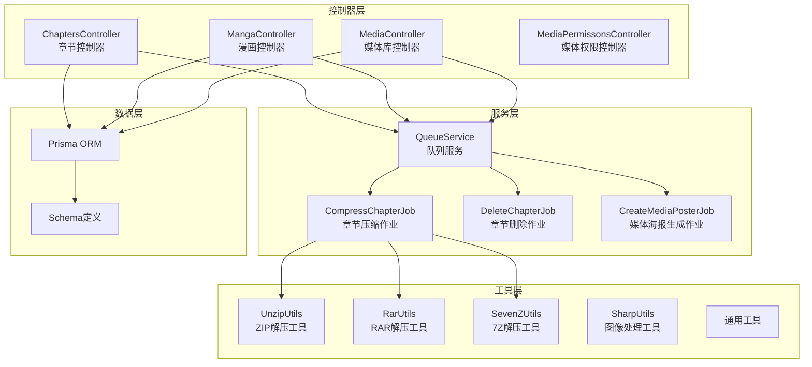
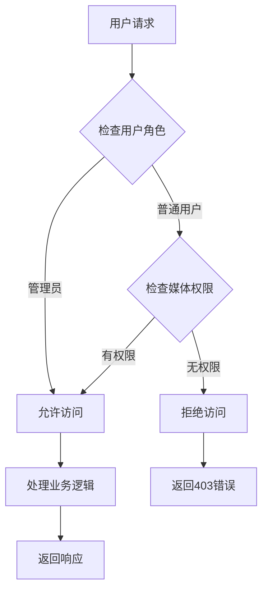
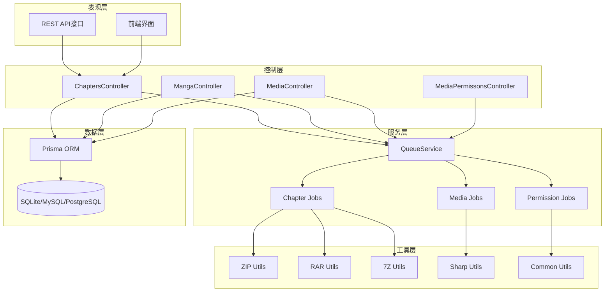
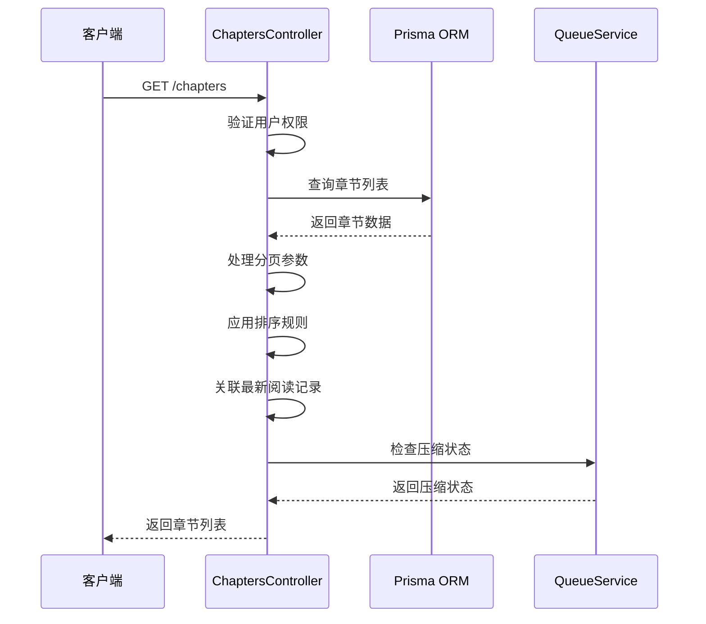
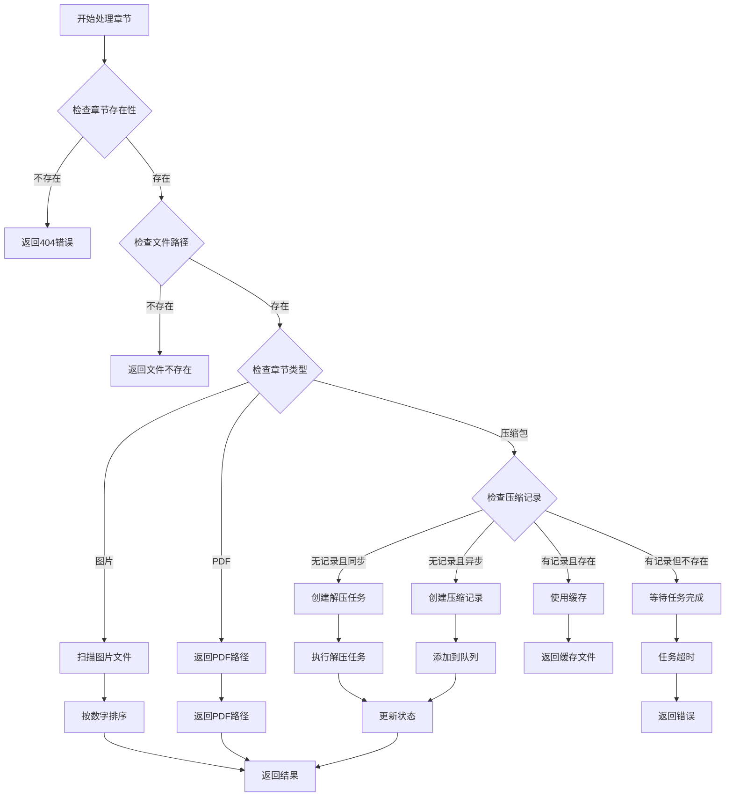
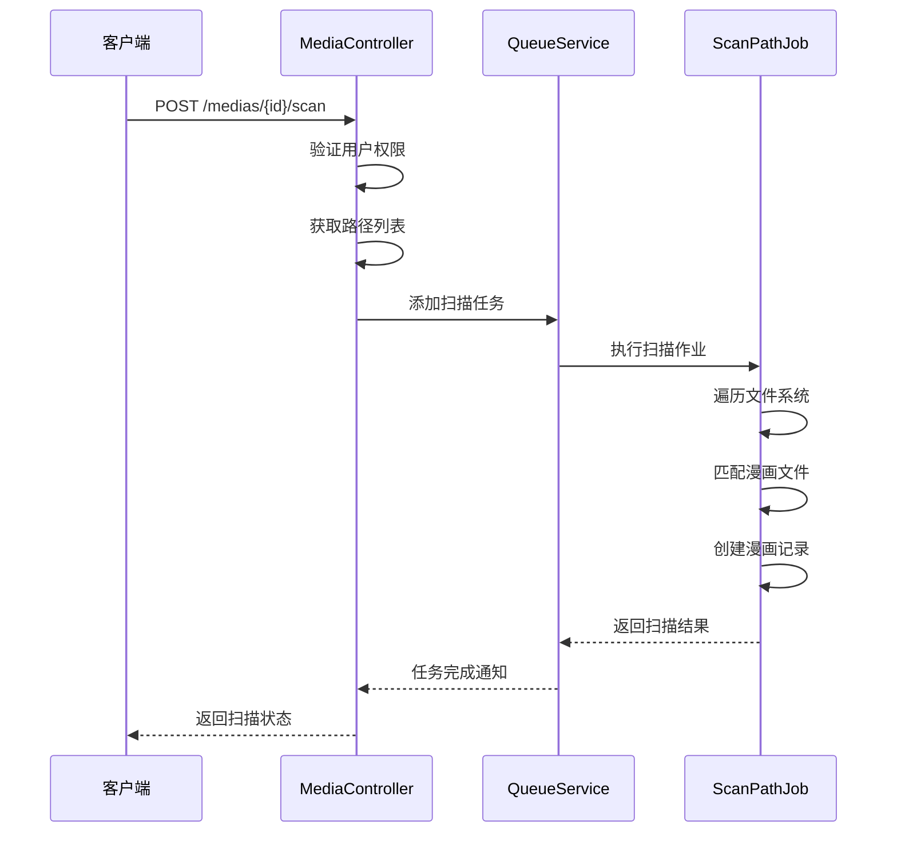
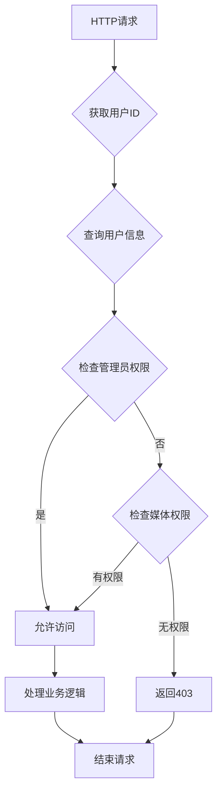
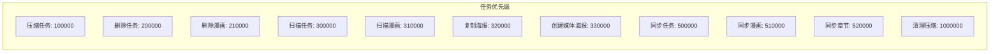
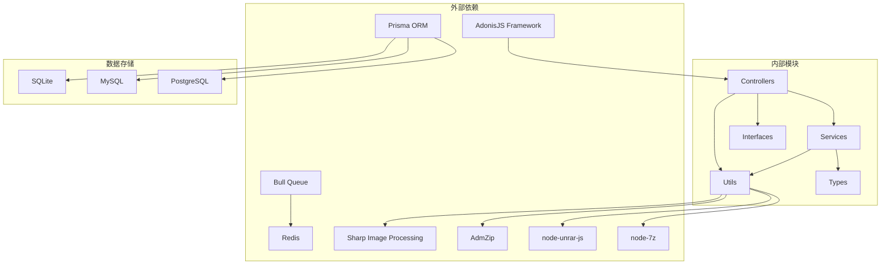

# 章节管理模块

<cite>
**本文档引用的文件**
- [chapters_controller.ts](file://app/controllers/chapters_controller.ts)
- [media_controller.ts](file://app/controllers/media_controller.ts)
- [media_permissons_controller.ts](file://app/controllers/media_permissons_controller.ts)
- [manga_controller.ts](file://app/controllers/manga_controller.ts)
- [schema.prisma](file://prisma/sqlite/schema.prisma)
- [index.ts](file://app/utils/index.ts)
- [compress_chapter_job.ts](file://app/services/compress_chapter_job.ts)
- [delete_chapter_job.ts](file://app/services/delete_chapter_job.ts)
- [create_media_poster_job.ts](file://app/services/create_media_poster_job.ts)
- [queue_service.ts](file://app/services/queue_service.ts)
- [unzip.ts](file://app/utils/unzip.ts)
- [unrar.ts](file://app/utils/unrar.ts)
- [un7z.ts](file://app/utils/un7z.ts)
- [sharp.ts](file://app/utils/sharp.ts)
- [response.ts](file://app/interfaces/response.ts)
- [index.ts](file://app/type/index.ts)
</cite>

## 目录
1. [简介](#简介)
2. [项目结构](#项目结构)
3. [核心组件](#核心组件)
4. [架构概览](#架构概览)
5. [详细组件分析](#详细组件分析)
6. [依赖分析](#依赖分析)
7. [性能考虑](#性能考虑)
8. [故障排除指南](#故障排除指南)
9. [结论](#结论)

## 简介

SManga Adonis的章节管理模块是一个完整的漫画章节管理系统，负责管理漫画的章节数据、媒体文件存储和访问控制。该模块实现了章节的全生命周期管理，包括创建、更新、删除操作，以及媒体文件的智能存储和访问控制机制。

章节管理模块基于AdonisJS框架构建，采用现代化的TypeScript开发，结合Prisma ORM进行数据库操作，通过Redis队列系统实现异步任务处理。系统支持多种媒体格式（ZIP、RAR、7Z、PDF），提供智能的章节排序和状态管理功能。

## 项目结构

章节管理模块主要由以下核心组件构成：

**图表来源**
- [chapters_controller.ts:12-515](file://app/controllers/chapters_controller.ts#L12-L515)
- [queue_service.ts:1-267](file://app/services/queue_service.ts#L1-L267)
- [schema.prisma:29-55](file://prisma/sqlite/schema.prisma#L29-L55)

**章节来源**
- [chapters_controller.ts:1-515](file://app/controllers/chapters_controller.ts#L1-L515)
- [media_controller.ts:1-206](file://app/controllers/media_controller.ts#L1-L206)
- [manga_controller.ts:1-460](file://app/controllers/manga_controller.ts#L1-L460)
- [media_permissons_controller.ts:1-61](file://app/controllers/media_permissons_controller.ts#L1-L61)

## 核心组件

### 数据模型设计

章节管理模块采用关系型数据库设计，核心数据模型包括：

#### 章节模型 (Chapter)
章节模型是整个系统的核心实体，负责存储漫画章节的所有相关信息：

| 字段名 | 类型 | 描述 | 约束 |
|--------|------|------|------|
| chapterId | Int | 章节唯一标识符 | 主键, 自增 |
| mangaId | Int | 所属漫画ID | 外键, 约束(unique) |
| mediaId | Int | 所属媒体库ID | 外键 |
| pathId | Int | 路径ID | 外键 |
| chapterName | String | 章节名称 | 必填 |
| chapterPath | String | 章节文件路径 | 必填 |
| chapterType | String | 章节类型 | 默认: "image" |
| chapterNumber | String | 章节编号 | 可选 |
| chapterCover | String | 章节封面路径 | 可选 |
| browseType | String | 浏览类型 | 默认: "flow" |
| subTitle | String | 章节副标题 | 可选 |
| picNum | Int | 图片数量 | 可选 |
| deleteFlag | Int | 删除标志 | 默认: 0 |
| createTime | DateTime | 创建时间 | 默认: now() |
| updateTime | DateTime | 更新时间 | 默认: now(), 更新时自动 |

#### 媒体模型 (Media)
媒体模型管理漫画的存储位置和访问权限：

| 字段名 | 类型 | 描述 | 约束 |
|--------|------|------|------|
| mediaId | Int | 媒体库唯一标识符 | 主键, 自增 |
| mediaName | String | 媒体库名称 | 唯一, 必填 |
| mediaType | Int | 媒体类型 | 必填 |
| mediaCover | String | 媒体封面 | 可选 |
| sourceWebsite | String | 来源网站 | 可选 |
| isCloudMedia | Int | 是否云媒体 | 默认: 0 |
| directoryFormat | Int | 目录格式 | 默认: 0 |
| browseType | String | 浏览类型 | 默认: "flow" |
| direction | Int | 阅读方向 | 默认: 1 |
| removeFirst | Int | 移除首字 | 默认: 0 |
| deleteFlag | Int | 删除标志 | 默认: 0 |
| createTime | DateTime | 创建时间 | 默认: now() |
| updateTime | DateTime | 更新时间 | 默认: now(), 更新时自动 |

#### 权限模型 (MediaPermission)
权限模型实现细粒度的访问控制：

| 字段名 | 类型 | 描述 | 约束 |
|--------|------|------|------|
| mediaPermissonId | Int | 权限记录ID | 主键, 自增 |
| userId | Int | 用户ID | 外键 |
| mediaId | Int | 媒体库ID | 外键 |
| createTime | DateTime | 创建时间 | 默认: now() |
| updateTime | DateTime | 更新时间 | 默认: now(), 更新时自动 |

**章节来源**
- [schema.prisma:29-55](file://prisma/sqlite/schema.prisma#L29-L55)
- [schema.prisma:215-235](file://prisma/sqlite/schema.prisma#L215-L235)
- [schema.prisma:238-249](file://prisma/sqlite/schema.prisma#L238-L249)

### 媒体文件管理策略

章节管理模块采用智能的媒体文件存储策略，支持多种压缩格式和存储优化：

#### 支持的媒体格式
- **ZIP格式**: 使用AdmZip库进行解压
- **RAR格式**: 使用node-unrar-js库进行解压  
- **7Z格式**: 使用node-7z库进行解压
- **PDF格式**: 直接存储和访问
- **图片格式**: JPG、PNG、WEBP等

#### 存储策略
1. **本地存储**: 默认使用本地文件系统存储
2. **云存储**: 支持isCloudMedia标志启用云端存储
3. **压缩缓存**: 解压后的文件存储在/data/compress目录
4. **封面缓存**: 自动生成的封面存储在/data/poster目录

**章节来源**
- [chapters_controller.ts:204-368](file://app/controllers/chapters_controller.ts#L204-L368)
- [index.ts:74-82](file://app/utils/index.ts#L74-L82)

### 权限控制机制

系统实现多层次的权限控制机制：

#### 用户角色权限
- **管理员**: 拥有所有权限
- **普通用户**: 通过mediaPermit字段控制权限范围
- **权限限制**: 支持"all"和"limit"两种模式

#### 媒体库访问控制
通过MediaPermission表实现用户对特定媒体库的访问授权：

**图表来源**
- [chapters_controller.ts:39-53](file://app/controllers/chapters_controller.ts#L39-L53)
- [media_controller.ts:17-72](file://app/controllers/media_controller.ts#L17-L72)

**章节来源**
- [chapters_controller.ts:33-53](file://app/controllers/chapters_controller.ts#L33-L53)
- [media_controller.ts:17-72](file://app/controllers/media_controller.ts#L17-L72)
- [media_permissons_controller.ts:13-61](file://app/controllers/media_permissons_controller.ts#L13-L61)

## 架构概览

章节管理模块采用分层架构设计，确保代码的可维护性和扩展性：

**图表来源**
- [chapters_controller.ts:1-515](file://app/controllers/chapters_controller.ts#L1-L515)
- [queue_service.ts:1-267](file://app/services/queue_service.ts#L1-L267)
- [schema.prisma:1-447](file://prisma/sqlite/schema.prisma#L1-L447)

## 详细组件分析

### 章节控制器 (ChaptersController)

章节控制器是章节管理模块的核心，负责处理所有章节相关的HTTP请求：

#### 核心功能

##### 章节列表查询
支持分页和不分页两种查询模式，具备强大的筛选和排序能力：

**图表来源**
- [chapters_controller.ts:13-160](file://app/controllers/chapters_controller.ts#L13-L160)

##### 章节媒体文件处理
智能处理不同类型的媒体文件，支持实时解压和缓存机制：

**图表来源**
- [chapters_controller.ts:180-368](file://app/controllers/chapters_controller.ts#L180-L368)

##### 章节生命周期管理
提供完整的章节CRUD操作和批量管理功能：

| 操作类型 | 方法 | 功能描述 | 权限要求 |
|----------|------|----------|----------|
| 创建 | create | 新增章节信息 | 管理员/有权限用户 |
| 更新 | update | 修改章节属性 | 管理员/有权限用户 |
| 删除 | destroy | 标记章节删除 | 管理员/有权限用户 |
| 批量删除 | destroy_batch | 批量删除章节 | 管理员 |
| 下载 | download | 下载章节文件 | 管理员/有权限用户 |
| 压缩清理 | compress_delete | 清理压缩缓存 | 管理员 |

**章节来源**
- [chapters_controller.ts:371-483](file://app/controllers/chapters_controller.ts#L371-L483)

### 媒体库控制器 (MediaController)

媒体库控制器管理漫画的存储位置和访问权限：

#### 媒体库管理功能

##### 基础CRUD操作
- **创建媒体库**: 支持多种媒体类型配置
- **更新媒体库**: 动态修改媒体库设置
- **删除媒体库**: 软删除并触发清理任务

##### 媒体库扫描
自动扫描媒体库中的漫画文件，支持增量扫描和全量扫描：

**图表来源**
- [media_controller.ts:187-204](file://app/controllers/media_controller.ts#L187-L204)

##### 媒体海报生成
自动生成媒体库的聚合海报，提升用户体验：

**章节来源**
- [media_controller.ts:1-206](file://app/controllers/media_controller.ts#L1-L206)

### 权限控制器 (MediaPermissonsController)

权限控制器专门管理用户对媒体库的访问权限：

#### 权限管理功能

##### 权限CRUD操作
- **创建权限**: 为用户分配特定媒体库访问权限
- **更新权限**: 修改用户的媒体库访问范围
- **删除权限**: 移除用户的媒体库访问权限

##### 权限验证流程
系统在每个请求到达时都会执行权限验证：

**图表来源**
- [media_permissons_controller.ts:13-61](file://app/controllers/media_permissons_controller.ts#L13-L61)

**章节来源**
- [media_permissons_controller.ts:1-61](file://app/controllers/media_permissons_controller.ts#L1-L61)

### 服务层组件

#### 队列服务 (QueueService)
实现异步任务处理，支持多种任务类型的优先级管理：

##### 任务类型分类
- **扫描任务**: 路径扫描、漫画扫描
- **压缩任务**: 章节压缩、缓存清理
- **删除任务**: 媒体库删除、漫画删除、章节删除
- **同步任务**: 数据同步、元数据同步

##### 任务优先级

**图表来源**
- [queue_service.ts:3-16](file://app/services/queue_service.ts#L3-L16)

**章节来源**
- [queue_service.ts:1-267](file://app/services/queue_service.ts#L1-L267)

#### 章节压缩作业 (CompressChapterJob)
处理章节文件的解压和缓存：

##### 支持的压缩格式
- **ZIP**: 使用AdmZip库解压
- **RAR**: 使用node-unrar-js库解压
- **7Z**: 使用node-7z库解压

##### 解压流程
1. 根据章节类型选择相应的解压方法
2. 执行解压操作到指定目录
3. 更新压缩状态到数据库
4. 记录解压日志

**章节来源**
- [compress_chapter_job.ts:1-71](file://app/services/compress_chapter_job.ts#L1-L71)

#### 章节删除作业 (DeleteChapterJob)
安全删除章节及其相关数据：

##### 删除流程
1. 标记章节为删除状态
2. 删除相关的书签数据
3. 删除收藏记录
4. 清理压缩缓存
5. 删除历史记录
6. 删除最后阅读记录
7. 删除章节封面文件
8. 删除章节记录

**章节来源**
- [delete_chapter_job.ts:1-58](file://app/services/delete_chapter_job.ts#L1-L58)

#### 媒体海报生成作业 (CreateMediaPosterJob)
生成媒体库的聚合海报：

##### 海报生成策略
- **尺寸**: 60x90像素
- **布局**: 2x2网格排列
- **数量**: 最多4个封面
- **背景**: 黑色背景
- **间距**: 2像素间隙

**章节来源**
- [create_media_poster_job.ts:1-92](file://app/services/create_media_poster_job.ts#L1-L92)

### 工具层组件

#### 压缩文件处理工具
提供多种压缩格式的解压功能：

##### ZIP解压工具
- **unzipFile**: 完整解压ZIP文件
- **extractFirstImageSync**: 提取第一张图片
- **extractCoverAndMetadata**: 提取封面和元数据

##### RAR解压工具
- **extractRar**: 解压RAR文件
- **extractFirstImageFromRAROrder**: 按顺序提取第一张图片
- **Unrar类**: 面向对象的RAR处理

##### 7Z解压工具
- **extract7z**: 解压7Z文件
- **list7zContents**: 列出7Z内容
- **Un7z类**: 面向对象的7Z处理

**章节来源**
- [unzip.ts:1-168](file://app/utils/unzip.ts#L1-L168)
- [unrar.ts:1-118](file://app/utils/unrar.ts#L1-L118)
- [un7z.ts:1-141](file://app/utils/un7z.ts#L1-L141)

#### 图像处理工具
提供专业的图像压缩和处理功能：

##### 图像压缩
- **compressImageToSize**: 循环压缩直到达到目标大小
- **compressImageToSize1**: 单次预设质量压缩
- **质量控制**: JPEG(10-100), PNG(0-9), WEBP(1-100)

##### 文件系统操作
- **路径管理**: 自动识别操作系统并设置路径
- **文件删除**: 安全删除，支持正则匹配
- **目录遍历**: 递归扫描目录结构

**章节来源**
- [sharp.ts:1-181](file://app/utils/sharp.ts#L1-L181)
- [index.ts:1-313](file://app/utils/index.ts#L1-L313)

## 依赖分析

章节管理模块的依赖关系呈现清晰的分层结构：

**图表来源**
- [chapters_controller.ts:1-11](file://app/controllers/chapters_controller.ts#L1-L11)
- [queue_service.ts:1-15](file://app/services/queue_service.ts#L1-L15)
- [schema.prisma:1-8](file://prisma/sqlite/schema.prisma#L1-L8)

### 核心依赖关系

#### 控制器依赖
- **ChaptersController**: 依赖Prisma ORM、队列服务、压缩工具
- **MediaController**: 依赖Prisma ORM、队列服务、海报生成作业
- **MangaController**: 依赖Prisma ORM、队列服务、元数据处理

#### 服务依赖
- **QueueService**: 依赖Bull队列、Redis、各种作业类
- **CompressChapterJob**: 依赖压缩工具库
- **DeleteChapterJob**: 依赖Prisma ORM、文件系统工具

#### 工具依赖
- **通用工具**: 依赖操作系统API、文件系统、配置管理
- **图像处理**: 依赖Sharp库、文件系统
- **压缩处理**: 依赖第三方压缩库

**章节来源**
- [chapters_controller.ts:1-11](file://app/controllers/chapters_controller.ts#L1-L11)
- [queue_service.ts:1-15](file://app/services/queue_service.ts#L1-L15)

## 性能考虑

章节管理模块在设计时充分考虑了性能优化：

### 缓存策略
1. **压缩缓存**: 解压后的文件缓存在/data/compress目录
2. **权限缓存**: 用户权限信息缓存在内存中
3. **配置缓存**: 应用配置信息缓存在内存中

### 异步处理
1. **队列系统**: 使用Redis队列处理耗时任务
2. **并发控制**: 支持配置化的并发数控制
3. **任务优先级**: 不同类型任务有不同的优先级

### 数据库优化
1. **索引设计**: 在常用查询字段上建立索引
2. **连接池**: 使用连接池管理数据库连接
3. **批量操作**: 支持批量插入和更新操作

### 文件系统优化
1. **目录结构**: 采用扁平化目录结构减少层级深度
2. **文件命名**: 使用数字ID作为文件名提高查找效率
3. **磁盘空间**: 定期清理临时文件和缓存

## 故障排除指南

### 常见问题及解决方案

#### 权限相关问题
**问题**: 用户无法访问特定媒体库
**原因**: 用户权限不足或权限配置错误
**解决**: 
1. 检查用户角色设置
2. 验证MediaPermission表中的权限记录
3. 确认媒体库删除标志状态

#### 文件访问问题
**问题**: 章节文件无法访问
**原因**: 文件路径不存在或权限不足
**解决**:
1. 检查chapterPath字段的有效性
2. 验证文件系统权限
3. 确认文件是否被其他进程占用

#### 压缩任务失败
**问题**: 章节解压任务长时间处于压缩中
**原因**: 压缩文件损坏或解压库异常
**解决**:
1. 检查压缩文件完整性
2. 验证解压库安装情况
3. 查看队列日志获取详细错误信息

#### 性能问题
**问题**: 系统响应缓慢
**原因**: 数据库查询复杂或文件系统I/O瓶颈
**解决**:
1. 优化数据库查询语句
2. 增加适当的索引
3. 调整队列并发数配置

**章节来源**
- [chapters_controller.ts:350-359](file://app/controllers/chapters_controller.ts#L350-L359)
- [queue_service.ts:45-66](file://app/services/queue_service.ts#L45-L66)

### 日志监控
系统提供完善的日志记录机制：

#### 日志类型
- **操作日志**: 记录用户操作行为
- **错误日志**: 记录系统错误和异常
- **性能日志**: 记录性能指标和监控数据
- **调试日志**: 开发调试信息

#### 日志配置
- **日志级别**: 支持多种日志级别
- **日志轮转**: 自动轮转和清理旧日志
- **远程日志**: 支持远程日志收集

**章节来源**
- [index.ts:189-199](file://app/utils/index.ts#L189-L199)

## 结论

SManga Adonis的章节管理模块是一个功能完整、架构清晰的漫画管理系统。通过合理的数据模型设计、智能的媒体文件管理策略和严格的权限控制机制，该模块能够高效地管理大规模的漫画资源。

模块的主要优势包括：

1. **模块化设计**: 清晰的分层架构便于维护和扩展
2. **异步处理**: 基于队列的任务处理提升系统性能
3. **权限控制**: 多层次的权限管理确保数据安全
4. **文件优化**: 智能的文件存储和缓存策略
5. **跨平台支持**: 支持多种操作系统和数据库

未来可以考虑的功能增强包括：
- 更丰富的元数据管理功能
- 增强的搜索和过滤能力
- 支持更多的媒体格式
- 优化的缓存策略
- 更完善的监控和告警机制