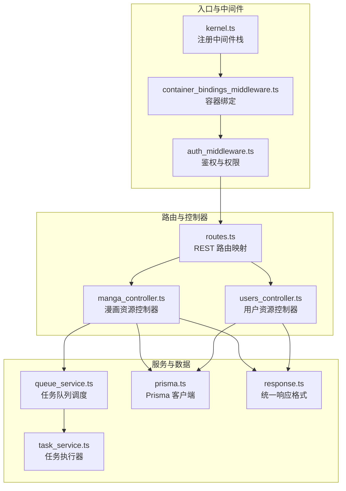
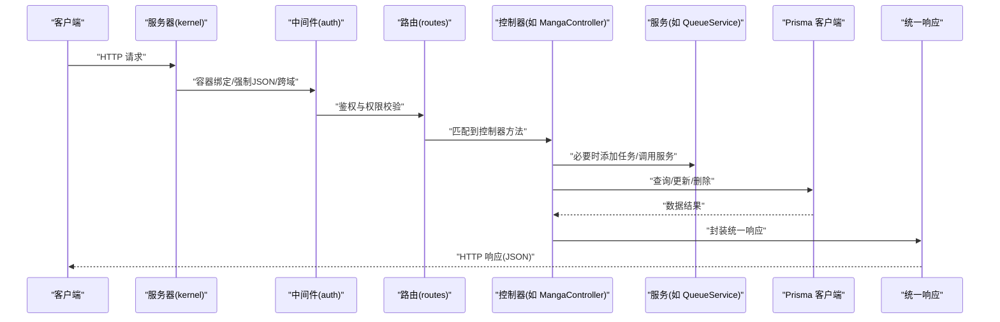
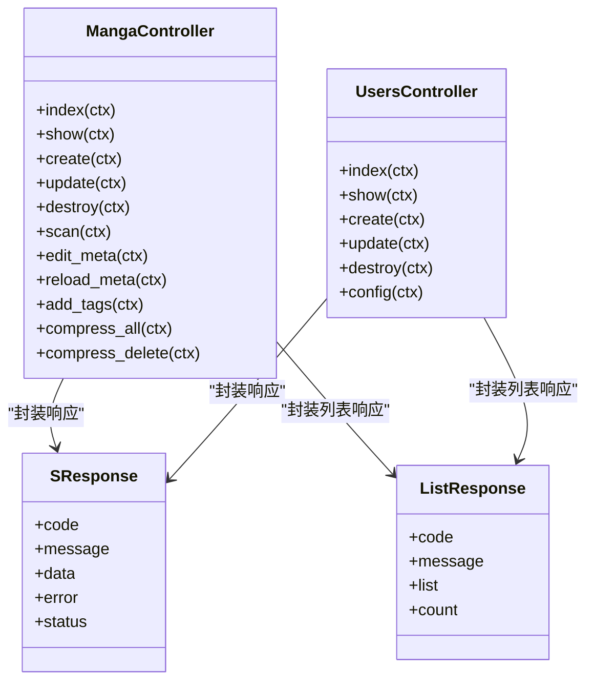
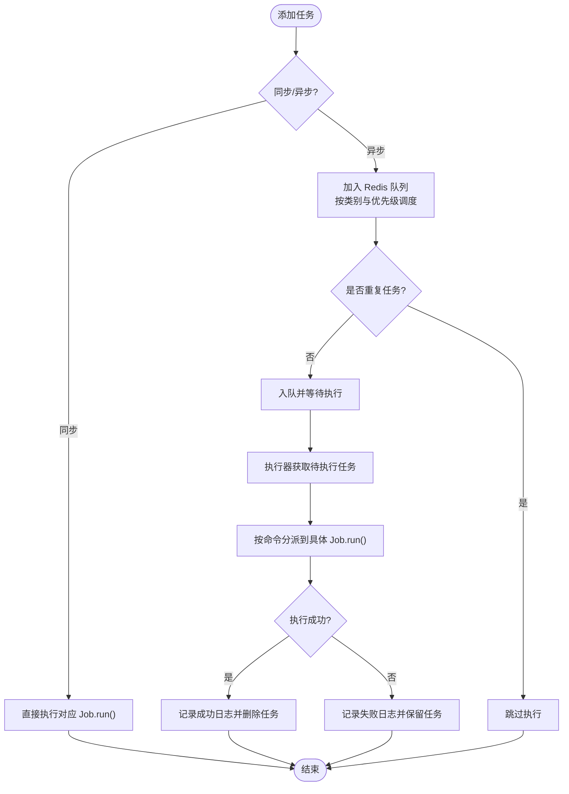
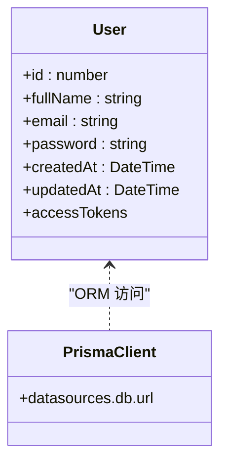
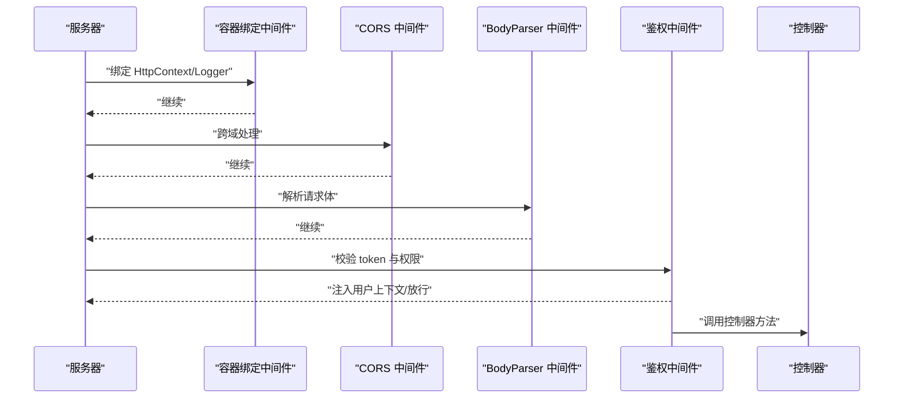
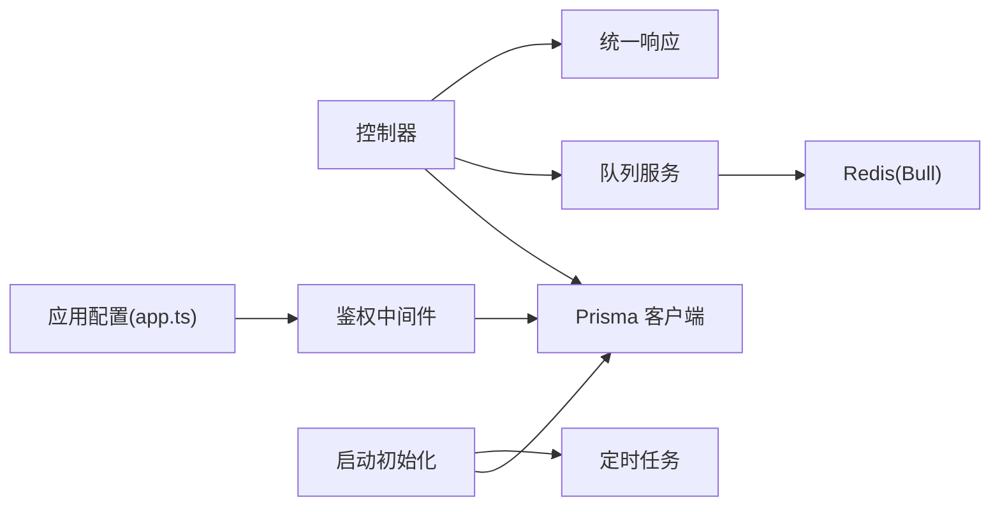

# MVC架构模式

<cite>
**本文引用的文件**
- [routes.ts](file://start/routes.ts)
- [kernel.ts](file://start/kernel.ts)
- [container_bindings_middleware.ts](file://app/middleware/container_bindings_middleware.ts)
- [auth_middleware.ts](file://app/middleware/auth_middleware.ts)
- [prisma.ts](file://start/prisma.ts)
- [manga_controller.ts](file://app/controllers/manga_controller.ts)
- [users_controller.ts](file://app/controllers/users_controller.ts)
- [task_service.ts](file://app/services/task_service.ts)
- [queue_service.ts](file://app/services/queue_service.ts)
- [response.ts](file://app/interfaces/response.ts)
- [user.ts](file://app/models/user.ts)
- [http.ts](file://app/type/http.ts)
- [init.ts](file://start/init.ts)
- [app.ts](file://config/app.ts)
</cite>

## 目录
1. [引言](#引言)
2. [项目结构](#项目结构)
3. [核心组件](#核心组件)
4. [架构总览](#架构总览)
5. [详细组件分析](#详细组件分析)
6. [依赖分析](#依赖分析)
7. [性能考量](#性能考量)
8. [故障排查指南](#故障排查指南)
9. [结论](#结论)
10. [附录](#附录)

## 引言
本文件系统性阐述 SManga Adonis 项目在 AdonisJS 框架下的 MVC 架构设计与实现，覆盖控制器层如何处理 HTTP 请求、服务层如何封装业务逻辑、模型层如何管理数据访问，并结合依赖注入容器、路由分发机制与中间件管道，给出各层协作关系与最佳实践。文中通过图示与“章节来源”标注，帮助读者快速定位到具体实现文件。

## 项目结构
- 路由定义集中于 start/routes.ts，采用按模块划分的控制器方法映射，形成清晰的 RESTful 接口清单。
- 中间件栈在 start/kernel.ts 中注册，分别作用于服务器全局与路由匹配后的请求链路。
- 控制器位于 app/controllers，每个控制器对应一个资源域（如 manga、users），负责请求解析、鉴权校验与响应封装。
- 服务层位于 app/services，包含队列调度、任务执行、定时任务等业务编排能力。
- 数据访问通过 Prisma 客户端在 start/prisma.ts 统一初始化，供控制器与服务层复用。
- 响应格式统一定义于 app/interfaces/response.ts，确保前后端交互一致性。
- 类型扩展位于 app/type/http.ts，增强 HttpContext 的上下文能力（如附加 userId）。

图表来源
- [kernel.ts:18-49](file://start/kernel.ts#L18-L49)
- [routes.ts:10-241](file://start/routes.ts#L10-L241)
- [manga_controller.ts:12-460](file://app/controllers/manga_controller.ts#L12-L460)
- [users_controller.ts:7-160](file://app/controllers/users_controller.ts#L7-L160)
- [queue_service.ts:17-267](file://app/services/queue_service.ts#L17-L267)
- [task_service.ts:25-171](file://app/services/task_service.ts#L25-L171)
- [prisma.ts:7-42](file://start/prisma.ts#L7-L42)
- [response.ts:18-63](file://app/interfaces/response.ts#L18-L63)

章节来源
- [routes.ts:10-241](file://start/routes.ts#L10-L241)
- [kernel.ts:18-49](file://start/kernel.ts#L18-L49)
- [prisma.ts:7-42](file://start/prisma.ts#L7-L42)
- [response.ts:18-63](file://app/interfaces/response.ts#L18-L63)

## 核心组件
- 控制器层：以资源为中心的控制器方法，负责参数提取、鉴权校验、调用服务层或直接访问数据层、返回统一响应格式。
- 服务层：封装复杂业务流程，如任务队列调度、任务执行器、定时任务创建等，解耦控制器与底层实现细节。
- 模型层：基于 Lucid 的模型定义与认证混入，提供用户实体的属性与令牌提供器；数据访问通过 Prisma 统一客户端完成。
- 中间件层：容器绑定与鉴权中间件贯穿请求生命周期，确保上下文可用与权限控制。
- 路由层：集中式路由定义，按模块划分资源接口，支持 GET/POST/PUT/DELETE 等方法映射。
- 响应层：统一的响应包装类，保证前后端交互的一致性与可读性。

章节来源
- [manga_controller.ts:12-460](file://app/controllers/manga_controller.ts#L12-L460)
- [users_controller.ts:7-160](file://app/controllers/users_controller.ts#L7-L160)
- [task_service.ts:25-171](file://app/services/task_service.ts#L25-L171)
- [queue_service.ts:17-267](file://app/services/queue_service.ts#L17-L267)
- [user.ts:13-33](file://app/models/user.ts#L13-L33)
- [auth_middleware.ts:17-87](file://app/middleware/auth_middleware.ts#L17-L87)
- [container_bindings_middleware.ts:12-20](file://app/middleware/container_bindings_middleware.ts#L12-L20)
- [routes.ts:10-241](file://start/routes.ts#L10-L241)
- [response.ts:18-63](file://app/interfaces/response.ts#L18-L63)

## 架构总览
下图展示了请求从进入服务器到返回响应的关键流转：中间件栈对请求进行预处理，路由根据 URL 与方法选择对应控制器，控制器调用服务层或数据层，最终以统一响应格式返回。

图表来源
- [kernel.ts:35-49](file://start/kernel.ts#L35-L49)
- [auth_middleware.ts:23-85](file://app/middleware/auth_middleware.ts#L23-L85)
- [routes.ts:170-181](file://start/routes.ts#L170-L181)
- [manga_controller.ts:13-55](file://app/controllers/manga_controller.ts#L13-L55)
- [queue_service.ts:175-264](file://app/services/queue_service.ts#L175-L264)
- [prisma.ts:36-42](file://start/prisma.ts#L36-L42)
- [response.ts:18-33](file://app/interfaces/response.ts#L18-L33)

## 详细组件分析

### 控制器层：请求处理与响应封装
- 职责边界
  - 解析请求参数与请求体，进行基础校验。
  - 基于用户上下文与权限规则进行访问控制。
  - 调用服务层或直接访问数据层执行业务。
  - 使用统一响应类封装返回数据，保持接口一致性。
- 关键实现要点
  - 统一响应：控制器广泛使用 SResponse 与 ListResponse，确保 code/message/data/error/status 字段一致。
  - 权限控制：在控制器内部读取用户上下文并进行角色与媒体权限校验，非管理员或越权访问直接返回错误响应。
  - 任务触发：对耗时或后台任务，控制器通过队列服务添加任务，立即返回确认响应。
- 代表控制器
  - MangaController：提供漫画资源的增删改查、扫描、元数据编辑、标签管理、批量压缩等功能。
  - UsersController：提供用户资源的增删改查、权限配置、用户配置读取等。

图表来源
- [manga_controller.ts:12-460](file://app/controllers/manga_controller.ts#L12-L460)
- [users_controller.ts:7-160](file://app/controllers/users_controller.ts#L7-L160)
- [response.ts:18-63](file://app/interfaces/response.ts#L18-L63)

章节来源
- [manga_controller.ts:12-460](file://app/controllers/manga_controller.ts#L12-L460)
- [users_controller.ts:7-160](file://app/controllers/users_controller.ts#L7-L160)
- [response.ts:18-63](file://app/interfaces/response.ts#L18-L63)

### 服务层：任务编排与执行
- 队列服务
  - 通过 Bull 驱动 Redis 实现任务队列，支持按任务名分类（scan/sync/compress）与优先级调度。
  - 提供 addTask 方法统一添加任务，支持同步/异步两种执行模式，具备指数退避与最大重试次数配置。
  - 对特定任务（如扫描/删除路径）进行去重判断，避免重复执行。
- 任务执行器
  - TaskProcess 负责从数据库拉取待执行任务，加互斥锁与并发限制，按命令分派到具体 Job 执行。
  - 成功/失败分别记录到成功/失败表，并清理已完成任务。
- 作业类型
  - 包含扫描、删除、复制封面、压缩、同步、生成媒体海报、清理压缩缓存等作业，均以独立类实现 run 方法。

图表来源
- [queue_service.ts:175-264](file://app/services/queue_service.ts#L175-L264)
- [task_service.ts:36-171](file://app/services/task_service.ts#L36-L171)

章节来源
- [queue_service.ts:17-267](file://app/services/queue_service.ts#L17-L267)
- [task_service.ts:25-171](file://app/services/task_service.ts#L25-L171)

### 模型层：数据访问与认证
- 用户模型
  - 基于 Lucid 的 BaseModel，使用 withAuthFinder 混入提供基于令牌的认证能力。
  - 定义主键、邮箱、密码等字段，以及访问令牌提供器。
- 数据访问客户端
  - Prisma 客户端在启动时按配置动态创建，支持 sqlite/mysql/postgresql 三类数据库，统一注入到应用各处。

图表来源
- [user.ts:13-33](file://app/models/user.ts#L13-L33)
- [prisma.ts:26-32](file://start/prisma.ts#L26-L32)

章节来源
- [user.ts:13-33](file://app/models/user.ts#L13-L33)
- [prisma.ts:7-42](file://start/prisma.ts#L7-L42)

### 中间件与依赖注入容器
- 容器绑定中间件
  - 将 HttpContext 与 Logger 绑定到容器解析器，使任意位置可通过容器解析获取上下文与日志实例。
- 鉴权中间件
  - 在路由中间件栈中生效，对特定路径放行，其余请求校验 token 并加载用户信息与权限范围，注入到请求上下文。
  - 对用户模块与 DELETE 请求进行额外权限校验，非管理员不可访问或操作。
- HTTP内核
  - 服务器中间件对所有请求生效，路由中间件仅对已注册路由生效；错误处理器统一转换异常为 HTTP 响应。

图表来源
- [kernel.ts:35-49](file://start/kernel.ts#L35-L49)
- [container_bindings_middleware.ts:12-20](file://app/middleware/container_bindings_middleware.ts#L12-L20)
- [auth_middleware.ts:23-85](file://app/middleware/auth_middleware.ts#L23-L85)

章节来源
- [kernel.ts:18-49](file://start/kernel.ts#L18-L49)
- [container_bindings_middleware.ts:12-20](file://app/middleware/container_bindings_middleware.ts#L12-L20)
- [auth_middleware.ts:17-87](file://app/middleware/auth_middleware.ts#L17-L87)

### 路由分发机制
- 路由集中定义于 start/routes.ts，按资源域划分（如 manga、chapter、user、media 等），每个资源提供标准 CRUD 接口与扩展动作（如扫描、压缩、重载元数据等）。
- 路由映射采用懒加载控制器，提升启动性能与模块化程度。
- 示例：漫画资源路由涵盖列表、详情、创建、更新、删除、扫描、元数据编辑、标签管理、压缩等。

章节来源
- [routes.ts:10-241](file://start/routes.ts#L10-L241)
- [manga_controller.ts:170-181](file://app/controllers/manga_controller.ts#L170-L181)

## 依赖分析
- 控制器依赖
  - 控制器通过 prisma.ts 注入的 Prisma 客户端进行数据访问。
  - 控制器通过 queue_service.ts 调度后台任务，实现异步处理。
  - 控制器统一使用 response.ts 的响应包装类，保证输出格式一致。
- 服务层依赖
  - 任务执行器依赖 Prisma 客户端与 Redis 队列（Bull）。
  - 队列服务根据任务名与配置决定执行策略与退避策略。
- 中间件依赖
  - 鉴权中间件依赖 Prisma 客户端与请求头 token，向控制器注入用户上下文。
- 配置与启动
  - 启动时根据操作系统与配置创建目录、默认用户、清理缓存与恢复中断任务。
  - 应用密钥与 Cookie 配置在 config/app.ts 中定义。

图表来源
- [manga_controller.ts:2,6:2-6](file://app/controllers/manga_controller.ts#L2-L6)
- [queue_service.ts:17-267](file://app/services/queue_service.ts#L17-L267)
- [task_service.ts:1-171](file://app/services/task_service.ts#L1-L171)
- [auth_middleware.ts:8,55-58:8-58](file://app/middleware/auth_middleware.ts#L8-L58)
- [init.ts:63-110](file://start/init.ts#L63-L110)
- [app.ts:18-40](file://config/app.ts#L18-L40)

章节来源
- [manga_controller.ts:2,6:2-6](file://app/controllers/manga_controller.ts#L2-L6)
- [queue_service.ts:17-267](file://app/services/queue_service.ts#L17-L267)
- [task_service.ts:1-171](file://app/services/task_service.ts#L1-L171)
- [auth_middleware.ts:8,55-58:8-58](file://app/middleware/auth_middleware.ts#L8-L58)
- [init.ts:63-110](file://start/init.ts#L63-L110)
- [app.ts:18-40](file://config/app.ts#L18-L40)

## 性能考量
- 路由与控制器懒加载：减少启动时的模块解析开销，提升冷启动性能。
- 任务队列异步化：将耗时操作（扫描、压缩、删除、同步）放入队列，避免阻塞请求线程。
- 并发与退避：队列服务支持并发数与最大重试次数配置，任务失败采用指数退避降低重试风暴风险。
- 数据访问优化：控制器中对列表与统计场景使用 Promise.all 并行查询，减少往返时间。
- 缓存与清理：启动阶段清理缓存文件，避免历史残留影响运行效率。
- 配置驱动：数据库类型、队列并发、超时与重试等参数通过配置文件集中管理，便于按环境调优。

## 故障排查指南
- 鉴权失败
  - 现象：返回 token 错误或权限不足。
  - 排查：确认请求头 token 是否存在与有效；检查用户角色与媒体权限范围；确认中间件是否正确注入 userId。
- 数据库连接问题
  - 现象：无法连接数据库或迁移失败。
  - 排查：核对 config 中 sql 配置与环境变量；确认 Prisma 客户端初始化路径与数据库文件是否存在。
- 任务未执行或重复执行
  - 现象：任务长时间 pending 或重复执行。
  - 排查：检查 Redis 可用性与队列进程；查看队列服务的去重逻辑与任务名；确认任务执行器互斥锁与并发限制。
- 响应格式不一致
  - 现象：部分接口返回字段缺失或格式异常。
  - 排查：确认控制器是否使用统一响应类；检查接口是否遗漏必要的字段赋值。

章节来源
- [auth_middleware.ts:32-85](file://app/middleware/auth_middleware.ts#L32-L85)
- [prisma.ts:12-32](file://start/prisma.ts#L12-L32)
- [queue_service.ts:222-264](file://app/services/queue_service.ts#L222-L264)
- [task_service.ts:36-84](file://app/services/task_service.ts#L36-L84)
- [response.ts:18-63](file://app/interfaces/response.ts#L18-L63)

## 结论
SManga Adonis 项目在 AdonisJS 框架下实现了清晰的 MVC 分层：控制器专注请求与响应，服务层负责业务编排与任务调度，模型层与数据访问通过 Prisma 统一管理。中间件与依赖注入容器贯穿请求生命周期，确保上下文可用与权限可控。通过路由集中管理与统一响应格式，系统具备良好的可维护性与扩展性。配合队列异步化与配置驱动的性能参数，满足高并发与复杂业务场景的需求。

## 附录
- 关键实现路径参考
  - 控制器示例：[manga_controller.ts:13-index:13-55](file://app/controllers/manga_controller.ts#L13-L55)、[manga_controller.ts:147-create:147-154](file://app/controllers/manga_controller.ts#L147-L154)
  - 服务示例：[queue_service.ts:175-addTask:175-264](file://app/services/queue_service.ts#L175-L264)、[task_service.ts:91-process:91-171](file://app/services/task_service.ts#L91-L171)
  - 数据访问：[prisma.ts:36-prisma 实例:36-42](file://start/prisma.ts#L36-L42)
  - 响应格式：[response.ts:18-SResponse:18-33](file://app/interfaces/response.ts#L18-L33)
  - 中间件：[auth_middleware.ts:23-handle:23-85](file://app/middleware/auth_middleware.ts#L23-L85)
  - 路由：[routes.ts:170-manga 资源路由:170-181](file://start/routes.ts#L170-L181)
  - 启动初始化：[init.ts:63-boot:63-110](file://start/init.ts#L63-L110)
  - 应用配置：[app.ts:18-http 配置:18-40](file://config/app.ts#L18-L40)