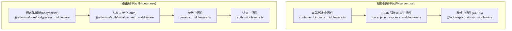
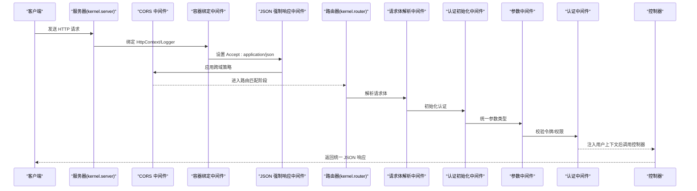
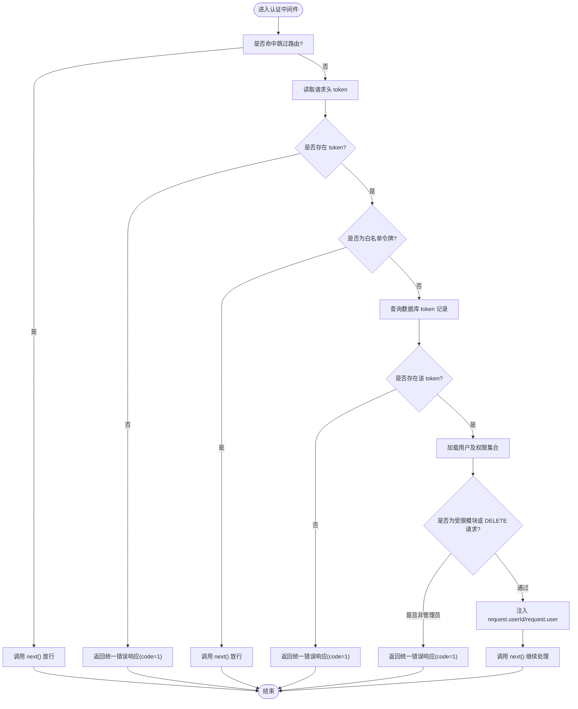
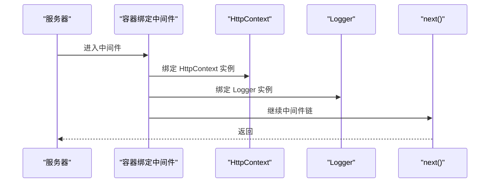
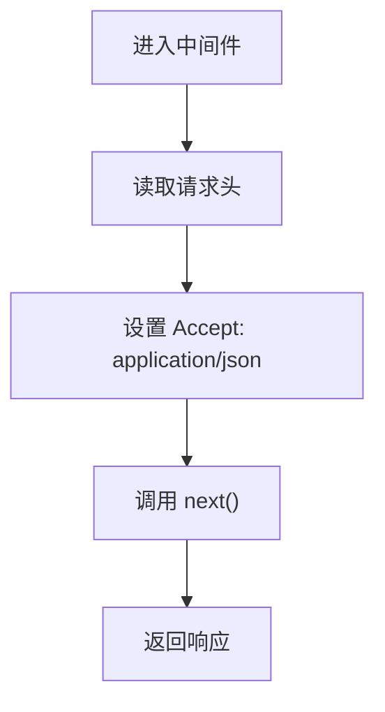
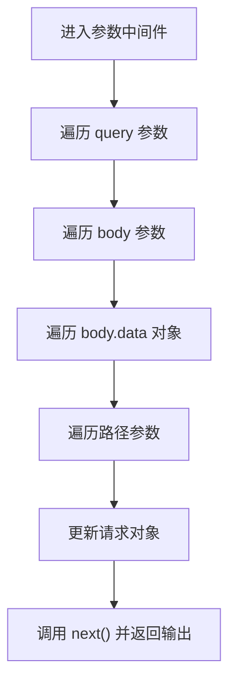
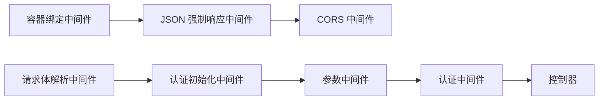

# 中间件系统

<cite>
**本文引用的文件**
- [app/middleware/auth_middleware.ts](file://app/middleware/auth_middleware.ts)
- [app/middleware/container_bindings_middleware.ts](file://app/middleware/container_bindings_middleware.ts)
- [app/middleware/force_json_response_middleware.ts](file://app/middleware/force_json_response_middleware.ts)
- [app/middleware/params_middleware.ts](file://app/middleware/params_middleware.ts)
- [start/kernel.ts](file://start/kernel.ts)
- [app/interfaces/response.ts](file://app/interfaces/response.ts)
- [app/type/http.ts](file://app/type/http.ts)
- [app/controllers/login_controller.ts](file://app/controllers/login_controller.ts)
- [app/controllers/tokens_controller.ts](file://app/controllers/tokens_controller.ts)
- [config/auth.ts](file://config/auth.ts)
- [config/bodyparser.ts](file://config/bodyparser.ts)
- [config/cors.ts](file://config/cors.ts)
- [app/exceptions/handler.ts](file://app/exceptions/handler.ts)
- [start/routes.ts](file://start/routes.ts)
</cite>

## 目录
1. [简介](#简介)
2. [项目结构](#项目结构)
3. [核心组件](#核心组件)
4. [架构总览](#架构总览)
5. [详细组件分析](#详细组件分析)
6. [依赖关系分析](#依赖关系分析)
7. [性能考量](#性能考量)
8. [故障排查指南](#故障排查指南)
9. [结论](#结论)
10. [附录](#附录)

## 简介
本文件系统性梳理 SManga Adonis 的中间件体系，覆盖执行顺序、生命周期与作用域；重点解析认证中间件的令牌校验流程、容器绑定中间件的服务注入、JSON 强制响应中间件的格式化策略、参数中间件的数据转换逻辑；并提供自定义中间件的开发指南、中间件链构建与错误处理建议、配置项说明、性能优化与调试技巧。

## 项目结构
中间件注册集中在启动内核文件中，分为两类栈：
- 服务器级中间件：对所有请求生效（含未匹配路由）
- 路由级中间件：仅对已注册路由生效

图表来源
- [start/kernel.ts:35-49](file://start/kernel.ts#L35-L49)

章节来源
- [start/kernel.ts:35-49](file://start/kernel.ts#L35-L49)

## 核心组件
- 认证中间件：负责令牌校验、用户权限判定、将用户上下文注入请求对象。
- 容器绑定中间件：向请求上下文容器绑定 HttpContext 与 Logger 实例，便于后续服务注入。
- JSON 强制响应中间件：统一将 Accept 头设置为 application/json，确保框架内部错误与校验结果以 JSON 返回。
- 参数中间件：统一将 query、body、嵌套 data 字段以及路径参数中的 id 与特定键转换为数字，提升控制器侧数据一致性。

章节来源
- [app/middleware/auth_middleware.ts:17-86](file://app/middleware/auth_middleware.ts#L17-L86)
- [app/middleware/container_bindings_middleware.ts:12-19](file://app/middleware/container_bindings_middleware.ts#L12-L19)
- [app/middleware/force_json_response_middleware.ts:9-16](file://app/middleware/force_json_response_middleware.ts#L9-L16)
- [app/middleware/params_middleware.ts:3-65](file://app/middleware/params_middleware.ts#L3-L65)

## 架构总览
下图展示一次典型请求从进入服务器到到达控制器的完整中间件链路与关键决策点。

图表来源
- [start/kernel.ts:35-49](file://start/kernel.ts#L35-L49)
- [app/middleware/container_bindings_middleware.ts:12-19](file://app/middleware/container_bindings_middleware.ts#L12-L19)
- [app/middleware/force_json_response_middleware.ts:9-16](file://app/middleware/force_json_response_middleware.ts#L9-L16)
- [app/middleware/params_middleware.ts:3-65](file://app/middleware/params_middleware.ts#L3-L65)
- [app/middleware/auth_middleware.ts:17-86](file://app/middleware/auth_middleware.ts#L17-L86)

## 详细组件分析

### 认证中间件（JWT 令牌验证与权限控制）
- 执行时机：路由级中间件链末端，确保在控制器前完成鉴权。
- 跳过规则：对特定前缀的路由直接放行（如部署、测试、登录、文件、分析等）。
- 令牌来源：从请求头读取 token。
- 校验流程：
  - 若缺少 token，返回统一错误响应。
  - 特殊白名单令牌可直接放行。
  - 查询数据库中的 token 记录，不存在则拒绝。
  - 加载用户及其权限集合，计算媒体与模块访问限制。
  - 对特定模块与 DELETE 方法进行管理员角色校验。
  - 将用户 ID 与用户对象写入请求上下文，继续后续处理。
- 错误处理：统一通过响应接口返回标准结构，状态码 401。

图表来源
- [app/middleware/auth_middleware.ts:23-85](file://app/middleware/auth_middleware.ts#L23-L85)
- [app/interfaces/response.ts:18-33](file://app/interfaces/response.ts#L18-L33)
- [app/type/http.ts:12-14](file://app/type/http.ts#L12-L14)

章节来源
- [app/middleware/auth_middleware.ts:17-86](file://app/middleware/auth_middleware.ts#L17-L86)
- [app/interfaces/response.ts:18-33](file://app/interfaces/response.ts#L18-L33)
- [app/type/http.ts:12-14](file://app/type/http.ts#L12-L14)

### 容器绑定中间件（服务注入）
- 作用：将 HttpContext 与 Logger 绑定到请求上下文容器，使控制器与服务可通过容器解析对应实例。
- 生命周期：服务器级中间件，每个请求都会执行一次。
- 注意：当前实现仅绑定 HttpContext 与 Logger，若需扩展其他服务，可在同一模式下继续绑定。

图表来源
- [app/middleware/container_bindings_middleware.ts:12-19](file://app/middleware/container_bindings_middleware.ts#L12-L19)

章节来源
- [app/middleware/container_bindings_middleware.ts:12-19](file://app/middleware/container_bindings_middleware.ts#L12-L19)

### JSON 强制响应中间件（统一 JSON 输出）
- 作用：将请求头 Accept 设为 application/json，确保框架内置校验与认证错误也以 JSON 形式返回。
- 适用场景：前端统一消费后端 API，避免混合内容类型导致解析困难。
- 配置：可结合 CORS 与 bodyparser 配置共同工作。

图表来源
- [app/middleware/force_json_response_middleware.ts:9-16](file://app/middleware/force_json_response_middleware.ts#L9-L16)

章节来源
- [app/middleware/force_json_response_middleware.ts:9-16](file://app/middleware/force_json_response_middleware.ts#L9-L16)

### 参数中间件（统一类型转换）
- 作用：将 query、body、嵌套 data 字段以及路径参数中的 id 与特定键（如 page、pageSize、limit、slice）转换为数字，提升控制器侧数据一致性。
- 数据流：
  - 处理 query 参数
  - 处理 body 参数
  - 处理 body.data 对象
  - 处理路径参数
  - 更新请求对象后继续链路

图表来源
- [app/middleware/params_middleware.ts:3-65](file://app/middleware/params_middleware.ts#L3-L65)

章节来源
- [app/middleware/params_middleware.ts:3-65](file://app/middleware/params_middleware.ts#L3-L65)

### 认证配置与令牌生成（参考）
- 认证守卫配置：使用基于令牌的守卫，模型为用户模型。
- 登录流程：控制器根据用户名与密码校验，成功后生成令牌并记录登录行为。
- 令牌管理：提供令牌列表、详情、增删改查等接口。

章节来源
- [config/auth.ts:5-15](file://config/auth.ts#L5-L15)
- [app/controllers/login_controller.ts:34-93](file://app/controllers/login_controller.ts#L34-L93)
- [app/controllers/tokens_controller.ts:13-61](file://app/controllers/tokens_controller.ts#L13-L61)

## 依赖关系分析
- 中间件链依赖：
  - 服务器级：容器绑定 → JSON 强制响应 → CORS
  - 路由级：请求体解析 → 认证初始化 → 参数中间件 → 认证中间件
- 关键耦合点：
  - 认证中间件依赖数据库（Prisma）与统一响应格式。
  - 参数中间件影响控制器输入数据形态，降低控制器重复转换成本。
  - CORS 与 JSON 强制响应配合，保证跨域与统一输出。

图表来源
- [start/kernel.ts:35-49](file://start/kernel.ts#L35-L49)

章节来源
- [start/kernel.ts:35-49](file://start/kernel.ts#L35-L49)

## 性能考量
- 认证中间件：
  - 令牌与用户查询为数据库 IO，建议：
    - 为 token 表与用户表建立合适索引
    - 对高频路由启用跳过规则，减少不必要的鉴权
    - 避免在中间件中做重型计算，必要时缓存用户权限
- 参数中间件：
  - 遍历多处参数结构，建议：
    - 控制器侧尽量只读取必要的字段
    - 对超大请求体谨慎开启自动处理
- CORS：
  - 合理设置允许源与方法，避免宽泛暴露
- JSON 强制响应：
  - 仅做头部修改，开销极低

[本节为通用性能建议，不直接分析具体文件]

## 故障排查指南
- 统一异常处理：
  - 异常处理器在生产环境关闭详细堆栈，便于线上稳定运行。
- 常见问题定位：
  - 401 令牌错误：检查请求头 token 是否存在、是否在数据库中有效、是否命中跳过路由。
  - 权限不足：确认用户角色与目标模块/方法是否满足管理员要求。
  - 参数类型异常：确认前端传参是否为字符串数字，参数中间件会尝试转换。
  - CORS 失败：检查允许源、方法与凭据配置。
- 调试技巧：
  - 开启容器绑定，使用 Logger 记录关键路径
  - 使用统一响应包装，便于前后端一致处理
  - 在开发环境适当放宽 CORS，快速定位跨域问题

章节来源
- [app/exceptions/handler.ts:4-28](file://app/exceptions/handler.ts#L4-L28)
- [config/cors.ts:9-17](file://config/cors.ts#L9-L17)
- [app/interfaces/response.ts:18-33](file://app/interfaces/response.ts#L18-L33)

## 结论
SManga Adonis 的中间件体系通过“服务器级 + 路由级”的双层设计，实现了统一的请求预处理、认证与权限控制、参数标准化与统一响应格式。认证中间件以数据库令牌为核心，结合用户角色与模块权限，形成细粒度的访问控制；参数中间件显著降低了控制器侧的数据清洗成本；容器绑定与 JSON 强制响应中间件提升了可维护性与一致性。建议在生产环境中关注数据库索引、CORS 策略与日志记录，持续优化认证与参数处理的性能表现。

## 附录

### 中间件链构建与自定义开发指南
- 新增中间件：
  - 在 app/middleware 下创建文件，导出默认类并实现 handle(ctx, next) 方法
  - 在 start/kernel.ts 中 server.use 或 router.use 注册
- 执行顺序：
  - 服务器级先于路由级执行
  - 路由级按注册顺序依次执行
- 生命周期：
  - 每个请求独立执行一次
  - 可在 handle 内部决定是否调用 next 或直接返回响应
- 最佳实践：
  - 尽量保持中间件职责单一
  - 对数据库查询与外部 IO 做最小化与必要化
  - 使用统一响应格式与日志记录

章节来源
- [start/kernel.ts:35-49](file://start/kernel.ts#L35-L49)

### 配置选项速览
- 认证配置（auth.ts）
  - 默认守卫：api
  - 守卫类型：基于令牌的守卫
  - 用户提供者：基于 accessTokens 与用户模型
- 请求体解析（bodyparser.ts）
  - 允许方法：POST、PUT、PATCH、DELETE
  - JSON 类型：application/json 等
  - 多部分上传：自动处理、最大 20MB
- 跨域（cors.ts）
  - 启用 CORS
  - 允许方法：GET、HEAD、POST、PUT、DELETE
  - 凭据：允许

章节来源
- [config/auth.ts:5-15](file://config/auth.ts#L5-L15)
- [config/bodyparser.ts:3-53](file://config/bodyparser.ts#L3-L53)
- [config/cors.ts:9-17](file://config/cors.ts#L9-L17)