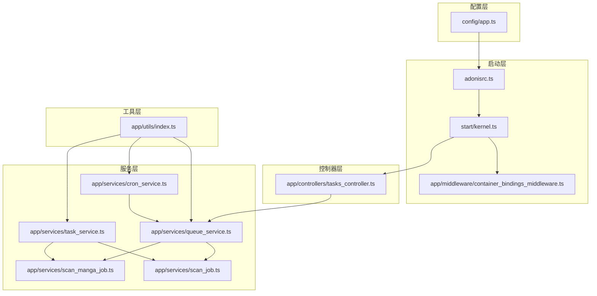
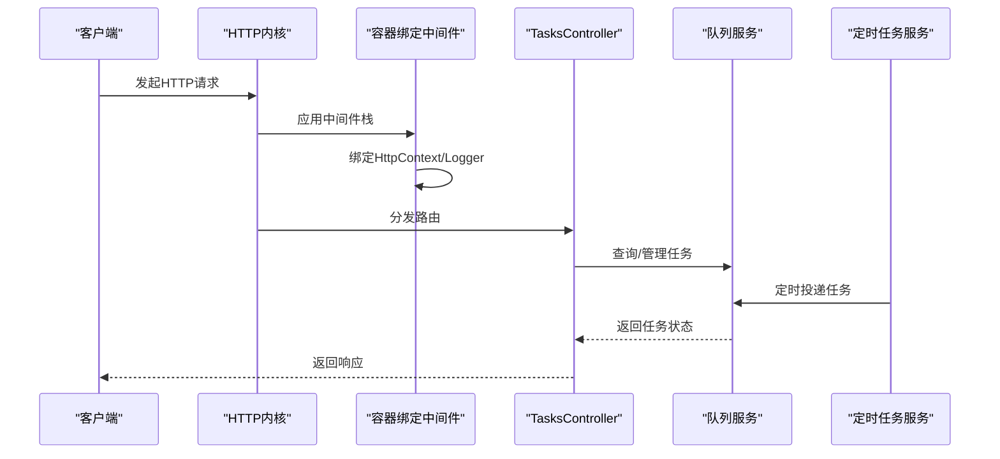
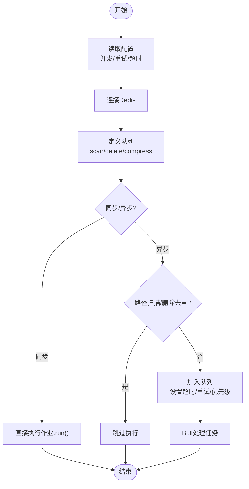
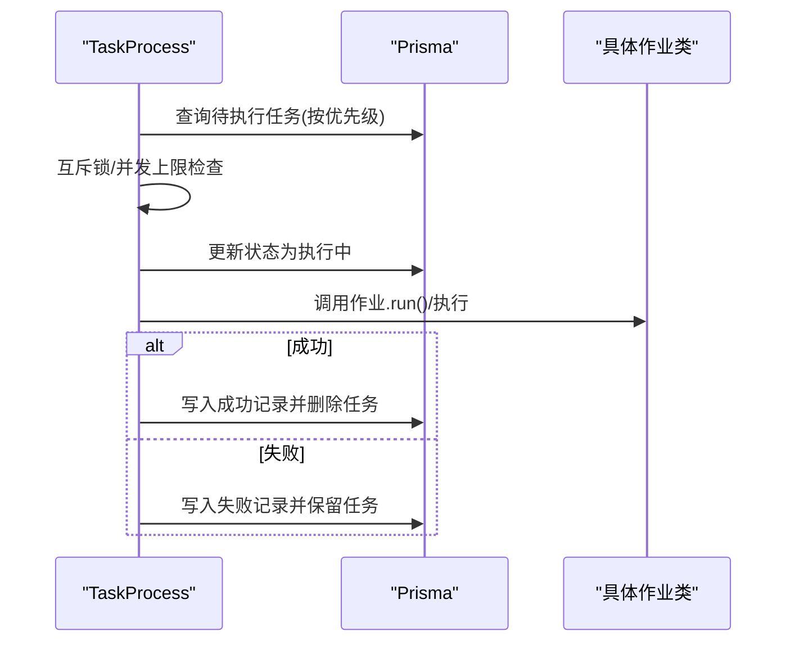
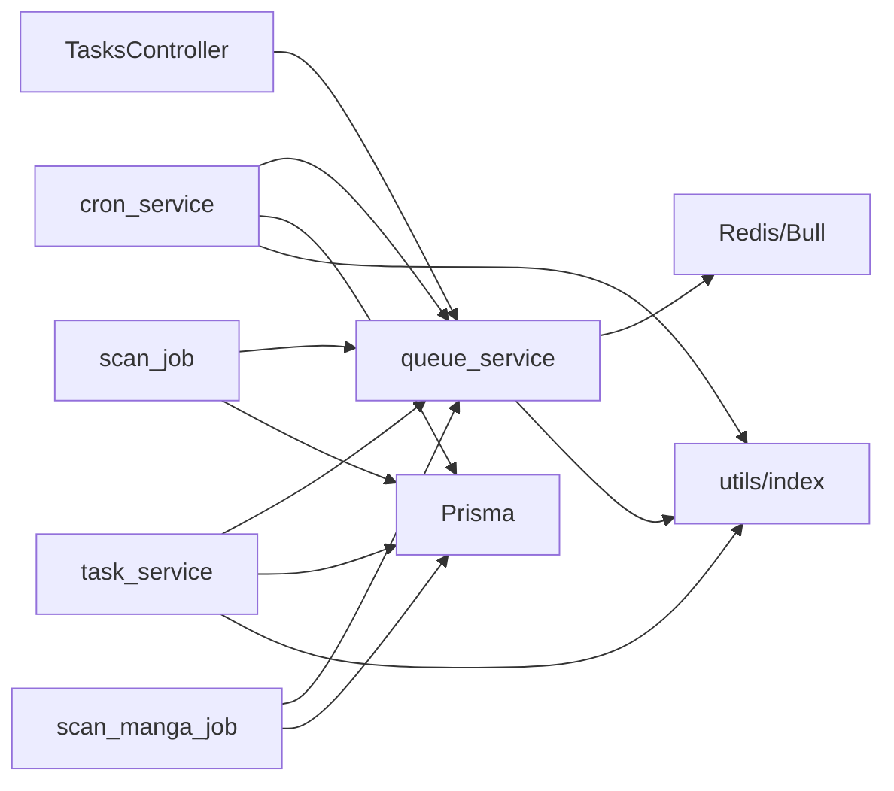

# 依赖注入容器

<cite>
**本文引用的文件**
- [adonisrc.ts](file://adonisrc.ts)
- [kernel.ts](file://start/kernel.ts)
- [container_bindings_middleware.ts](file://app/middleware/container_bindings_middleware.ts)
- [queue_service.ts](file://app/services/queue_service.ts)
- [task_service.ts](file://app/services/task_service.ts)
- [cron_service.ts](file://app/services/cron_service.ts)
- [scan_job.ts](file://app/services/scan_job.ts)
- [scan_manga_job.ts](file://app/services/scan_manga_job.ts)
- [tasks_controller.ts](file://app/controllers/tasks_controller.ts)
- [index.ts](file://app/utils/index.ts)
- [app.ts](file://config/app.ts)
- [package.json](file://package.json)
</cite>

## 目录
1. [简介](#简介)
2. [项目结构](#项目结构)
3. [核心组件](#核心组件)
4. [架构总览](#架构总览)
5. [详细组件分析](#详细组件分析)
6. [依赖分析](#依赖分析)
7. [性能考虑](#性能考虑)
8. [故障排查指南](#故障排查指南)
9. [结论](#结论)
10. [附录](#附录)

## 简介
本文件系统化阐述 SManga Adonis 项目的依赖注入（IoC）容器工作原理与最佳实践，覆盖服务注册与解析、服务提供者、构造函数注入与属性注入、队列与任务服务的依赖关系，以及在 MVC 架构中的作用与优势。文档同时提供避免循环依赖、性能优化建议与常见问题排查方法，帮助开发者在复杂后台任务场景下高效、稳定地组织代码。

## 项目结构
SManga Adonis 基于 AdonisJS 6，采用模块化的分层结构：
- 配置层：应用密钥、HTTP 服务器配置等
- 启动层：应用引导、中间件栈、预加载模块
- 控制器层：HTTP 请求入口，调用服务完成业务
- 服务层：核心业务逻辑与任务编排，如队列、定时任务、扫描任务等
- 工具层：通用工具函数（路径、配置、日志等）
- 中间件层：请求生命周期中的横切关注点（如容器绑定）

图表来源
- [adonisrc.ts:1-72](file://adonisrc.ts#L1-L72)
- [kernel.ts:1-69](file://start/kernel.ts#L1-L69)
- [container_bindings_middleware.ts:1-20](file://app/middleware/container_bindings_middleware.ts#L1-L20)
- [tasks_controller.ts:1-55](file://app/controllers/tasks_controller.ts#L1-L55)
- [queue_service.ts:1-267](file://app/services/queue_service.ts#L1-L267)
- [task_service.ts:1-171](file://app/services/task_service.ts#L1-L171)
- [cron_service.ts:1-144](file://app/services/cron_service.ts#L1-L144)
- [scan_job.ts:1-254](file://app/services/scan_job.ts#L1-L254)
- [scan_manga_job.ts:1-800](file://app/services/scan_manga_job.ts#L1-L800)
- [index.ts:1-313](file://app/utils/index.ts#L1-L313)

章节来源
- [adonisrc.ts:1-72](file://adonisrc.ts#L1-L72)
- [kernel.ts:1-69](file://start/kernel.ts#L1-L69)
- [container_bindings_middleware.ts:1-20](file://app/middleware/container_bindings_middleware.ts#L1-L20)
- [tasks_controller.ts:1-55](file://app/controllers/tasks_controller.ts#L1-L55)
- [queue_service.ts:1-267](file://app/services/queue_service.ts#L1-L267)
- [task_service.ts:1-171](file://app/services/task_service.ts#L1-L171)
- [cron_service.ts:1-144](file://app/services/cron_service.ts#L1-L144)
- [scan_job.ts:1-254](file://app/services/scan_job.ts#L1-L254)
- [scan_manga_job.ts:1-800](file://app/services/scan_manga_job.ts#L1-L800)
- [index.ts:1-313](file://app/utils/index.ts#L1-L313)

## 核心组件
- 服务提供者与应用配置
  - 应用通过配置文件声明服务提供者与预加载模块，确保框架与第三方能力（如 CORS、数据库、认证）按需注册。
- 中间件与容器绑定
  - HTTP 请求进入内核后，容器绑定中间件将 HttpContext 与 Logger 绑定到请求上下文，使控制器与服务可直接获取这些对象。
- 队列与任务服务
  - 任务通过队列服务统一调度，支持并发、重试、超时与优先级；定时任务由 cron 服务触发，向队列投递任务。
- 扫描与媒体处理作业
  - 扫描路径与扫描漫画作业封装具体业务，通过队列服务解耦执行与调度。

章节来源
- [adonisrc.ts:24-35](file://adonisrc.ts#L24-L35)
- [kernel.ts:18-49](file://start/kernel.ts#L18-L49)
- [container_bindings_middleware.ts:12-19](file://app/middleware/container_bindings_middleware.ts#L12-L19)
- [queue_service.ts:17-101](file://app/services/queue_service.ts#L17-L101)
- [cron_service.ts:16-141](file://app/services/cron_service.ts#L16-L141)
- [task_service.ts:25-84](file://app/services/task_service.ts#L25-L84)
- [scan_job.ts:15-27](file://app/services/scan_job.ts#L15-L27)
- [scan_manga_job.ts:29-74](file://app/services/scan_manga_job.ts#L29-L74)

## 架构总览
AdonisJS 的 IoC 容器在应用启动阶段解析配置，注册服务提供者，并在请求生命周期中通过中间件将上下文对象绑定到容器解析器，供控制器与服务使用。队列与任务服务通过统一接口解耦业务执行与调度，形成“调度-执行-持久化”的清晰边界。

图表来源
- [kernel.ts:18-49](file://start/kernel.ts#L18-L49)
- [container_bindings_middleware.ts:12-19](file://app/middleware/container_bindings_middleware.ts#L12-L19)
- [tasks_controller.ts:5-54](file://app/controllers/tasks_controller.ts#L5-L54)
- [queue_service.ts:175-264](file://app/services/queue_service.ts#L175-L264)
- [cron_service.ts:26-84](file://app/services/cron_service.ts#L26-L84)

## 详细组件分析

### 服务提供者与应用配置
- 服务提供者
  - 在配置中声明多个提供者，包括应用、哈希、REPL、Vine、CORS、数据库、认证等，确保框架能力按需启用。
- 预加载模块
  - 启动时预加载路由与内核，保证应用启动顺序与依赖可见性。

章节来源
- [adonisrc.ts:24-45](file://adonisrc.ts#L24-L45)

### 中间件与容器绑定
- 容器绑定中间件
  - 将 HttpContext 与 Logger 绑定到请求上下文的容器解析器，使控制器与服务可通过容器解析这些对象，实现解耦与测试友好。

章节来源
- [container_bindings_middleware.ts:12-19](file://app/middleware/container_bindings_middleware.ts#L12-L19)
- [kernel.ts:35-39](file://start/kernel.ts#L35-L39)

### 队列服务与任务调度
- 队列配置与连接
  - 通过配置读取并发、重试与超时参数，连接本地 Redis，定义扫描、删除、压缩三类队列。
- 任务处理流程
  - 支持同步/异步两种派发模式；根据任务名与命令映射到具体作业类；对路径扫描/删除任务进行去重判断；统一设置超时与指数退避重试。
- 控制器集成
  - 控制器直接使用队列实例查询、移除任务，实现任务管理端点。

图表来源
- [queue_service.ts:17-101](file://app/services/queue_service.ts#L17-L101)
- [queue_service.ts:175-264](file://app/services/queue_service.ts#L175-L264)

章节来源
- [queue_service.ts:17-101](file://app/services/queue_service.ts#L17-L101)
- [queue_service.ts:175-264](file://app/services/queue_service.ts#L175-L264)
- [tasks_controller.ts:5-54](file://app/controllers/tasks_controller.ts#L5-L54)

### 任务服务与数据库交互
- 任务监控与并发控制
  - 使用互斥锁与数据库锁避免重复执行；按优先级取出待执行任务；执行前后更新状态并记录成功/失败日志。
- 作业分发
  - 根据命令分发到具体作业类，如扫描路径、扫描漫画、删除媒体等。

图表来源
- [task_service.ts:36-84](file://app/services/task_service.ts#L36-L84)
- [task_service.ts:91-170](file://app/services/task_service.ts#L91-L170)

章节来源
- [task_service.ts:25-84](file://app/services/task_service.ts#L25-L84)
- [task_service.ts:91-170](file://app/services/task_service.ts#L91-L170)

### 定时任务服务与配置驱动
- 定时任务
  - 周期性扫描、同步、生成媒体封面、清理压缩缓存等任务通过 cron 服务调度。
- 配置驱动
  - 从配置读取各任务间隔与开关，确保任务策略可配置、可演进。

章节来源
- [cron_service.ts:16-141](file://app/services/cron_service.ts#L16-L141)
- [index.ts:94-115](file://app/utils/index.ts#L94-L115)

### 扫描作业与媒体处理
- 扫描路径作业
  - 解析路径与媒体库信息，扫描漫画并批量投递扫描漫画任务；必要时生成媒体封面。
- 扫描漫画作业
  - 解析漫画元数据、标签、封面与章节，支持多种归档格式；与数据库交互并记录扫描日志。

章节来源
- [scan_job.ts:15-119](file://app/services/scan_job.ts#L15-L119)
- [scan_manga_job.ts:29-356](file://app/services/scan_manga_job.ts#L29-L356)

## 依赖分析
- 模块耦合
  - 控制器仅依赖队列服务接口；服务层依赖工具层与配置；作业类依赖服务层提供的队列接口，形成自上而下的依赖方向。
- 外部依赖
  - Redis 用于队列持久化与分布式；Bull 提供队列与可视化面板；node-cron 提供定时任务；Prisma 提供数据库访问。
- 循环依赖规避
  - 通过“接口/服务实例”在运行时注入，避免在模块导入阶段形成环；控制器与服务通过容器解析间接依赖，降低耦合。

图表来源
- [tasks_controller.ts:1-55](file://app/controllers/tasks_controller.ts#L1-L55)
- [queue_service.ts:1-267](file://app/services/queue_service.ts#L1-L267)
- [cron_service.ts:1-144](file://app/services/cron_service.ts#L1-L144)
- [task_service.ts:1-171](file://app/services/task_service.ts#L1-L171)
- [scan_job.ts:1-254](file://app/services/scan_job.ts#L1-L254)
- [scan_manga_job.ts:1-800](file://app/services/scan_manga_job.ts#L1-L800)
- [index.ts:1-313](file://app/utils/index.ts#L1-L313)

章节来源
- [package.json:62-88](file://package.json#L62-L88)

## 性能考虑
- 队列并发与重试
  - 依据配置设置并发度与最大重试次数，结合指数退避与抖动，避免重试风暴；对耗时任务设置合理超时。
- I/O 与数据库锁
  - 使用互斥锁与数据库锁避免重复执行；批量任务采用去重策略，减少无效计算。
- 缓存与磁盘
  - 利用配置驱动的缓存与临时目录，减少重复扫描与元数据解析成本。
- 可视化与可观测性
  - 使用队列可视化面板监控任务状态与失败原因，便于快速定位性能瓶颈。

## 故障排查指南
- 任务未执行
  - 检查队列连接与 Redis 可用性；确认任务是否被去重策略跳过；查看队列处理回调与命令映射。
- 任务频繁失败
  - 查看重试策略与超时设置；检查作业内部异常日志与数据库事务回滚。
- 定时任务未触发
  - 核对配置中的时间表达式与环境变量；确认 cron 服务已正确调度。
- 控制器无法获取上下文对象
  - 确认容器绑定中间件已生效；检查中间件顺序与请求上下文绑定时机。

章节来源
- [queue_service.ts:41-47](file://app/services/queue_service.ts#L41-L47)
- [queue_service.ts:175-264](file://app/services/queue_service.ts#L175-L264)
- [cron_service.ts:26-84](file://app/services/cron_service.ts#L26-L84)
- [container_bindings_middleware.ts:12-19](file://app/middleware/container_bindings_middleware.ts#L12-L19)

## 结论
SManga Adonis 的 IoC 容器通过服务提供者与中间件绑定，实现了请求上下文与日志等对象的解耦注入；队列与任务服务以配置驱动与统一接口解耦了调度与执行；定时任务进一步将周期性工作自动化。整体架构在 MVC 模式下提升了可维护性与可测试性，配合合理的并发、重试与可观测性设计，能够稳定支撑复杂的后台任务场景。

## 附录
- 服务绑定最佳实践
  - 使用配置驱动参数（并发、重试、超时），避免硬编码；对路径扫描/删除任务进行去重；在作业中捕获异常并记录失败原因。
- 循环依赖避免
  - 通过运行时依赖解析与接口抽象，避免在导入阶段形成环；将共享状态集中到服务层，减少跨模块直接引用。
- 性能优化建议
  - 合理设置队列并发度；利用互斥锁与数据库锁控制资源竞争；对耗时操作引入超时与断路策略；使用可视化面板持续观察任务健康状况。