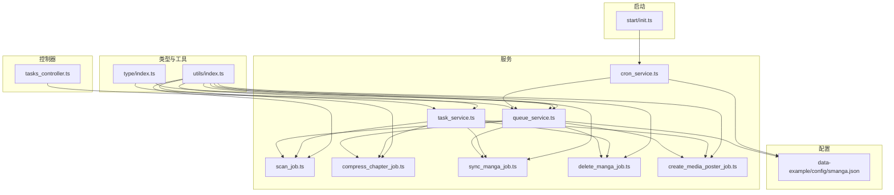
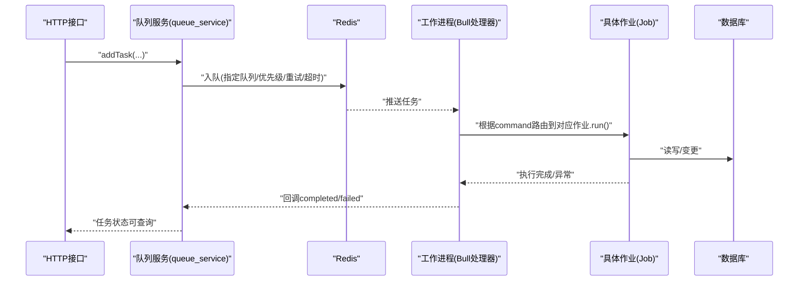
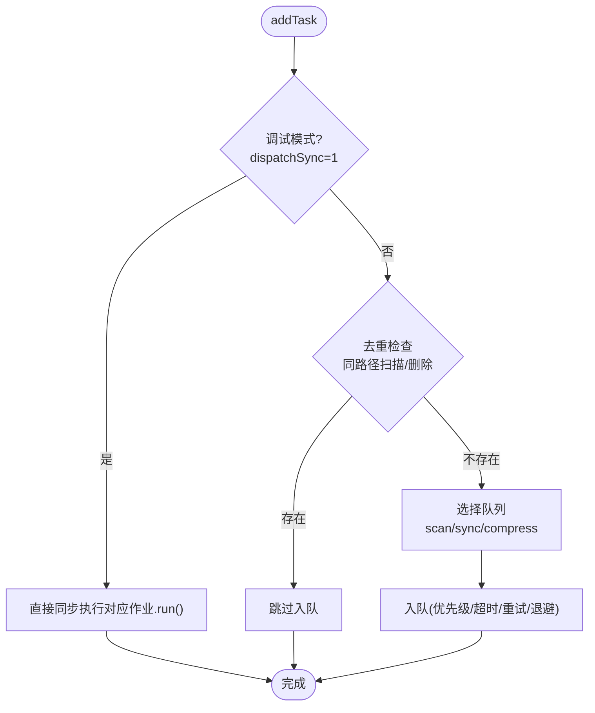
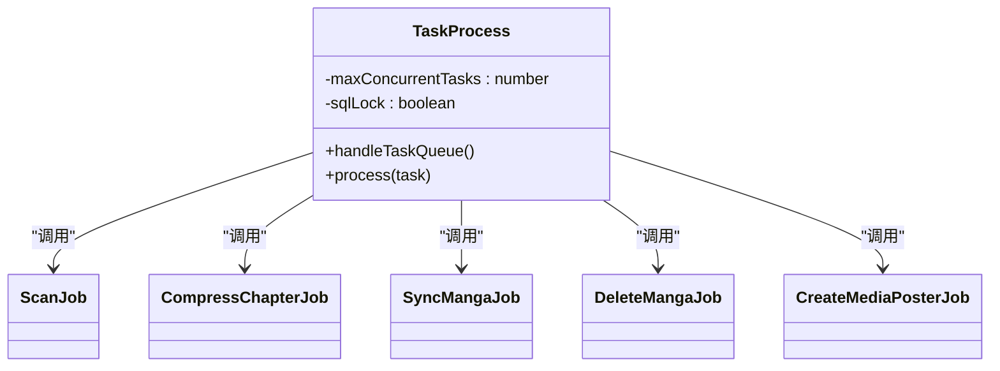
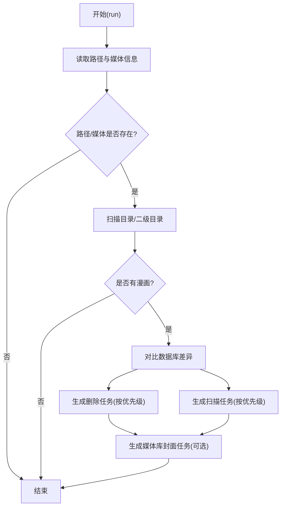
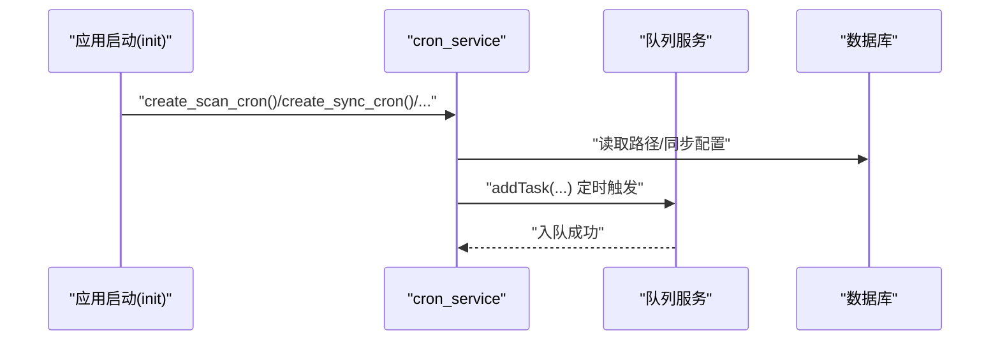
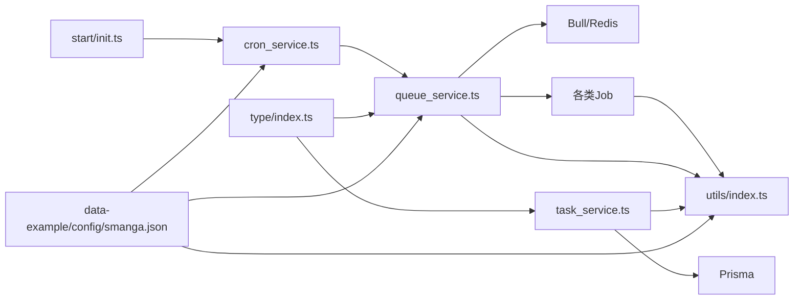

# 异步任务处理

<cite>
**本文引用的文件**
- [app/services/queue_service.ts](file://app/services/queue_service.ts)
- [app/services/task_service.ts](file://app/services/task_service.ts)
- [app/controllers/tasks_controller.ts](file://app/controllers/tasks_controller.ts)
- [app/listeners/task.ts](file://app/listeners/task.ts)
- [app/services/scan_job.ts](file://app/services/scan_job.ts)
- [app/services/compress_chapter_job.ts](file://app/services/compress_chapter_job.ts)
- [app/services/sync_manga_job.ts](file://app/services/sync_manga_job.ts)
- [app/services/delete_manga_job.ts](file://app/services/delete_manga_job.ts)
- [app/services/create_media_poster_job.ts](file://app/services/create_media_poster_job.ts)
- [app/services/cron_service.ts](file://app/services/cron_service.ts)
- [app/type/index.ts](file://app/type/index.ts)
- [app/utils/index.ts](file://app/utils/index.ts)
- [data-example/config/smanga.json](file://data-example/config/smanga.json)
- [start/init.ts](file://start/init.ts)
</cite>

## 目录
1. [简介](#简介)
2. [项目结构](#项目结构)
3. [核心组件](#核心组件)
4. [架构总览](#架构总览)
5. [详细组件分析](#详细组件分析)
6. [依赖关系分析](#依赖关系分析)
7. [性能考量](#性能考量)
8. [故障排查指南](#故障排查指南)
9. [结论](#结论)
10. [附录](#附录)

## 简介
本文件系统性阐述 SManga Adonis 的异步任务处理体系，围绕基于 Bull 和 Redis 的任务队列，覆盖任务创建、调度与执行流程；解释扫描、压缩、同步等任务类型的处理机制；说明任务监听器、错误重试与状态监控；并提供性能优化、并发控制与内存管理的最佳实践，以及定时任务服务的 cron 表达式配置与执行策略。

## 项目结构
SManga 异步任务相关代码主要分布在以下模块：
- 服务层：队列服务、任务服务、各类作业（扫描、压缩、同步、删除、生成海报等）、定时任务服务
- 控制器层：任务查询、删除、批量清理等接口
- 类型定义：任务优先级枚举
- 工具与配置：配置读取、路径与日志工具、默认配置初始化
- 启动入口：应用启动时部署定时任务

图表来源
- [app/controllers/tasks_controller.ts:1-55](file://app/controllers/tasks_controller.ts#L1-L55)
- [app/services/queue_service.ts:1-267](file://app/services/queue_service.ts#L1-L267)
- [app/services/task_service.ts:1-171](file://app/services/task_service.ts#L1-L171)
- [app/services/cron_service.ts:1-144](file://app/services/cron_service.ts#L1-L144)
- [app/services/scan_job.ts:1-254](file://app/services/scan_job.ts#L1-L254)
- [app/services/compress_chapter_job.ts:1-71](file://app/services/compress_chapter_job.ts#L1-L71)
- [app/services/sync_manga_job.ts:1-103](file://app/services/sync_manga_job.ts#L1-L103)
- [app/services/delete_manga_job.ts:1-78](file://app/services/delete_manga_job.ts#L1-L78)
- [app/services/create_media_poster_job.ts:1-92](file://app/services/create_media_poster_job.ts#L1-L92)
- [app/type/index.ts:1-49](file://app/type/index.ts#L1-L49)
- [app/utils/index.ts:1-313](file://app/utils/index.ts#L1-L313)
- [data-example/config/smanga.json:1-54](file://data-example/config/smanga.json#L1-L54)
- [start/init.ts:1-253](file://start/init.ts#L1-L253)

章节来源
- [app/services/queue_service.ts:1-267](file://app/services/queue_service.ts#L1-L267)
- [app/services/task_service.ts:1-171](file://app/services/task_service.ts#L1-L171)
- [app/services/cron_service.ts:1-144](file://app/services/cron_service.ts#L1-L144)
- [app/controllers/tasks_controller.ts:1-55](file://app/controllers/tasks_controller.ts#L1-L55)
- [app/type/index.ts:1-49](file://app/type/index.ts#L1-L49)
- [app/utils/index.ts:1-313](file://app/utils/index.ts#L1-L313)
- [data-example/config/smanga.json:1-54](file://data-example/config/smanga.json#L1-L54)
- [start/init.ts:1-253](file://start/init.ts#L1-L253)

## 核心组件
- 队列服务（Bull + Redis）：统一的任务分发、并发控制、重试与超时策略、按队列分类（scan/sync/compress）处理
- 任务服务（数据库驱动）：基于数据库的任务表轮询、加锁、并发上限、执行与结果记录
- 作业（Job）：扫描、压缩、同步、删除、生成海报等具体业务逻辑封装
- 定时任务服务：基于 node-cron 的周期性任务部署与调度
- 控制器：任务状态查询、单个任务删除、批量删除、清空队列
- 类型与工具：任务优先级、配置读取、路径与日志工具

章节来源
- [app/services/queue_service.ts:1-267](file://app/services/queue_service.ts#L1-L267)
- [app/services/task_service.ts:1-171](file://app/services/task_service.ts#L1-L171)
- [app/services/cron_service.ts:1-144](file://app/services/cron_service.ts#L1-L144)
- [app/controllers/tasks_controller.ts:1-55](file://app/controllers/tasks_controller.ts#L1-L55)
- [app/type/index.ts:1-49](file://app/type/index.ts#L1-L49)
- [app/utils/index.ts:1-313](file://app/utils/index.ts#L1-L313)

## 架构总览
系统采用“双轨异步”模式：
- Bull/Redis 队列：高吞吐、持久化、重试、超时、优先级与队列隔离
- 数据库队列：低频、顺序、串行、强一致，适合需要严格顺序或幂等的场景

图表来源
- [app/services/queue_service.ts:34-101](file://app/services/queue_service.ts#L34-L101)
- [app/services/queue_service.ts:103-141](file://app/services/queue_service.ts#L103-L141)
- [app/controllers/tasks_controller.ts:6-17](file://app/controllers/tasks_controller.ts#L6-L17)

## 详细组件分析

### 队列服务（Bull + Redis）
- 连接与事件：连接本地 Redis，注册 completed/failed 事件
- 队列分类：scan/sync/compress 三类队列，分别处理不同业务域
- 处理器：
  - 统一处理器：解析 command，路由到具体作业
  - 专用处理器：如 compress 队列专门处理压缩命令
- 任务入队：
  - 支持优先级、超时、最大重试次数、指数退避（带抖动）
  - 调试模式下可同步执行，便于开发调试
  - 对同一路径的扫描/删除任务进行去重判断
- 监控接口：通过控制器列出 active/waiting 任务，支持删除、清空

图表来源
- [app/services/queue_service.ts:175-264](file://app/services/queue_service.ts#L175-L264)

章节来源
- [app/services/queue_service.ts:1-267](file://app/services/queue_service.ts#L1-L267)
- [app/controllers/tasks_controller.ts:6-53](file://app/controllers/tasks_controller.ts#L6-L53)

### 任务服务（数据库驱动）
- 并发控制：互斥锁 + 最大并发计数，避免同时执行过多任务
- 任务拉取：按优先级升序（数值小优先）从 pending 中选取
- 执行与记录：执行成功写入成功表，失败写入失败表，并更新状态
- 锁与事务：SQL 锁避免并发冲突，确保串行化处理

图表来源
- [app/services/task_service.ts:25-171](file://app/services/task_service.ts#L25-L171)
- [app/services/scan_job.ts:15-254](file://app/services/scan_job.ts#L15-L254)
- [app/services/compress_chapter_job.ts:6-71](file://app/services/compress_chapter_job.ts#L6-L71)
- [app/services/sync_manga_job.ts:10-103](file://app/services/sync_manga_job.ts#L10-L103)
- [app/services/delete_manga_job.ts:11-78](file://app/services/delete_manga_job.ts#L11-L78)
- [app/services/create_media_poster_job.ts:9-92](file://app/services/create_media_poster_job.ts#L9-L92)

章节来源
- [app/services/task_service.ts:1-171](file://app/services/task_service.ts#L1-L171)

### 作业：扫描任务（ScanPathJob）
- 功能：扫描路径下的漫画，生成删除与扫描任务
- 去重：对同一路径的扫描/删除任务进行过滤，避免重复
- 生成任务：
  - 删除任务：对数据库中不存在的漫画生成删除任务
  - 扫描任务：对现有漫画生成扫描任务
  - 媒体库封面：可选生成媒体库封面任务
- 文件扫描：支持两种模式（仅文件/二级目录），并支持隐藏文件过滤与正则包含/排除

图表来源
- [app/services/scan_job.ts:29-119](file://app/services/scan_job.ts#L29-L119)

章节来源
- [app/services/scan_job.ts:1-254](file://app/services/scan_job.ts#L1-L254)

### 作业：压缩任务（CompressChapterJob）
- 功能：根据章节类型（zip/rar/7z）解压到目标路径
- 结果：Upsert 压缩记录，标记压缩状态
- 错误处理：捕获异常并抛出，交由 Bull 决定重试

章节来源
- [app/services/compress_chapter_job.ts:1-71](file://app/services/compress_chapter_job.ts#L1-L71)

### 作业：同步任务（SyncMangaJob）
- 功能：根据分享链接或目标记录，下载封面与元数据，获取章节列表并逐章生成同步任务
- 生成任务：按优先级生成章节同步任务

章节来源
- [app/services/sync_manga_job.ts:1-103](file://app/services/sync_manga_job.ts#L1-L103)

### 作业：删除任务（DeleteMangaJob）
- 功能：删除漫画及其关联的书签、收藏、压缩、历史、标签、元数据、章节、封面等

章节来源
- [app/services/delete_manga_job.ts:1-78](file://app/services/delete_manga_job.ts#L1-L78)

### 作业：生成媒体库封面（CreateMediaPosterJob）
- 功能：聚合最近更新的漫画封面，生成媒体库拼接图并更新媒体封面

章节来源
- [app/services/create_media_poster_job.ts:1-92](file://app/services/create_media_poster_job.ts#L1-L92)

### 定时任务服务（cron_service）
- 扫描定时任务：按配置间隔扫描所有启用的路径
- 同步定时任务：按配置间隔触发媒体/漫画同步
- 媒体库封面定时任务：按配置间隔生成媒体库封面
- 清除压缩缓存定时任务：按配置 cron 清理压缩缓存
- 部署：应用启动时在 init 中调用部署函数

图表来源
- [app/services/cron_service.ts:16-141](file://app/services/cron_service.ts#L16-L141)
- [start/init.ts:105-109](file://start/init.ts#L105-L109)

章节来源
- [app/services/cron_service.ts:1-144](file://app/services/cron_service.ts#L1-L144)
- [start/init.ts:105-109](file://start/init.ts#L105-L109)

### 任务监听器
- 当前监听器文件为空壳，预留扩展点，可用于订阅队列事件（如 completed/failed）并执行副作用逻辑

章节来源
- [app/listeners/task.ts:1-2](file://app/listeners/task.ts#L1-L2)

### 任务状态监控与控制
- 查询：列出 active/waiting 任务
- 查看：按 taskId 获取任务详情
- 删除：单个删除、批量删除、清空队列（清理历史）

章节来源
- [app/controllers/tasks_controller.ts:6-53](file://app/controllers/tasks_controller.ts#L6-L53)

## 依赖关系分析
- 队列服务依赖 Bull 与 Redis，负责任务分发与重试
- 作业依赖工具与配置，访问数据库与文件系统
- 定时任务服务依赖 node-cron 与配置，按周期触发 addTask
- 任务服务依赖数据库，实现串行化与幂等
- 类型定义提供任务优先级常量，贯穿调度与入队

图表来源
- [app/services/queue_service.ts:1-267](file://app/services/queue_service.ts#L1-L267)
- [app/services/cron_service.ts:1-144](file://app/services/cron_service.ts#L1-L144)
- [app/services/task_service.ts:1-171](file://app/services/task_service.ts#L1-L171)
- [app/type/index.ts:1-49](file://app/type/index.ts#L1-L49)
- [app/utils/index.ts:1-313](file://app/utils/index.ts#L1-L313)
- [data-example/config/smanga.json:1-54](file://data-example/config/smanga.json#L1-L54)
- [start/init.ts:1-253](file://start/init.ts#L1-L253)

章节来源
- [app/services/queue_service.ts:1-267](file://app/services/queue_service.ts#L1-L267)
- [app/services/cron_service.ts:1-144](file://app/services/cron_service.ts#L1-L144)
- [app/services/task_service.ts:1-171](file://app/services/task_service.ts#L1-L171)
- [app/type/index.ts:1-49](file://app/type/index.ts#L1-L49)
- [app/utils/index.ts:1-313](file://app/utils/index.ts#L1-L313)
- [data-example/config/smanga.json:1-54](file://data-example/config/smanga.json#L1-L54)
- [start/init.ts:1-253](file://start/init.ts#L1-L253)

## 性能考量
- 并发控制
  - Bull 并发：通过 queue.concurrency 控制每类队列的并发度
  - 数据库任务并发：任务服务限制最大并发，避免数据库压力过大
- 超时与重试
  - 统一超时与最大重试次数，指数退避+抖动降低风暴效应
- 优先级
  - 通过优先级枚举控制执行顺序，保证关键任务优先
- I/O 优化
  - 扫描与压缩涉及大量文件系统操作，建议合理设置并发与磁盘带宽
- 内存管理
  - 压缩/解压与图像处理需注意内存峰值，结合 imagick 配置与系统资源规划
- 去重与幂等
  - 同路径扫描/删除去重，避免重复 I/O
  - 作业内部尽量幂等，配合重试与回滚策略

章节来源
- [app/services/queue_service.ts:18-32](file://app/services/queue_service.ts#L18-L32)
- [app/services/queue_service.ts:248-262](file://app/services/queue_service.ts#L248-L262)
- [app/services/task_service.ts:28-31](file://app/services/task_service.ts#L28-L31)
- [app/type/index.ts:3-16](file://app/type/index.ts#L3-L16)
- [app/utils/index.ts:94-115](file://app/utils/index.ts#L94-L115)
- [data-example/config/smanga.json:18-53](file://data-example/config/smanga.json#L18-L53)

## 故障排查指南
- 任务长时间处于 in-progress
  - 检查数据库任务服务是否被锁住，确认互斥锁释放与最大并发阈值
- 任务频繁失败
  - 查看队列 failed 事件与作业内部异常，确认重试策略与退避参数
- 任务未被执行
  - 检查队列是否正确创建、处理器是否注册、任务是否被去重跳过
- 定时任务未触发
  - 检查 cron 表达式与配置项，确认启动时已部署定时任务
- 监控与清理
  - 使用控制器接口查看/删除/清空任务，定位问题任务

章节来源
- [app/services/task_service.ts:36-84](file://app/services/task_service.ts#L36-L84)
- [app/services/queue_service.ts:41-47](file://app/services/queue_service.ts#L41-L47)
- [app/services/queue_service.ts:222-232](file://app/services/queue_service.ts#L222-L232)
- [app/services/cron_service.ts:26-42](file://app/services/cron_service.ts#L26-L42)
- [app/controllers/tasks_controller.ts:6-53](file://app/controllers/tasks_controller.ts#L6-L53)

## 结论
SManga 的异步任务体系以 Bull/Redis 为主、数据库任务为辅，实现了高吞吐与强一致性的平衡。通过队列分类、优先级、重试与超时策略，以及定时任务与去重机制，系统在复杂业务场景下具备良好的稳定性与可观测性。建议在生产环境中根据硬件与业务规模调整并发与超时参数，并持续完善监控与告警。

## 附录

### 任务类型与处理机制概览
- 扫描任务：扫描路径生成删除与扫描任务，必要时生成媒体库封面
- 压缩任务：按章节类型解压，更新压缩记录
- 同步任务：下载封面/元数据，生成章节同步任务
- 删除任务：删除漫画及其关联数据
- 生成媒体库封面：聚合封面生成拼接图

章节来源
- [app/services/scan_job.ts:29-119](file://app/services/scan_job.ts#L29-L119)
- [app/services/compress_chapter_job.ts:31-65](file://app/services/compress_chapter_job.ts#L31-L65)
- [app/services/sync_manga_job.ts:25-101](file://app/services/sync_manga_job.ts#L25-L101)
- [app/services/delete_manga_job.ts:18-76](file://app/services/delete_manga_job.ts#L18-L76)
- [app/services/create_media_poster_job.ts:22-89](file://app/services/create_media_poster_job.ts#L22-L89)

### 任务优先级（TaskPriority）
- 用于控制任务执行顺序，数值越小优先级越高

章节来源
- [app/type/index.ts:3-16](file://app/type/index.ts#L3-L16)

### 配置要点（queue/scan/sync/compress）
- queue：并发、重试、超时
- scan：自动扫描、忽略隐藏文件、媒体库封面间隔、创建封面开关、扫描间隔
- sync：同步间隔
- compress：自动清理周期、清理开关、缓存限制等

章节来源
- [data-example/config/smanga.json:18-53](file://data-example/config/smanga.json#L18-L53)