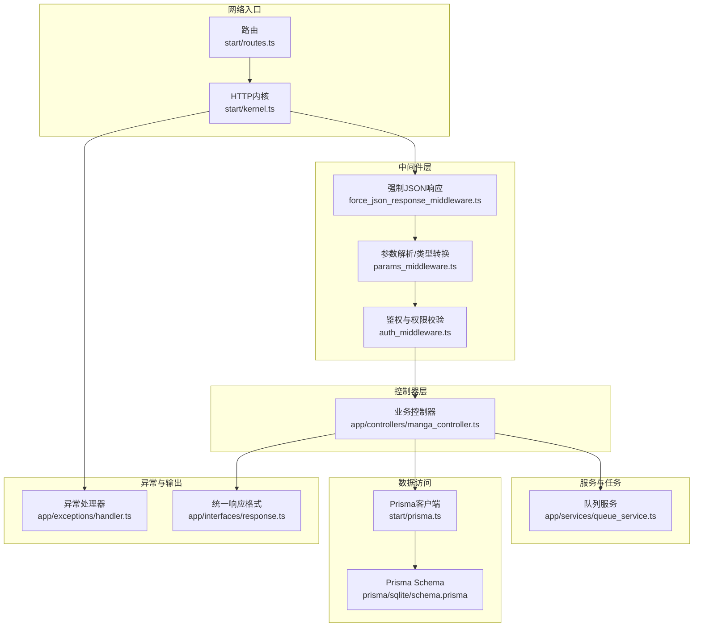
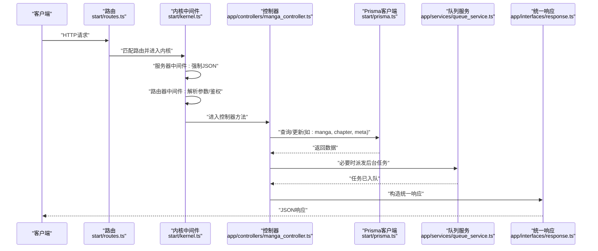
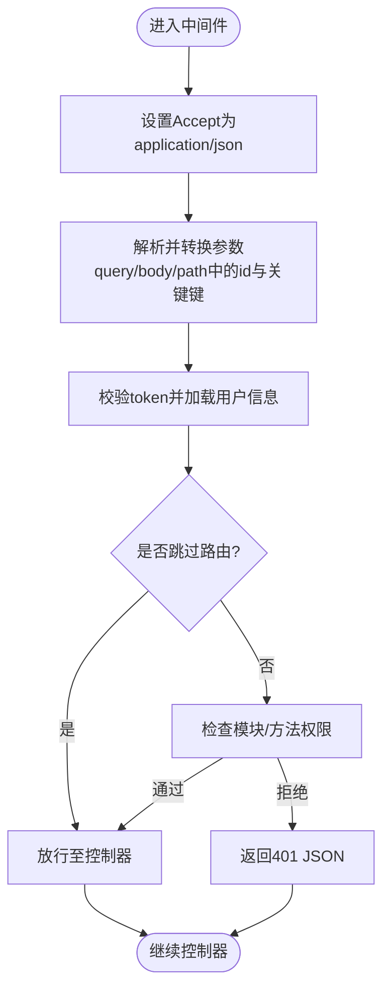
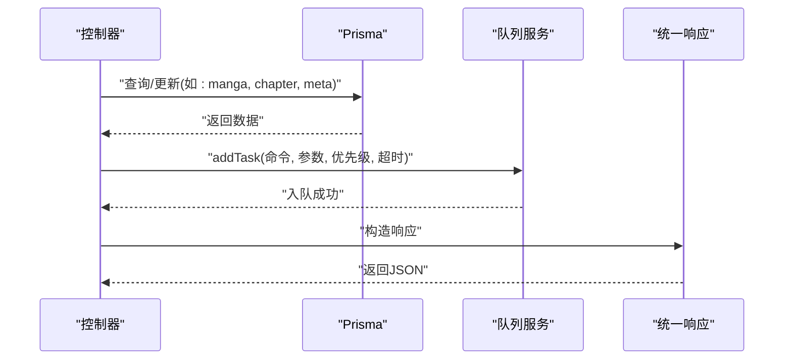
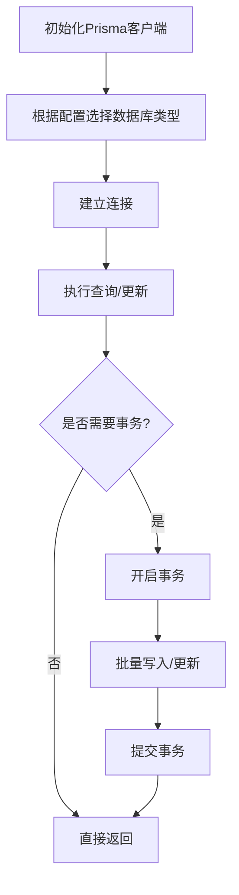
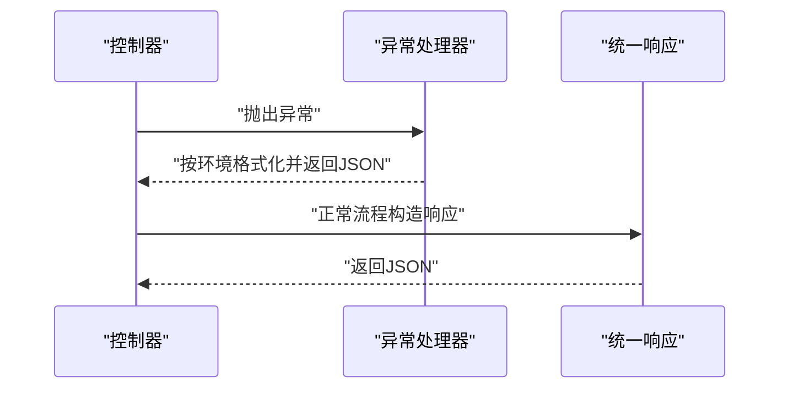
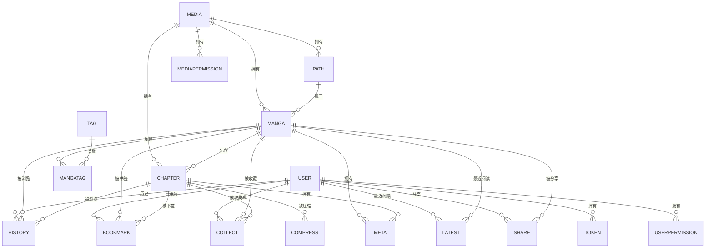
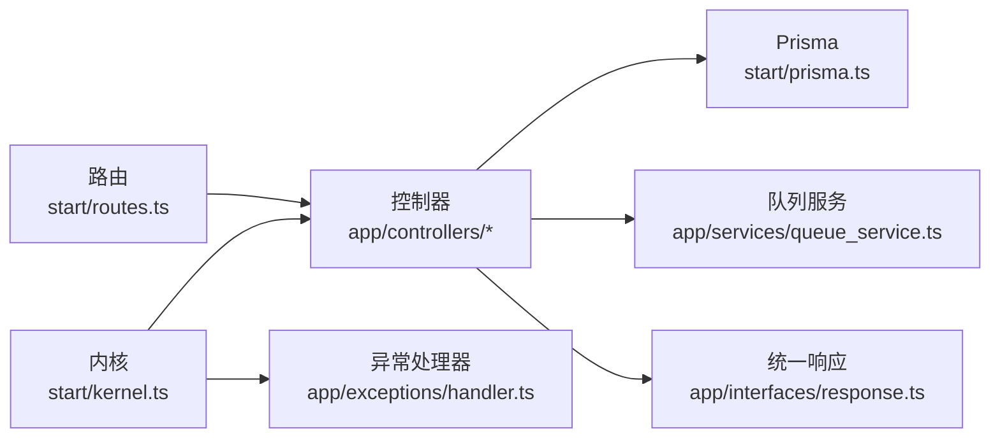

# 数据流架构

<cite>
**本文引用的文件**
- [start/kernel.ts](file://start/kernel.ts)
- [start/routes.ts](file://start/routes.ts)
- [start/prisma.ts](file://start/prisma.ts)
- [app/exceptions/handler.ts](file://app/exceptions/handler.ts)
- [config/database.ts](file://config/database.ts)
- [app/middleware/auth_middleware.ts](file://app/middleware/auth_middleware.ts)
- [app/middleware/params_middleware.ts](file://app/middleware/params_middleware.ts)
- [app/middleware/force_json_response_middleware.ts](file://app/middleware/force_json_response_middleware.ts)
- [app/controllers/manga_controller.ts](file://app/controllers/manga_controller.ts)
- [app/interfaces/response.ts](file://app/interfaces/response.ts)
- [app/services/queue_service.ts](file://app/services/queue_service.ts)
- [app/utils/api.ts](file://app/utils/api.ts)
- [app/utils/index.ts](file://app/utils/index.ts)
- [prisma/sqlite/schema.prisma](file://prisma/sqlite/schema.prisma)
- [prisma/mysql/schema.prisma](file://prisma/mysql/schema.prisma)
- [prisma/pgsql/schema.prisma](file://prisma/pgsql/schema.prisma)
</cite>

## 目录
1. [引言](#引言)
2. [项目结构](#项目结构)
3. [核心组件](#核心组件)
4. [架构总览](#架构总览)
5. [详细组件分析](#详细组件分析)
6. [依赖分析](#依赖分析)
7. [性能考量](#性能考量)
8. [故障排查指南](#故障排查指南)
9. [结论](#结论)
10. [附录](#附录)

## 引言
本文件系统性梳理 SManga Adonis 的数据流架构，覆盖从 HTTP 请求进入、中间件处理、路由与控制器、服务层与队列、Prisma ORM 数据访问、事务与查询优化、到响应返回的全链路。同时解释数据验证、错误处理与统一响应格式化流程，并给出性能监控、缓存策略与负载均衡建议；最后阐述数据模型关系与一致性保障机制。

## 项目结构
SManga Adonis 采用基于 AdonisJS 的典型分层组织：路由定义、内核注册中间件、控制器处理业务、服务层协调任务、Prisma 提供跨数据库抽象、工具与接口层统一输出格式与通用能力。

图示来源
- [start/routes.ts:1-241](file://start/routes.ts#L1-L241)
- [start/kernel.ts:18-69](file://start/kernel.ts#L18-L69)
- [app/middleware/force_json_response_middleware.ts:1-17](file://app/middleware/force_json_response_middleware.ts#L1-L17)
- [app/middleware/params_middleware.ts:1-65](file://app/middleware/params_middleware.ts#L1-L65)
- [app/middleware/auth_middleware.ts:1-87](file://app/middleware/auth_middleware.ts#L1-L87)
- [app/controllers/manga_controller.ts:1-460](file://app/controllers/manga_controller.ts#L1-L460)
- [app/services/queue_service.ts:1-267](file://app/services/queue_service.ts#L1-L267)
- [start/prisma.ts:1-42](file://start/prisma.ts#L1-L42)
- [prisma/sqlite/schema.prisma:1-447](file://prisma/sqlite/schema.prisma#L1-L447)
- [app/exceptions/handler.ts:1-29](file://app/exceptions/handler.ts#L1-L29)
- [app/interfaces/response.ts:1-64](file://app/interfaces/response.ts#L1-L64)

章节来源
- [start/routes.ts:1-241](file://start/routes.ts#L1-L241)
- [start/kernel.ts:18-69](file://start/kernel.ts#L18-L69)

## 核心组件
- 中间件栈：统一设置 Accept 为 JSON、参数解析与类型转换、鉴权与权限控制。
- 控制器：承载具体业务逻辑，调用 Prisma 查询与更新，组装统一响应。
- 服务层：封装队列任务派发与处理，隔离耗时或异步操作。
- 数据访问：通过 Prisma 客户端连接 SQLite/MySQL/PostgreSQL，提供类型安全的查询与更新。
- 异常处理：基于 Adonis 异常基类，按环境决定调试模式与上报行为。
- 统一响应：标准化 code/message/data/error/status 字段，便于前端一致处理。

章节来源
- [app/middleware/force_json_response_middleware.ts:1-17](file://app/middleware/force_json_response_middleware.ts#L1-L17)
- [app/middleware/params_middleware.ts:1-65](file://app/middleware/params_middleware.ts#L1-L65)
- [app/middleware/auth_middleware.ts:1-87](file://app/middleware/auth_middleware.ts#L1-L87)
- [app/controllers/manga_controller.ts:1-460](file://app/controllers/manga_controller.ts#L1-L460)
- [app/services/queue_service.ts:1-267](file://app/services/queue_service.ts#L1-L267)
- [start/prisma.ts:1-42](file://start/prisma.ts#L1-L42)
- [app/exceptions/handler.ts:1-29](file://app/exceptions/handler.ts#L1-L29)
- [app/interfaces/response.ts:1-64](file://app/interfaces/response.ts#L1-L64)

## 架构总览
下图展示一次典型请求从进入内核到返回响应的完整数据流，以及与 Prisma 和队列的交互。

图示来源
- [start/routes.ts:1-241](file://start/routes.ts#L1-L241)
- [start/kernel.ts:35-49](file://start/kernel.ts#L35-L49)
- [app/middleware/force_json_response_middleware.ts:1-17](file://app/middleware/force_json_response_middleware.ts#L1-L17)
- [app/middleware/params_middleware.ts:1-65](file://app/middleware/params_middleware.ts#L1-L65)
- [app/middleware/auth_middleware.ts:23-85](file://app/middleware/auth_middleware.ts#L23-L85)
- [app/controllers/manga_controller.ts:13-55](file://app/controllers/manga_controller.ts#L13-L55)
- [start/prisma.ts:7-41](file://start/prisma.ts#L7-L41)
- [app/services/queue_service.ts:175-264](file://app/services/queue_service.ts#L175-L264)
- [app/interfaces/response.ts:18-63](file://app/interfaces/response.ts#L18-L63)

## 详细组件分析

### 中间件链路与数据验证
- 强制 JSON 响应：确保框架内置校验与认证错误也以 JSON 返回，简化前端处理。
- 参数解析与类型转换：对 query/body/path 中以 id 结尾或特定键（page/pageSize/limit/slice）的字段进行数字转换，提升后续业务处理稳定性。
- 鉴权与权限：从请求头读取 token，查询 token 表与用户表，注入用户上下文；对特定模块与 DELETE 方法做角色限制；将媒体与模块权限映射到请求对象，供控制器使用。

图示来源
- [app/middleware/force_json_response_middleware.ts:10-15](file://app/middleware/force_json_response_middleware.ts#L10-L15)
- [app/middleware/params_middleware.ts:4-63](file://app/middleware/params_middleware.ts#L4-L63)
- [app/middleware/auth_middleware.ts:23-85](file://app/middleware/auth_middleware.ts#L23-L85)

章节来源
- [app/middleware/force_json_response_middleware.ts:1-17](file://app/middleware/force_json_response_middleware.ts#L1-L17)
- [app/middleware/params_middleware.ts:1-65](file://app/middleware/params_middleware.ts#L1-L65)
- [app/middleware/auth_middleware.ts:1-87](file://app/middleware/auth_middleware.ts#L1-L87)

### 控制器与服务层
- 控制器负责参数收集、权限校验、调用 Prisma 查询/更新、组装统一响应；部分长耗时操作通过队列派发。
- 服务层封装队列配置、任务派发与处理分支，支持按任务名称分类到不同队列（scan/sync/compress），并具备指数退避重试与超时控制。

图示来源
- [app/controllers/manga_controller.ts:147-188](file://app/controllers/manga_controller.ts#L147-L188)
- [app/services/queue_service.ts:175-264](file://app/services/queue_service.ts#L175-L264)
- [app/interfaces/response.ts:18-63](file://app/interfaces/response.ts#L18-L63)

章节来源
- [app/controllers/manga_controller.ts:1-460](file://app/controllers/manga_controller.ts#L1-L460)
- [app/services/queue_service.ts:1-267](file://app/services/queue_service.ts#L1-L267)
- [app/interfaces/response.ts:1-64](file://app/interfaces/response.ts#L1-L64)

### 数据访问与事务管理
- Prisma 客户端按配置动态生成数据库 URL，支持 SQLite/MySQL/PostgreSQL；在 Linux/Windows 下分别指向不同路径。
- 事务：代码中未显式使用 Prisma 事务块，多处为独立查询/更新；对于强一致需求的复合写入，建议在关键路径包裹事务块。
- 查询优化：控制器中存在并行查询（Promise.all）、合理使用 include/select、分页查询与 count 并行，减少 N+1 与不必要的字段传输。

图示来源
- [start/prisma.ts:7-41](file://start/prisma.ts#L7-L41)
- [app/controllers/manga_controller.ts:92-95](file://app/controllers/manga_controller.ts#L92-L95)

章节来源
- [start/prisma.ts:1-42](file://start/prisma.ts#L1-L42)
- [app/controllers/manga_controller.ts:1-460](file://app/controllers/manga_controller.ts#L1-L460)

### 错误处理与响应格式化
- 异常处理器继承自框架基类，生产环境关闭详细堆栈，便于稳定输出；可扩展 report 用于日志或监控上报。
- 统一响应：SResponse/ListResponse 提供 code/message/data/error/status/count/list 等字段，控制器直接返回，前端无需额外适配。

图示来源
- [app/exceptions/handler.ts:15-27](file://app/exceptions/handler.ts#L15-L27)
- [app/interfaces/response.ts:18-63](file://app/interfaces/response.ts#L18-L63)

章节来源
- [app/exceptions/handler.ts:1-29](file://app/exceptions/handler.ts#L1-L29)
- [app/interfaces/response.ts:1-64](file://app/interfaces/response.ts#L1-L64)

### 数据模型关系与一致性
- 关系概览：manga → chapter（一对多）、manga ← collect/bookmark/history/latest/share（多对一）、media ← path/manga/chapter（多对一）、user ← token/userPermisson/mediaPermisson（多对一）。
- 唯一约束：章节与漫画路径组合唯一、书签（chapterId, page）唯一、用户名称唯一等。
- 一致性保障：当前代码未显式使用事务，建议在“修改标签/元数据/删除漫画”等涉及多表更新的场景使用事务，确保原子性。

图示来源
- [prisma/sqlite/schema.prisma:11-447](file://prisma/sqlite/schema.prisma#L11-L447)
- [prisma/mysql/schema.prisma:11-370](file://prisma/mysql/schema.prisma#L11-L370)
- [prisma/pgsql/schema.prisma:11-356](file://prisma/pgsql/schema.prisma#L11-L356)

章节来源
- [prisma/sqlite/schema.prisma:1-447](file://prisma/sqlite/schema.prisma#L1-L447)
- [prisma/mysql/schema.prisma:1-370](file://prisma/mysql/schema.prisma#L1-L370)
- [prisma/pgsql/schema.prisma:1-356](file://prisma/pgsql/schema.prisma#L1-L356)

## 依赖分析
- 路由到控制器：start/routes.ts 将 HTTP 路径映射到各控制器方法，形成清晰的业务边界。
- 控制器到 Prisma：控制器直接依赖 Prisma 客户端进行数据访问，耦合度较高但便于快速迭代。
- 控制器到队列：通过 addTask 将耗时任务异步化，降低请求延迟。
- 中间件到控制器：鉴权与参数解析中间件前置，保证控制器专注业务逻辑。
- 异常处理与响应：异常处理器与统一响应格式贯穿全链路，保证错误与返回的一致性。

图示来源
- [start/routes.ts:10-35](file://start/routes.ts#L10-L35)
- [start/kernel.ts:35-49](file://start/kernel.ts#L35-L49)
- [app/controllers/manga_controller.ts:1-460](file://app/controllers/manga_controller.ts#L1-L460)
- [app/services/queue_service.ts:1-267](file://app/services/queue_service.ts#L1-L267)
- [start/prisma.ts:1-42](file://start/prisma.ts#L1-L42)
- [app/exceptions/handler.ts:1-29](file://app/exceptions/handler.ts#L1-L29)
- [app/interfaces/response.ts:1-64](file://app/interfaces/response.ts#L1-L64)

章节来源
- [start/routes.ts:1-241](file://start/routes.ts#L1-L241)
- [start/kernel.ts:18-69](file://start/kernel.ts#L18-L69)

## 性能考量
- 查询优化
  - 并行查询：分页列表同时获取数据与 count，减少往返。
  - 合理投影：include/select 仅取所需字段，避免大字段传输。
  - 分页与排序：使用 skip/take 与 order_params 动态排序，避免一次性拉取全量。
- 缓存策略
  - 对高频只读数据（如标签、媒体元信息）可在应用层引入缓存（如 Redis），减少数据库压力。
  - 对于列表页，可考虑 ETag/Last-Modified 实现条件缓存。
- 负载均衡
  - 前端/反向代理层做请求分发；数据库层可采用主从复制与只读副本。
  - 队列服务独立部署，Redis 与 Worker 集群化，避免单点瓶颈。
- 监控与可观测性
  - 记录请求耗时、错误率、队列积压；对慢查询与重复查询建立告警。
  - 统一日志格式，结合统一响应 code，便于问题定位。

## 故障排查指南
- 鉴权失败
  - 检查请求头 token 是否缺失或过期；确认 token 与用户权限映射正确。
- 参数类型错误
  - 确认 query/body/path 中 id 与关键键是否被正确转换为数字。
- 数据库连接
  - 根据运行平台与配置检查 SQLite/MySQL/PostgreSQL 连接串与权限。
- 队列任务堆积
  - 检查 Redis 可用性、Worker 数量与任务超时/重试配置；关注 failed 队列。
- 统一响应
  - 前端统一解析 code/message/data，异常时依据 code 判定。

章节来源
- [app/middleware/auth_middleware.ts:32-58](file://app/middleware/auth_middleware.ts#L32-L58)
- [app/middleware/params_middleware.ts:4-63](file://app/middleware/params_middleware.ts#L4-L63)
- [start/prisma.ts:12-32](file://start/prisma.ts#L12-L32)
- [app/services/queue_service.ts:34-87](file://app/services/queue_service.ts#L34-L87)
- [app/interfaces/response.ts:18-63](file://app/interfaces/response.ts#L18-L63)

## 结论
SManga Adonis 的数据流以“路由→中间件→控制器→Prisma/队列→统一响应”为主线，结构清晰、职责明确。通过参数中间件与鉴权中间件确保输入质量与安全性；通过队列异步化处理耗时任务；通过统一响应与异常处理器提升可观测性与前端体验。建议在关键写入路径引入事务，配合缓存与监控体系进一步提升性能与稳定性。

## 附录
- 数据库配置：Lucid 仅用于 MySQL 连接配置，实际运行由 Prisma 客户端按配置选择数据库类型。
- 工具函数：路径解析、配置读取、JSON 序列化/反序列化、图片文件扫描等辅助能力贯穿各层。

章节来源
- [config/database.ts:4-22](file://config/database.ts#L4-L22)
- [app/utils/index.ts:94-115](file://app/utils/index.ts#L94-L115)
- [app/utils/index.ts:163-179](file://app/utils/index.ts#L163-L179)