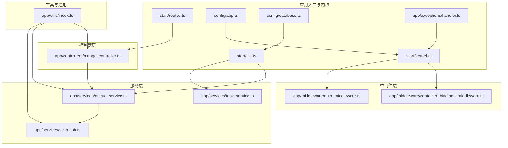
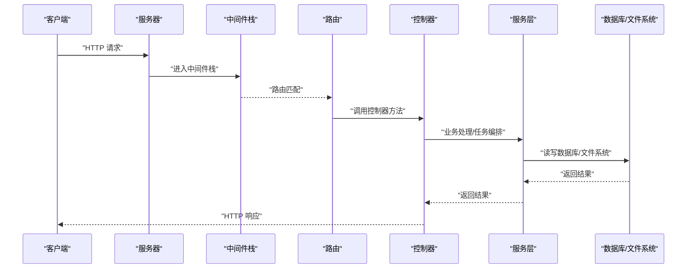
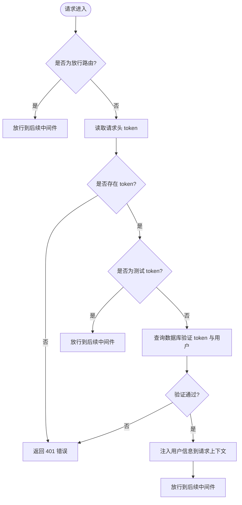
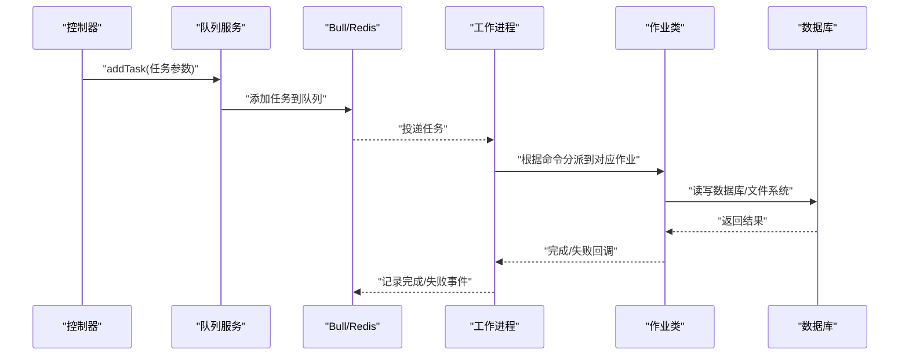
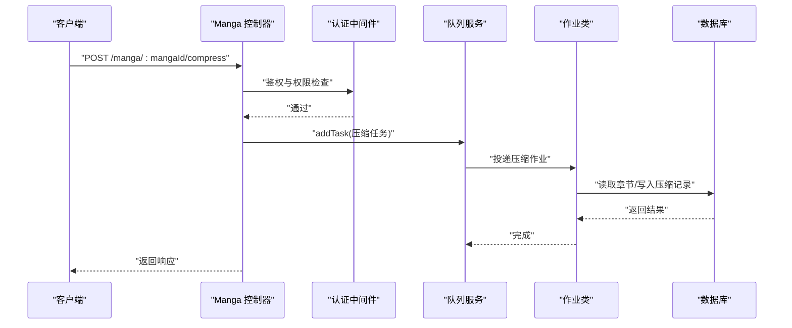
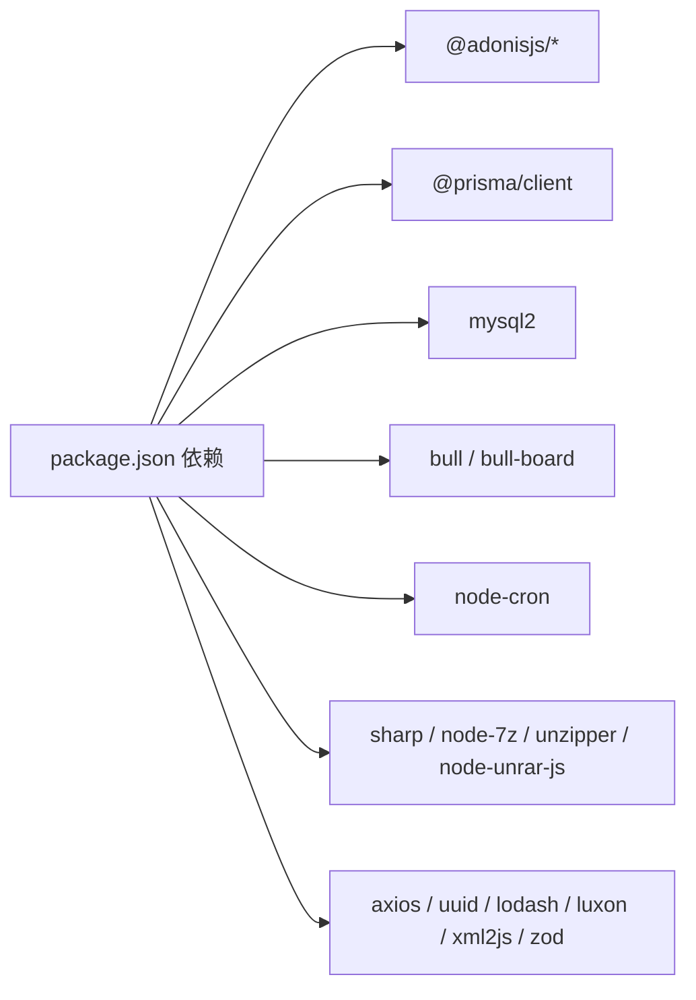

# 系统架构

<cite>
**本文引用的文件**
- [package.json](file://package.json)
- [adonisrc.ts](file://adonisrc.ts)
- [start/kernel.ts](file://start/kernel.ts)
- [start/routes.ts](file://start/routes.ts)
- [config/app.ts](file://config/app.ts)
- [config/database.ts](file://config/database.ts)
- [start/init.ts](file://start/init.ts)
- [app/exceptions/handler.ts](file://app/exceptions/handler.ts)
- [app/middleware/auth_middleware.ts](file://app/middleware/auth_middleware.ts)
- [app/middleware/container_bindings_middleware.ts](file://app/middleware/container_bindings_middleware.ts)
- [app/services/queue_service.ts](file://app/services/queue_service.ts)
- [app/services/task_service.ts](file://app/services/task_service.ts)
- [app/controllers/manga_controller.ts](file://app/controllers/manga_controller.ts)
- [app/utils/index.ts](file://app/utils/index.ts)
- [app/services/scan_job.ts](file://app/services/scan_job.ts)
</cite>

## 目录
1. [引言](#引言)
2. [项目结构](#项目结构)
3. [核心组件](#核心组件)
4. [架构总览](#架构总览)
5. [详细组件分析](#详细组件分析)
6. [依赖分析](#依赖分析)
7. [性能考量](#性能考量)
8. [故障排查指南](#故障排查指南)
9. [结论](#结论)
10. [附录](#附录)

## 引言
本架构文档面向 SManga Adonis 系统，聚焦于高层设计、架构模式与系统边界，系统采用基于 AdonisJS 的 MVC 架构，结合中间件层、服务层与队列异步任务处理，实现漫画资源的扫描、压缩、同步与管理。文档覆盖组件交互关系、数据流向、集成模式、技术决策与权衡、基础设施与可扩展性、部署拓扑、安全与监控、灾难恢复、技术栈与第三方依赖、依赖注入容器以及异步任务处理机制。

## 项目结构
系统采用按功能域划分的模块化组织方式：
- 应用入口与内核：启动内核注册中间件、异常处理与初始化流程
- 路由层：集中定义 RESTful 路由，按业务域拆分控制器
- 控制器层：接收请求、校验参数、调用服务、返回响应
- 中间件层：全局与路由级中间件，负责认证、参数绑定、CORS 等
- 服务层：封装业务逻辑与任务编排，包含队列服务与定时任务
- 工具与通用模块：跨域配置、数据库配置、环境与路径工具
- 异常处理：统一异常转换与上报

**图表来源**
- [start/kernel.ts:1-69](file://start/kernel.ts#L1-L69)
- [start/routes.ts:1-241](file://start/routes.ts#L1-L241)
- [config/app.ts:1-41](file://config/app.ts#L1-L41)
- [config/database.ts:1-24](file://config/database.ts#L1-L24)
- [start/init.ts:1-253](file://start/init.ts#L1-L253)
- [app/exceptions/handler.ts:1-29](file://app/exceptions/handler.ts#L1-L29)
- [app/middleware/container_bindings_middleware.ts:1-20](file://app/middleware/container_bindings_middleware.ts#L1-L20)
- [app/middleware/auth_middleware.ts:1-87](file://app/middleware/auth_middleware.ts#L1-L87)
- [app/controllers/manga_controller.ts:1-460](file://app/controllers/manga_controller.ts#L1-L460)
- [app/services/queue_service.ts:1-267](file://app/services/queue_service.ts#L1-L267)
- [app/services/task_service.ts:1-171](file://app/services/task_service.ts#L1-L171)
- [app/services/scan_job.ts:1-254](file://app/services/scan_job.ts#L1-L254)
- [app/utils/index.ts:1-313](file://app/utils/index.ts#L1-L313)

**章节来源**
- [start/kernel.ts:1-69](file://start/kernel.ts#L1-L69)
- [start/routes.ts:1-241](file://start/routes.ts#L1-L241)
- [config/app.ts:1-41](file://config/app.ts#L1-L41)
- [config/database.ts:1-24](file://config/database.ts#L1-L24)
- [start/init.ts:1-253](file://start/init.ts#L1-L253)
- [app/exceptions/handler.ts:1-29](file://app/exceptions/handler.ts#L1-L29)

## 核心组件
- 路由与控制器：集中定义 RESTful 路由，控制器负责参数解析、鉴权与调用服务层
- 中间件：容器绑定中间件与认证中间件，分别负责依赖注入与访问控制
- 服务层：队列服务与任务服务，封装异步任务编排、Redis/Bull 队列处理与数据库任务调度
- 工具模块：平台适配、路径与配置读取、日志与文件操作
- 异常处理：继承框架异常处理器，按环境决定调试输出

**章节来源**
- [start/routes.ts:1-241](file://start/routes.ts#L1-L241)
- [app/middleware/container_bindings_middleware.ts:1-20](file://app/middleware/container_bindings_middleware.ts#L1-L20)
- [app/middleware/auth_middleware.ts:1-87](file://app/middleware/auth_middleware.ts#L1-L87)
- [app/services/queue_service.ts:1-267](file://app/services/queue_service.ts#L1-L267)
- [app/services/task_service.ts:1-171](file://app/services/task_service.ts#L1-L171)
- [app/utils/index.ts:1-313](file://app/utils/index.ts#L1-L313)
- [app/exceptions/handler.ts:1-29](file://app/exceptions/handler.ts#L1-L29)

## 架构总览
系统采用 MVC 架构与中间件管道，结合服务层的队列与定时任务，形成“请求-中间件-控制器-服务-数据库/文件系统”的清晰数据流。认证中间件在路由级生效，确保受保护接口的安全访问；队列服务通过 Redis/Bull 实现异步任务解耦；初始化流程负责目录与默认配置的准备，并重置中断任务状态。

**图表来源**
- [start/kernel.ts:18-49](file://start/kernel.ts#L18-L49)
- [start/routes.ts:10-35](file://start/routes.ts#L10-L35)
- [app/controllers/manga_controller.ts:12-55](file://app/controllers/manga_controller.ts#L12-L55)
- [app/services/queue_service.ts:175-264](file://app/services/queue_service.ts#L175-L264)

## 详细组件分析

### 中间件架构
- 容器绑定中间件：将 HttpContext 与 Logger 绑定至容器解析器，便于依赖注入
- 认证中间件：对特定路由放行，校验请求头 token，查询数据库验证用户身份与权限，注入用户信息到请求上下文

**图表来源**
- [app/middleware/auth_middleware.ts:23-85](file://app/middleware/auth_middleware.ts#L23-L85)

**章节来源**
- [app/middleware/container_bindings_middleware.ts:12-18](file://app/middleware/container_bindings_middleware.ts#L12-L18)
- [app/middleware/auth_middleware.ts:17-85](file://app/middleware/auth_middleware.ts#L17-L85)

### 依赖注入容器
- 容器绑定中间件将 HttpContext 与 Logger 绑定到容器解析器，使控制器与服务可通过依赖注入获取上下文与日志实例
- 服务层通过动态导入与工厂模式解耦组件，减少循环依赖风险

**章节来源**
- [app/middleware/container_bindings_middleware.ts:12-18](file://app/middleware/container_bindings_middleware.ts#L12-L18)

### 异步任务处理机制
- 队列服务：基于 Bull/Redis 的多队列模型，支持 scan/sync/compress 三类任务，具备并发、重试、超时与指数退避策略
- 任务服务：基于数据库的任务表，按优先级顺序调度，使用互斥锁与 SQL 锁避免并发冲突，记录成功/失败日志并清理已完成任务
- 作业类：扫描路径、扫描漫画、删除媒体/路径/漫画/章节、复制封面、生成媒体封面、压缩章节、清理压缩缓存、同步媒体/漫画/章节等

**图表来源**
- [app/services/queue_service.ts:34-141](file://app/services/queue_service.ts#L34-L141)
- [app/services/queue_service.ts:175-264](file://app/services/queue_service.ts#L175-L264)
- [app/services/task_service.ts:36-84](file://app/services/task_service.ts#L36-L84)
- [app/services/scan_job.ts:29-119](file://app/services/scan_job.ts#L29-L119)

**章节来源**
- [app/services/queue_service.ts:1-267](file://app/services/queue_service.ts#L1-L267)
- [app/services/task_service.ts:1-171](file://app/services/task_service.ts#L1-L171)
- [app/services/scan_job.ts:1-254](file://app/services/scan_job.ts#L1-L254)

### 控制器与数据流
- Manga 控制器：实现漫画的增删改查、分页与统计、扫描与元数据编辑、批量删除与压缩等；对受保护接口进行权限校验；通过队列服务异步执行耗时任务
- 参数与权限：控制器读取请求上下文中的用户信息，结合媒体权限与模块权限进行细粒度控制

**图表来源**
- [app/controllers/manga_controller.ts:418-437](file://app/controllers/manga_controller.ts#L418-L437)
- [app/middleware/auth_middleware.ts:23-85](file://app/middleware/auth_middleware.ts#L23-L85)
- [app/services/queue_service.ts:175-264](file://app/services/queue_service.ts#L175-L264)

**章节来源**
- [app/controllers/manga_controller.ts:12-460](file://app/controllers/manga_controller.ts#L12-L460)

### 安全性、监控与灾难恢复
- 安全性：认证中间件强制 token 校验与角色/模块权限检查；生产环境关闭调试输出；Cookie 安全策略按环境启用 HTTPS
- 监控：队列服务监听完成/失败事件；控制器与服务层打印日志；异常处理器统一处理与上报
- 灾难恢复：初始化阶段重置“执行中”任务为“待处理”，保证中断任务可恢复；压缩缓存清理与媒体封面生成支持定时任务

**章节来源**
- [app/middleware/auth_middleware.ts:23-85](file://app/middleware/auth_middleware.ts#L23-L85)
- [config/app.ts:18-40](file://config/app.ts#L18-L40)
- [app/exceptions/handler.ts:14-27](file://app/exceptions/handler.ts#L14-L27)
- [start/init.ts:95-103](file://start/init.ts#L95-L103)
- [app/services/queue_service.ts:41-47](file://app/services/queue_service.ts#L41-L47)

## 依赖分析
- 框架与核心：AdonisJS 核心、Auth、CORS、Lucid（数据库 ORM）、Vine（校验）
- 数据库：MySQL2、Prisma 客户端、SQLite/MySQL/PostgreSQL 多套迁移
- 队列与任务：Bull、bull-board（可视化）、node-cron（定时任务）
- 压缩与图像：sharp、node-7z、unzipper、node-unrar-js
- 其他：axios、uuid、lodash、luxon、xml2js、zod、reflect-metadata

**图表来源**
- [package.json:62-87](file://package.json#L62-L87)

**章节来源**
- [package.json:1-100](file://package.json#L1-L100)

## 性能考量
- 队列并发与重试：通过配置项控制并发、最大重试次数与超时，结合指数退避降低重试风暴
- 数据库访问：控制器与服务层使用分页与并发查询，减少一次性负载
- 文件系统操作：扫描与压缩采用异步队列，避免阻塞请求线程
- 缓存与日志：初始化阶段清理缓存，减少冷启动开销

[本节为通用性能建议，不直接分析具体文件]

## 故障排查指南
- 认证失败：确认 token 是否存在且有效；检查认证中间件放行规则与用户权限
- 任务未执行：检查队列服务连接 Redis 是否正常；查看队列事件监听与作业分派逻辑
- 数据库异常：确认数据库连接配置与迁移状态；检查初始化阶段的任务状态重置
- 日志定位：查看队列完成/失败事件日志与控制器/服务层打印信息

**章节来源**
- [app/middleware/auth_middleware.ts:23-85](file://app/middleware/auth_middleware.ts#L23-L85)
- [app/services/queue_service.ts:34-47](file://app/services/queue_service.ts#L34-L47)
- [config/database.ts:4-22](file://config/database.ts#L4-L22)
- [start/init.ts:95-103](file://start/init.ts#L95-L103)

## 结论
SManga Adonis 以 MVC 为核心，结合中间件与服务层的队列/定时任务，实现了漫画资源的高效管理与异步处理。通过严格的认证与权限控制、完善的异常处理与监控、以及可配置的队列与定时策略，系统在可维护性、可扩展性与可靠性方面具备良好基础。建议在生产环境中进一步完善监控告警、备份与灾备策略，并持续优化队列并发与重试策略以提升吞吐量。

## 附录
- 技术栈与版本兼容：AdonisJS 6.x、Prisma 6.x、Bull/Redis、sharp、node-7z 等
- 部署拓扑：应用服务（AdonisJS）+ Redis（队列）+ MySQL/SQLite/PostgreSQL（数据），支持 Windows/Linux 双环境
- 基础设施要求：Node.js 运行时、Redis 服务、数据库实例、磁盘空间（压缩/海报/缓存/日志）

[本节为概览性信息，不直接分析具体文件]