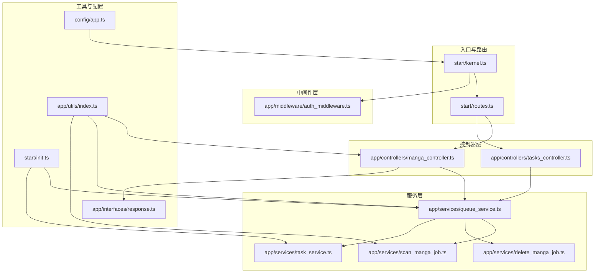
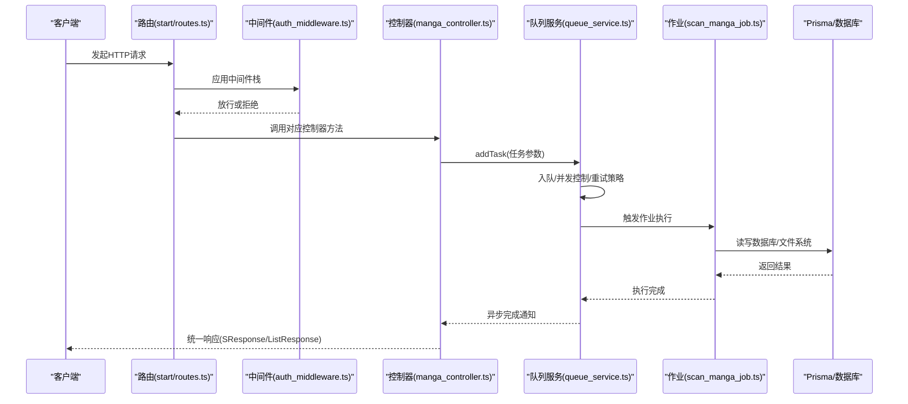
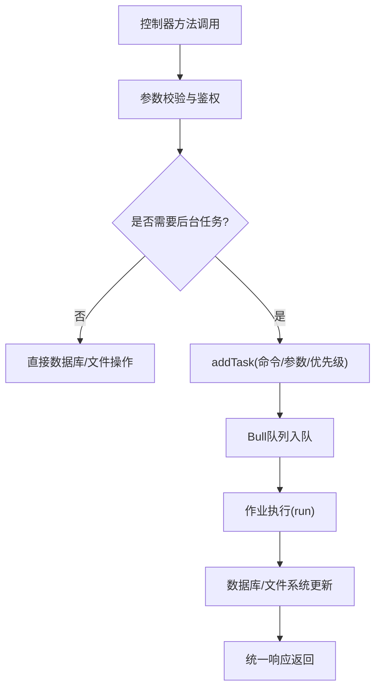
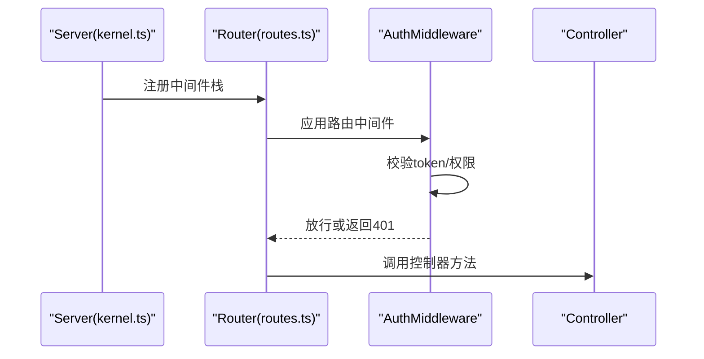
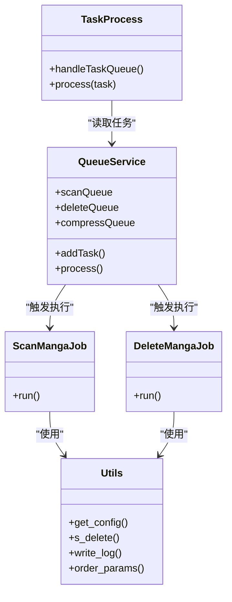
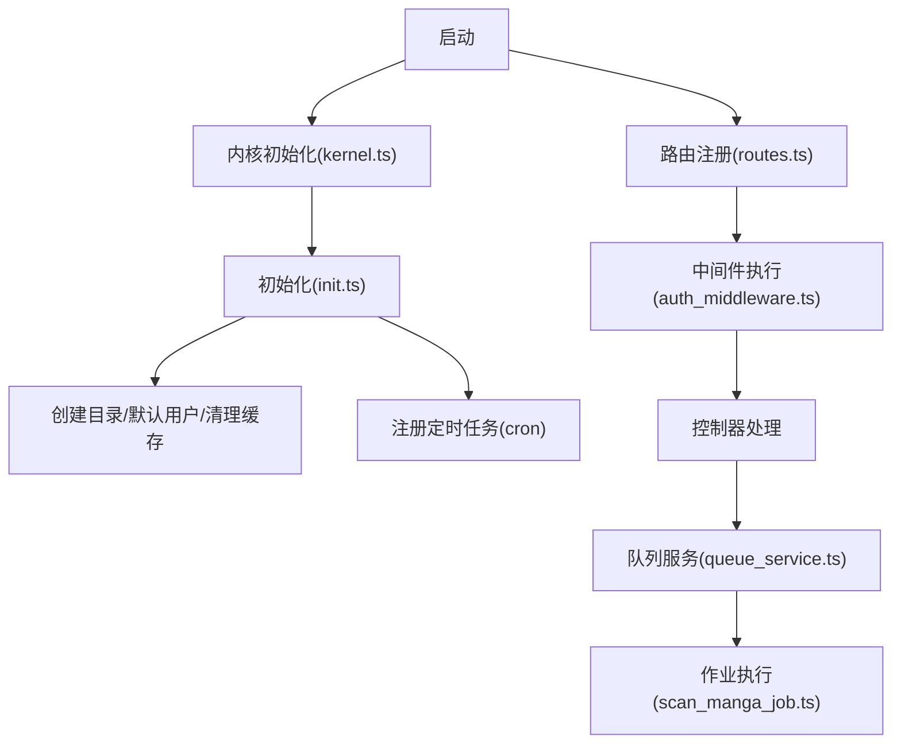
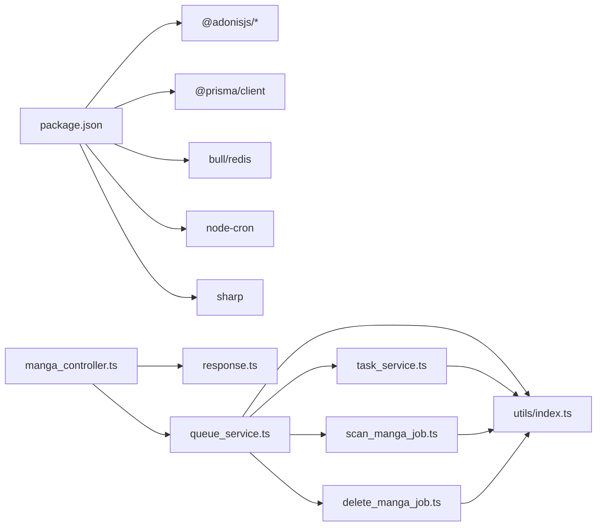

# 组件交互关系

<cite>
**本文引用的文件**
- [start/kernel.ts](file://start/kernel.ts)
- [start/routes.ts](file://start/routes.ts)
- [app/controllers/manga_controller.ts](file://app/controllers/manga_controller.ts)
- [app/controllers/tasks_controller.ts](file://app/controllers/tasks_controller.ts)
- [app/middleware/auth_middleware.ts](file://app/middleware/auth_middleware.ts)
- [app/services/queue_service.ts](file://app/services/queue_service.ts)
- [app/services/task_service.ts](file://app/services/task_service.ts)
- [app/services/scan_manga_job.ts](file://app/services/scan_manga_job.ts)
- [app/services/delete_manga_job.ts](file://app/services/delete_manga_job.ts)
- [app/utils/index.ts](file://app/utils/index.ts)
- [start/init.ts](file://start/init.ts)
- [app/interfaces/response.ts](file://app/interfaces/response.ts)
- [config/app.ts](file://config/app.ts)
- [package.json](file://package.json)
</cite>

## 目录
1. [简介](#简介)
2. [项目结构](#项目结构)
3. [核心组件](#核心组件)
4. [架构总览](#架构总览)
5. [详细组件分析](#详细组件分析)
6. [依赖分析](#依赖分析)
7. [性能考量](#性能考量)
8. [故障排查指南](#故障排查指南)
9. [结论](#结论)
10. [附录](#附录)

## 简介
本文件聚焦 SManga Adonis 的组件交互关系，系统性梳理控制器与服务层的调用链、中间件与路由的集成方式、服务层与数据层的交互模式，并深入解析任务队列驱动的异步处理、事件与观察者模式的应用现状、组件生命周期管理与模块化边界。同时给出解耦最佳实践、接口设计原则与扩展点规划建议。

## 项目结构
项目采用基于功能域的分层组织：控制器负责请求入口与响应封装；中间件负责认证鉴权与参数校验；服务层承载业务逻辑与任务编排；工具层提供通用能力；配置与启动脚本负责系统初始化与环境适配。

**图表来源**
- [start/kernel.ts:1-69](file://start/kernel.ts#L1-L69)
- [start/routes.ts:1-241](file://start/routes.ts#L1-L241)
- [app/controllers/manga_controller.ts:1-460](file://app/controllers/manga_controller.ts#L1-L460)
- [app/controllers/tasks_controller.ts:1-55](file://app/controllers/tasks_controller.ts#L1-L55)
- [app/middleware/auth_middleware.ts:1-87](file://app/middleware/auth_middleware.ts#L1-L87)
- [app/services/queue_service.ts:1-267](file://app/services/queue_service.ts#L1-L267)
- [app/services/task_service.ts:1-171](file://app/services/task_service.ts#L1-L171)
- [app/services/scan_manga_job.ts:1-800](file://app/services/scan_manga_job.ts#L1-L800)
- [app/services/delete_manga_job.ts:1-78](file://app/services/delete_manga_job.ts#L1-L78)
- [app/utils/index.ts:1-313](file://app/utils/index.ts#L1-L313)
- [start/init.ts:1-253](file://start/init.ts#L1-L253)
- [app/interfaces/response.ts:1-64](file://app/interfaces/response.ts#L1-L64)
- [config/app.ts:1-41](file://config/app.ts#L1-L41)

**章节来源**
- [start/kernel.ts:1-69](file://start/kernel.ts#L1-L69)
- [start/routes.ts:1-241](file://start/routes.ts#L1-L241)
- [config/app.ts:1-41](file://config/app.ts#L1-L41)

## 核心组件
- 路由与内核：统一注册服务器与路由器中间件栈，定义全局错误处理与启动初始化流程。
- 控制器：面向资源的 HTTP 入口，负责参数解析、鉴权校验后的业务调用与统一响应封装。
- 中间件：集中处理认证、权限与请求预处理，按需跳过测试/部署等特殊路径。
- 服务层：
  - 队列服务：基于 Bull/Redis 的任务编排与执行，支持分类队列、并发控制、重试与回退策略。
  - 任务处理：轮询待执行任务，串行加互斥锁，执行后写入成功/失败记录并清理。
  - 作业：具体业务单元（如扫描、删除、压缩、海报生成等），通过命令分发执行。
- 工具与配置：跨层共享的通用能力（路径、日志、配置、文件操作）与应用配置。
- 初始化：系统启动时的目录创建、默认用户、缓存清理、任务状态修复与定时任务注册。

**章节来源**
- [start/kernel.ts:18-69](file://start/kernel.ts#L18-L69)
- [start/routes.ts:10-241](file://start/routes.ts#L10-L241)
- [app/controllers/manga_controller.ts:12-460](file://app/controllers/manga_controller.ts#L12-L460)
- [app/middleware/auth_middleware.ts:17-87](file://app/middleware/auth_middleware.ts#L17-L87)
- [app/services/queue_service.ts:17-267](file://app/services/queue_service.ts#L17-L267)
- [app/services/task_service.ts:25-171](file://app/services/task_service.ts#L25-L171)
- [app/services/scan_manga_job.ts:29-800](file://app/services/scan_manga_job.ts#L29-L800)
- [app/services/delete_manga_job.ts:11-78](file://app/services/delete_manga_job.ts#L11-L78)
- [app/utils/index.ts:9-313](file://app/utils/index.ts#L9-L313)
- [start/init.ts:63-110](file://start/init.ts#L63-L110)
- [app/interfaces/response.ts:18-64](file://app/interfaces/response.ts#L18-L64)

## 架构总览
SManga Adonis 采用“控制器-服务-作业-数据层”的分层架构，结合任务队列实现高吞吐的后台处理。HTTP 请求经由路由与中间件进入控制器，控制器将复杂业务委托给服务层，服务层通过队列调度具体作业，作业直接访问数据层与文件系统完成持久化与文件处理。

**图表来源**
- [start/routes.ts:10-241](file://start/routes.ts#L10-L241)
- [app/middleware/auth_middleware.ts:23-84](file://app/middleware/auth_middleware.ts#L23-L84)
- [app/controllers/manga_controller.ts:174-188](file://app/controllers/manga_controller.ts#L174-L188)
- [app/services/queue_service.ts:175-264](file://app/services/queue_service.ts#L175-L264)
- [app/services/scan_manga_job.ts:76-356](file://app/services/scan_manga_job.ts#L76-L356)
- [app/interfaces/response.ts:18-64](file://app/interfaces/response.ts#L18-L64)

## 详细组件分析

### 控制器与服务层调用关系
- Manga 控制器在执行删除、扫描、压缩等耗时操作时，不直接阻塞请求线程，而是通过队列服务提交任务，立即返回统一响应对象。
- 任务参数包含命令、任务名、超时与优先级等，确保作业可追踪、可限流与可重试。
- 任务完成后，作业可进一步触发其他作业或更新数据库状态，形成链式处理。

**图表来源**
- [app/controllers/manga_controller.ts:174-188](file://app/controllers/manga_controller.ts#L174-L188)
- [app/services/queue_service.ts:175-264](file://app/services/queue_service.ts#L175-L264)
- [app/interfaces/response.ts:18-64](file://app/interfaces/response.ts#L18-L64)

**章节来源**
- [app/controllers/manga_controller.ts:174-188](file://app/controllers/manga_controller.ts#L174-L188)
- [app/services/queue_service.ts:175-264](file://app/services/queue_service.ts#L175-L264)
- [app/interfaces/response.ts:18-64](file://app/interfaces/response.ts#L18-L64)

### 中间件与路由集成
- 内核注册服务器与路由器中间件栈，统一处理容器绑定、强制JSON响应、CORS、BodyParser、鉴权初始化与参数中间件。
- 认证中间件根据白名单路径决定放行，否则校验请求头 token 并查询用户权限，注入用户上下文供后续控制器使用。

**图表来源**
- [start/kernel.ts:35-49](file://start/kernel.ts#L35-L49)
- [app/middleware/auth_middleware.ts:23-84](file://app/middleware/auth_middleware.ts#L23-L84)
- [start/routes.ts:10-241](file://start/routes.ts#L10-L241)

**章节来源**
- [start/kernel.ts:35-49](file://start/kernel.ts#L35-L49)
- [app/middleware/auth_middleware.ts:23-84](file://app/middleware/auth_middleware.ts#L23-L84)

### 服务层与数据层交互模式
- 队列服务负责任务入队、并发与重试；任务处理服务负责任务轮询与执行；具体作业直接操作 Prisma 与文件系统。
- 通用工具提供路径、日志、配置读取、文件删除、延时等能力，被控制器与作业广泛复用。

**图表来源**
- [app/services/queue_service.ts:17-267](file://app/services/queue_service.ts#L17-L267)
- [app/services/task_service.ts:25-171](file://app/services/task_service.ts#L25-L171)
- [app/services/scan_manga_job.ts:29-800](file://app/services/scan_manga_job.ts#L29-L800)
- [app/services/delete_manga_job.ts:11-78](file://app/services/delete_manga_job.ts#L11-L78)
- [app/utils/index.ts:94-115](file://app/utils/index.ts#L94-L115)

**章节来源**
- [app/services/queue_service.ts:17-267](file://app/services/queue_service.ts#L17-L267)
- [app/services/task_service.ts:25-171](file://app/services/task_service.ts#L25-L171)
- [app/services/scan_manga_job.ts:29-800](file://app/services/scan_manga_job.ts#L29-L800)
- [app/services/delete_manga_job.ts:11-78](file://app/services/delete_manga_job.ts#L11-L78)
- [app/utils/index.ts:94-115](file://app/utils/index.ts#L94-L115)

### 组件生命周期管理
- 启动阶段：内核在 Windows 平台下执行数据库检查与初始化；初始化脚本创建必要目录、默认用户、清理缓存、修复任务状态并注册定时任务。
- 运行阶段：中间件在每次请求前执行；控制器方法在鉴权通过后执行；后台任务由队列服务与任务处理服务协同完成。

**图表来源**
- [start/kernel.ts:60-69](file://start/kernel.ts#L60-L69)
- [start/init.ts:63-110](file://start/init.ts#L63-L110)
- [start/routes.ts:10-241](file://start/routes.ts#L10-L241)
- [app/middleware/auth_middleware.ts:23-84](file://app/middleware/auth_middleware.ts#L23-L84)
- [app/services/queue_service.ts:17-267](file://app/services/queue_service.ts#L17-L267)
- [app/services/scan_manga_job.ts:76-356](file://app/services/scan_manga_job.ts#L76-L356)

**章节来源**
- [start/kernel.ts:60-69](file://start/kernel.ts#L60-L69)
- [start/init.ts:63-110](file://start/init.ts#L63-L110)

### 事件驱动与观察者模式
- 项目中存在监听器占位文件，但未见显式的事件发布/订阅实现与观察者注册代码。当前以“任务队列+作业”为主导的事件驱动模式，通过命令分发与回调实现松耦合。
- 建议：若需强事件模型，可在队列服务中引入事件总线，控制器仅发布事件，监听器订阅并处理，从而进一步解耦。

**章节来源**
- [app/listeners/task.ts:1-2](file://app/listeners/task.ts#L1-L2)

### 组件解耦最佳实践
- 接口与契约：统一响应封装（SResponse/ListResponse）与参数解析，避免控制器直接关心细节。
- 依赖注入：通过导入路径别名（imports）与服务单例化，减少硬编码依赖。
- 作业职责单一：每个作业专注一个业务单元，便于测试与替换。
- 配置中心：通过工具层读取配置，避免散落的魔法数字。

**章节来源**
- [app/interfaces/response.ts:18-64](file://app/interfaces/response.ts#L18-L64)
- [app/utils/index.ts:94-115](file://app/utils/index.ts#L94-L115)
- [package.json:16-36](file://package.json#L16-L36)

### 扩展点规划
- 新增控制器：遵循现有命名与路由约定，复用统一响应与鉴权中间件。
- 新增作业：在队列服务中注册命令与处理分支，确保参数校验与异常捕获完备。
- 新增中间件：按需注册至服务器或路由器中间件栈，注意与现有鉴权逻辑协作。
- 新增定时任务：在初始化脚本中注册 cron，或在服务层提供独立注册入口。

**章节来源**
- [start/routes.ts:10-241](file://start/routes.ts#L10-L241)
- [app/services/queue_service.ts:103-141](file://app/services/queue_service.ts#L103-L141)
- [start/init.ts:105-109](file://start/init.ts#L105-L109)

## 依赖分析
- 外部依赖：AdonisJS 核心、Auth、CORS、Lucid、Prisma、Bull/Redis、node-cron、sharp、unzipper 等。
- 内部依赖：控制器依赖服务层与响应接口；服务层依赖工具层与数据层；中间件依赖控制器上下文与鉴权逻辑。
- 循环依赖风险：当前结构清晰，控制器仅向上游调用，未见循环导入迹象。

**图表来源**
- [package.json:62-88](file://package.json#L62-L88)
- [app/controllers/manga_controller.ts:1-11](file://app/controllers/manga_controller.ts#L1-L11)
- [app/services/queue_service.ts:1-15](file://app/services/queue_service.ts#L1-L15)
- [app/services/scan_manga_job.ts:1-26](file://app/services/scan_manga_job.ts#L1-L26)
- [app/services/delete_manga_job.ts:1-10](file://app/services/delete_manga_job.ts#L1-L10)
- [app/services/task_service.ts:1-12](file://app/services/task_service.ts#L1-L12)
- [app/utils/index.ts:1-5](file://app/utils/index.ts#L1-L5)
- [app/interfaces/response.ts:1-10](file://app/interfaces/response.ts#L1-L10)

**章节来源**
- [package.json:62-88](file://package.json#L62-L88)

## 性能考量
- 队列并发与重试：通过配置项控制并发度、最大重试次数与超时，避免资源争用与雪崩。
- 互斥锁与串行化：任务处理服务使用互斥锁与最大并发限制，保证数据库事务一致性。
- I/O 优化：文件操作与图像处理使用异步与批处理，减少主线程阻塞。
- 缓存与清理：启动阶段清理缓存，降低冷启动成本；压缩缓存定期清理，平衡磁盘占用。

**章节来源**
- [app/services/queue_service.ts:24-28](file://app/services/queue_service.ts#L24-L28)
- [app/services/task_service.ts:29-84](file://app/services/task_service.ts#L29-L84)
- [start/init.ts:88-94](file://start/init.ts#L88-L94)

## 故障排查指南
- 认证失败：检查 token 是否存在、是否在数据库中有效，以及中间件白名单配置。
- 任务未执行：确认队列服务是否运行、Redis 可达、任务参数是否正确、是否被去重逻辑跳过。
- 数据库异常：查看任务执行日志与失败记录表，定位具体命令与参数。
- 响应格式：统一使用 SResponse/ListResponse，便于前端与调试工具识别错误码与消息。

**章节来源**
- [app/middleware/auth_middleware.ts:32-54](file://app/middleware/auth_middleware.ts#L32-L54)
- [app/services/queue_service.ts:41-47](file://app/services/queue_service.ts#L41-L47)
- [app/controllers/tasks_controller.ts:30-53](file://app/controllers/tasks_controller.ts#L30-L53)
- [app/interfaces/response.ts:18-64](file://app/interfaces/response.ts#L18-L64)

## 结论
SManga Adonis 通过清晰的分层与任务队列实现了高内聚、低耦合的组件交互。控制器专注于请求与响应，服务层承担业务编排与异步调度，作业聚焦具体任务执行，工具层提供横切能力。建议在现有基础上引入更完善的事件总线与观察者机制，进一步增强系统的可扩展性与可观测性。

## 附录
- 系统边界：HTTP 层（路由/中间件）、业务层（控制器/服务）、作业层（任务/作业）、数据层（Prisma/文件系统）。
- 模块化设计：按功能域划分控制器与服务，通过导入别名与统一接口实现模块解耦。