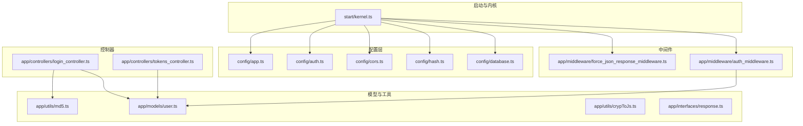
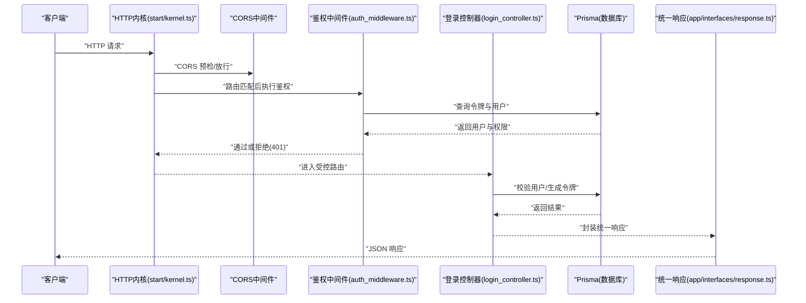
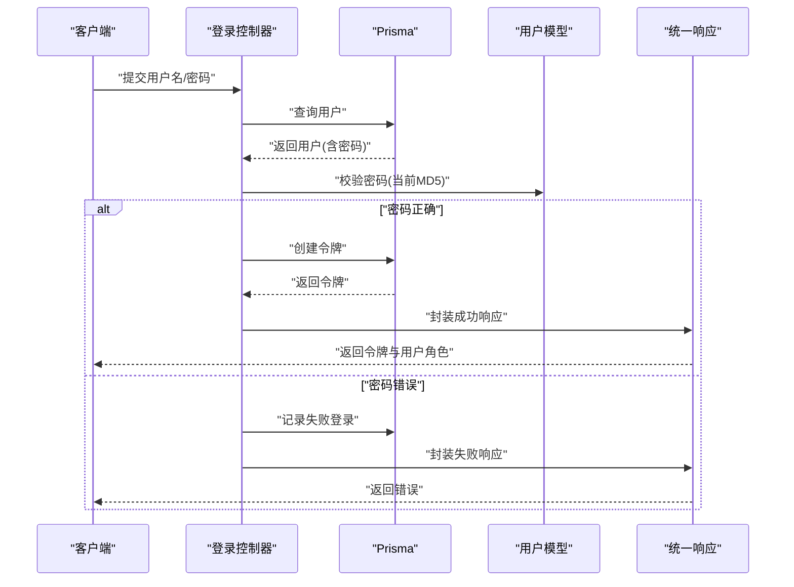
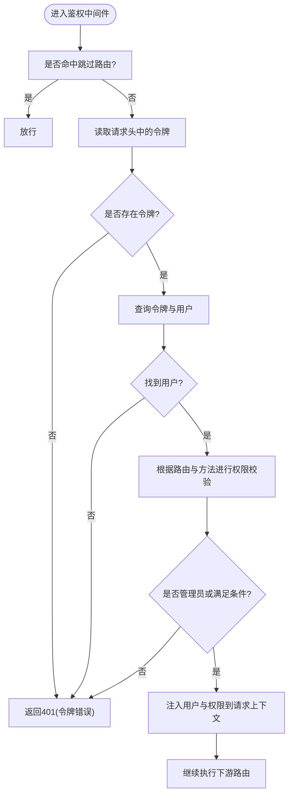
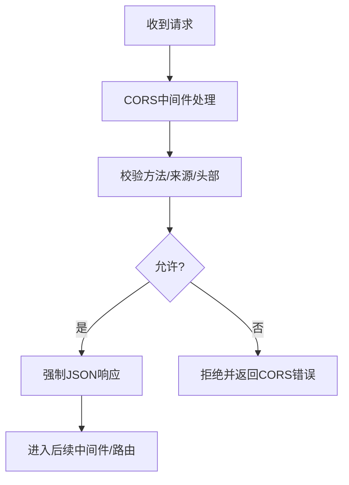
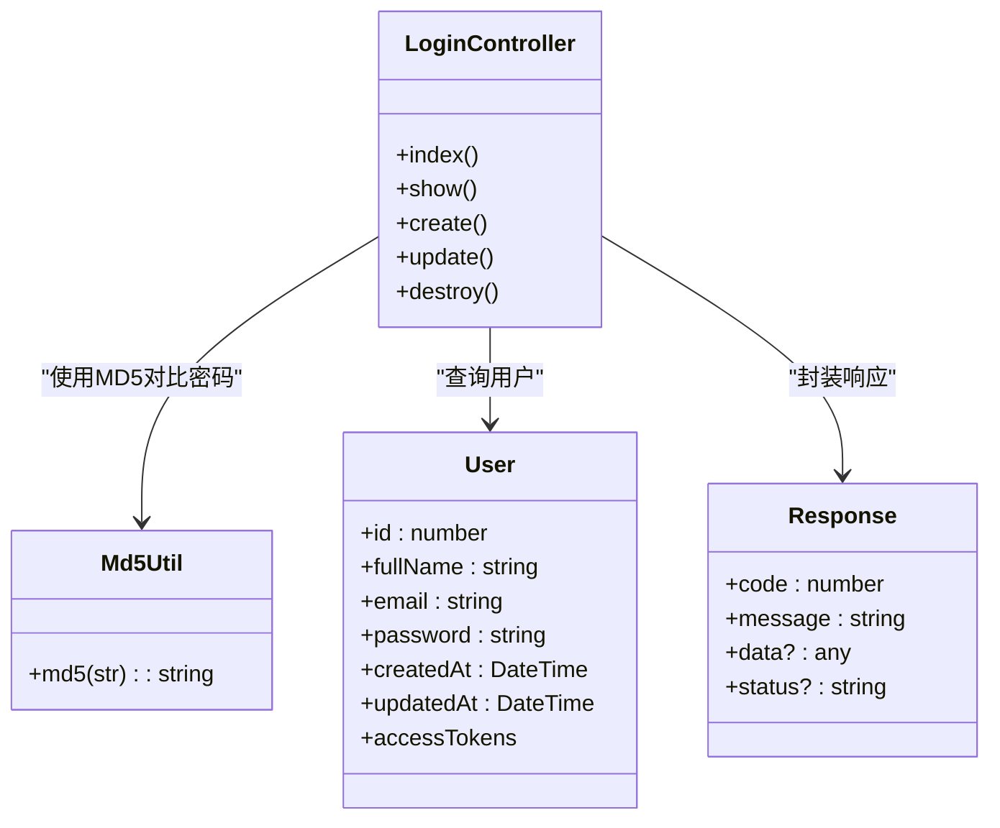
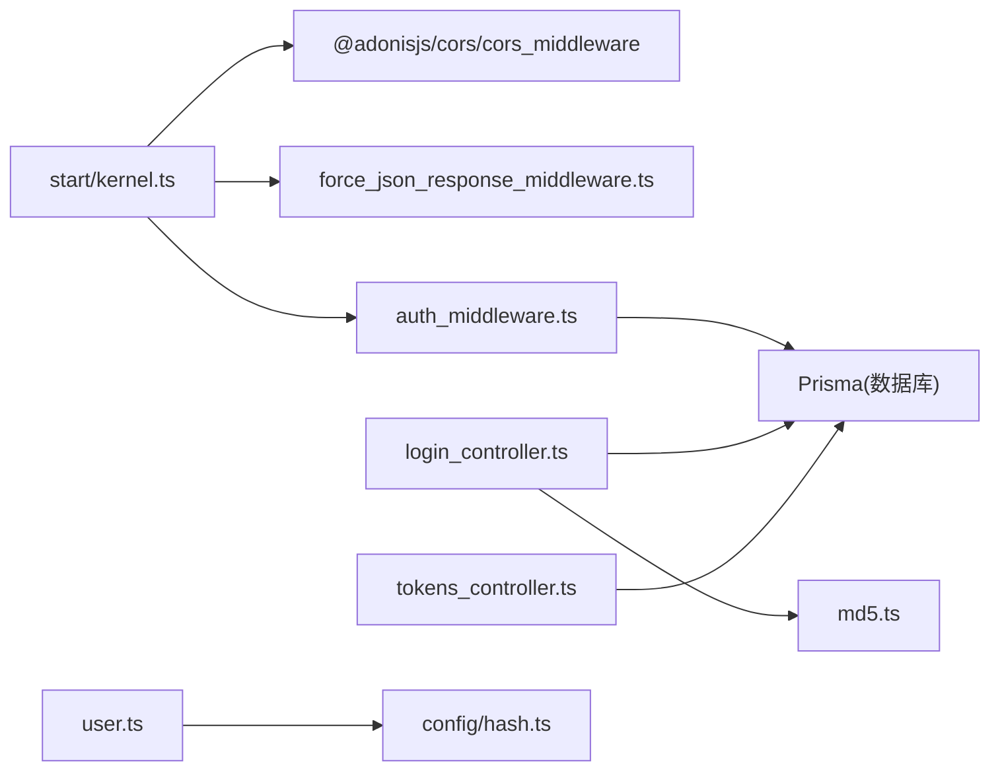

# 安全配置

<cite>
**本文引用的文件**
- [config/app.ts](file://config/app.ts)
- [config/auth.ts](file://config/auth.ts)
- [config/cors.ts](file://config/cors.ts)
- [config/hash.ts](file://config/hash.ts)
- [config/database.ts](file://config/database.ts)
- [start/kernel.ts](file://start/kernel.ts)
- [app/middleware/auth_middleware.ts](file://app/middleware/auth_middleware.ts)
- [app/middleware/force_json_response_middleware.ts](file://app/middleware/force_json_response_middleware.ts)
- [app/controllers/login_controller.ts](file://app/controllers/login_controller.ts)
- [app/controllers/tokens_controller.ts](file://app/controllers/tokens_controller.ts)
- [app/models/user.ts](file://app/models/user.ts)
- [app/utils/crypToJs.ts](file://app/utils/crypToJs.ts)
- [app/utils/md5.ts](file://app/utils/md5.ts)
- [app/interfaces/response.ts](file://app/interfaces/response.ts)
</cite>

## 目录
1. [简介](#简介)
2. [项目结构](#项目结构)
3. [核心组件](#核心组件)
4. [架构总览](#架构总览)
5. [详细组件分析](#详细组件分析)
6. [依赖关系分析](#依赖关系分析)
7. [性能与安全特性](#性能与安全特性)
8. [故障排查指南](#故障排查指南)
9. [结论](#结论)
10. [附录：安全配置检查清单与评估方法](#附录安全配置检查清单与评估方法)

## 简介
本文件面向 SManga Adonis 应用，系统化梳理其安全配置现状与加固建议，覆盖身份认证、授权控制、会话与令牌管理、密码哈希策略、CORS 跨域、安全响应头、数据库与敏感信息保护、网络安全与 DDoS 防护、安全审计与事件响应、合规性要求以及定期评估方法。内容基于仓库现有配置与代码实现进行分析，并提出可落地的改进建议。

## 项目结构
SManga Adonis 的安全相关配置主要分布在以下位置：
- 配置层：应用密钥、HTTP 服务器、认证、CORS、哈希、数据库等
- 中间件层：统一容器绑定、强制 JSON 响应、鉴权与权限校验
- 控制器层：登录、令牌管理等业务入口
- 工具与模型：密码工具、用户模型与访问令牌提供者
- 启动层：HTTP 内核注册中间件栈

图表来源
- [start/kernel.ts:35-49](file://start/kernel.ts#L35-L49)
- [config/app.ts:18-40](file://config/app.ts#L18-L40)
- [config/auth.ts:5-15](file://config/auth.ts#L5-L15)
- [config/cors.ts:9-17](file://config/cors.ts#L9-L17)
- [config/hash.ts:3-14](file://config/hash.ts#L3-L14)
- [config/database.ts:4-22](file://config/database.ts#L4-L22)
- [app/middleware/auth_middleware.ts:17-85](file://app/middleware/auth_middleware.ts#L17-L85)
- [app/middleware/force_json_response_middleware.ts:9-16](file://app/middleware/force_json_response_middleware.ts#L9-L16)
- [app/controllers/login_controller.ts:14-93](file://app/controllers/login_controller.ts#L14-L93)
- [app/controllers/tokens_controller.ts:13-60](file://app/controllers/tokens_controller.ts#L13-L60)
- [app/models/user.ts:8-33](file://app/models/user.ts#L8-L33)
- [app/utils/md5.ts:19-21](file://app/utils/md5.ts#L19-L21)
- [app/utils/crypToJs.ts:1-19](file://app/utils/crypToJs.ts#L1-L19)
- [app/interfaces/response.ts:18-33](file://app/interfaces/response.ts#L18-L33)

章节来源
- [start/kernel.ts:35-49](file://start/kernel.ts#L35-L49)
- [config/app.ts:18-40](file://config/app.ts#L18-L40)
- [config/auth.ts:5-15](file://config/auth.ts#L5-L15)
- [config/cors.ts:9-17](file://config/cors.ts#L9-L17)
- [config/hash.ts:3-14](file://config/hash.ts#L3-L14)
- [config/database.ts:4-22](file://config/database.ts#L4-L22)

## 核心组件
- 应用密钥与 Cookie 安全：通过应用密钥保障签名与加密；Cookie 默认启用 httpOnly、按生产环境启用 secure，并使用 Lax 的 SameSite 策略。
- 认证与令牌：采用访问令牌（Access Token）作为默认认证方式，令牌存储于数据库并通过用户模型的访问令牌提供者管理。
- 密码哈希：使用 scrypt 算法，具备可调的成本参数，满足现代强度要求。
- CORS：允许常见方法与凭据，支持动态来源与头部透传。
- 强制 JSON 响应：确保错误与验证响应为 JSON，避免浏览器端非预期解析。
- 登录与令牌管理：登录接口负责校验用户与密码，生成唯一令牌并记录登录日志；令牌控制器提供令牌列表与变更能力。
- 权限与鉴权中间件：对特定路由与请求方法进行权限拦截，限制非管理员操作；同时注入用户与媒体/模块权限到请求上下文。

章节来源
- [config/app.ts:13](file://config/app.ts#L13)
- [config/app.ts:32-39](file://config/app.ts#L32-L39)
- [config/auth.ts:5-15](file://config/auth.ts#L5-L15)
- [config/hash.ts:7-12](file://config/hash.ts#L7-L12)
- [config/cors.ts:9-17](file://config/cors.ts#L9-L17)
- [app/middleware/force_json_response_middleware.ts:9-16](file://app/middleware/force_json_response_middleware.ts#L9-L16)
- [app/controllers/login_controller.ts:34-93](file://app/controllers/login_controller.ts#L34-L93)
- [app/controllers/tokens_controller.ts:13-60](file://app/controllers/tokens_controller.ts#L13-L60)
- [app/middleware/auth_middleware.ts:17-85](file://app/middleware/auth_middleware.ts#L17-L85)

## 架构总览
下图展示从请求进入至鉴权与权限校验的整体流程，以及与配置层的关系。

图表来源
- [start/kernel.ts:35-49](file://start/kernel.ts#L35-L49)
- [app/middleware/auth_middleware.ts:23-84](file://app/middleware/auth_middleware.ts#L23-L84)
- [app/controllers/login_controller.ts:34-93](file://app/controllers/login_controller.ts#L34-L93)
- [app/interfaces/response.ts:18-33](file://app/interfaces/response.ts#L18-L33)

## 详细组件分析

### 身份认证与令牌管理
- 认证守卫：默认使用访问令牌守卫，令牌持久化在数据库，用户模型通过访问令牌提供者进行关联。
- 登录流程：接收用户名与密码，查询用户并比对密码（当前使用 MD5），成功则生成唯一令牌并记录登录信息。
- 令牌管理：提供令牌列表、详情、创建、更新与删除接口，便于运维与审计。

图表来源
- [config/auth.ts:5-15](file://config/auth.ts#L5-L15)
- [app/models/user.ts:8-33](file://app/models/user.ts#L8-L33)
- [app/controllers/login_controller.ts:34-93](file://app/controllers/login_controller.ts#L34-L93)
- [app/utils/md5.ts:19-21](file://app/utils/md5.ts#L19-L21)
- [app/interfaces/response.ts:18-33](file://app/interfaces/response.ts#L18-L33)

章节来源
- [config/auth.ts:5-15](file://config/auth.ts#L5-L15)
- [app/models/user.ts:8-33](file://app/models/user.ts#L8-L33)
- [app/controllers/login_controller.ts:34-93](file://app/controllers/login_controller.ts#L34-L93)
- [app/utils/md5.ts:19-21](file://app/utils/md5.ts#L19-L21)
- [app/interfaces/response.ts:18-33](file://app/interfaces/response.ts#L18-L33)

### 授权控制与会话管理
- 路由白名单：对特定前缀的路由（如部署、测试、登录、文件、分析）跳过鉴权中间件。
- 权限校验：针对用户管理与 DELETE 方法进行管理员权限限制；将用户媒体权限与模块权限注入请求上下文，供后续业务使用。
- 会话 Cookie：启用 httpOnly、按生产环境启用 secure、Lax 的 SameSite，有效降低 XSS 与 CSRF 风险。

图表来源
- [app/middleware/auth_middleware.ts:23-84](file://app/middleware/auth_middleware.ts#L23-L84)
- [config/app.ts:32-39](file://config/app.ts#L32-L39)

章节来源
- [app/middleware/auth_middleware.ts:17-85](file://app/middleware/auth_middleware.ts#L17-L85)
- [config/app.ts:32-39](file://config/app.ts#L32-L39)

### CORS 跨域与安全响应头
- CORS：允许 GET/HEAD/POST/PUT/DELETE 方法，允许凭据，动态来源与头部透传，最大预检缓存时间有限。
- 强制 JSON 响应：统一将 Accept 设置为 application/json，确保错误与验证以 JSON 返回，减少浏览器端误解析风险。

图表来源
- [config/cors.ts:9-17](file://config/cors.ts#L9-L17)
- [app/middleware/force_json_response_middleware.ts:9-16](file://app/middleware/force_json_response_middleware.ts#L9-L16)
- [start/kernel.ts:35-39](file://start/kernel.ts#L35-L39)

章节来源
- [config/cors.ts:9-17](file://config/cors.ts#L9-L17)
- [app/middleware/force_json_response_middleware.ts:9-16](file://app/middleware/force_json_response_middleware.ts#L9-L16)
- [start/kernel.ts:35-39](file://start/kernel.ts#L35-L39)

### 密码加密策略与敏感信息保护
- 密码哈希：使用 scrypt，具备成本、块大小、并行度与内存上限等参数，满足现代强度要求。
- 登录密码：当前登录接口使用 MD5 对比，存在安全风险，建议迁移至与模型一致的 scrypt。
- 敏感信息：存在 AES 加密工具文件，但未在登录与令牌流程中使用，建议统一加密策略并在传输与存储中强制启用。

图表来源
- [app/models/user.ts:8-33](file://app/models/user.ts#L8-L33)
- [app/controllers/login_controller.ts:34-93](file://app/controllers/login_controller.ts#L34-L93)
- [app/utils/md5.ts:19-21](file://app/utils/md5.ts#L19-L21)
- [app/interfaces/response.ts:18-33](file://app/interfaces/response.ts#L18-L33)

章节来源
- [config/hash.ts:7-12](file://config/hash.ts#L7-L12)
- [app/models/user.ts:8-33](file://app/models/user.ts#L8-L33)
- [app/controllers/login_controller.ts:34-93](file://app/controllers/login_controller.ts#L34-L93)
- [app/utils/md5.ts:19-21](file://app/utils/md5.ts#L19-L21)
- [app/utils/crypToJs.ts:1-19](file://app/utils/crypToJs.ts#L1-L19)
- [app/interfaces/response.ts:18-33](file://app/interfaces/response.ts#L18-L33)

### 数据库安全配置
- 连接配置：通过环境变量注入主机、端口、用户、密码与数据库名，避免硬编码。
- 迁移路径：启用自然排序与自定义迁移路径，便于版本化管理。
- 建议：在生产环境启用 TLS 连接、最小权限账户、连接池与慢查询日志；对敏感字段进行加密存储。

章节来源
- [config/database.ts:4-22](file://config/database.ts#L4-L22)

### 网络安全与 DDoS 防护
- 当前未发现专用防火墙或速率限制中间件配置；建议在网关/反向代理层启用：
  - IP 黑名单/白名单
  - 请求速率限制（RPM/LPM）
  - 连接数与并发限制
  - DDoS 缓冲与清洗
  - TLS 终止与证书管理
- 应用层可结合中间件实现轻量限流与异常检测。

章节来源
- [start/kernel.ts:35-49](file://start/kernel.ts#L35-L49)

### 安全审计、漏洞扫描与渗透测试
- 建议流程：
  - 漏洞扫描：静态分析（依赖与配置）、动态扫描（OWASP ZAP/Postman）
  - 渗透测试：模拟 SSRF、SQL 注入、命令注入、越权与会话劫持
  - 日志审计：登录、令牌变更、敏感操作均需记录
  - 回归测试：每次发布前执行自动化安全回归

章节来源
- [app/controllers/login_controller.ts:34-93](file://app/controllers/login_controller.ts#L34-L93)
- [app/controllers/tokens_controller.ts:13-60](file://app/controllers/tokens_controller.ts#L13-L60)

### 安全事件响应与数据泄露应急
- 建议流程：
  - 快速隔离：冻结受影响账号与令牌
  - 彻底调查：回溯日志、确认影响范围
  - 修复与通知：修复漏洞、重置凭证、通知用户
  - 复盘与改进：完善监控与告警、更新应急预案

章节来源
- [app/controllers/tokens_controller.ts:13-60](file://app/controllers/tokens_controller.ts#L13-L60)
- [app/middleware/auth_middleware.ts:17-85](file://app/middleware/auth_middleware.ts#L17-L85)

### 合规性要求
- 数据最小化：仅收集必要信息
- 明示同意：在登录与隐私政策中明确告知
- 数据生命周期：设定令牌与登录日志保留期限
- 审计追踪：完整记录敏感操作

章节来源
- [app/controllers/login_controller.ts:34-93](file://app/controllers/login_controller.ts#L34-L93)
- [app/interfaces/response.ts:18-33](file://app/interfaces/response.ts#L18-L33)

## 依赖关系分析
- 中间件栈耦合：HTTP 内核统一注册服务端中间件与路由中间件，鉴权中间件依赖 Prisma 查询令牌与用户。
- 控制器依赖：登录控制器依赖用户模型与 MD5 工具；令牌控制器依赖用户模型与 Prisma。
- 配置依赖：认证、哈希、CORS、数据库等配置共同决定安全行为。

图表来源
- [start/kernel.ts:35-49](file://start/kernel.ts#L35-L49)
- [app/middleware/auth_middleware.ts:48-58](file://app/middleware/auth_middleware.ts#L48-L58)
- [app/controllers/login_controller.ts:34-93](file://app/controllers/login_controller.ts#L34-L93)
- [app/controllers/tokens_controller.ts:13-60](file://app/controllers/tokens_controller.ts#L13-L60)
- [app/utils/md5.ts:19-21](file://app/utils/md5.ts#L19-L21)
- [app/models/user.ts:8-33](file://app/models/user.ts#L8-L33)
- [config/hash.ts:3-14](file://config/hash.ts#L3-L14)

章节来源
- [start/kernel.ts:35-49](file://start/kernel.ts#L35-L49)
- [app/middleware/auth_middleware.ts:48-58](file://app/middleware/auth_middleware.ts#L48-L58)
- [app/controllers/login_controller.ts:34-93](file://app/controllers/login_controller.ts#L34-L93)
- [app/controllers/tokens_controller.ts:13-60](file://app/controllers/tokens_controller.ts#L13-L60)
- [app/utils/md5.ts:19-21](file://app/utils/md5.ts#L19-L21)
- [app/models/user.ts:8-33](file://app/models/user.ts#L8-L33)
- [config/hash.ts:3-14](file://config/hash.ts#L3-L14)

## 性能与安全特性
- 性能：scrypt 参数已优化，建议结合业务负载调整；鉴权中间件按需查询，避免不必要的 ORM 调用。
- 安全：Cookie 默认 httpOnly+secure(Lax)，CORS 放宽但可控；登录密码当前使用 MD5，存在风险，建议迁移至 scrypt 并启用 HTTPS 传输。

章节来源
- [config/hash.ts:7-12](file://config/hash.ts#L7-L12)
- [config/app.ts:32-39](file://config/app.ts#L32-L39)
- [app/utils/md5.ts:19-21](file://app/utils/md5.ts#L19-L21)

## 故障排查指南
- 401 令牌错误：检查请求头是否携带 token，确认数据库中是否存在该令牌且未过期。
- 权限不足：确认用户角色与目标路由/方法是否匹配；检查用户媒体权限与模块权限注入逻辑。
- CORS 失败：确认来源、方法、头部与凭据配置；确保前端与后端域名一致。
- 登录失败：确认用户名存在且密码匹配；若使用 MD5，请确保前后端一致；检查登录记录与日志。

章节来源
- [app/middleware/auth_middleware.ts:32-54](file://app/middleware/auth_middleware.ts#L32-L54)
- [app/controllers/login_controller.ts:34-66](file://app/controllers/login_controller.ts#L34-L66)
- [config/cors.ts:9-17](file://config/cors.ts#L9-L17)

## 结论
SManga Adonis 已具备基础的安全配置：应用密钥、Cookie 安全策略、访问令牌认证、CORS 与强制 JSON 响应。但仍存在登录密码使用 MD5 的风险、缺少统一加密策略与 DDoS 防护、未见专门的 CSRF 与 XSS 防护中间件。建议优先完成密码策略升级、统一敏感信息加密、完善 CORS 与安全响应头、引入速率限制与 WAF、建立安全审计与事件响应机制，并持续开展漏洞扫描与渗透测试。

## 附录：安全配置检查清单与评估方法
- 密码与令牌
  - 是否使用 scrypt 或更高等级哈希算法
  - 登录密码是否迁移至 scrypt
  - 令牌生成是否使用强随机源
  - 令牌撤销与刷新机制是否完善
- 传输与存储
  - 是否启用 HTTPS 与 TLS 1.3+
  - 是否对敏感字段（如密码、令牌）进行加密存储
  - 是否对日志中的敏感信息脱敏
- 访问控制
  - 是否对所有路由启用鉴权中间件
  - 是否区分管理员与普通用户权限
  - 是否对 DELETE 等高危方法进行额外校验
- CORS 与响应头
  - 是否最小化暴露头部与来源
  - 是否启用 X-Content-Type-Options、X-Frame-Options、Referrer-Policy 等安全头
  - 是否在生产环境关闭调试与多余头
- 数据库与网络
  - 是否使用最小权限账户与只读副本
  - 是否启用连接池与慢查询日志
  - 是否在网络层启用 WAF、DDoS 防护与速率限制
- 审计与合规
  - 是否记录登录、令牌变更、敏感操作
  - 是否定期进行漏洞扫描与渗透测试
  - 是否制定并演练安全事件响应预案