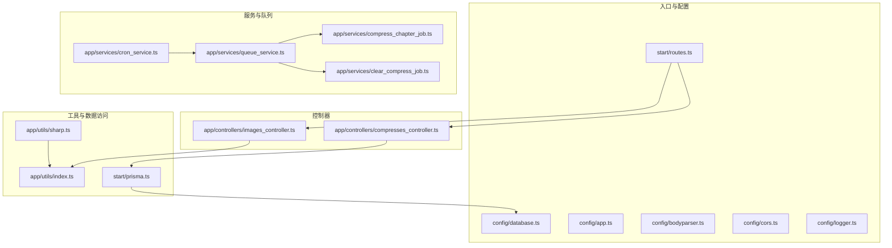
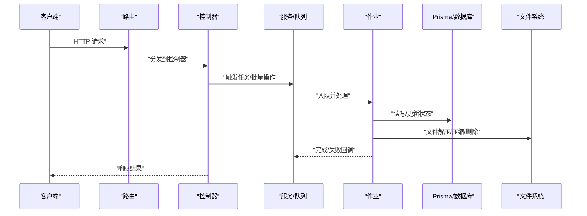
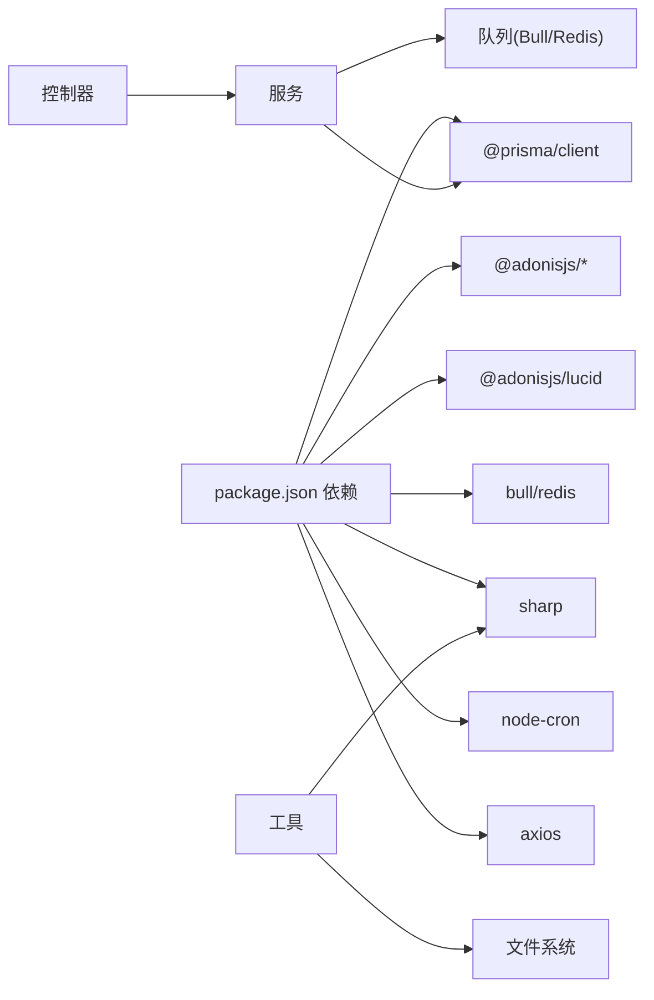

# 性能优化

<cite>
**本文引用的文件**
- [package.json](file://package.json)
- [config/database.ts](file://config/database.ts)
- [config/app.ts](file://config/app.ts)
- [config/bodyparser.ts](file://config/bodyparser.ts)
- [config/cors.ts](file://config/cors.ts)
- [config/logger.ts](file://config/logger.ts)
- [start/prisma.ts](file://start/prisma.ts)
- [start/routes.ts](file://start/routes.ts)
- [app/utils/index.ts](file://app/utils/index.ts)
- [app/utils/sharp.ts](file://app/utils/sharp.ts)
- [app/controllers/images_controller.ts](file://app/controllers/images_controller.ts)
- [app/controllers/compresses_controller.ts](file://app/controllers/compresses_controller.ts)
- [app/services/queue_service.ts](file://app/services/queue_service.ts)
- [app/services/cron_service.ts](file://app/services/cron_service.ts)
- [app/services/compress_chapter_job.ts](file://app/services/compress_chapter_job.ts)
- [app/services/clear_compress_job.ts](file://app/services/clear_compress_job.ts)
- [data-example/config/smanga.json](file://data-example/config/smanga.json)
</cite>

## 目录
1. [简介](#简介)
2. [项目结构](#项目结构)
3. [核心组件](#核心组件)
4. [架构总览](#架构总览)
5. [详细组件分析](#详细组件分析)
6. [依赖关系分析](#依赖关系分析)
7. [性能考量](#性能考量)
8. [故障排查指南](#故障排查指南)
9. [结论](#结论)
10. [附录](#附录)

## 简介
本文件面向 SManga Adonis 应用，系统化梳理并提出性能优化方案，覆盖数据库查询与连接池、Redis 缓存与失效策略、内存管理与图像处理、文件压缩与存储、队列并发与批量化、HTTP 请求与静态资源缓存、CDN 配置、性能基准测试与瓶颈定位、以及多环境调优建议。文档以仓库现有实现为基础，结合可落地的优化策略，帮助在高并发与海量数据场景下稳定提升系统吞吐与响应。

## 项目结构
SManga Adonis 采用 AdonisJS 6 的标准分层组织：控制器负责 HTTP 入口与响应封装；服务层承载业务流程与队列调度；工具模块提供通用能力（路径、配置、图像处理）；Prisma 提供数据库访问；Bull 队列与 Redis 协同实现后台任务；路由集中定义 API。

**图表来源**
- [start/routes.ts:1-241](file://start/routes.ts#L1-L241)
- [config/database.ts:1-24](file://config/database.ts#L1-L24)
- [config/app.ts:1-41](file://config/app.ts#L1-L41)
- [config/bodyparser.ts:1-56](file://config/bodyparser.ts#L1-L56)
- [config/cors.ts:1-20](file://config/cors.ts#L1-L20)
- [config/logger.ts:1-36](file://config/logger.ts#L1-L36)
- [app/controllers/images_controller.ts:1-114](file://app/controllers/images_controller.ts#L1-L114)
- [app/controllers/compresses_controller.ts:1-147](file://app/controllers/compresses_controller.ts#L1-L147)
- [app/services/queue_service.ts:1-267](file://app/services/queue_service.ts#L1-L267)
- [app/services/cron_service.ts:1-144](file://app/services/cron_service.ts#L1-L144)
- [app/services/compress_chapter_job.ts:1-71](file://app/services/compress_chapter_job.ts#L1-L71)
- [app/services/clear_compress_job.ts:1-56](file://app/services/clear_compress_job.ts#L1-L56)
- [app/utils/index.ts:1-313](file://app/utils/index.ts#L1-L313)
- [app/utils/sharp.ts:1-181](file://app/utils/sharp.ts#L1-L181)
- [start/prisma.ts:1-42](file://start/prisma.ts#L1-L42)

**章节来源**
- [start/routes.ts:1-241](file://start/routes.ts#L1-L241)
- [config/database.ts:1-24](file://config/database.ts#L1-L24)
- [config/app.ts:1-41](file://config/app.ts#L1-L41)
- [config/bodyparser.ts:1-56](file://config/bodyparser.ts#L1-L56)
- [config/cors.ts:1-20](file://config/cors.ts#L1-L20)
- [config/logger.ts:1-36](file://config/logger.ts#L1-L36)

## 核心组件
- 数据库访问：通过 Prisma 客户端按配置连接 MySQL/PostgreSQL/SQLite，统一数据源与查询接口。
- 队列与任务：基于 Bull/Redis 的任务队列，支持并发、重试、指数退避、优先级与分类队列（scan/sync/compress）。
- 图像处理：基于 Sharp 的图片压缩与格式转换，支持 JPEG/PNG/WebP，并提供两套策略（迭代逼近与一次性预设质量）。
- 文件与路径：跨平台路径解析与配置读取，统一海报、缓存、压缩等目录布局。
- 控制器：HTTP 接口层，负责请求校验、流式响应与批量操作。
- 定时任务：基于 node-cron 的周期性扫描、同步与清理任务，统一注入队列。

**章节来源**
- [start/prisma.ts:1-42](file://start/prisma.ts#L1-L42)
- [app/services/queue_service.ts:1-267](file://app/services/queue_service.ts#L1-L267)
- [app/utils/sharp.ts:1-181](file://app/utils/sharp.ts#L1-L181)
- [app/utils/index.ts:1-313](file://app/utils/index.ts#L1-L313)
- [app/controllers/images_controller.ts:1-114](file://app/controllers/images_controller.ts#L1-L114)
- [app/services/cron_service.ts:1-144](file://app/services/cron_service.ts#L1-L144)

## 架构总览
SManga Adonis 的性能关键链路包括：HTTP 请求经路由与控制器进入业务层；读写操作通过 Prisma 访问数据库；耗时任务（扫描、同步、解压、清理）由队列异步执行；图像处理与文件 IO 在工具层完成；配置中心（smanga.json）驱动运行参数与阈值。

**图表来源**
- [start/routes.ts:1-241](file://start/routes.ts#L1-L241)
- [app/controllers/compresses_controller.ts:1-147](file://app/controllers/compresses_controller.ts#L1-L147)
- [app/services/queue_service.ts:1-267](file://app/services/queue_service.ts#L1-L267)
- [app/services/compress_chapter_job.ts:1-71](file://app/services/compress_chapter_job.ts#L1-L71)
- [app/services/clear_compress_job.ts:1-56](file://app/services/clear_compress_job.ts#L1-L56)
- [start/prisma.ts:1-42](file://start/prisma.ts#L1-L42)
- [app/utils/index.ts:1-313](file://app/utils/index.ts#L1-L313)

## 详细组件分析

### 数据库查询优化与连接池配置
- 连接配置：Adonis Lucid 配置了 mysql2 客户端，连接参数来自环境变量，便于在不同环境切换数据库类型与实例。
- Prisma 客户端：根据配置动态拼装数据库 URL，支持 SQLite/MySQL/PostgreSQL，统一数据源接入。
- 建议
  - 查询优化：对高频查询建立合适索引（如 mangaId/chapterId），减少全表扫描；使用分页与投影字段，避免 SELECT *。
  - 连接池：在生产环境启用连接池复用，限制最大连接数，设置合理的空闲回收与超时；监控慢查询日志与锁等待。
  - 事务批处理：批量插入/更新使用事务包裹，减少往返开销。
  - 读写分离：对只读报表类查询走从库，主库承担写入与强一致读。

**章节来源**
- [config/database.ts:1-24](file://config/database.ts#L1-L24)
- [start/prisma.ts:1-42](file://start/prisma.ts#L1-L42)
- [app/controllers/compresses_controller.ts:16-27](file://app/controllers/compresses_controller.ts#L16-L27)

### Redis 缓存策略、内存管理与缓存失效
- 队列与缓存：Bull/Redis 用于任务编排与持久化，适合高并发后台任务；可结合 Redis 作为应用层缓存（如热门列表、元数据）。
- 内存管理：Sharp 在压缩时需控制内存占用，建议限制并发与输入尺寸，及时销毁实例。
- 缓存失效：采用 TTL 或 LRU 清理策略；热点数据可引入本地缓存（进程内）降低 Redis 压力；对写多读少场景采用写穿透或延时双删。

**章节来源**
- [app/services/queue_service.ts:34-101](file://app/services/queue_service.ts#L34-L101)
- [app/utils/sharp.ts:12-89](file://app/utils/sharp.ts#L12-L89)
- [data-example/config/smanga.json:46-50](file://data-example/config/smanga.json#L46-L50)

### 图像处理优化、文件压缩与存储
- 压缩策略
  - 迭代逼近：循环降低质量直至满足阈值，适合对体积敏感且允许轻微损失的场景。
  - 一次性预设：根据初始大小估算初始质量，单次压缩，适合对一致性要求更高的场景。
- 存储布局：统一海报、缓存、压缩目录，跨平台路径解析，避免磁盘碎片与 IO 抖动。
- 建议
  - 批量压缩：合并小图生成 WebP 或 AVIF，减少请求数与带宽。
  - CDN 加速：将海报与压缩包指向 CDN，开启边缘缓存与回源压缩。
  - 传输优化：HTTP 流式响应返回图片，避免一次性加载至内存。

**章节来源**
- [app/utils/sharp.ts:12-167](file://app/utils/sharp.ts#L12-L167)
- [app/controllers/images_controller.ts:8-29](file://app/controllers/images_controller.ts#L8-L29)
- [app/utils/index.ts:64-82](file://app/utils/index.ts#L64-L82)

### 队列性能调优、并发与任务批量化
- 并发与重试：队列支持并发度、最大重试次数与指数退避，避免重试风暴。
- 分类队列：scan/sync/compress 三类队列隔离资源争用，保障关键路径优先。
- 批量化：对批量删除、批量更新采用事务与批量 API，减少网络往返。
- 建议
  - 优先级：扫描类任务高于清理类，清理类高于压缩类。
  - 超时与监控：为长任务设置合理超时，结合 bull-board 监控队列积压与失败。
  - 资源隔离：CPU 密集型（压缩）与 IO 密集型（扫描）任务分离节点或容器。

**章节来源**
- [app/services/queue_service.ts:17-33](file://app/services/queue_service.ts#L17-L33)
- [app/services/queue_service.ts:49-87](file://app/services/queue_service.ts#L49-L87)
- [app/services/queue_service.ts:103-141](file://app/services/queue_service.ts#L103-L141)
- [app/services/queue_service.ts:175-264](file://app/services/queue_service.ts#L175-L264)

### HTTP 请求优化、静态资源缓存与 CDN
- 请求体：JSON/表单/多部分上传均有限制，避免过大请求导致内存压力。
- CORS：允许跨域与凭证，注意暴露头与缓存时间。
- 静态资源：图片采用流式响应，配合 CDN 与浏览器缓存策略。
- 建议
  - 对 GET 列表接口增加 ETag/Last-Modified 缓存控制。
  - 对大文件下载启用 Range 支持与断点续传。
  - CDN 边缘缓存与压缩（Gzip/Br）结合，减少回源。

**章节来源**
- [config/bodyparser.ts:1-56](file://config/bodyparser.ts#L1-L56)
- [config/cors.ts:1-20](file://config/cors.ts#L1-L20)
- [app/controllers/images_controller.ts:8-29](file://app/controllers/images_controller.ts#L8-L29)

### 定时任务与自动清理
- 扫描与同步：基于 cron 周期性触发，按配置间隔执行。
- 清理策略：定期清理压缩缓存目录，超过阈值按记录删除多余目录，保持空间健康。

**章节来源**
- [app/services/cron_service.ts:16-43](file://app/services/cron_service.ts#L16-L43)
- [app/services/cron_service.ts:45-89](file://app/services/cron_service.ts#L45-L89)
- [app/services/clear_compress_job.ts:13-55](file://app/services/clear_compress_job.ts#L13-L55)

## 依赖关系分析
- 外部依赖：AdonisJS 核心、Lucid/Prisma、Bull/Redis、Sharp、node-cron、Axios 等。
- 组件耦合：控制器依赖服务与 Prisma；服务依赖队列与工具；工具依赖文件系统与第三方库。
- 循环依赖：当前结构清晰，无明显循环导入。

**图表来源**
- [package.json:62-88](file://package.json#L62-L88)
- [app/controllers/compresses_controller.ts:1-147](file://app/controllers/compresses_controller.ts#L1-L147)
- [app/services/queue_service.ts:1-267](file://app/services/queue_service.ts#L1-L267)
- [app/utils/sharp.ts:1-181](file://app/utils/sharp.ts#L1-L181)

**章节来源**
- [package.json:62-88](file://package.json#L62-L88)

## 性能考量

### 数据库查询优化
- 索引策略
  - mangaId/chapterId 上建立复合索引，加速关联查询。
  - 对时间字段（createTime/updateTime）建立索引，优化排序与分页。
  - 对模糊匹配字段（名称）考虑前缀索引或全文索引（视数据库支持）。
- 查询模式
  - 使用 select 投影，避免不必要的字段。
  - 分页使用游标分页或基于主键的范围分页，减少 offset 开销。
- 连接池
  - 最大连接数与空闲回收时间按 QPS 与平均响应时间调优。
  - 开启只读事务与连接复用，减少握手成本。

### Redis 与缓存
- 缓存键设计：采用命名空间与版本号，避免键冲突。
- 失效策略：TTL + LRU，热点数据可加本地缓存。
- 降级：缓存不可用时快速失败或旁路，保证核心功能可用。

### 图像处理与存储
- 压缩策略选择：根据业务对画质与体积的权衡选择迭代逼近或一次性预设。
- 并发控制：限制同时处理的图像数量，避免内存峰值。
- 存储布局：统一目录、分层命名、定期清理无效目录。

### 队列与并发
- 并发度：根据 CPU/IO 特性设置 scan/sync/compress 的并发，避免相互抢占。
- 重试与退避：指数退避 + 抖动，避免雪崩。
- 优先级：扫描 > 清理 > 压缩，保障用户体验。

### HTTP 与 CDN
- 请求体限制：避免超大上传导致 OOM。
- 缓存控制：对静态资源设置强缓存与协商缓存。
- CDN：边缘缓存 + 回源压缩，减少带宽与延迟。

## 故障排查指南
- 队列堆积
  - 检查并发与超时配置，确认任务处理耗时与资源占用。
  - 使用 bull-board 查看失败任务与重试历史。
- 图像处理失败
  - 检查输入格式与磁盘空间，确认 Sharp 实例销毁与内存释放。
- 数据库慢查询
  - 开启慢查询日志，分析索引缺失与锁等待。
- 文件清理异常
  - 校验目录权限与路径解析，确保记录与目录一致性。

**章节来源**
- [app/services/queue_service.ts:41-47](file://app/services/queue_service.ts#L41-L47)
- [app/utils/sharp.ts:169-173](file://app/utils/sharp.ts#L169-L173)
- [app/services/clear_compress_job.ts:14-55](file://app/services/clear_compress_job.ts#L14-L55)

## 结论
通过数据库索引与连接池优化、Redis 缓存与失效策略、图像处理与存储的工程化改进、队列并发与批量化治理、HTTP 与 CDN 的协同，SManga Adonis 可在高并发与大规模数据场景下显著提升吞吐与稳定性。建议以配置为中心，持续监控与压测，逐步迭代优化。

## 附录

### 性能基准测试方法
- 数据库：使用 sysbench/tpcc 评估连接池与索引效果；对比不同并发下的 P95/P99 延迟。
- 队列：模拟任务注入速率与处理耗时，观察队列长度与失败率。
- 图像处理：固定输入规模与格式，测量压缩耗时与内存峰值。
- HTTP：ab/wrk 压测接口，关注并发数、吞吐与延迟分布。

### 瓶颈识别技术
- APM 工具：集成性能探针，定位慢 SQL、慢队列任务与慢 IO。
- 日志分析：结合请求 ID 串联日志，定位热点路径。
- 监控指标：CPU/内存/IO/网络/队列长度/数据库连接数。

### 不同环境下的调优建议
- 开发环境：适度并发，开启详细日志与断点调试。
- 测试环境：模拟生产流量，验证缓存命中与队列处理能力。
- 生产环境：启用连接池与缓存，严格监控与告警，预留扩容空间。