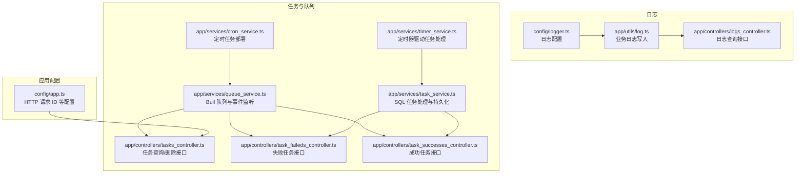
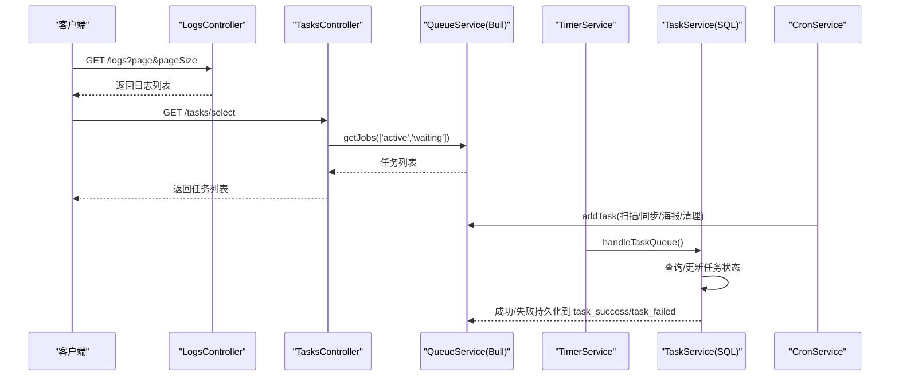
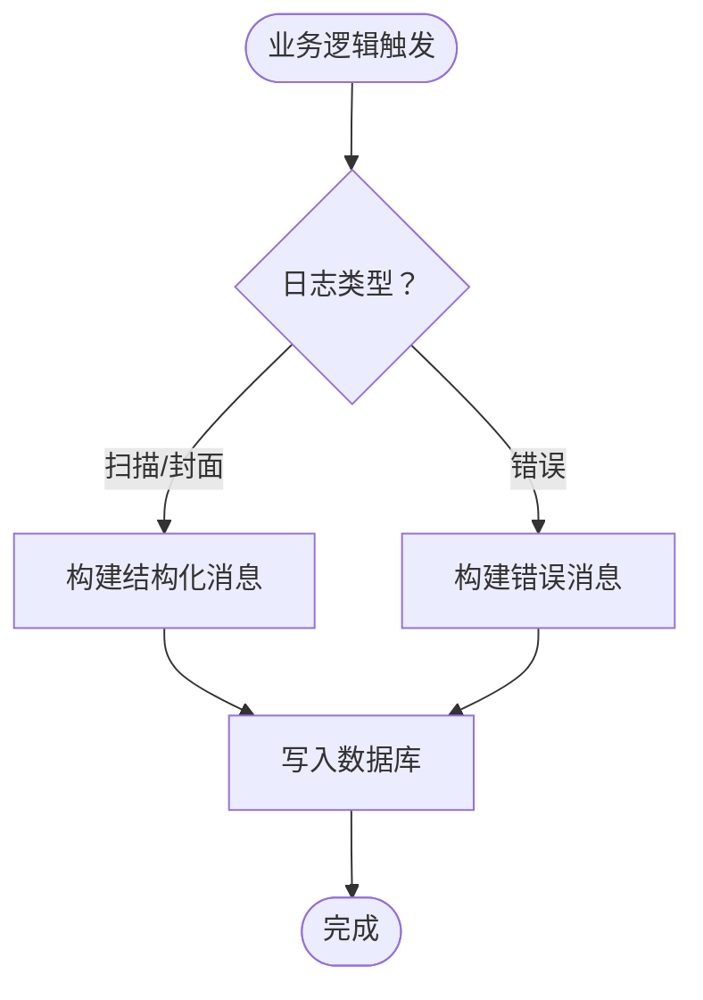
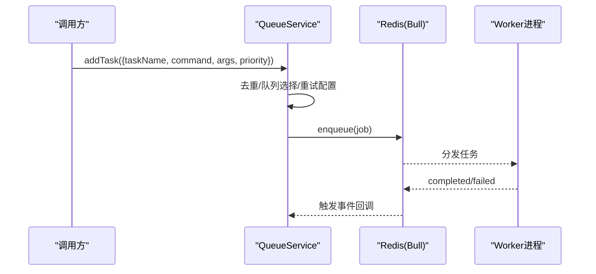
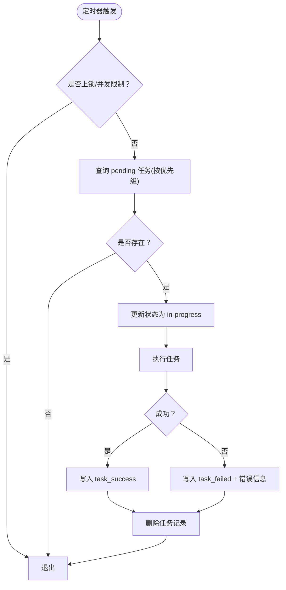
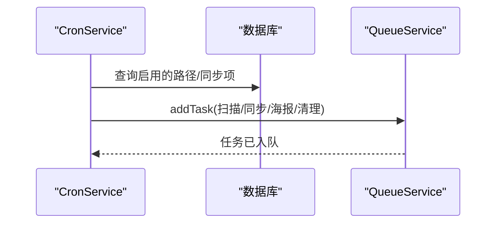
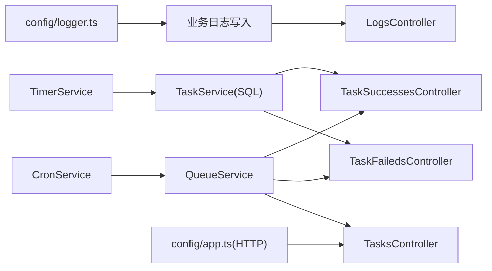
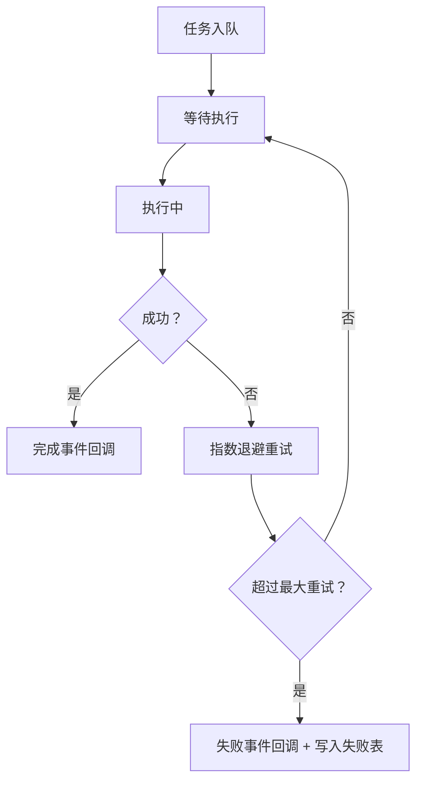

# 监控管理

<cite>
**本文引用的文件**
- [config/logger.ts](file://config/logger.ts)
- [app/utils/log.ts](file://app/utils/log.ts)
- [app/controllers/logs_controller.ts](file://app/controllers/logs_controller.ts)
- [app/services/queue_service.ts](file://app/services/queue_service.ts)
- [app/controllers/tasks_controller.ts](file://app/controllers/tasks_controller.ts)
- [app/controllers/task_faileds_controller.ts](file://app/controllers/task_faileds_controller.ts)
- [app/controllers/task_successes_controller.ts](file://app/controllers/task_successes_controller.ts)
- [app/services/task_service.ts](file://app/services/task_service.ts)
- [app/services/timer_service.ts](file://app/services/timer_service.ts)
- [app/services/cron_service.ts](file://app/services/cron_service.ts)
- [config/app.ts](file://config/app.ts)
</cite>

## 目录
1. [简介](#简介)
2. [项目结构](#项目结构)
3. [核心组件](#核心组件)
4. [架构总览](#架构总览)
5. [组件详解](#组件详解)
6. [依赖关系分析](#依赖关系分析)
7. [性能与资源监控](#性能与资源监控)
8. [日志与审计](#日志与审计)
9. [Redis 队列与任务监控](#redis-队列与任务监控)
10. [健康检查与指标暴露](#健康检查与指标暴露)
11. [告警与可视化](#告警与可视化)
12. [故障排查指南](#故障排查指南)
13. [结论](#结论)

## 简介
本文件面向 SManga Adonis 的监控管理需求，系统性梳理应用性能监控、系统资源监控与业务指标监控的实现方式；覆盖日志采集、聚合与分析最佳实践；提供 Redis 队列监控、任务执行状态跟踪与错误统计方法；给出健康检查端点、性能指标暴露与告警规则配置建议；并说明监控数据可视化、仪表板配置与异常告警通知机制，以及监控工具集成与第三方监控平台对接思路。

## 项目结构
围绕监控主题，SManga Adonis 的关键模块分布如下：
- 日志：配置层与业务日志写入
- 任务与队列：基于 Bull 的 Redis 队列与任务调度
- 控制器：对外暴露任务查询、删除与日志查询接口
- 定时与计划任务：基于 node-cron 的周期性任务部署
- 应用配置：请求 ID 生成等基础能力

图表来源
- [config/logger.ts:1-36](file://config/logger.ts#L1-L36)
- [app/utils/log.ts:1-74](file://app/utils/log.ts#L1-L74)
- [app/controllers/logs_controller.ts:1-61](file://app/controllers/logs_controller.ts#L1-L61)
- [app/services/queue_service.ts:1-267](file://app/services/queue_service.ts#L1-L267)
- [app/controllers/tasks_controller.ts:1-55](file://app/controllers/tasks_controller.ts#L1-L55)
- [app/controllers/task_faileds_controller.ts:1-61](file://app/controllers/task_faileds_controller.ts#L1-L61)
- [app/controllers/task_successes_controller.ts:1-54](file://app/controllers/task_successes_controller.ts#L1-L54)
- [app/services/task_service.ts:1-171](file://app/services/task_service.ts#L1-L171)
- [app/services/timer_service.ts:1-44](file://app/services/timer_service.ts#L1-L44)
- [app/services/cron_service.ts:1-144](file://app/services/cron_service.ts#L1-L144)
- [config/app.ts:1-41](file://config/app.ts#L1-L41)

章节来源
- [config/logger.ts:1-36](file://config/logger.ts#L1-L36)
- [app/utils/log.ts:1-74](file://app/utils/log.ts#L1-L74)
- [app/controllers/logs_controller.ts:1-61](file://app/controllers/logs_controller.ts#L1-L61)
- [app/services/queue_service.ts:1-267](file://app/services/queue_service.ts#L1-L267)
- [app/controllers/tasks_controller.ts:1-55](file://app/controllers/tasks_controller.ts#L1-L55)
- [app/controllers/task_faileds_controller.ts:1-61](file://app/controllers/task_faileds_controller.ts#L1-L61)
- [app/controllers/task_successes_controller.ts:1-54](file://app/controllers/task_successes_controller.ts#L1-L54)
- [app/services/task_service.ts:1-171](file://app/services/task_service.ts#L1-L171)
- [app/services/timer_service.ts:1-44](file://app/services/timer_service.ts#L1-L44)
- [app/services/cron_service.ts:1-144](file://app/services/cron_service.ts#L1-L144)
- [config/app.ts:1-41](file://config/app.ts#L1-L41)

## 核心组件
- 日志体系：统一的日志配置与业务日志写入，支持按环境输出到控制台或文件，并持久化到数据库便于查询。
- 任务与队列：Bull 驱动的 Redis 队列，支持多队列分类、重试退避、任务状态持久化与查询接口。
- SQL 任务处理：基于数据库的任务表，定时器周期性拉取并执行，失败/成功分别落库，便于审计与统计。
- 计划任务：基于 node-cron 的周期性任务部署，自动派发扫描、同步、海报生成与缓存清理等任务。
- 应用配置：开启 HTTP 请求 ID 生成，便于跨服务链路追踪。

章节来源
- [config/logger.ts:1-36](file://config/logger.ts#L1-L36)
- [app/utils/log.ts:1-74](file://app/utils/log.ts#L1-L74)
- [app/services/queue_service.ts:1-267](file://app/services/queue_service.ts#L1-L267)
- [app/services/task_service.ts:1-171](file://app/services/task_service.ts#L1-L171)
- [app/services/cron_service.ts:1-144](file://app/services/cron_service.ts#L1-L144)
- [config/app.ts:18-40](file://config/app.ts#L18-L40)

## 架构总览
下图展示监控相关的关键交互：日志从应用写入数据库并通过控制器查询；任务通过队列分发，执行结果持久化；定时器与计划任务持续推动任务处理；Redis 作为队列存储。

图表来源
- [app/controllers/logs_controller.ts:8-22](file://app/controllers/logs_controller.ts#L8-L22)
- [app/controllers/tasks_controller.ts:6-17](file://app/controllers/tasks_controller.ts#L6-L17)
- [app/services/queue_service.ts:34-87](file://app/services/queue_service.ts#L34-L87)
- [app/services/timer_service.ts:17-24](file://app/services/timer_service.ts#L17-L24)
- [app/services/task_service.ts:36-84](file://app/services/task_service.ts#L36-L84)
- [app/services/cron_service.ts:26-43](file://app/services/cron_service.ts#L26-L43)

## 组件详解

### 日志子系统
- 配置：根据运行环境选择输出目标（开发使用控制台，生产写入文件），统一日志级别由环境变量控制。
- 业务日志：封装常用日志类型（扫描、封面生成、错误）写入数据库，便于后续检索与统计。
- 查询接口：提供分页、详情、新增、更新、删除等标准 CRUD 接口。

图表来源
- [app/utils/log.ts:10-45](file://app/utils/log.ts#L10-L45)
- [app/utils/log.ts:47-58](file://app/utils/log.ts#L47-L58)
- [app/utils/log.ts:60-72](file://app/utils/log.ts#L60-L72)
- [app/controllers/logs_controller.ts:9-22](file://app/controllers/logs_controller.ts#L9-L22)

章节来源
- [config/logger.ts:5-25](file://config/logger.ts#L5-L25)
- [app/utils/log.ts:10-72](file://app/utils/log.ts#L10-L72)
- [app/controllers/logs_controller.ts:8-60](file://app/controllers/logs_controller.ts#L8-L60)

### 任务与队列子系统
- 队列定义：统一使用 Bull 连接本地 Redis，定义多个处理分支（扫描、同步、压缩）与默认处理。
- 事件监听：对完成与失败事件进行日志输出，便于快速定位问题。
- 任务派发：支持同步/异步两种模式，按任务名去重（如路径扫描/删除），自动选择队列类型，配置重试退避策略。
- 任务查询：提供任务列表、详情、批量删除、清空等接口，便于运维与排障。

图表来源
- [app/services/queue_service.ts:174-264](file://app/services/queue_service.ts#L174-L264)
- [app/services/queue_service.ts:41-47](file://app/services/queue_service.ts#L41-L47)
- [app/controllers/tasks_controller.ts:6-53](file://app/controllers/tasks_controller.ts#L6-L53)

章节来源
- [app/services/queue_service.ts:17-32](file://app/services/queue_service.ts#L17-L32)
- [app/services/queue_service.ts:34-101](file://app/services/queue_service.ts#L34-L101)
- [app/services/queue_service.ts:103-141](file://app/services/queue_service.ts#L103-L141)
- [app/services/queue_service.ts:175-264](file://app/services/queue_service.ts#L175-L264)
- [app/controllers/tasks_controller.ts:6-53](file://app/controllers/tasks_controller.ts#L6-L53)

### SQL 任务处理与持久化
- 定时器：每秒触发一次任务处理流程，加互斥锁避免并发冲突。
- 任务拉取：按优先级顺序从数据库任务表拉取待执行任务，更新状态为“执行中”。
- 执行与归档：成功则写入成功表，失败则写入失败表，并记录错误信息；最后删除任务记录。

图表来源
- [app/services/timer_service.ts:17-24](file://app/services/timer_service.ts#L17-L24)
- [app/services/task_service.ts:36-84](file://app/services/task_service.ts#L36-L84)
- [app/services/task_service.ts:91-170](file://app/services/task_service.ts#L91-L170)

章节来源
- [app/services/timer_service.ts:17-44](file://app/services/timer_service.ts#L17-L44)
- [app/services/task_service.ts:25-84](file://app/services/task_service.ts#L25-L84)
- [app/services/task_service.ts:91-170](file://app/services/task_service.ts#L91-L170)

### 计划任务与周期性作业
- 扫描任务：按配置的 cron 表达式周期性扫描路径，自动派发扫描任务。
- 同步任务：按配置的同步间隔扫描同步项，自动派发媒体/漫画同步任务。
- 海报生成：按配置周期为媒体库生成封面。
- 缓存清理：按配置周期清理压缩缓存。

图表来源
- [app/services/cron_service.ts:26-43](file://app/services/cron_service.ts#L26-L43)
- [app/services/cron_service.ts:60-88](file://app/services/cron_service.ts#L60-L88)
- [app/services/cron_service.ts:101-117](file://app/services/cron_service.ts#L101-L117)
- [app/services/cron_service.ts:130-140](file://app/services/cron_service.ts#L130-L140)

章节来源
- [app/services/cron_service.ts:16-43](file://app/services/cron_service.ts#L16-L43)
- [app/services/cron_service.ts:45-88](file://app/services/cron_service.ts#L45-L88)
- [app/services/cron_service.ts:91-117](file://app/services/cron_service.ts#L91-L117)
- [app/services/cron_service.ts:120-140](file://app/services/cron_service.ts#L120-L140)

## 依赖关系分析
- 日志：应用配置决定日志输出目标；业务日志写入数据库；日志控制器提供查询接口。
- 队列：队列服务负责连接 Redis、注册处理器、派发任务；任务控制器提供查询/删除接口；失败/成功控制器提供对应数据访问。
- 任务：SQL 任务处理服务与定时器耦合；计划任务服务与队列服务耦合。
- 应用：HTTP 配置开启请求 ID，便于跨组件关联。

图表来源
- [config/logger.ts:5-25](file://config/logger.ts#L5-L25)
- [app/utils/log.ts:10-72](file://app/utils/log.ts#L10-L72)
- [app/controllers/logs_controller.ts:9-22](file://app/controllers/logs_controller.ts#L9-L22)
- [app/services/queue_service.ts:34-101](file://app/services/queue_service.ts#L34-L101)
- [app/controllers/tasks_controller.ts:6-17](file://app/controllers/tasks_controller.ts#L6-L17)
- [app/controllers/task_faileds_controller.ts:14-23](file://app/controllers/task_faileds_controller.ts#L14-L23)
- [app/controllers/task_successes_controller.ts:7-16](file://app/controllers/task_successes_controller.ts#L7-L16)
- [app/services/task_service.ts:36-84](file://app/services/task_service.ts#L36-L84)
- [app/services/cron_service.ts:26-43](file://app/services/cron_service.ts#L26-L43)
- [app/services/timer_service.ts:17-24](file://app/services/timer_service.ts#L17-L24)
- [config/app.ts:18-40](file://config/app.ts#L18-L40)

章节来源
- [config/logger.ts:5-25](file://config/logger.ts#L5-L25)
- [app/utils/log.ts:10-72](file://app/utils/log.ts#L10-L72)
- [app/controllers/logs_controller.ts:9-22](file://app/controllers/logs_controller.ts#L9-L22)
- [app/services/queue_service.ts:34-101](file://app/services/queue_service.ts#L34-L101)
- [app/controllers/tasks_controller.ts:6-17](file://app/controllers/tasks_controller.ts#L6-L17)
- [app/controllers/task_faileds_controller.ts:14-23](file://app/controllers/task_faileds_controller.ts#L14-L23)
- [app/controllers/task_successes_controller.ts:7-16](file://app/controllers/task_successes_controller.ts#L7-L16)
- [app/services/task_service.ts:36-84](file://app/services/task_service.ts#L36-L84)
- [app/services/cron_service.ts:26-43](file://app/services/cron_service.ts#L26-L43)
- [app/services/timer_service.ts:17-24](file://app/services/timer_service.ts#L17-L24)
- [config/app.ts:18-40](file://config/app.ts#L18-L40)

## 性能与资源监控
- CPU/内存：建议结合系统监控工具（如操作系统自带工具或容器监控）观察进程资源占用趋势。
- I/O：扫描/压缩等 IO 密集型任务可通过队列积压与任务耗时统计评估。
- Redis：监控队列长度、等待/活动任务数、重试次数与失败率。
- 数据库：监控慢查询、连接池使用率与任务表增长趋势。
- 应用层：开启请求 ID，便于跨组件串联日志与性能分析。

章节来源
- [config/app.ts:18-40](file://config/app.ts#L18-L40)

## 日志与审计
- 结构化日志：建议在业务日志中固定字段（如任务名、命令、版本、环境），便于检索与统计。
- 日志级别：按严重程度分级（如 info/warn/error），生产环境以文件输出为主。
- 日志轮转：当前配置仅区分开发/生产输出，未见显式轮转策略；建议引入日志轮转工具或在容器侧配置。
- 审计：任务成功/失败均持久化，可作为审计依据；建议增加操作人、来源 IP 等上下文字段。

章节来源
- [config/logger.ts:12-24](file://config/logger.ts#L12-L24)
- [app/utils/log.ts:10-72](file://app/utils/log.ts#L10-L72)
- [app/controllers/logs_controller.ts:9-22](file://app/controllers/logs_controller.ts#L9-L22)
- [app/services/task_service.ts:132-169](file://app/services/task_service.ts#L132-L169)

## Redis 队列与任务监控
- 队列状态：通过任务控制器查询 active/waiting 任务，结合队列事件回调（完成/失败）进行观测。
- 去重与冲突：路径扫描/删除任务按任务名去重，避免重复执行。
- 重试与退避：队列配置包含最大重试次数与指数退避，防止重试风暴。
- 失败统计：失败任务持久化至 task_failed，便于统计失败率与失败原因。

图表来源
- [app/services/queue_service.ts:241-264](file://app/services/queue_service.ts#L241-L264)
- [app/services/queue_service.ts:41-47](file://app/services/queue_service.ts#L41-L47)
- [app/controllers/tasks_controller.ts:6-17](file://app/controllers/tasks_controller.ts#L6-L17)
- [app/services/task_service.ts:148-169](file://app/services/task_service.ts#L148-L169)

章节来源
- [app/services/queue_service.ts:17-32](file://app/services/queue_service.ts#L17-L32)
- [app/services/queue_service.ts:143-165](file://app/services/queue_service.ts#L143-L165)
- [app/controllers/tasks_controller.ts:6-53](file://app/controllers/tasks_controller.ts#L6-L53)
- [app/controllers/task_faileds_controller.ts:14-60](file://app/controllers/task_faileds_controller.ts#L14-L60)
- [app/controllers/task_successes_controller.ts:7-53](file://app/controllers/task_successes_controller.ts#L7-L53)

## 健康检查与指标暴露
- 健康检查端点：建议新增一个轻量级 GET /health，返回应用与 Redis 连通性、数据库可用性等状态。
- 指标暴露：可扩展 Prometheus 指标导出（例如队列长度、任务耗时、失败率、版本/环境标签）；当前仓库未见指标暴露实现。
- 链路追踪：结合 HTTP 请求 ID，将任务 ID、Redis 任务 ID 关联到请求上下文。

章节来源
- [config/app.ts:18-40](file://config/app.ts#L18-L40)

## 告警与可视化
- 告警规则建议：
  - 队列等待任务数长时间高于阈值
  - 任务失败率连续周期内上升
  - Redis 连接数/内存使用率异常
  - 数据库慢查询条数激增
- 可视化：基于日志与任务表构建仪表板，展示任务吞吐、失败趋势、队列长度、执行耗时分布。
- 通知：结合企业微信/钉钉/邮件等通道，将告警推送到值班群组。

## 故障排查指南
- 任务未执行：检查定时器是否启动、计划任务是否部署、队列是否正确连接 Redis。
- 任务堆积：查看 active/waiting 列表，确认 worker 并发与处理耗时；关注重试退避是否导致延迟。
- 任务失败：查看失败表与日志，定位具体命令与参数；必要时手动重放任务。
- 日志缺失：确认日志配置是否为生产模式、文件权限是否允许写入、数据库连接是否正常。

章节来源
- [app/services/timer_service.ts:17-44](file://app/services/timer_service.ts#L17-L44)
- [app/services/cron_service.ts:26-43](file://app/services/cron_service.ts#L26-L43)
- [app/services/queue_service.ts:34-101](file://app/services/queue_service.ts#L34-L101)
- [app/controllers/tasks_controller.ts:6-53](file://app/controllers/tasks_controller.ts#L6-L53)
- [app/controllers/task_faileds_controller.ts:14-60](file://app/controllers/task_faileds_controller.ts#L14-L60)
- [app/controllers/logs_controller.ts:9-22](file://app/controllers/logs_controller.ts#L9-L22)

## 结论
SManga Adonis 已具备完善的日志与任务监控基础：统一的日志配置、结构化的业务日志写入、基于 Bull 的 Redis 队列与任务持久化、SQL 任务处理与定时器驱动、以及基于 node-cron 的周期性任务部署。建议在此基础上补充健康检查端点、指标暴露与可视化面板，并完善日志轮转与告警规则，形成闭环的监控体系。