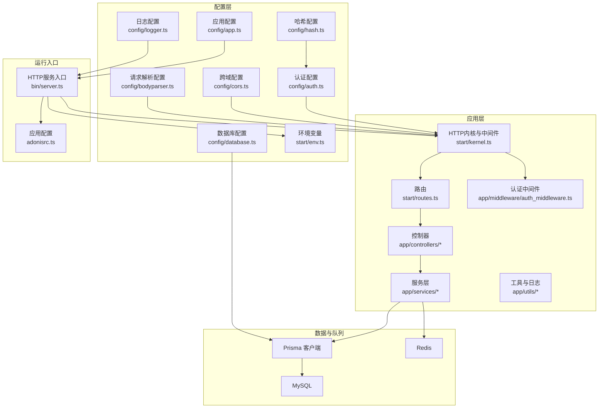
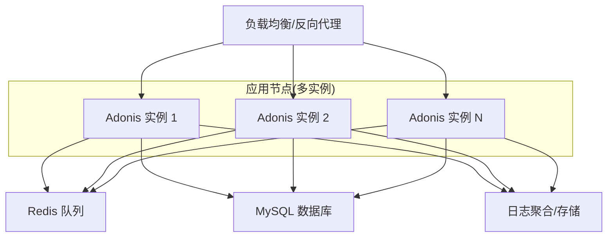
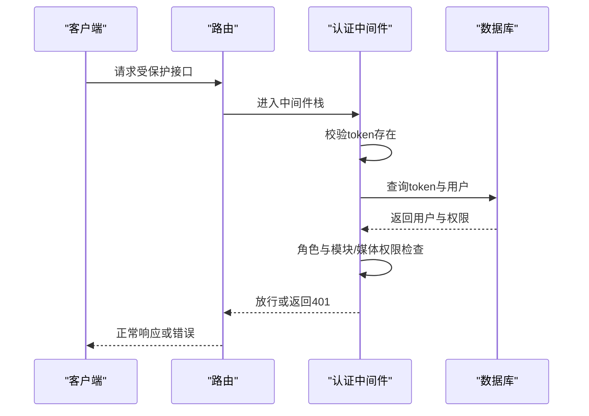
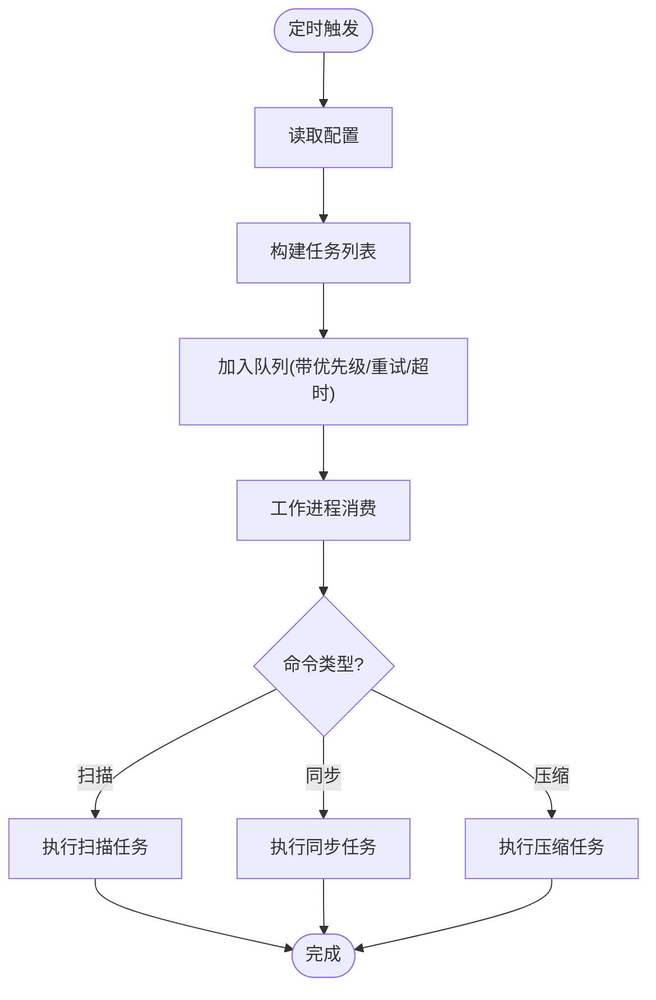
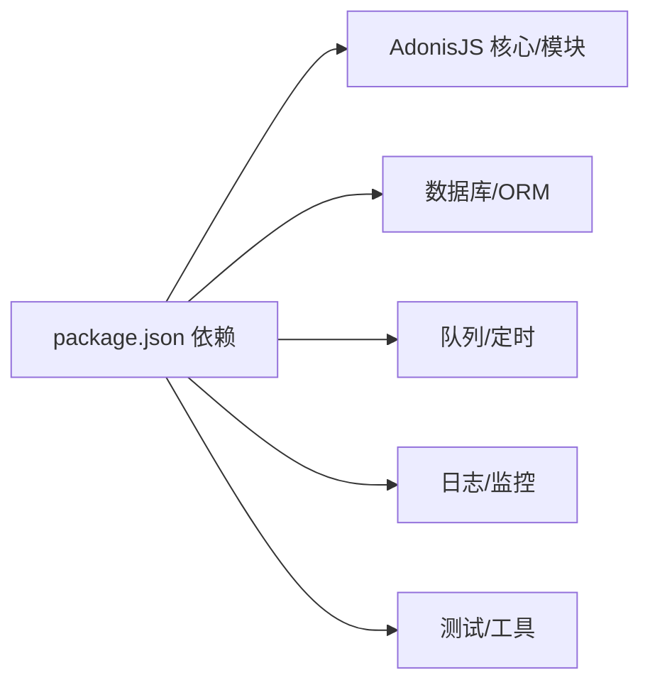

# 部署与运维

<cite>
**本文引用的文件**
- [package.json](file://package.json)
- [adonisrc.ts](file://adonisrc.ts)
- [config/app.ts](file://config/app.ts)
- [config/auth.ts](file://config/auth.ts)
- [config/bodyparser.ts](file://config/bodyparser.ts)
- [config/cors.ts](file://config/cors.ts)
- [config/database.ts](file://config/database.ts)
- [config/hash.ts](file://config/hash.ts)
- [config/logger.ts](file://config/logger.ts)
- [bin/server.ts](file://bin/server.ts)
- [start/env.ts](file://start/env.ts)
- [start/kernel.ts](file://start/kernel.ts)
- [start/routes.ts](file://start/routes.ts)
- [app/middleware/auth_middleware.ts](file://app/middleware/auth_middleware.ts)
- [app/services/queue_service.ts](file://app/services/queue_service.ts)
- [app/services/cron_service.ts](file://app/services/cron_service.ts)
- [app/utils/log.ts](file://app/utils/log.ts)
- [data-example/config/smanga.json](file://data-example/config/smanga.json)
</cite>

## 目录
1. [简介](#简介)
2. [项目结构](#项目结构)
3. [核心组件](#核心组件)
4. [架构总览](#架构总览)
5. [详细组件分析](#详细组件分析)
6. [依赖关系分析](#依赖关系分析)
7. [性能考虑](#性能考虑)
8. [故障排查指南](#故障排查指南)
9. [结论](#结论)
10. [附录](#附录)

## 简介
本文件面向生产环境的 SManga Adonis 服务部署与运维，覆盖服务器准备、依赖安装、配置设置、Docker 部署与容器编排、集群配置、监控与日志、性能优化、备份与灾备、高可用、安全加固、负载均衡与缓存、数据库优化、运维自动化与 CI/CD、以及版本升级等全链路内容。文档以仓库现有代码与配置为依据，结合实际可落地的工程实践，帮助团队快速搭建稳定可靠的线上系统。

## 项目结构
SManga Adonis 是基于 AdonisJS 的后端应用，采用模块化分层组织：控制器、中间件、模型、服务、工具与配置。路由集中定义于路由文件，HTTP 内核与中间件栈在内核文件中注册；数据库通过 Lucid/Prisma 访问；队列使用 Bull + Redis；定时任务由 node-cron 驱动；日志通过内置 Logger 组件输出到文件或控制台。

图表来源
- [bin/server.ts:1-46](file://bin/server.ts#L1-L46)
- [adonisrc.ts:1-72](file://adonisrc.ts#L1-L72)
- [start/kernel.ts:1-69](file://start/kernel.ts#L1-L69)
- [start/routes.ts:1-241](file://start/routes.ts#L1-L241)
- [config/app.ts:1-41](file://config/app.ts#L1-L41)
- [config/auth.ts:1-28](file://config/auth.ts#L1-L28)
- [config/database.ts:1-24](file://config/database.ts#L1-L24)
- [config/logger.ts:1-36](file://config/logger.ts#L1-L36)
- [config/cors.ts:1-20](file://config/cors.ts#L1-L20)
- [config/bodyparser.ts:1-56](file://config/bodyparser.ts#L1-L56)
- [config/hash.ts:1-25](file://config/hash.ts#L1-L25)
- [start/env.ts:1-39](file://start/env.ts#L1-L39)

章节来源
- [bin/server.ts:1-46](file://bin/server.ts#L1-L46)
- [adonisrc.ts:1-72](file://adonisrc.ts#L1-L72)
- [start/kernel.ts:1-69](file://start/kernel.ts#L1-L69)
- [start/routes.ts:1-241](file://start/routes.ts#L1-L241)
- [config/app.ts:1-41](file://config/app.ts#L1-L41)
- [config/auth.ts:1-28](file://config/auth.ts#L1-L28)
- [config/database.ts:1-24](file://config/database.ts#L1-L24)
- [config/logger.ts:1-36](file://config/logger.ts#L1-L36)
- [config/cors.ts:1-20](file://config/cors.ts#L1-L20)
- [config/bodyparser.ts:1-56](file://config/bodyparser.ts#L1-L56)
- [config/hash.ts:1-25](file://config/hash.ts#L1-L25)
- [start/env.ts:1-39](file://start/env.ts#L1-L39)

## 核心组件
- 应用入口与生命周期
  - 入口文件负责初始化应用、监听信号并启动 HTTP 服务器。
  - 参考路径：[bin/server.ts:1-46](file://bin/server.ts#L1-L46)
- 配置体系
  - 应用密钥、Cookie、请求 ID、同站策略等在应用配置中定义。
  - 认证使用令牌守卫，支持按用户模型提供令牌。
  - 数据库连接通过环境变量注入，支持多连接配置。
  - 日志默认按环境输出至控制台或文件。
  - 跨域、请求体解析、哈希算法等均有独立配置。
  - 参考路径：
    - [config/app.ts:1-41](file://config/app.ts#L1-L41)
    - [config/auth.ts:1-28](file://config/auth.ts#L1-L28)
    - [config/database.ts:1-24](file://config/database.ts#L1-L24)
    - [config/logger.ts:1-36](file://config/logger.ts#L1-L36)
    - [config/cors.ts:1-20](file://config/cors.ts#L1-L20)
    - [config/bodyparser.ts:1-56](file://config/bodyparser.ts#L1-L56)
    - [config/hash.ts:1-25](file://config/hash.ts#L1-L25)
- 运行时内核与中间件
  - 内核注册全局与路由中间件栈，错误处理、CORS、BodyParser、鉴权、参数中间件等。
  - 参考路径：[start/kernel.ts:1-69](file://start/kernel.ts#L1-L69)
- 路由与控制器
  - 路由集中定义，覆盖收藏、书签、压缩、历史、媒体库、路径、标签、漫画、章节、用户、图表、搜索、分享、同步、配置、资源文件等。
  - 参考路径：[start/routes.ts:1-241](file://start/routes.ts#L1-L241)
- 认证中间件
  - 基于请求头 token 校验，支持管理员权限校验与模块/媒体权限限制。
  - 参考路径：[app/middleware/auth_middleware.ts:1-87](file://app/middleware/auth_middleware.ts#L1-L87)
- 任务调度与队列
  - 使用 Bull + Redis 实现扫描、同步、压缩等后台任务；node-cron 驱动周期性任务。
  - 参考路径：
    - [app/services/queue_service.ts:1-267](file://app/services/queue_service.ts#L1-L267)
    - [app/services/cron_service.ts:1-144](file://app/services/cron_service.ts#L1-L144)
- 日志与监控
  - 内置 Logger 输出到文件或控制台；业务侧日志写入数据库。
  - 参考路径：
    - [config/logger.ts:1-36](file://config/logger.ts#L1-L36)
    - [app/utils/log.ts:1-74](file://app/utils/log.ts#L1-L74)
- 环境变量
  - 包含运行模式、端口、主机、应用密钥、日志级别及数据库连接参数。
  - 参考路径：[start/env.ts:1-39](file://start/env.ts#L1-L39)

章节来源
- [bin/server.ts:1-46](file://bin/server.ts#L1-L46)
- [config/app.ts:1-41](file://config/app.ts#L1-L41)
- [config/auth.ts:1-28](file://config/auth.ts#L1-L28)
- [config/database.ts:1-24](file://config/database.ts#L1-L24)
- [config/logger.ts:1-36](file://config/logger.ts#L1-L36)
- [config/cors.ts:1-20](file://config/cors.ts#L1-L20)
- [config/bodyparser.ts:1-56](file://config/bodyparser.ts#L1-L56)
- [config/hash.ts:1-25](file://config/hash.ts#L1-L25)
- [start/kernel.ts:1-69](file://start/kernel.ts#L1-L69)
- [start/routes.ts:1-241](file://start/routes.ts#L1-L241)
- [app/middleware/auth_middleware.ts:1-87](file://app/middleware/auth_middleware.ts#L1-L87)
- [app/services/queue_service.ts:1-267](file://app/services/queue_service.ts#L1-L267)
- [app/services/cron_service.ts:1-144](file://app/services/cron_service.ts#L1-L144)
- [app/utils/log.ts:1-74](file://app/utils/log.ts#L1-L74)
- [start/env.ts:1-39](file://start/env.ts#L1-L39)

## 架构总览
下图展示生产环境典型拓扑：反向代理/负载均衡前置，后端多实例运行 Adonis 应用，共享 Redis 队列与 MySQL 数据库，日志统一采集与归档。

## 详细组件分析

### 认证与访问控制
- 令牌认证
  - 使用 API 守卫与访问令牌提供程序，令牌来自数据库表，绑定用户模型。
  - 参考路径：[config/auth.ts:1-28](file://config/auth.ts#L1-L28)
- 中间件鉴权
  - 从请求头读取 token，查询数据库校验有效性；对特定路由放行（如部署、测试、登录、文件、分析）。
  - 管理员角色限制用户管理类接口；DELETE 方法需管理员；支持按用户授予的媒体与模块权限进行细粒度控制。
  - 参考路径：[app/middleware/auth_middleware.ts:1-87](file://app/middleware/auth_middleware.ts#L1-L87)

图表来源
- [app/middleware/auth_middleware.ts:23-84](file://app/middleware/auth_middleware.ts#L23-L84)
- [config/auth.ts:7-14](file://config/auth.ts#L7-L14)

章节来源
- [config/auth.ts:1-28](file://config/auth.ts#L1-L28)
- [app/middleware/auth_middleware.ts:1-87](file://app/middleware/auth_middleware.ts#L1-L87)

### 任务队列与定时任务
- 队列实现
  - 使用 Bull 连接本地 Redis，按任务类型分发到不同处理器（扫描、同步、压缩），支持并发、重试、超时与指数退避。
  - 参考路径：[app/services/queue_service.ts:1-267](file://app/services/queue_service.ts#L1-L267)
- 定时任务
  - 使用 node-cron 按配置调度扫描、媒体封面生成、压缩缓存清理与同步任务。
  - 参考路径：[app/services/cron_service.ts:1-144](file://app/services/cron_service.ts#L1-L144)

图表来源
- [app/services/cron_service.ts:26-84](file://app/services/cron_service.ts#L26-L84)
- [app/services/queue_service.ts:103-141](file://app/services/queue_service.ts#L103-L141)

章节来源
- [app/services/queue_service.ts:1-267](file://app/services/queue_service.ts#L1-L267)
- [app/services/cron_service.ts:1-144](file://app/services/cron_service.ts#L1-L144)

### 日志与监控
- 应用日志
  - 生产环境输出到文件，开发环境输出到控制台；日志级别通过环境变量配置。
  - 参考路径：[config/logger.ts:1-36](file://config/logger.ts#L1-L36)
- 业务日志
  - 漫画扫描、媒体封面生成、错误等业务日志写入数据库，便于审计与问题定位。
  - 参考路径：[app/utils/log.ts:1-74](file://app/utils/log.ts#L1-L74)

章节来源
- [config/logger.ts:1-36](file://config/logger.ts#L1-L36)
- [app/utils/log.ts:1-74](file://app/utils/log.ts#L1-L74)

### 数据库与迁移
- 连接配置
  - 通过环境变量注入主机、端口、用户名、密码与数据库名；Lucid 管理迁移路径。
  - 参考路径：[config/database.ts:1-24](file://config/database.ts#L1-L24)
- 迁移文件
  - 提供 SQLite、MySQL、PostgreSQL 三套迁移脚本，覆盖初始结构与后续增量变更。
  - 参考路径：[prisma/sqlite/migrations](file://prisma/sqlite/migrations)、[prisma/mysql/migrations](file://prisma/mysql/migrations)、[prisma/pgsql/migrations](file://prisma/pgsql/migrations)

章节来源
- [config/database.ts:1-24](file://config/database.ts#L1-L24)

### 配置文件与示例
- 服务端配置示例
  - 包含 SQL 客户端、ImageMagick 参数、扫描/同步/压缩/队列/调试等配置项。
  - 参考路径：[data-example/config/smanga.json:1-54](file://data-example/config/smanga.json#L1-L54)

章节来源
- [data-example/config/smanga.json:1-54](file://data-example/config/smanga.json#L1-L54)

## 依赖关系分析
- 运行时依赖
  - AdonisJS 核心、CORS、Lucid、Auth、Prisma 客户端、Bull/Redis、node-cron、Sharp、Unzipper、UUID、XML 解析等。
  - 参考路径：[package.json:62-88](file://package.json#L62-L88)
- 构建与开发依赖
  - Assembler、ESLint、Prettier、Prisma、TypeScript、Japa 测试框架等。
  - 参考路径：[package.json:37-88](file://package.json#L37-L88)
- 应用装配
  - 服务提供者、命令、预加载模块、测试套件在应用配置中声明。
  - 参考路径：[adonisrc.ts:1-72](file://adonisrc.ts#L1-L72)

图表来源
- [package.json:62-88](file://package.json#L62-L88)
- [adonisrc.ts:24-35](file://adonisrc.ts#L24-L35)

章节来源
- [package.json:1-100](file://package.json#L1-L100)
- [adonisrc.ts:1-72](file://adonisrc.ts#L1-L72)

## 性能考虑
- 队列与并发
  - 通过队列分发 CPU 密集型任务（扫描、压缩、同步），合理设置并发与超时，避免阻塞请求线程。
  - 参考路径：[app/services/queue_service.ts:175-264](file://app/services/queue_service.ts#L175-L264)
- 定时任务节流
  - 对同一路径/媒体的任务进行去重判断，避免重复执行。
  - 参考路径：
    - [app/services/queue_service.ts:143-165](file://app/services/queue_service.ts#L143-L165)
    - [app/services/cron_service.ts:26-43](file://app/services/cron_service.ts#L26-L43)
- 图像处理与内存
  - ImageMagick 内存/密度/质量参数可在服务端配置中调整，平衡质量与资源占用。
  - 参考路径：[data-example/config/smanga.json:12-17](file://data-example/config/smanga.json#L12-L17)
- 数据库连接与索引
  - 使用连接池与合适的索引，避免热点查询导致锁等待；定期分析慢查询。
  - 参考路径：[config/database.ts:1-24](file://config/database.ts#L1-L24)
- 缓存策略
  - 对高频读取的元数据与封面生成结果进行缓存，降低数据库压力。
  - 参考路径：[app/services/cron_service.ts:91-118](file://app/services/cron_service.ts#L91-L118)

## 故障排查指南
- 启动失败
  - 检查应用密钥、端口占用、进程信号处理与依赖安装。
  - 参考路径：[bin/server.ts:32-45](file://bin/server.ts#L32-L45)
- 认证失败
  - 核对请求头 token 是否存在、是否在数据库中有效、用户角色与权限范围。
  - 参考路径：[app/middleware/auth_middleware.ts:32-58](file://app/middleware/auth_middleware.ts#L32-L58)
- 队列堆积
  - 查看 Redis 队列长度、工作进程状态与任务耗时，调整并发与超时。
  - 参考路径：[app/services/queue_service.ts:34-47](file://app/services/queue_service.ts#L34-L47)
- 日志定位
  - 生产日志落盘，业务日志写入数据库，结合错误日志与扫描日志快速定位问题。
  - 参考路径：
    - [config/logger.ts:18-22](file://config/logger.ts#L18-L22)
    - [app/utils/log.ts:60-72](file://app/utils/log.ts#L60-L72)

章节来源
- [bin/server.ts:1-46](file://bin/server.ts#L1-L46)
- [app/middleware/auth_middleware.ts:1-87](file://app/middleware/auth_middleware.ts#L1-L87)
- [app/services/queue_service.ts:1-267](file://app/services/queue_service.ts#L1-L267)
- [config/logger.ts:1-36](file://config/logger.ts#L1-L36)
- [app/utils/log.ts:1-74](file://app/utils/log.ts#L1-L74)

## 结论
本文基于仓库现有代码与配置，给出了 SManga Adonis 在生产环境的部署与运维全景：从服务器准备、依赖安装、配置设置，到 Docker 与集群、监控与日志、性能优化、备份与灾备、高可用、安全加固、负载均衡与缓存、数据库优化、运维自动化与 CI/CD、版本升级等。建议在上线前完成安全基线检查、压测验证与演练，并建立完善的变更与回滚机制。

## 附录

### A. 生产环境部署清单
- 服务器准备
  - 操作系统：Linux（推荐 Ubuntu/CentOS）
  - 软件：Node.js、MySQL、Redis、Nginx/HAProxy、PM2（可选）
- 依赖安装
  - 安装 Node.js 与包管理器，执行依赖安装与构建。
  - 参考路径：[package.json:7-14](file://package.json#L7-L14)
- 配置设置
  - 设置环境变量（NODE_ENV、PORT、HOST、APP_KEY、LOG_LEVEL、DB_*）。
  - 参考路径：[start/env.ts:21-38](file://start/env.ts#L21-L38)
- 数据库初始化
  - 选择目标数据库（SQLite/MySQL/PostgreSQL），执行迁移。
  - 参考路径：[config/database.ts:1-24](file://config/database.ts#L1-L24)
- 启动与守护
  - 使用 PM2 或 systemd 管理进程，配置健康检查与自动重启。
  - 参考路径：[bin/server.ts:37-39](file://bin/server.ts#L37-L39)

章节来源
- [package.json:1-100](file://package.json#L1-L100)
- [start/env.ts:1-39](file://start/env.ts#L1-L39)
- [config/database.ts:1-24](file://config/database.ts#L1-L24)
- [bin/server.ts:1-46](file://bin/server.ts#L1-L46)

### B. Docker 与容器编排
- 建议镜像
  - 基于官方 Node.js 镜像，安装系统依赖（解压/归档工具）、拷贝构建产物、暴露端口、设置非 root 用户。
- 容器编排
  - 使用 Docker Compose 或 Kubernetes，分离应用、Redis、MySQL，配置持久卷与健康检查。
- 网络与安全
  - 仅开放必要端口，启用网络隔离与只读根文件系统，挂载最小权限凭据。

[本节为通用实践建议，不直接对应具体源码文件]

### C. 监控指标与日志管理
- 指标
  - 应用：QPS、响应时间、错误率、队列长度、Redis 连接数、数据库连接数。
  - 系统：CPU、内存、磁盘 IO、网络。
- 日志
  - 应用日志落盘与轮转，业务日志入库；集中采集与可视化（ELK/Fluentd/Promtail）。
- 报警
  - 基于阈值与趋势异常设置告警，联动值班与自动恢复。

[本节为通用实践建议，不直接对应具体源码文件]

### D. 备份与灾备
- 数据备份
  - MySQL/SQLite/PostgreSQL 定时快照与增量备份；校验完整性与恢复演练。
- 配置备份
  - 服务端配置文件与环境变量清单纳入版本管理与密钥管理。
- 灾难恢复
  - 多可用区部署、自动故障转移、RPO/RTO 指标明确。

[本节为通用实践建议，不直接对应具体源码文件]

### E. 高可用与负载均衡
- 负载均衡
  - Nginx/HAProxy/云负载均衡，开启会话亲和或无状态设计。
- 健康检查
  - TCP/HTTP 探针，失败自动摘除与重试。
- 自动扩缩容
  - 基于 CPU/内存/队列长度触发扩缩容。

[本节为通用实践建议，不直接对应具体源码文件]

### F. 安全加固与访问控制
- 网络
  - 防火墙仅放开端口，内网隔离，TLS 终止于反向代理。
- 应用
  - 强密码策略、令牌有效期、最小权限原则、输入校验与防注入。
- 认证
  - 强制令牌认证、管理员权限分级、模块/媒体授权矩阵。
- 参考路径：
  - [config/cors.ts:9-17](file://config/cors.ts#L9-L17)
  - [config/hash.ts:7-12](file://config/hash.ts#L7-L12)
  - [app/middleware/auth_middleware.ts:63-76](file://app/middleware/auth_middleware.ts#L63-L76)

章节来源
- [config/cors.ts:1-20](file://config/cors.ts#L1-L20)
- [config/hash.ts:1-25](file://config/hash.ts#L1-L25)
- [app/middleware/auth_middleware.ts:1-87](file://app/middleware/auth_middleware.ts#L1-L87)

### G. 负载均衡、缓存与数据库优化
- 负载均衡
  - 会话无状态化，静态资源走 CDN。
- 缓存
  - Redis 缓存热点数据与计算结果，设置合理过期策略。
- 数据库
  - 连接池、索引优化、慢查询分析、读写分离与分库分表。

[本节为通用实践建议，不直接对应具体源码文件]

### H. 运维自动化与 CI/CD
- 构建
  - 固定 Node 版本，缓存依赖，构建产物最小化。
- 测试
  - 单元测试与集成测试，覆盖率门槛。
- 部署
  - 蓝绿/金丝雀发布，回滚策略，灰度流量。
- 参考路径：[package.json:7-14](file://package.json#L7-L14)

章节来源
- [package.json:1-100](file://package.json#L1-L100)

### I. 版本升级指南
- 准备
  - 备份数据库与配置，停止服务，拉取新版本。
- 升级
  - 更新依赖，执行迁移，重启服务，验证接口与队列。
- 回滚
  - 快速回滚到上一版本，恢复备份。
- 参考路径：
  - [package.json:7-14](file://package.json#L7-L14)
  - [config/database.ts:16-19](file://config/database.ts#L16-L19)

章节来源
- [package.json:1-100](file://package.json#L1-L100)
- [config/database.ts:1-24](file://config/database.ts#L1-L24)