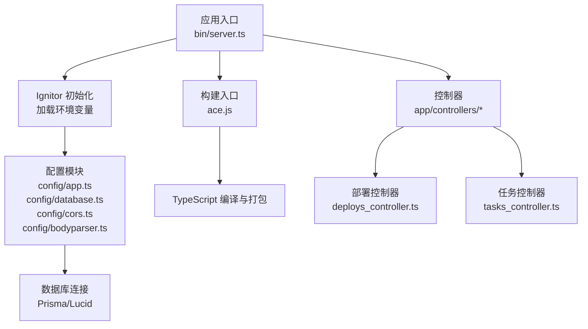
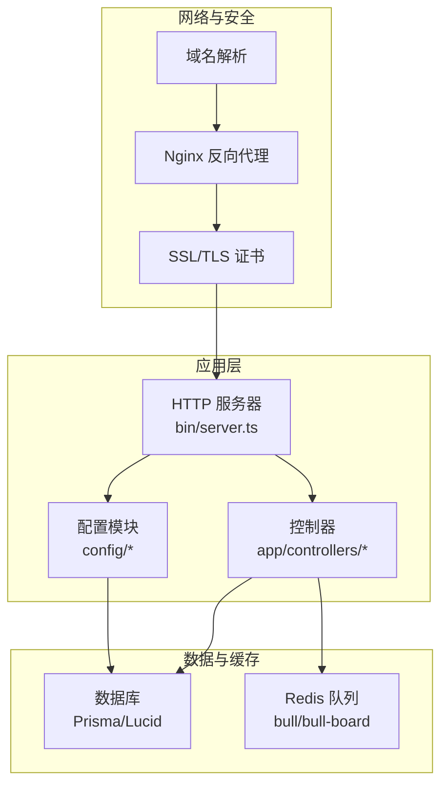
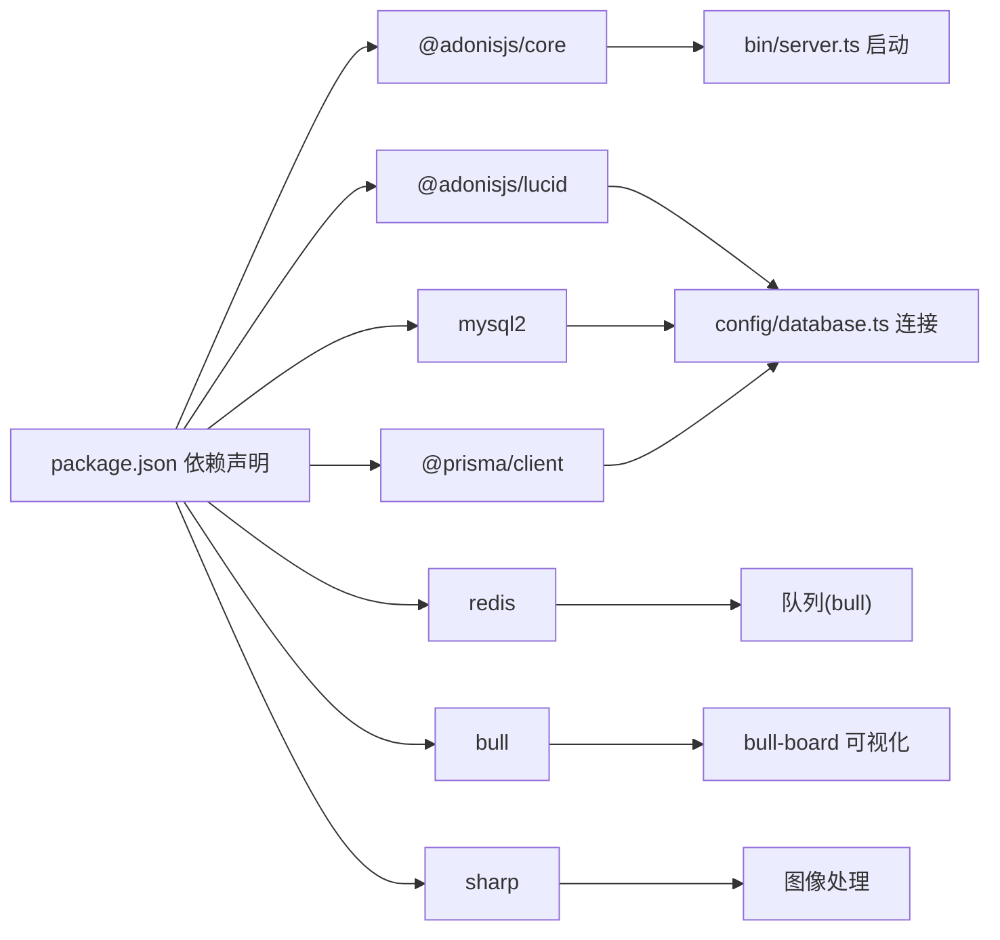

# 部署指南

<cite>
**本文引用的文件**
- [package.json](file://package.json)
- [adonisrc.ts](file://adonisrc.ts)
- [bin/server.ts](file://bin/server.ts)
- [start/env.ts](file://start/env.ts)
- [config/app.ts](file://config/app.ts)
- [config/database.ts](file://config/database.ts)
- [config/bodyparser.ts](file://config/bodyparser.ts)
- [config/cors.ts](file://config/cors.ts)
- [ace.js](file://ace.js)
- [data-example/config/smanga.json](file://data-example/config/smanga.json)
- [app/controllers/deploys_controller.ts](file://app/controllers/deploys_controller.ts)
- [app/controllers/tasks_controller.ts](file://app/controllers/tasks_controller.ts)
</cite>

## 目录
1. [简介](#简介)
2. [项目结构](#项目结构)
3. [核心组件](#核心组件)
4. [架构总览](#架构总览)
5. [详细组件分析](#详细组件分析)
6. [依赖分析](#依赖分析)
7. [性能考虑](#性能考虑)
8. [故障排查指南](#故障排查指南)
9. [结论](#结论)
10. [附录](#附录)

## 简介
本指南面向生产环境部署 SManga Adonis（基于 AdonisJS 6 的漫画管理系统），覆盖从服务器环境准备、Node.js 版本与依赖安装、构建与运行，到多种部署方式（传统部署、Docker 容器化部署、PM2 进程管理）的完整流程。同时提供环境变量配置、数据库连接、队列与 Redis 使用、文件存储、Nginx 反向代理与 SSL、域名绑定、部署前检查清单、常见问题排查、回滚策略、版本升级与零停机部署建议。

## 项目结构
- 应用入口与启动
  - 启动脚本通过 Ignitor 初始化应用，加载环境变量与 HTTP 服务器。
  - 构建产物由 Ace 脚本驱动，使用 TypeScript 编译与打包。
- 配置层
  - 应用密钥、HTTP Cookie、CORS、BodyParser、数据库连接等均在配置文件中定义，并通过环境变量注入。
- 控制器与服务
  - 部署控制器提供数据库连接检测与迁移执行能力；任务控制器用于查看与管理队列作业。
- 示例配置
  - 提供了 smanga.json 示例，包含 SQL 客户端、扫描与压缩参数、队列并发与超时等。

**图表来源**
- [bin/server.ts:1-46](file://bin/server.ts#L1-L46)
- [ace.js:1-29](file://ace.js#L1-L29)
- [config/app.ts:1-41](file://config/app.ts#L1-L41)
- [config/database.ts:1-24](file://config/database.ts#L1-L24)
- [config/cors.ts:1-20](file://config/cors.ts#L1-L20)
- [config/bodyparser.ts:1-56](file://config/bodyparser.ts#L1-L56)
- [app/controllers/deploys_controller.ts:1-36](file://app/controllers/deploys_controller.ts#L1-L36)
- [app/controllers/tasks_controller.ts:1-38](file://app/controllers/tasks_controller.ts#L1-L38)

**章节来源**
- [bin/server.ts:1-46](file://bin/server.ts#L1-L46)
- [ace.js:1-29](file://ace.js#L1-L29)
- [config/app.ts:1-41](file://config/app.ts#L1-L41)
- [config/database.ts:1-24](file://config/database.ts#L1-L24)
- [config/cors.ts:1-20](file://config/cors.ts#L1-L20)
- [config/bodyparser.ts:1-56](file://config/bodyparser.ts#L1-L56)

## 核心组件
- 应用启动与环境
  - 启动入口负责注册信号处理、加载环境变量与启动 HTTP 服务器。
  - 环境变量服务定义了运行模式、端口、主机、日志级别及数据库连接参数。
- 配置模块
  - 应用密钥用于加密 Cookie、签名 URL 等；HTTP Cookie 在生产环境启用安全标志。
  - 数据库连接通过环境变量注入，支持 mysql2 客户端。
  - CORS 允许跨域请求，暴露必要方法与头信息。
  - BodyParser 对表单、JSON、multipart 请求进行解析，限制上传大小。
- 构建与脚本
  - 包含开发、构建、测试、类型检查等脚本；构建脚本调用 Ace 并忽略 TS 错误。
- 控制器
  - 部署控制器提供数据库连接检测与 Prisma 迁移执行（按客户端类型选择 schema）。
  - 任务控制器用于查询与删除队列作业，便于运维排障。

**章节来源**
- [bin/server.ts:1-46](file://bin/server.ts#L1-L46)
- [start/env.ts:1-39](file://start/env.ts#L1-L39)
- [config/app.ts:1-41](file://config/app.ts#L1-L41)
- [config/database.ts:1-24](file://config/database.ts#L1-L24)
- [config/cors.ts:1-20](file://config/cors.ts#L1-L20)
- [config/bodyparser.ts:1-56](file://config/bodyparser.ts#L1-L56)
- [package.json:1-100](file://package.json#L1-L100)
- [app/controllers/deploys_controller.ts:1-36](file://app/controllers/deploys_controller.ts#L1-L36)
- [app/controllers/tasks_controller.ts:1-38](file://app/controllers/tasks_controller.ts#L1-L38)

## 架构总览
下图展示了生产部署的关键路径：应用启动、环境变量加载、数据库连接、队列与 Redis、Nginx 反向代理与 SSL 终止、域名解析。

**图表来源**
- [bin/server.ts:1-46](file://bin/server.ts#L1-L46)
- [config/app.ts:1-41](file://config/app.ts#L1-L41)
- [config/database.ts:1-24](file://config/database.ts#L1-L24)
- [app/controllers/deploys_controller.ts:1-36](file://app/controllers/deploys_controller.ts#L1-L36)
- [app/controllers/tasks_controller.ts:1-38](file://app/controllers/tasks_controller.ts#L1-L38)

## 详细组件分析

### 传统部署（裸机/虚拟机）
- 服务器环境准备
  - 操作系统：推荐 Linux（如 Ubuntu/CentOS）。
  - Node.js：根据项目依赖与运行时需求，确保 Node.js 版本满足各包的最低要求（参考依赖声明与构建脚本）。
  - 数据库：MySQL 或 SQLite（示例配置默认 sqlite，生产建议 MySQL/PostgreSQL）。
  - Redis：用于队列与缓存（bull 依赖 redis）。
  - 文件存储：用于漫画封面、压缩后的图片等静态资源。
- 依赖安装与构建
  - 安装依赖后执行构建脚本生成生产可执行文件。
  - 构建脚本通过 Ace 执行编译与打包。
- 运行与进程管理
  - 使用 PM2 或 systemd 管理进程，监听 SIGTERM/SIGINT 平滑退出。
  - 设置环境变量（NODE_ENV、PORT、HOST、APP_KEY、DB_* 等）。
- Nginx 反向代理与 SSL
  - 将域名解析至服务器 IP。
  - 配置 Nginx 反代到应用端口，开启 HTTPS 并部署证书。
- 部署后验证
  - 访问健康检查接口与后台管理界面，确认数据库连接与队列状态正常。

**章节来源**
- [package.json:1-100](file://package.json#L1-L100)
- [ace.js:1-29](file://ace.js#L1-L29)
- [bin/server.ts:1-46](file://bin/server.ts#L1-L46)
- [start/env.ts:1-39](file://start/env.ts#L1-L39)
- [config/database.ts:1-24](file://config/database.ts#L1-L24)

### Docker 容器化部署
- 容器镜像构建
  - 基于 Node.js 官方镜像，安装系统依赖（如解压工具、ImageMagick 等，依据压缩与图像处理需求）。
  - 复制项目源码，安装依赖并执行构建。
- 容器编排
  - 使用 docker-compose 编排应用、数据库与 Redis。
  - 映射应用端口与持久化目录（日志、媒体、封面等）。
- 环境变量与挂载
  - 通过环境变量注入 DB_*、APP_KEY、HOST、PORT 等。
  - 将外部配置文件（如 smanga.json）挂载到容器内对应路径。
- Nginx 与 SSL
  - 单独部署 Nginx 容器或使用反向代理服务，终止 TLS 并转发到应用容器。
- 验证与监控
  - 容器健康检查、日志采集与告警。

**章节来源**
- [package.json:1-100](file://package.json#L1-L100)
- [data-example/config/smanga.json:1-54](file://data-example/config/smanga.json#L1-L54)

### PM2 进程管理部署
- 启动与守护
  - 使用 PM2 启动应用，自动监听 SIGTERM/SIGINT 平滑退出。
  - 设置工作目录、环境变量与日志输出路径。
- 配置热更新与滚动重启
  - 利用 PM2 的零停机更新能力，在新版本就绪后切换流量。
- 监控与告警
  - 结合 Bull Board 查看队列状态与作业历史。

**章节来源**
- [bin/server.ts:1-46](file://bin/server.ts#L1-L46)
- [app/controllers/tasks_controller.ts:1-38](file://app/controllers/tasks_controller.ts#L1-L38)

### 环境变量与配置
- 必填项
  - 运行模式：NODE_ENV（development/production/test）
  - 应用密钥：APP_KEY（用于 Cookie 加密与签名）
  - 主机与端口：HOST、PORT
  - 日志级别：LOG_LEVEL
  - 数据库：DB_HOST、DB_PORT、DB_USER、DB_PASSWORD、DB_DATABASE
- 可选项
  - CORS、Cookie 安全标志、BodyParser 限制等可在配置文件中调整。
- 示例配置
  - smanga.json 中包含 SQL 客户端、扫描与压缩参数、队列并发与超时等，可用于初始化与运维调优。

**章节来源**
- [start/env.ts:1-39](file://start/env.ts#L1-L39)
- [config/app.ts:1-41](file://config/app.ts#L1-L41)
- [config/database.ts:1-24](file://config/database.ts#L1-L24)
- [config/cors.ts:1-20](file://config/cors.ts#L1-L20)
- [config/bodyparser.ts:1-56](file://config/bodyparser.ts#L1-L56)
- [data-example/config/smanga.json:1-54](file://data-example/config/smanga.json#L1-L54)

### 数据库连接与迁移
- 连接配置
  - 通过环境变量注入数据库连接参数，支持 mysql2 客户端。
- 迁移与初始化
  - 部署控制器提供数据库连接检测与 Prisma 迁移执行逻辑（按客户端类型选择 schema 并执行 generate 与 migrate deploy）。
- 生产建议
  - 使用只读用户进行查询，写操作使用专用用户。
  - 开启备份与主从复制，确保高可用。

**章节来源**
- [config/database.ts:1-24](file://config/database.ts#L1-L24)
- [app/controllers/deploys_controller.ts:1-36](file://app/controllers/deploys_controller.ts#L1-L36)

### 队列与 Redis
- 队列实现
  - 使用 bull 作为队列，bull-board 提供可视化面板。
- Redis 配置
  - Redis 用于队列与缓存，需保证网络连通性与访问权限。
- 作业管理
  - 通过任务控制器查看与删除作业，便于排障与清理。

**章节来源**
- [package.json:1-100](file://package.json#L1-L100)
- [app/controllers/tasks_controller.ts:1-38](file://app/controllers/tasks_controller.ts#L1-L38)

### 文件存储配置
- 存储位置
  - 建议将封面、压缩后的图片、日志等放置在独立挂载盘或对象存储（如 S3）。
- 权限与容量
  - 确保应用账户对存储目录有读写权限，并预留足够空间。
- 访问控制
  - 对外访问的静态资源建议通过 CDN 或 Nginx 提供，避免直接暴露应用目录。

**章节来源**
- [data-example/config/smanga.json:1-54](file://data-example/config/smanga.json#L1-L54)

### Nginx 反向代理与 SSL
- 反向代理
  - 将域名解析到服务器 IP，配置 Nginx 将请求转发到应用端口。
- SSL 证书
  - 使用 Let’s Encrypt 或商业证书，启用 HTTPS 并配置强密码套件与安全头。
- 压缩与缓存
  - 启用 gzip/br 压缩与静态资源缓存，提升访问速度。

**章节来源**
- [config/cors.ts:1-20](file://config/cors.ts#L1-L20)
- [config/bodyparser.ts:1-56](file://config/bodyparser.ts#L1-L56)

## 依赖分析
- 运行时依赖
  - AdonisJS 核心、Lucid（ORM）、Redis 客户端、Bull 队列、Sharp 图像处理、mysql2 等。
- 构建与开发依赖
  - Assembler、ESLint、Prettier、Prisma、TypeScript 等。
- 关键耦合点
  - 应用启动依赖 Ignitor 与环境变量；数据库连接依赖 Prisma/Lucid；队列依赖 Redis。

**图表来源**
- [package.json:1-100](file://package.json#L1-L100)
- [bin/server.ts:1-46](file://bin/server.ts#L1-L46)
- [config/database.ts:1-24](file://config/database.ts#L1-L24)

**章节来源**
- [package.json:1-100](file://package.json#L1-L100)
- [bin/server.ts:1-46](file://bin/server.ts#L1-L46)
- [config/database.ts:1-24](file://config/database.ts#L1-L24)

## 性能考虑
- 图像处理
  - 使用 Sharp 进行高效缩放与格式转换；合理设置内存与密度参数以平衡质量与性能。
- 队列并发
  - 根据 CPU 与磁盘 IO 能力调整并发数与超时时间，避免过载。
- 数据库优化
  - 为常用查询建立索引，使用连接池与只读副本分担压力。
- 缓存与静态资源
  - 启用浏览器缓存与 CDN 加速，减少服务器负载。

[本节为通用指导，无需列出具体文件来源]

## 故障排查指南
- 启动失败
  - 检查环境变量是否正确设置；查看应用日志定位错误。
- 数据库连接异常
  - 核对 DB_HOST、DB_PORT、DB_USER、DB_PASSWORD、DB_DATABASE；确认网络连通与防火墙规则。
- 队列无响应
  - 检查 Redis 是否在线；通过 bull-board 查看作业状态与错误堆栈。
- 任务无法删除
  - 使用任务控制器接口查询并删除特定作业，或重试失败作业。
- CORS 与跨域问题
  - 核对 CORS 配置与前端请求头，确保允许的方法与凭据设置正确。

**章节来源**
- [start/env.ts:1-39](file://start/env.ts#L1-L39)
- [config/database.ts:1-24](file://config/database.ts#L1-L24)
- [config/cors.ts:1-20](file://config/cors.ts#L1-L20)
- [app/controllers/tasks_controller.ts:1-38](file://app/controllers/tasks_controller.ts#L1-L38)

## 结论
通过标准化的环境准备、严格的配置管理、合理的队列与缓存策略、完善的 Nginx 与 SSL 配置，以及 PM2 的进程管理与监控，SManga Adonis 可以在生产环境中稳定运行。建议结合本文提供的检查清单与排障步骤，制定自动化部署与回滚流程，确保变更可控与业务连续性。

[本节为总结性内容，无需列出具体文件来源]

## 附录

### 部署前检查清单
- 服务器与系统依赖已准备（操作系统、Node.js、数据库、Redis、图像处理工具）。
- 环境变量已配置并验证（NODE_ENV、PORT、HOST、APP_KEY、DB_*）。
- 数据库连接正常，Prisma 迁移完成。
- 队列与 Redis 正常运行，bull-board 可访问。
- Nginx 已配置反向代理与 SSL，域名解析生效。
- 文件存储目录权限正确且容量充足。
- PM2 或 systemd 已配置并启动应用，日志输出正常。

**章节来源**
- [start/env.ts:1-39](file://start/env.ts#L1-L39)
- [config/database.ts:1-24](file://config/database.ts#L1-L24)
- [package.json:1-100](file://package.json#L1-L100)
- [data-example/config/smanga.json:1-54](file://data-example/config/smanga.json#L1-L54)

### 回滚策略
- 保留上一版本构建产物与配置文件。
- 使用 PM2 或 systemd 切换到旧版本进程。
- 如需数据库回滚，先停止写入，再执行回滚迁移。
- 回滚后验证功能与性能指标，确认无异常后再释放新版本。

**章节来源**
- [bin/server.ts:1-46](file://bin/server.ts#L1-L46)
- [app/controllers/deploys_controller.ts:1-36](file://app/controllers/deploys_controller.ts#L1-L36)

### 版本升级与零停机部署
- 预备新版本
  - 在新分支上完成构建与集成测试，生成生产构建产物。
- 预热与验证
  - 在非高峰时段启动新版本，接入少量流量进行验证。
- 切换流量
  - 通过 Nginx 或负载均衡器逐步切换流量至新版本。
- 清理与监控
  - 观察日志与指标，确认稳定后关闭旧版本进程并清理资源。

**章节来源**
- [package.json:1-100](file://package.json#L1-L100)
- [bin/server.ts:1-46](file://bin/server.ts#L1-L46)