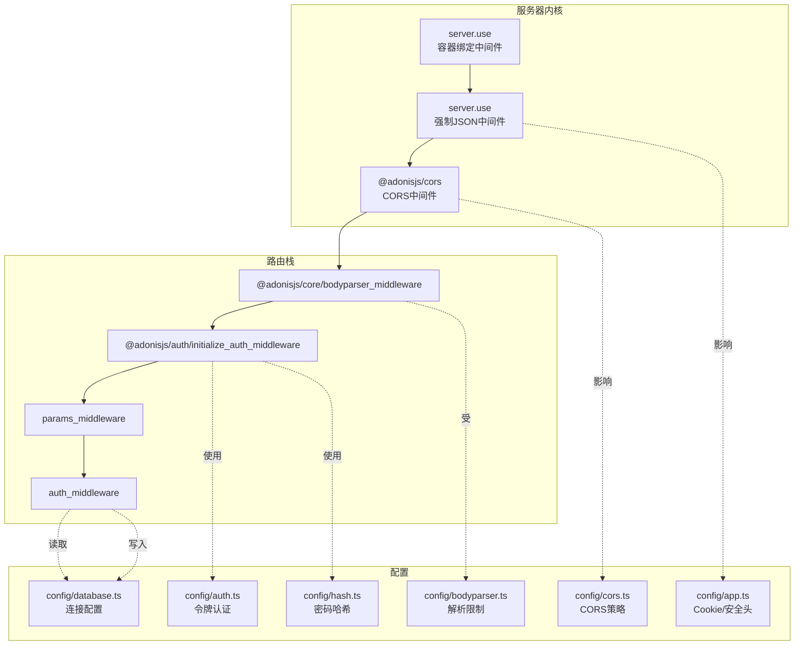
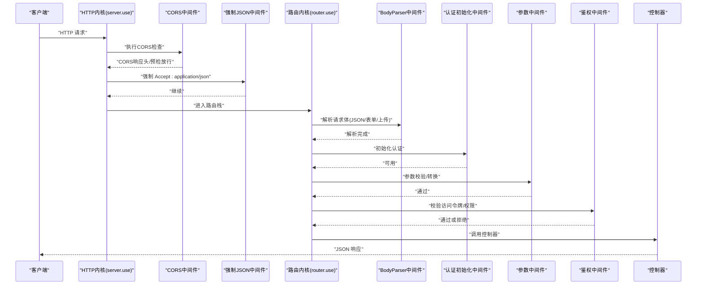
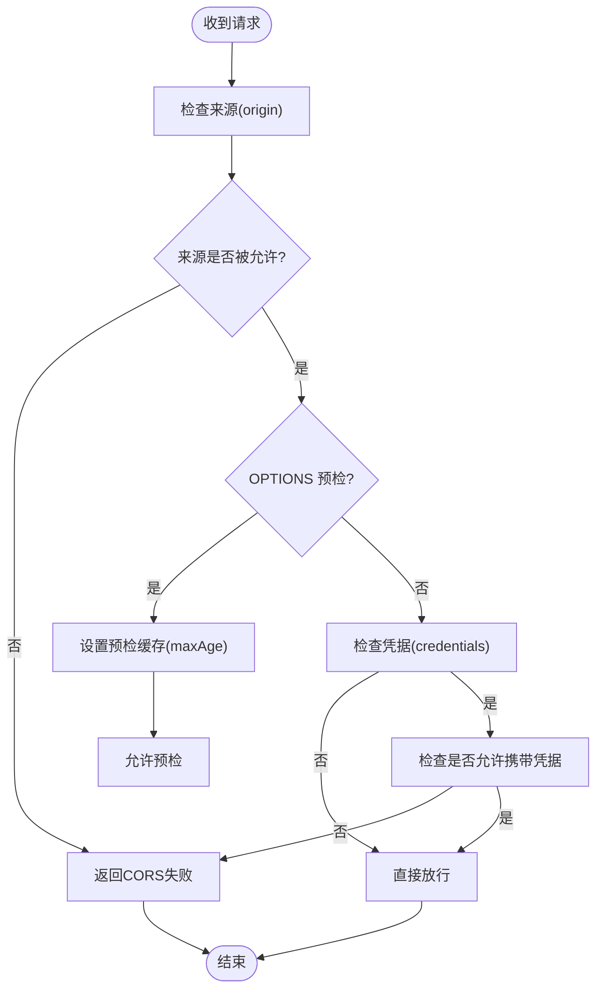
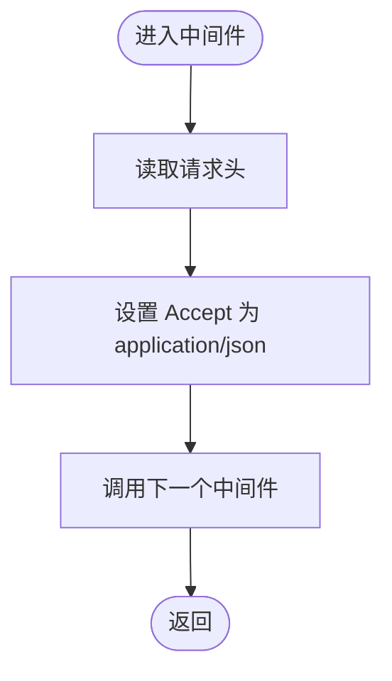
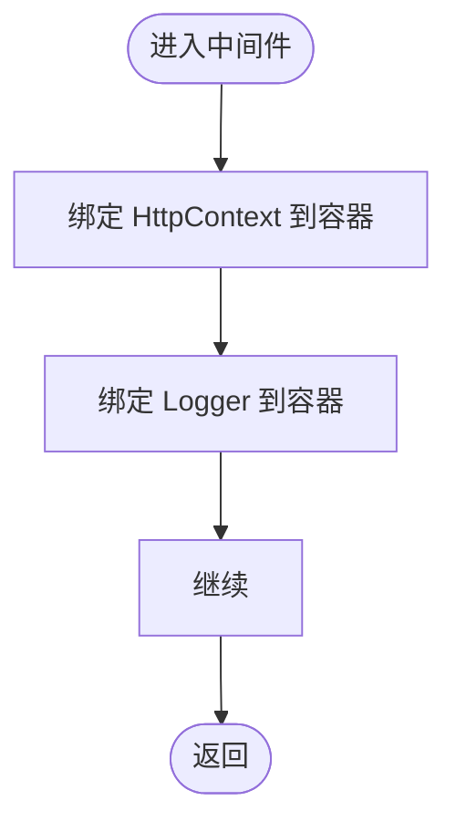
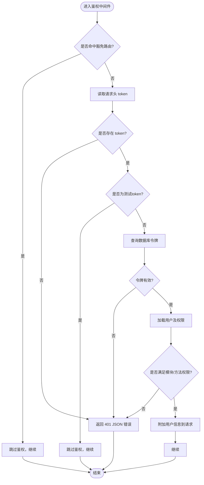
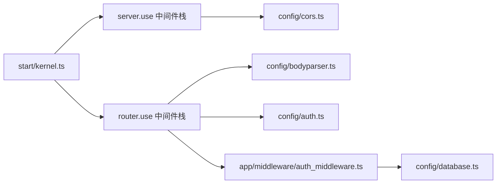

# 安全配置

<cite>
**本文引用的文件**
- [config/cors.ts](file://config/cors.ts)
- [app/middleware/force_json_response_middleware.ts](file://app/middleware/force_json_response_middleware.ts)
- [app/middleware/container_bindings_middleware.ts](file://app/middleware/container_bindings_middleware.ts)
- [start/kernel.ts](file://start/kernel.ts)
- [config/app.ts](file://config/app.ts)
- [config/auth.ts](file://config/auth.ts)
- [config/bodyparser.ts](file://config/bodyparser.ts)
- [config/hash.ts](file://config/hash.ts)
- [app/middleware/auth_middleware.ts](file://app/middleware/auth_middleware.ts)
- [start/routes.ts](file://start/routes.ts)
- [app/exceptions/handler.ts](file://app/exceptions/handler.ts)
- [config/database.ts](file://config/database.ts)
- [package.json](file://package.json)
</cite>

## 目录
1. [简介](#简介)
2. [项目结构与安全相关组件](#项目结构与安全相关组件)
3. [核心安全组件](#核心安全组件)
4. [架构总览](#架构总览)
5. [详细组件分析](#详细组件分析)
6. [依赖关系分析](#依赖关系分析)
7. [性能与安全权衡](#性能与安全权衡)
8. [故障排查指南](#故障排查指南)
9. [结论](#结论)
10. [附录：最佳实践与专项配置](#附录最佳实践与专项配置)

## 简介
本文件面向 SManga Adonis 的安全配置，聚焦以下方面：
- CORS 跨域策略、预检请求与凭据传递
- 强制 JSON 响应、容器绑定等安全中间件的作用与配置
- CSRF、XSS、SQL 注入等 Web 应用常见威胁的缓解思路与实现要点
- HTTPS、安全头、密码策略等基础安全最佳实践
- API 安全、文件上传安全、会话安全专项配置
- 安全审计、漏洞扫描与安全监控建议

## 项目结构与安全相关组件
SManga Adonis 的安全相关配置主要分布在如下位置：
- 中间件层：内核注册顺序、自定义中间件（强制 JSON、容器绑定、鉴权）
- 配置层：应用、认证、CORS、BodyParser、哈希、数据库
- 路由层：暴露的端点与访问控制
- 异常处理层：统一错误输出与上报

图表来源
- [start/kernel.ts:35-49](file://start/kernel.ts#L35-L49)
- [config/cors.ts:9-17](file://config/cors.ts#L9-L17)
- [config/app.ts:32-39](file://config/app.ts#L32-L39)
- [config/auth.ts:5-14](file://config/auth.ts#L5-L14)
- [config/bodyparser.ts:3-53](file://config/bodyparser.ts#L3-L53)
- [config/hash.ts:3-14](file://config/hash.ts#L3-L14)
- [config/database.ts:4-22](file://config/database.ts#L4-L22)

章节来源
- [start/kernel.ts:35-49](file://start/kernel.ts#L35-L49)
- [config/cors.ts:9-17](file://config/cors.ts#L9-L17)
- [config/app.ts:32-39](file://config/app.ts#L32-L39)
- [config/auth.ts:5-14](file://config/auth.ts#L5-L14)
- [config/bodyparser.ts:3-53](file://config/bodyparser.ts#L3-L53)
- [config/hash.ts:3-14](file://config/hash.ts#L3-L14)
- [config/database.ts:4-22](file://config/database.ts#L4-L22)

## 核心安全组件
- CORS 配置：启用跨域、允许的方法与头部、凭据支持、预检缓存时间
- 强制 JSON 响应：确保框架内部错误与验证错误以 JSON 返回，避免 HTML 报错泄露
- 容器绑定中间件：将 HttpContext 与 Logger 绑定到请求上下文，便于日志与上下文追踪
- 认证与授权：基于访问令牌的 API 认证，结合业务权限控制
- BodyParser 限制：对 JSON、表单、多部分上传的大小与类型进行约束
- 密码哈希：采用 scrypt 参数化哈希，提升抗暴力破解能力
- Cookie 安全：httpOnly、secure（生产环境）、sameSite、路径与有效期
- 数据库连接：通过环境变量隔离敏感凭据

章节来源
- [config/cors.ts:9-17](file://config/cors.ts#L9-L17)
- [app/middleware/force_json_response_middleware.ts:9-16](file://app/middleware/force_json_response_middleware.ts#L9-L16)
- [app/middleware/container_bindings_middleware.ts:12-19](file://app/middleware/container_bindings_middleware.ts#L12-L19)
- [config/auth.ts:5-14](file://config/auth.ts#L5-L14)
- [config/bodyparser.ts:3-53](file://config/bodyparser.ts#L3-L53)
- [config/hash.ts:3-14](file://config/hash.ts#L3-L14)
- [config/app.ts:32-39](file://config/app.ts#L32-L39)
- [config/database.ts:4-22](file://config/database.ts#L4-L22)

## 架构总览
下图展示请求从进入服务器到路由处理的完整链路，以及安全相关中间件与配置的交互。

图表来源
- [start/kernel.ts:35-49](file://start/kernel.ts#L35-L49)
- [config/bodyparser.ts:3-53](file://config/bodyparser.ts#L3-L53)
- [config/auth.ts:5-14](file://config/auth.ts#L5-L14)
- [app/middleware/auth_middleware.ts:23-84](file://app/middleware/auth_middleware.ts#L23-L84)
- [start/routes.ts:10-241](file://start/routes.ts#L10-L241)

## 详细组件分析

### CORS 跨域与预检请求
- 启用 CORS 并允许常用方法与自定义头部
- 允许携带凭据（cookies/授权头），需谨慎与具体前端域名配合
- 设置预检请求缓存时间，减少重复预检请求
- 建议：生产环境将 origin 显式限定为可信域名，避免通配符

图表来源
- [config/cors.ts:9-17](file://config/cors.ts#L9-L17)

章节来源
- [config/cors.ts:9-17](file://config/cors.ts#L9-L17)

### 强制 JSON 响应中间件
- 将请求的 Accept 头强制为 application/json
- 使框架内置的校验错误、认证错误等以 JSON 形式返回
- 有助于前后端一致处理错误，避免 HTML 错误页面泄露

图表来源
- [app/middleware/force_json_response_middleware.ts:9-16](file://app/middleware/force_json_response_middleware.ts#L9-L16)

章节来源
- [app/middleware/force_json_response_middleware.ts:9-16](file://app/middleware/force_json_response_middleware.ts#L9-L16)

### 容器绑定中间件
- 将 HttpContext 与 Logger 绑定到当前请求上下文
- 便于在中间件与控制器中通过依赖注入获取上下文与日志实例
- 提升可测试性与可观测性

图表来源
- [app/middleware/container_bindings_middleware.ts:12-19](file://app/middleware/container_bindings_middleware.ts#L12-L19)

章节来源
- [app/middleware/container_bindings_middleware.ts:12-19](file://app/middleware/container_bindings_middleware.ts#L12-L19)

### 认证与授权中间件
- 通过请求头 token 获取访问令牌
- 查询数据库校验令牌有效性
- 加载用户角色与权限，按模块与方法进行细粒度控制
- 对特定路由（如登录、部署、测试、文件）进行豁免
- 未授权时返回统一 JSON 错误

图表来源
- [app/middleware/auth_middleware.ts:23-84](file://app/middleware/auth_middleware.ts#L23-L84)

章节来源
- [app/middleware/auth_middleware.ts:23-84](file://app/middleware/auth_middleware.ts#L23-L84)

### BodyParser 与文件上传安全
- 仅对指定方法解析请求体
- JSON 类型扩展支持多种规范类型
- 表单与多部分上传开启空字符串转 null，限制上传大小，启用自动处理
- 建议：结合业务限制上传类型与大小，必要时增加白名单与二次校验

章节来源
- [config/bodyparser.ts:3-53](file://config/bodyparser.ts#L3-L53)

### 密码哈希策略
- 使用 scrypt，具备成本参数、块大小、并行度与内存上限
- 建议：根据硬件能力调整参数，兼顾安全与性能；迁移旧数据时保持向后兼容

章节来源
- [config/hash.ts:3-14](file://config/hash.ts#L3-L14)

### Cookie 与安全头
- Cookie 默认 httpOnly，生产环境启用 secure，sameSite 为 lax
- 路径与有效期合理设置，降低会话劫持风险
- 建议：结合 HTTPS 与 HSTS，强化传输层安全

章节来源
- [config/app.ts:32-39](file://config/app.ts#L32-L39)

### 数据库连接安全
- 通过环境变量注入主机、端口、用户名、密码与数据库名
- 建议：最小权限原则、网络隔离、TLS 连接、定期轮换凭据

章节来源
- [config/database.ts:4-22](file://config/database.ts#L4-L22)

### 异常处理与调试
- 生产环境关闭详细调试输出，避免敏感堆栈泄露
- 可扩展报告逻辑对接日志或监控系统

章节来源
- [app/exceptions/handler.ts:9-27](file://app/exceptions/handler.ts#L9-L27)

## 依赖关系分析
- 内核注册顺序决定中间件执行顺序与覆盖范围
- 路由中间件栈在匹配到具体路由后执行，适合做参数与鉴权
- CORS 在服务级生效，影响所有请求（含预检）

图表来源
- [start/kernel.ts:35-49](file://start/kernel.ts#L35-L49)
- [config/cors.ts:9-17](file://config/cors.ts#L9-L17)
- [config/bodyparser.ts:3-53](file://config/bodyparser.ts#L3-L53)
- [config/auth.ts:5-14](file://config/auth.ts#L5-L14)
- [app/middleware/auth_middleware.ts:23-84](file://app/middleware/auth_middleware.ts#L23-L84)
- [config/database.ts:4-22](file://config/database.ts#L4-L22)

章节来源
- [start/kernel.ts:35-49](file://start/kernel.ts#L35-L49)
- [config/cors.ts:9-17](file://config/cors.ts#L9-L17)
- [config/bodyparser.ts:3-53](file://config/bodyparser.ts#L3-L53)
- [config/auth.ts:5-14](file://config/auth.ts#L5-L14)
- [app/middleware/auth_middleware.ts:23-84](file://app/middleware/auth_middleware.ts#L23-L84)
- [config/database.ts:4-22](file://config/database.ts#L4-L22)

## 性能与安全权衡
- CORS 预检缓存时间影响跨域性能，但过长可能带来策略变更滞后
- BodyParser 上传大小限制影响安全性与资源占用，需按业务平衡
- scrypt 参数影响哈希性能，应结合硬件与吞吐需求调优
- 强制 JSON 响应简化错误处理，但需保证前端兼容

## 故障排查指南
- CORS 失败
  - 检查 origin 是否正确配置，生产环境避免通配符
  - 确认凭据场景下浏览器实际发送了 Authorization 头
  - 查看预检请求是否命中 maxAge 缓存
- 认证失败
  - 确认请求头 token 是否存在且未过期
  - 检查数据库中是否存在该令牌及用户权限
  - 排查豁免路由列表是否误放
- 文件上传异常
  - 检查 Content-Type 与 multipart 边界
  - 确认上传大小与类型限制是否符合预期
- 错误输出不符合预期
  - 确认强制 JSON 中间件已注册
  - 检查异常处理器在生产环境是否关闭调试

章节来源
- [config/cors.ts:9-17](file://config/cors.ts#L9-L17)
- [app/middleware/auth_middleware.ts:23-84](file://app/middleware/auth_middleware.ts#L23-L84)
- [config/bodyparser.ts:3-53](file://config/bodyparser.ts#L3-L53)
- [app/middleware/force_json_response_middleware.ts:9-16](file://app/middleware/force_json_response_middleware.ts#L9-L16)
- [app/exceptions/handler.ts:9-27](file://app/exceptions/handler.ts#L9-L27)

## 结论
SManga Adonis 的安全配置围绕“中间件优先、配置兜底”的思路构建：CORS、强制 JSON、容器绑定等中间件在服务级与路由级协同工作；认证与授权在路由栈中实施；BodyParser、哈希与 Cookie 等配置为整体安全提供基础保障。建议在此基础上进一步细化 CORS 来源、完善 CSRF/XSS/SQL 注入的通用防护，并建立完善的 HTTPS、安全头与监控体系。

## 附录：最佳实践与专项配置

### HTTPS 与安全头
- 强制 HTTPS，启用 HSTS（建议在反向代理层配置）
- 设置 X-Content-Type-Options、X-Frame-Options、Referrer-Policy、Permissions-Policy 等
- Cookie secure + sameSite + httpOnly 已在配置中体现，建议结合 HSTS

章节来源
- [config/app.ts:32-39](file://config/app.ts#L32-L39)

### CSRF 防护
- 建议：启用 SameSite Cookie（已在配置中设置），并在表单提交时加入 CSRF Token（如适用）
- 对于无状态 API，优先使用短时效令牌与严格来源策略

### XSS 防护
- 建议：统一输出编码、设置 Content-Security-Policy、避免内联脚本与 eval
- 对用户输入进行严格的白名单过滤与长度限制

### SQL 注入防护
- 已使用 ORM（Prisma），建议：
  - 严格使用参数化查询与模型 API
  - 禁止拼接 SQL 字符串
  - 定期审查复杂查询与动态条件

### API 安全
- 令牌管理：短时效、刷新机制、撤销列表
- 速率限制：对鉴权与敏感接口限流
- 审计日志：记录登录、权限变更、删除等高危操作

### 文件上传安全
- 类型白名单、大小限制、临时目录清理
- 上传后立即进行病毒扫描与内容检测
- 存储路径随机化、禁止执行权限

### 会话安全
- Cookie secure/httpOnly/sameSite 已配置
- 登录成功后更换会话 ID，超时自动登出
- 多设备登录策略与异地登录提醒

### 安全审计与监控
- 日志分级与脱敏，敏感字段屏蔽
- 集成 APM/日志平台，告警异常错误率与异常 IP
- 定期代码扫描与依赖漏洞扫描（CI 集成）