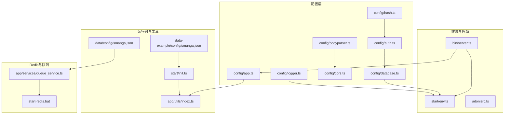
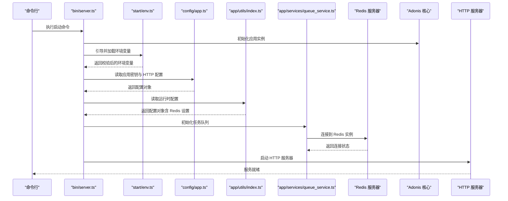
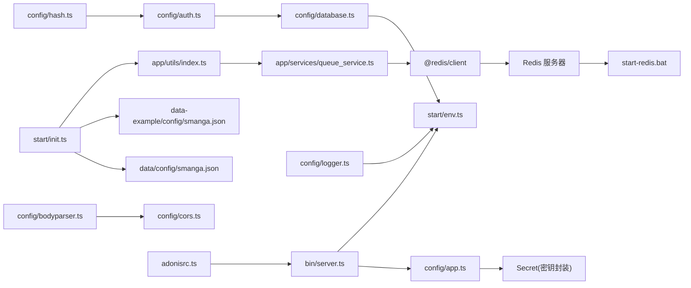

# 应用配置

<cite>
**本文引用的文件**
- [config/app.ts](file://config/app.ts)
- [start/env.ts](file://start/env.ts)
- [bin/server.ts](file://bin/server.ts)
- [adonisrc.ts](file://adonisrc.ts)
- [config/database.ts](file://config/database.ts)
- [config/auth.ts](file://config/auth.ts)
- [config/bodyparser.ts](file://config/bodyparser.ts)
- [config/cors.ts](file://config/cors.ts)
- [config/hash.ts](file://config/hash.ts)
- [config/logger.ts](file://config/logger.ts)
- [start/init.ts](file://start/init.ts)
- [app/utils/index.ts](file://app/utils/index.ts)
- [data-example/config/smanga.json](file://data-example/config/smanga.json)
- [data/config/smanga.json](file://data/config/smanga.json)
- [package.json](file://package.json)
- [app/services/queue_service.ts](file://app/services/queue_service.ts)
- [start-redis.bat](file://start-redis.bat)
</cite>

## 目录
1. [简介](#简介)
2. [项目结构](#项目结构)
3. [核心组件](#核心组件)
4. [架构总览](#架构总览)
5. [详细组件分析](#详细组件分析)
6. [依赖关系分析](#依赖关系分析)
7. [性能与安全考量](#性能与安全考量)
8. [故障排查指南](#故障排查指南)
9. [结论](#结论)
10. [附录：开发与生产配置差异](#附录开发与生产配置差异)

## 简介
本文件面向 SManga Adonis 应用的配置管理，聚焦于应用密钥（APP_KEY）、HTTP 服务器配置（请求 ID、方法欺骗防护、异步本地存储）、Cookie 安全参数，以及环境变量与配置加载机制。文档同时涵盖新增的 Redis 配置支持，包括外部 Redis 实例集成、任务队列配置等。文档给出开发与生产环境的配置差异建议与最佳实践，帮助团队在不同环境中安全、稳定地部署与运维。

## 项目结构
与应用配置密切相关的文件主要分布在以下位置：
- 配置层：config 下的各类配置文件（app、database、auth、bodyparser、cors、hash、logger）
- 环境变量：start/env.ts 定义并校验环境变量
- 启动入口：bin/server.ts 引导应用、加载环境变量
- 应用清单：adonisrc.ts 定义服务提供者、预加载项、测试套件
- 运行时配置：start/init.ts 初始化系统默认配置、创建目录与默认用户
- 工具函数：app/utils/index.ts 提供路径、配置读写、日志等工具
- 示例配置：data-example/config/smanga.json 展示应用层面的运行时配置样例
- 任务队列：app/services/queue_service.ts 集成 Redis 任务队列支持
- Redis 服务：start-redis.bat 提供 Redis 服务启动脚本

**图表来源**
- [config/app.ts:1-41](file://config/app.ts#L1-L41)
- [start/env.ts:1-39](file://start/env.ts#L1-L39)
- [bin/server.ts:1-46](file://bin/server.ts#L1-L46)
- [adonisrc.ts:1-72](file://adonisrc.ts#L1-L72)
- [config/database.ts:1-24](file://config/database.ts#L1-L24)
- [config/auth.ts:1-28](file://config/auth.ts#L1-L28)
- [config/bodyparser.ts:1-56](file://config/bodyparser.ts#L1-L56)
- [config/cors.ts:1-20](file://config/cors.ts#L1-L20)
- [config/hash.ts:1-25](file://config/hash.ts#L1-L25)
- [config/logger.ts:1-36](file://config/logger.ts#L1-L36)
- [start/init.ts:1-253](file://start/init.ts#L1-L253)
- [app/utils/index.ts:1-313](file://app/utils/index.ts#L1-L313)
- [data-example/config/smanga.json:1-58](file://data-example/config/smanga.json#L1-L58)
- [data/config/smanga.json:1-55](file://data/config/smanga.json#L1-L55)
- [app/services/queue_service.ts:1-267](file://app/services/queue_service.ts#L1-L267)
- [start-redis.bat:1-42](file://start-redis.bat#L1-L42)

**章节来源**
- [config/app.ts:1-41](file://config/app.ts#L1-L41)
- [start/env.ts:1-39](file://start/env.ts#L1-L39)
- [bin/server.ts:1-46](file://bin/server.ts#L1-L46)
- [adonisrc.ts:1-72](file://adonisrc.ts#L1-L72)

## 核心组件
本节聚焦应用配置的关键参数及其作用范围与安全影响。

- 应用密钥（APP_KEY）
  - 作用：用于加密 Cookie、生成签名 URL、加密模块解密等。一旦丢失或变更，将导致无法解密历史数据。
  - 安全要求：必须保密、不可泄露；在多环境间保持一致；建议定期轮换并在变更后迁移存量数据。
  - 来源与加载：通过环境变量注入，由配置层封装为安全密钥对象。
  
- HTTP 服务器配置
  - 请求 ID 生成：启用后可为每个请求生成唯一标识，便于日志追踪与问题定位。
  - 方法欺骗防护：禁用后可避免客户端通过特定方式"伪装"HTTP 方法，提升安全性。
  - 异步本地存储：关闭时无法全局访问 HTTP 上下文，适合对上下文传播无需求的场景；开启则带来便利但需评估上下文泄漏风险。
  
- Cookie 配置
  - domain/path/maxAge：控制域名、路径与有效期；合理设置可减少跨域与越权访问风险。
  - httpOnly：禁止前端脚本读取 Cookie，降低 XSS 攻击面。
  - secure：生产环境建议启用，仅在 HTTPS 下传输，防止中间人攻击。
  - sameSite：推荐使用严格策略，限制跨站携带 Cookie，缓解 CSRF 风险。

- Redis 配置支持（新增）
  - Redis 主机与端口：支持配置外部 Redis 实例，通过 smanga.json 中的 redis 字段指定。
  - 任务队列集成：Bull 任务队列使用 Redis 作为消息代理，支持扫描、压缩、同步等多种任务类型。
  - 配置优先级：应用配置中的 Redis 设置优先于硬编码的默认值（127.0.0.1:6379）。
  - 连接池管理：Redis 客户端自动管理连接池，支持高并发任务处理。

- 环境变量与加载机制
  - 环境变量定义：包括运行模式、端口、主机、日志级别、数据库连接信息等。
  - 加载顺序：启动入口在引导阶段显式加载环境变量模块，随后初始化 HTTP 服务器。
  - 类型校验与默认值：通过 schema 定义进行类型校验，确保配置输入的正确性。

- 运行时配置（应用级）
  - 路径与默认配置：启动时根据操作系统创建必要目录，并写入默认运行时配置文件。
  - 配置读写：提供统一的读取与写入接口，支持 JSON 结构化存储。
  - 与数据库配置解耦：应用运行时配置独立于数据库连接配置，二者分别在不同配置文件中管理。

**章节来源**
- [config/app.ts:6-40](file://config/app.ts#L6-L40)
- [start/env.ts:21-38](file://start/env.ts#L21-L38)
- [bin/server.ts:32-41](file://bin/server.ts#L32-L41)
- [start/init.ts:63-110](file://start/init.ts#L63-L110)
- [app/utils/index.ts:94-115](file://app/utils/index.ts#L94-L115)
- [app/services/queue_service.ts:34-101](file://app/services/queue_service.ts#L34-L101)
- [data-example/config/smanga.json:10-13](file://data-example/config/smanga.json#L10-L13)

## 架构总览
下图展示应用启动、环境变量加载、HTTP 服务器初始化与配置生效的整体流程，包括新增的 Redis 配置支持。

**图表来源**
- [bin/server.ts:32-41](file://bin/server.ts#L32-L41)
- [start/env.ts:21-38](file://start/env.ts#L21-L38)
- [config/app.ts:13-40](file://config/app.ts#L13-L40)
- [app/utils/index.ts:94-115](file://app/utils/index.ts#L94-L115)
- [app/services/queue_service.ts:34-101](file://app/services/queue_service.ts#L34-L101)

## 详细组件分析

### 应用密钥（APP_KEY）与安全
- 作用与风险
  - 用于 Cookie 加密、签名 URL 生成、加密模块解密等。
  - 若丢失或变更，历史加密数据将无法解密，业务连续性受影响。
- 安全实践
  - 密钥长度与随机性：采用足够强度的随机字符串。
  - 多环境一致性：开发、测试、生产环境保持一致，避免跨环境迁移失败。
  - 变更流程：制定密钥轮换流程，提前备份旧密钥，平滑过渡。
- 配置要点
  - 从环境变量读取并封装为安全密钥对象，避免明文暴露。

**章节来源**
- [config/app.ts:6-13](file://config/app.ts#L6-L13)
- [start/env.ts:24](file://start/env.ts#L24)

### HTTP 服务器配置
- 请求 ID 生成
  - 启用后可为每个请求生成唯一标识，便于日志聚合与问题追踪。
- 方法欺骗防护
  - 禁用可阻止客户端通过特定方式伪装 HTTP 方法，降低误操作与攻击风险。
- 异步本地存储
  - 关闭时无法全局访问 HTTP 上下文；开启后可在应用任意位置获取上下文，但需关注上下文泄漏与并发安全。

**章节来源**
- [config/app.ts:18-26](file://config/app.ts#L18-L26)

### Cookie 安全参数
- domain/path/maxAge
  - 控制 Cookie 生效范围与有效期，建议按需最小化范围，缩短有效期。
- httpOnly
  - 禁止前端脚本读取，显著降低 XSS 盗取 Cookie 的风险。
- secure
  - 生产环境建议启用，仅在 HTTPS 下传输，防止中间人攻击。
- sameSite
  - 推荐使用严格策略，限制跨站携带 Cookie，缓解 CSRF 攻击。

**章节来源**
- [config/app.ts:32-39](file://config/app.ts#L32-L39)

### Redis 配置支持（新增）
- Redis 主机与端口配置
  - 通过 smanga.json 中的 redis 字段配置 Redis 实例地址，默认值为 127.0.0.1:6379。
  - 支持外部 Redis 实例集成，便于在分布式环境中部署。
- 任务队列集成
  - Bull 任务队列使用 Redis 作为消息代理，支持扫描、压缩、同步等多种任务类型。
  - 自动连接到配置的 Redis 实例，无需额外配置。
- 配置优先级与回退机制
  - 应用配置中的 Redis 设置优先于硬编码的默认值。
  - 当配置缺失时，自动回退到默认的本地 Redis 实例。
- Redis 服务管理
  - 提供 start-redis.bat 脚本用于 Windows 环境下的 Redis 服务启动。
  - 支持自定义 Redis 配置文件和安装路径。

**章节来源**
- [app/services/queue_service.ts:34-101](file://app/services/queue_service.ts#L34-L101)
- [data-example/config/smanga.json:10-13](file://data-example/config/smanga.json#L10-L13)
- [data/config/smanga.json:1-55](file://data/config/smanga.json#L1-L55)
- [start-redis.bat:1-42](file://start-redis.bat#L1-L42)

### 环境变量管理与加载机制
- 定义范围
  - 包括运行模式、端口、主机、日志级别、数据库连接参数等。
- 加载时机
  - 在启动入口中显式引导环境变量模块，确保后续配置读取可用。
- 类型校验
  - 使用 schema 对输入进行类型转换与校验，保证配置的可靠性。

**章节来源**
- [start/env.ts:21-38](file://start/env.ts#L21-L38)
- [bin/server.ts:34-36](file://bin/server.ts#L34-L36)

### 运行时配置（应用级）
- 默认配置与目录创建
  - 根据操作系统创建必要的数据目录与默认配置文件，确保首次运行可用。
- 配置读写
  - 提供统一的读取与写入接口，支持 JSON 结构化存储，便于扩展。
- 与数据库配置解耦
  - 应用运行时配置与数据库连接配置相互独立，分别在不同配置文件中管理。

**章节来源**
- [start/init.ts:63-110](file://start/init.ts#L63-L110)
- [app/utils/index.ts:94-115](file://app/utils/index.ts#L94-L115)
- [data-example/config/smanga.json:1-58](file://data-example/config/smanga.json#L1-L58)

### 其他相关配置简述
- 数据库配置
  - 通过环境变量驱动连接参数，支持多种迁移路径与排序策略。
- 认证配置
  - 默认使用令牌守卫与用户提供者，模型绑定到用户实体。
- 请求体解析
  - 支持表单、JSON、multipart 等多种类型，具备空字符串转换与大小限制。
- CORS
  - 开启跨域支持，允许常用方法与头部，生产环境建议收紧白名单。
- 哈希算法
  - 默认使用 scrypt，具备成本参数与内存限制，兼顾安全性与性能。
- 日志
  - 开发环境使用控制台输出，生产环境输出至文件，便于集中收集。

**章节来源**
- [config/database.ts:4-22](file://config/database.ts#L4-L22)
- [config/auth.ts:5-15](file://config/auth.ts#L5-L15)
- [config/bodyparser.ts:3-53](file://config/bodyparser.ts#L3-L53)
- [config/cors.ts:9-17](file://config/cors.ts#L9-L17)
- [config/hash.ts:3-14](file://config/hash.ts#L3-L14)
- [config/logger.ts:5-25](file://config/logger.ts#L5-L25)

## 依赖关系分析
应用配置涉及多个层次的依赖与耦合，下图展示关键文件之间的依赖关系，包括新增的 Redis 配置支持。

**图表来源**
- [bin/server.ts:32-41](file://bin/server.ts#L32-L41)
- [start/env.ts:19-38](file://start/env.ts#L19-L38)
- [config/app.ts:1-41](file://config/app.ts#L1-L41)
- [start/init.ts:1-253](file://start/init.ts#L1-L253)
- [app/utils/index.ts:1-313](file://app/utils/index.ts#L1-L313)
- [data-example/config/smanga.json:1-58](file://data-example/config/smanga.json#L1-L58)
- [data/config/smanga.json:1-55](file://data/config/smanga.json#L1-L55)
- [app/services/queue_service.ts:1-267](file://app/services/queue_service.ts#L1-L267)
- [package.json:80](file://package.json#L80)
- [start-redis.bat:1-42](file://start-redis.bat#L1-L42)

**章节来源**
- [adonisrc.ts:24-35](file://adonisrc.ts#L24-L35)
- [bin/server.ts:32-41](file://bin/server.ts#L32-L41)

## 性能与安全考量
- 性能
  - 关闭异步本地存储可减少上下文传播开销，适用于高吞吐场景。
  - 合理设置请求体解析上限与超时时间，避免资源滥用。
  - Redis 连接池管理：Bull 自动管理 Redis 连接池，支持高并发任务处理。
- 安全
  - APP_KEY 必须保密且定期轮换；生产环境启用 secure 与 httpOnly。
  - sameSite 建议使用严格策略；CORS 白名单应最小化。
  - 禁用方法欺骗，避免被利用进行非法操作。
  - Redis 安全：生产环境建议使用密码认证和网络隔离。
- Redis 特殊考量
  - 外部 Redis 实例：确保网络连通性和防火墙配置。
  - 连接超时：合理设置 Redis 连接超时时间，避免阻塞。
  - 内存管理：监控 Redis 内存使用情况，避免 OOM。

## 故障排查指南
- 启动失败
  - 检查环境变量是否完整加载，尤其是数据库连接参数与 APP_KEY。
  - 查看启动入口的错误打印逻辑，定位具体异常。
- Cookie 无效或跨域问题
  - 核对 domain/path/sameSite/secure 配置，确保与前端域名与协议一致。
- 配置未生效
  - 确认运行时配置文件存在且可读写；检查默认配置初始化逻辑。
  - 验证 Redis 配置是否正确加载，检查 smanga.json 中的 redis 字段。
- 日志输出异常
  - 校验日志级别与传输目标配置，区分开发与生产环境输出策略。
- Redis 连接问题
  - 检查 Redis 服务是否正常运行，验证主机和端口配置。
  - 确认防火墙设置允许应用服务器访问 Redis 端口。
  - 验证 Redis 认证配置（如果启用密码）。

**章节来源**
- [bin/server.ts:42-45](file://bin/server.ts#L42-L45)
- [config/logger.ts:14-24](file://config/logger.ts#L14-L24)
- [start/init.ts:210-219](file://start/init.ts#L210-L219)
- [app/utils/index.ts:94-115](file://app/utils/index.ts#L94-L115)
- [app/services/queue_service.ts:34-101](file://app/services/queue_service.ts#L34-L101)

## 结论
SManga Adonis 的配置体系围绕"环境变量 + 应用配置 + 运行时配置"三层设计展开。通过严格的密钥管理、明确的 HTTP 与 Cookie 安全参数、完善的环境变量校验与加载机制，以及独立的应用运行时配置，实现了在开发与生产环境下的可维护性与安全性。新增的 Redis 配置支持进一步增强了系统的可扩展性，通过外部 Redis 实例集成和任务队列支持，为分布式部署提供了基础。建议团队遵循本文档提供的最佳实践，在变更密钥、调整安全参数、优化性能以及配置 Redis 时保持谨慎与一致性。

## 附录：开发与生产配置差异
- 运行模式
  - 开发：NODE_ENV=development，日志输出至控制台，便于调试。
  - 生产：NODE_ENV=production，日志输出至文件，减少控制台噪声。
- 安全参数
  - secure：生产环境启用，确保 HTTPS 传输。
  - httpOnly：始终启用，降低 XSS 风险。
  - sameSite：生产环境建议严格策略。
- HTTP 服务器
  - 请求 ID：建议开启，便于问题追踪。
  - 方法欺骗：建议禁用，提升安全性。
  - 异步本地存储：开发可开启以便快速获取上下文，生产建议关闭。
- 数据库
  - 连接参数通过环境变量注入，生产环境建议使用只读账号与最小权限。
- CORS
  - 开发环境可宽松，生产环境建议限定 origin 与 methods。
- Redis 配置（新增）
  - 开发环境：可使用本地 Redis 实例（127.0.0.1:6379）。
  - 生产环境：建议使用专用 Redis 实例，配置网络隔离和认证。
  - 连接池：生产环境建议配置合适的连接池大小和超时时间。
  - 监控：生产环境建议启用 Redis 性能监控和告警。

**章节来源**
- [start/env.ts:22](file://start/env.ts#L22)
- [config/logger.ts:18-21](file://config/logger.ts#L18-L21)
- [config/app.ts:37](file://config/app.ts#L37)
- [config/app.ts:18-26](file://config/app.ts#L18-L26)
- [config/database.ts:10-15](file://config/database.ts#L10-L15)
- [config/cors.ts:10-16](file://config/cors.ts#L10-L16)
- [data-example/config/smanga.json:10-13](file://data-example/config/smanga.json#L10-L13)
- [data/config/smanga.json:1-55](file://data/config/smanga.json#L1-L55)