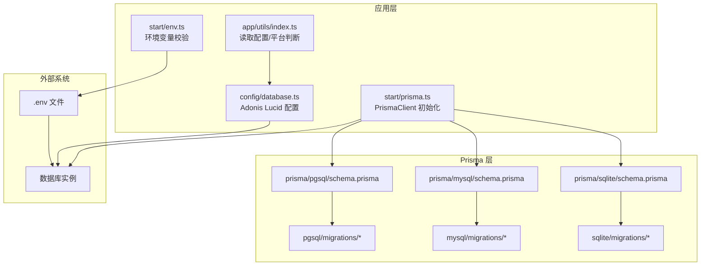
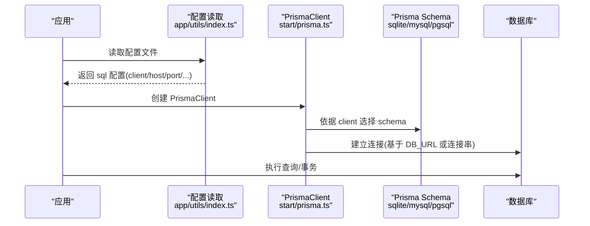
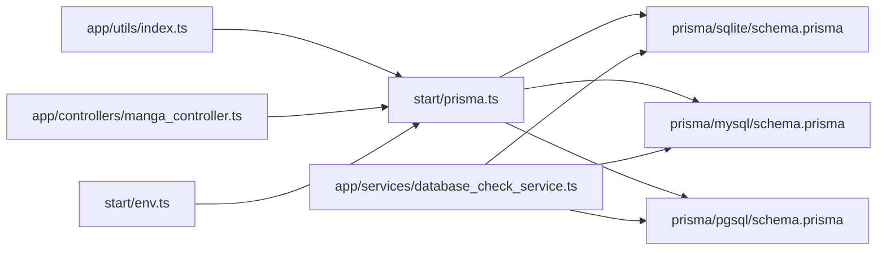

# 数据库配置

<cite>
**本文引用的文件**
- [config/database.ts](file://config/database.ts)
- [start/env.ts](file://start/env.ts)
- [start/prisma.ts](file://start/prisma.ts)
- [app/utils/index.ts](file://app/utils/index.ts)
- [prisma/sqlite/schema.prisma](file://prisma/sqlite/schema.prisma)
- [prisma/mysql/schema.prisma](file://prisma/mysql/schema.prisma)
- [prisma/pgsql/schema.prisma](file://prisma/pgsql/schema.prisma)
- [prisma/mysql/migrations/20240817084208_init/migration.sql](file://prisma/mysql/migrations/20240817084208_init/migration.sql)
- [prisma/sqlite/migrations/20240817081809_init/migration.sql](file://prisma/sqlite/migrations/20240817081809_init/migration.sql)
- [data-example/config/smanga.json](file://data-example/config/smanga.json)
- [app/services/database_check_service.ts](file://app/services/database_check_service.ts)
- [app/controllers/manga_controller.ts](file://app/controllers/manga_controller.ts)
- [package.json](file://package.json)
</cite>

## 目录
1. [简介](#简介)
2. [项目结构](#项目结构)
3. [核心组件](#核心组件)
4. [架构总览](#架构总览)
5. [详细组件分析](#详细组件分析)
6. [依赖关系分析](#依赖关系分析)
7. [性能考虑](#性能考虑)
8. [故障排查指南](#故障排查指南)
9. [结论](#结论)
10. [附录](#附录)

## 简介
本文件面向 SManga Adonis 项目的数据库配置与运维，围绕以下目标展开：
- 解释 AdonisJS Lucid 与 Prisma 在本项目中的协同工作方式
- 深入说明 SQLite、MySQL、PostgreSQL 三类数据库在配置、模型与迁移上的差异与选择标准
- 提供 Prisma ORM 的配置选项、模型定义与迁移管理方法
- 给出数据库性能优化、连接超时、并发连接数等调优建议
- 覆盖备份恢复、主从复制、读写分离等高级配置思路
- 总结不同环境（开发/生产）下的最佳实践

## 项目结构
本项目采用“AdonisJS + Prisma”的双 ORM 架构：
- AdonisJS Lucid 用于配置默认连接与迁移路径（当前仅启用 MySQL）
- Prisma 用于模型定义、客户端生成与多数据库迁移部署
- 数据库类型由应用配置文件决定，运行时根据配置动态拼接连接串或使用 .env 变量

图表来源
- [config/database.ts:1-24](file://config/database.ts#L1-L24)
- [start/env.ts:21-38](file://start/env.ts#L21-L38)
- [start/prisma.ts:7-33](file://start/prisma.ts#L7-L33)
- [prisma/sqlite/schema.prisma:1-8](file://prisma/sqlite/schema.prisma#L1-L8)
- [prisma/mysql/schema.prisma:1-8](file://prisma/mysql/schema.prisma#L1-L8)
- [prisma/pgsql/schema.prisma:1-8](file://prisma/pgsql/schema.prisma#L1-L8)

章节来源
- [config/database.ts:1-24](file://config/database.ts#L1-L24)
- [start/env.ts:21-38](file://start/env.ts#L21-L38)
- [start/prisma.ts:7-33](file://start/prisma.ts#L7-L33)
- [prisma/sqlite/schema.prisma:1-8](file://prisma/sqlite/schema.prisma#L1-L8)
- [prisma/mysql/schema.prisma:1-8](file://prisma/mysql/schema.prisma#L1-L8)
- [prisma/pgsql/schema.prisma:1-8](file://prisma/pgsql/schema.prisma#L1-L8)

## 核心组件
- AdonisJS Lucid 配置
  - 默认连接为 MySQL，连接参数来自环境变量
  - 迁移路径与自然排序策略在配置中声明
- Prisma 配置
  - 三套 schema 分别指向 sqlite/mysql/postgresql
  - 使用 .env 中对应的 DB_URL_* 变量
- 运行时初始化
  - 通过应用配置文件决定数据库类型，并动态生成 PrismaClient 连接串
- 环境变量
  - AdonisJS Env 校验 DB_HOST/DB_PORT/DB_USER/DB_PASSWORD/DB_DATABASE
  - Prisma 通过 DB_URL_SQLITE/DB_URL_MYSQL/DB_URL_POSTGRESQL 注入

章节来源
- [config/database.ts:4-22](file://config/database.ts#L4-L22)
- [start/env.ts:33-37](file://start/env.ts#L33-L37)
- [start/prisma.ts:7-33](file://start/prisma.ts#L7-L33)
- [prisma/sqlite/schema.prisma:5-7](file://prisma/sqlite/schema.prisma#L5-L7)
- [prisma/mysql/schema.prisma:5-7](file://prisma/mysql/schema.prisma#L5-L7)
- [prisma/pgsql/schema.prisma:5-7](file://prisma/pgsql/schema.prisma#L5-L7)

## 架构总览
下图展示从应用配置到数据库访问的关键流程：

图表来源
- [app/utils/index.ts:94-105](file://app/utils/index.ts#L94-L105)
- [start/prisma.ts:7-33](file://start/prisma.ts#L7-L33)
- [prisma/sqlite/schema.prisma:5-7](file://prisma/sqlite/schema.prisma#L5-L7)
- [prisma/mysql/schema.prisma:5-7](file://prisma/mysql/schema.prisma#L5-L7)
- [prisma/pgsql/schema.prisma:5-7](file://prisma/pgsql/schema.prisma#L5-L7)

## 详细组件分析

### AdonisJS Lucid 配置（database.ts）
- 连接选择：默认使用 mysql
- 连接参数：从环境变量读取 host/port/user/password/database
- 迁移配置：开启自然排序，迁移路径为相对路径数组
- 说明：Lucid 仅在此处定义默认连接；实际运行时以 Prisma 为主

章节来源
- [config/database.ts:4-22](file://config/database.ts#L4-L22)
- [start/env.ts:33-37](file://start/env.ts#L33-L37)

### Prisma 模型与数据源（三套 schema）
- 共同点
  - 生成器：prisma-client-js
  - 数据源：分别指向 sqlite/mysql/postgresql
  - 模型：覆盖业务实体（如 manga/chapter/user 等），包含索引、外键、字段注解
- 差异点
  - SQLite：字段类型更偏向原生 SQL 类型，JSON 存储需字符串化
  - MySQL：广泛使用 @db.UnsignedInt/@db.VarChar(191)/@db.DateTime(6) 等精确类型注解
  - PostgreSQL：JSON 字段使用 @db.Text，日期时间类型注解与 MySQL 不同

章节来源
- [prisma/sqlite/schema.prisma:1-447](file://prisma/sqlite/schema.prisma#L1-L447)
- [prisma/mysql/schema.prisma:1-449](file://prisma/mysql/schema.prisma#L1-L449)
- [prisma/pgsql/schema.prisma:1-448](file://prisma/pgsql/schema.prisma#L1-L448)

### 运行时连接初始化（start/prisma.ts）
- 功能
  - 读取应用配置（client/host/port/user/password/database）
  - 根据 client 动态拼接数据库 URL
  - 为 sqlite 自动拼接文件路径（Windows/Linux 区分）
  - 创建 PrismaClient 并注入 datasources.db.url
- 重要点
  - 该文件负责实际连接建立，与 .env 中的 DB_URL_* 变量配合使用
  - 若使用 Lucid 迁移，需确保 .env 中对应变量存在

章节来源
- [start/prisma.ts:7-33](file://start/prisma.ts#L7-L33)
- [app/utils/index.ts:94-105](file://app/utils/index.ts#L94-L105)

### 环境变量与配置文件
- 环境变量（AdonisJS Env）
  - DB_HOST/DB_PORT/DB_USER/DB_PASSWORD/DB_DATABASE 用于 Lucid 连接
- 应用配置（smanga.json）
  - sql.client 指定数据库类型（sqlite/mysql/pgsql）
  - sql.host/port/username/password/database 用于 Prisma 连接
  - sql.file 仅 sqlite 时使用（用于服务端部署场景）
- .env
  - DB_URL_SQLITE/DB_URL_MYSQL/DB_URL_POSTGRESQL 由 Prisma 使用

章节来源
- [start/env.ts:33-37](file://start/env.ts#L33-L37)
- [data-example/config/smanga.json:2-11](file://data-example/config/smanga.json#L2-L11)
- [prisma/sqlite/schema.prisma:5-7](file://prisma/sqlite/schema.prisma#L5-L7)
- [prisma/mysql/schema.prisma:5-7](file://prisma/mysql/schema.prisma#L5-L7)
- [prisma/pgsql/schema.prisma:5-7](file://prisma/pgsql/schema.prisma#L5-L7)

### 迁移管理与部署（database_check_service.ts）
- 功能
  - 根据配置自动更新 .env 对应 DB_URL_* 变量
  - 生成 Prisma Client 并执行 migrate deploy
  - 首次部署后标记 deploy=true，避免重复部署
- 使用建议
  - 生产环境首次部署前，确保数据库已创建
  - 变更 schema 后，按需执行 generate + migrate deploy

章节来源
- [app/services/database_check_service.ts:18-73](file://app/services/database_check_service.ts#L18-L73)

### 实际使用示例（manga_controller.ts）
- 控制器通过 #start/prisma 引入 PrismaClient
- 示例查询：用户权限检查、分页查询、关联查询、统计未观看章节
- 体现 Prisma 在业务层的典型用法

章节来源
- [app/controllers/manga_controller.ts:1-115](file://app/controllers/manga_controller.ts#L1-L115)

## 依赖关系分析
- 外部依赖
  - @prisma/client、prisma：ORM 与迁移工具
  - mysql2：MySQL 驱动（Lucid 与 Prisma 均可使用）
- 内部耦合
  - start/prisma.ts 依赖 app/utils/index.ts 的配置读取
  - app/services/database_check_service.ts 依赖 Prisma schema 与 .env
  - 控制器依赖 #start/prisma.ts 导出的 PrismaClient

图表来源
- [app/utils/index.ts:94-105](file://app/utils/index.ts#L94-L105)
- [start/prisma.ts:7-33](file://start/prisma.ts#L7-L33)
- [prisma/sqlite/schema.prisma:1-8](file://prisma/sqlite/schema.prisma#L1-L8)
- [prisma/mysql/schema.prisma:1-8](file://prisma/mysql/schema.prisma#L1-L8)
- [prisma/pgsql/schema.prisma:1-8](file://prisma/pgsql/schema.prisma#L1-L8)
- [app/services/database_check_service.ts:18-73](file://app/services/database_check_service.ts#L18-L73)
- [app/controllers/manga_controller.ts:1-115](file://app/controllers/manga_controller.ts#L1-L115)
- [start/env.ts:21-38](file://start/env.ts#L21-L38)

章节来源
- [package.json:58-87](file://package.json#L58-L87)
- [app/utils/index.ts:94-105](file://app/utils/index.ts#L94-L105)
- [start/prisma.ts:7-33](file://start/prisma.ts#L7-L33)
- [prisma/sqlite/schema.prisma:1-8](file://prisma/sqlite/schema.prisma#L1-L8)
- [prisma/mysql/schema.prisma:1-8](file://prisma/mysql/schema.prisma#L1-L8)
- [prisma/pgsql/schema.prisma:1-8](file://prisma/pgsql/schema.prisma#L1-L8)
- [app/services/database_check_service.ts:18-73](file://app/services/database_check_service.ts#L18-L73)
- [app/controllers/manga_controller.ts:1-115](file://app/controllers/manga_controller.ts#L1-L115)
- [start/env.ts:21-38](file://start/env.ts#L21-L38)

## 性能考虑
- 连接池与并发
  - Prisma 客户端默认行为由底层驱动控制；可通过 .env 或 PrismaClient 构造参数扩展连接池配置
  - 建议在高并发场景下评估数据库最大连接数与连接池大小
- 查询优化
  - 合理使用索引（schema 中已定义唯一索引与外键约束）
  - 避免 N+1 查询，优先使用 include/@@include 关联加载
- 字段类型与存储
  - MySQL 使用 @db.VarChar(191)/@db.DateTime(6) 等精确类型，有助于减少存储与提升排序效率
  - SQLite JSON 存储需字符串化，注意序列化/反序列化开销
- 迁移与版本
  - 使用 Prisma 迁移管理版本，避免手工修改数据库结构
  - 生产环境执行 migrate deploy 前，先 generate 客户端

[本节为通用指导，无需特定文件引用]

## 故障排查指南
- 连接失败
  - 检查 .env 是否正确设置 DB_URL_*（与 sql.client 对应）
  - 确认数据库实例可达（host/port/网络）
  - 如使用 Lucid 迁移，请确认 DB_HOST/DB_PORT/DB_USER/DB_PASSWORD/DB_DATABASE 已配置
- 首次部署
  - 使用 database_check_service 自动更新 .env 并执行 generate + migrate deploy
  - 确保数据库已创建（MySQL/PG 需手动创建数据库）
- 数据库类型切换
  - 修改 smanga.json 的 sql.client，并重新生成/部署迁移
- JSON 存储差异
  - SQLite 场景下 JSON 字段需字符串化；其他数据库可直接存储 JSON

章节来源
- [app/services/database_check_service.ts:18-73](file://app/services/database_check_service.ts#L18-L73)
- [start/env.ts:33-37](file://start/env.ts#L33-L37)
- [app/utils/index.ts:163-179](file://app/utils/index.ts#L163-L179)

## 结论
- 本项目采用“AdonisJS Lucid + Prisma”双 ORM 协同模式：Lucid 负责默认连接与迁移路径，Prisma 负责模型定义与多数据库迁移
- SQLite、MySQL、PostgreSQL 在 schema 中体现差异化字段类型与注解，需按数据库类型选择合适的 schema
- 运行时通过配置文件动态选择数据库类型，并自动生成连接串或使用 .env 变量
- 建议在生产环境遵循“先 generate，再 deploy”的迁移流程，并结合连接池与索引策略进行性能优化

[本节为总结性内容，无需特定文件引用]

## 附录

### 数据库类型选择与差异对比
- SQLite
  - 优点：零配置、单文件、适合开发/小规模部署
  - 缺点：并发写入受限、JSON 存储需字符串化
  - 适用：本地开发、轻量级生产（单实例）
- MySQL
  - 优点：成熟生态、高性能、广泛支持
  - 特性：@db.UnsignedInt/@db.VarChar(191)/@db.DateTime(6) 等类型注解
  - 适用：中大型生产环境
- PostgreSQL
  - 优点：强类型、JSON 文本存储、扩展性强
  - 特性：@db.Text JSON、@db.Date/@db.Timestamp(0) 等注解
  - 适用：对类型与 JSON 有更高要求的场景

章节来源
- [prisma/sqlite/schema.prisma:1-447](file://prisma/sqlite/schema.prisma#L1-L447)
- [prisma/mysql/schema.prisma:1-449](file://prisma/mysql/schema.prisma#L1-L449)
- [prisma/pgsql/schema.prisma:1-448](file://prisma/pgsql/schema.prisma#L1-L448)

### 迁移与模型对照（关键表）
- 初始化迁移（MySQL）
  - 表：bookmark/chapter/collect/compress/history/latest/log/login/manga/mangaTag/media/mediaPermisson/meta/path/scan/tag/task/taskFailed/taskSuccess/token/user/userPermisson/version
  - 索引：唯一索引/外键约束
- 初始化迁移（SQLite）
  - 结构与 MySQL 类似，但字段类型与外键约束语法略有差异
- 迁移文件位置
  - MySQL：prisma/mysql/migrations/...
  - SQLite：prisma/sqlite/migrations/...
  - PostgreSQL：prisma/pgsql/migrations/...

章节来源
- [prisma/mysql/migrations/20240817084208_init/migration.sql:1-449](file://prisma/mysql/migrations/20240817084208_init/migration.sql#L1-L449)
- [prisma/sqlite/migrations/20240817081809_init/migration.sql:1-385](file://prisma/sqlite/migrations/20240817081809_init/migration.sql#L1-L385)

### 高级配置思路（概念性）
- 备份与恢复
  - SQLite：备份 .db 文件或导出 SQL
  - MySQL/PG：使用 mysqldump/pg_dump，结合增量备份策略
- 主从复制与读写分离
  - MySQL：主从复制 + 应用侧读写分离（多个 PrismaClient 实例）
  - PostgreSQL：逻辑复制/物理复制 + 应用侧路由
- 连接超时与并发限制
  - 设置连接池大小、查询超时、连接生命周期
  - 监控慢查询与锁等待

[本节为概念性内容，无需特定文件引用]