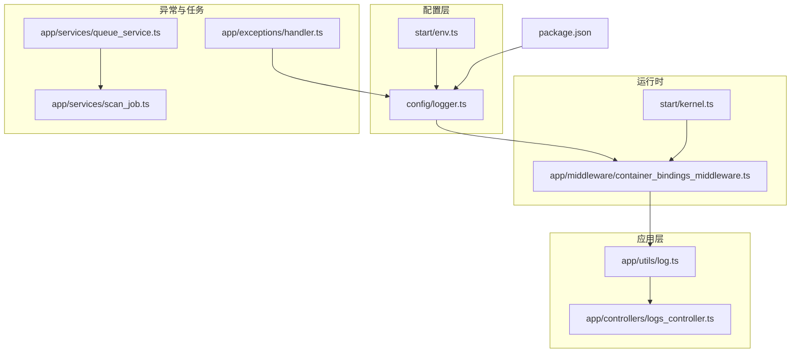
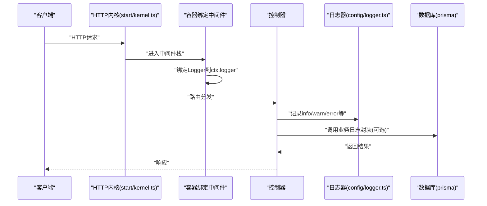
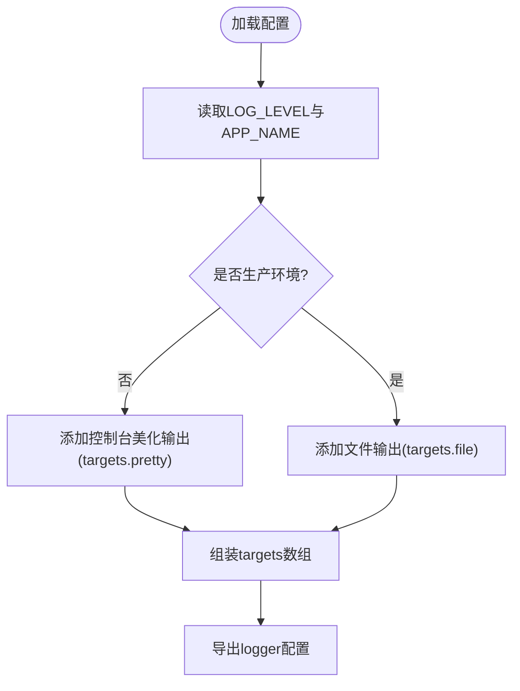
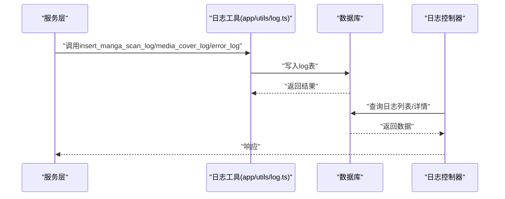
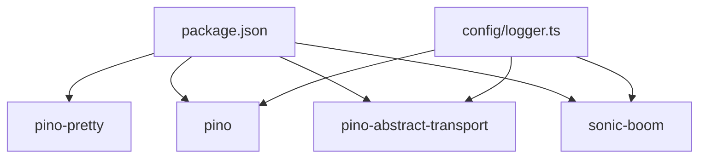

# 日志配置

<cite>
**本文引用的文件**
- [config/logger.ts](file://config/logger.ts)
- [start/env.ts](file://start/env.ts)
- [app/utils/log.ts](file://app/utils/log.ts)
- [app/controllers/logs_controller.ts](file://app/controllers/logs_controller.ts)
- [app/exceptions/handler.ts](file://app/exceptions/handler.ts)
- [app/middleware/container_bindings_middleware.ts](file://app/middleware/container_bindings_middleware.ts)
- [start/kernel.ts](file://start/kernel.ts)
- [package.json](file://package.json)
- [app/services/queue_service.ts](file://app/services/queue_service.ts)
- [app/services/scan_job.ts](file://app/services/scan_job.ts)
</cite>

## 目录
1. [简介](#简介)
2. [项目结构](#项目结构)
3. [核心组件](#核心组件)
4. [架构总览](#架构总览)
5. [详细组件分析](#详细组件分析)
6. [依赖分析](#依赖分析)
7. [性能考虑](#性能考虑)
8. [故障排查指南](#故障排查指南)
9. [结论](#结论)
10. [附录](#附录)

## 简介
本文件面向 SManga Adonis 项目，系统性梳理并解释日志配置与使用实践，重点围绕以下方面展开：
- logger.ts 中的日志级别、输出目标、格式化选项与多环境适配
- 不同日志级别的语义与使用场景
- 控制台输出与文件输出的配置方法
- 日志轮转、日志清理、日志聚合等高级能力的可选实现思路
- 异步日志写入、结构化日志、错误追踪与审计日志策略
- 生产环境日志监控与告警建议

## 项目结构
与日志相关的关键位置如下：
- 配置层：config/logger.ts 定义日志器与传输目标；start/env.ts 定义 LOG_LEVEL 等关键环境变量
- 运行时绑定：app/middleware/container_bindings_middleware.ts 将 Logger 绑定到请求上下文
- 应用层：app/utils/log.ts 提供业务日志写入数据库的封装；app/controllers/logs_controller.ts 提供日志查询接口
- 异常处理：app/exceptions/handler.ts 控制异常上报与调试模式
- 任务队列：app/services/queue_service.ts、app/services/scan_job.ts 展示了控制台日志与任务执行流程
- 依赖：package.json 显示 pino-pretty 等日志生态依赖

**图示来源**
- [config/logger.ts:1-36](file://config/logger.ts#L1-L36)
- [start/env.ts:21-38](file://start/env.ts#L21-L38)
- [app/middleware/container_bindings_middleware.ts:12-19](file://app/middleware/container_bindings_middleware.ts#L12-L19)
- [start/kernel.ts:28-39](file://start/kernel.ts#L28-L39)
- [app/utils/log.ts:1-74](file://app/utils/log.ts#L1-L74)
- [app/controllers/logs_controller.ts:1-60](file://app/controllers/logs_controller.ts#L1-L60)
- [app/exceptions/handler.ts:1-29](file://app/exceptions/handler.ts#L1-L29)
- [app/services/queue_service.ts:1-200](file://app/services/queue_service.ts#L1-L200)
- [app/services/scan_job.ts:1-200](file://app/services/scan_job.ts#L1-L200)
- [package.json:56-87](file://package.json#L56-L87)

**章节来源**
- [config/logger.ts:1-36](file://config/logger.ts#L1-L36)
- [start/env.ts:21-38](file://start/env.ts#L21-L38)
- [package.json:56-87](file://package.json#L56-L87)

## 核心组件
- 日志器定义与传输目标
  - 默认日志器名称为 app
  - 日志级别由环境变量 LOG_LEVEL 决定
  - 传输目标根据运行环境动态选择：
    - 开发环境：控制台美化输出
    - 生产环境：文件输出（标准输出）
- 环境变量
  - LOG_LEVEL 支持 fatal、error、warn、info、debug、trace 六个级别
  - NODE_ENV 支持 development、production、test
- 请求上下文日志
  - 中间件将 Logger 绑定到 ctx.logger，便于控制器与服务层直接使用
- 业务日志持久化
  - app/utils/log.ts 提供将扫描、封面生成、错误等事件写入数据库的封装
  - app/controllers/logs_controller.ts 提供日志列表查询接口
- 异常处理
  - app/exceptions/handler.ts 在非生产环境启用调试模式，便于输出详细堆栈

**章节来源**
- [config/logger.ts:5-27](file://config/logger.ts#L5-L27)
- [start/env.ts:22-26](file://start/env.ts#L22-L26)
- [app/middleware/container_bindings_middleware.ts:12-19](file://app/middleware/container_bindings_middleware.ts#L12-L19)
- [app/utils/log.ts:10-72](file://app/utils/log.ts#L10-L72)
- [app/controllers/logs_controller.ts:9-22](file://app/controllers/logs_controller.ts#L9-L22)
- [app/exceptions/handler.ts:9-27](file://app/exceptions/handler.ts#L9-L27)

## 架构总览
下图展示从请求到日志输出的整体链路，包括 AdonisJS 内置日志器、业务日志持久化与异常处理。

**图示来源**
- [start/kernel.ts:28-39](file://start/kernel.ts#L28-L39)
- [app/middleware/container_bindings_middleware.ts:12-19](file://app/middleware/container_bindings_middleware.ts#L12-L19)
- [config/logger.ts:5-27](file://config/logger.ts#L5-L27)
- [app/utils/log.ts:10-72](file://app/utils/log.ts#L10-L72)

## 详细组件分析

### 日志器与传输目标（logger.ts）
- 默认日志器
  - 名称：app
  - 启用状态：true
  - 名称来源：APP_NAME 环境变量
  - 级别来源：LOG_LEVEL 环境变量
- 传输目标
  - 开发环境：控制台美化输出（targets.pretty）
  - 生产环境：文件输出（标准输出，destination: 1）
- 类型推断
  - 通过 declare module 为 LoggersList 提供类型推断，确保在应用中使用时具备类型安全

**图示来源**
- [config/logger.ts:5-27](file://config/logger.ts#L5-L27)

**章节来源**
- [config/logger.ts:5-27](file://config/logger.ts#L5-L27)

### 环境变量与级别（start/env.ts）
- NODE_ENV：决定运行模式与调试行为
- LOG_LEVEL：决定日志器的最小输出级别
- 可选值：fatal、error、warn、info、debug、trace

**章节来源**
- [start/env.ts:22-26](file://start/env.ts#L22-L26)

### 请求上下文日志绑定（container_bindings_middleware.ts）
- 将 Logger 绑定到 ctx.logger，使控制器与服务层可通过 ctx.logger 记录请求上下文相关日志
- 与异常处理器配合，在非生产环境开启调试模式，便于定位问题

**章节来源**
- [app/middleware/container_bindings_middleware.ts:12-19](file://app/middleware/container_bindings_middleware.ts#L12-L19)
- [app/exceptions/handler.ts:9-27](file://app/exceptions/handler.ts#L9-L27)

### 业务日志持久化（app/utils/log.ts 与 app/controllers/logs_controller.ts）
- 业务日志封装
  - 将扫描、封面生成、错误等事件写入数据库表（log），包含消息、类型、级别、版本、环境等字段
  - 错误日志会同时输出到控制台与数据库
- 日志查询接口
  - 提供分页查询、详情查询、新增、更新、删除等接口，便于管理与审计

**图示来源**
- [app/utils/log.ts:10-72](file://app/utils/log.ts#L10-L72)
- [app/controllers/logs_controller.ts:9-60](file://app/controllers/logs_controller.ts#L9-L60)

**章节来源**
- [app/utils/log.ts:10-72](file://app/utils/log.ts#L10-L72)
- [app/controllers/logs_controller.ts:9-60](file://app/controllers/logs_controller.ts#L9-L60)

### 异常处理与调试（app/exceptions/handler.ts）
- 非生产环境自动启用调试模式，便于输出详细堆栈
- report 方法用于将错误上报至日志服务或第三方监控平台（当前委托父类实现）

**章节来源**
- [app/exceptions/handler.ts:9-27](file://app/exceptions/handler.ts#L9-L27)

### 任务队列与控制台日志（app/services/queue_service.ts 与 app/services/scan_job.ts）
- 任务队列在处理完成与失败时，使用控制台输出进行简单记录
- 适合开发与测试阶段的快速观测，生产环境建议统一接入日志器

**章节来源**
- [app/services/queue_service.ts:41-47](file://app/services/queue_service.ts#L41-L47)
- [app/services/scan_job.ts:41-43](file://app/services/scan_job.ts#L41-L43)

## 依赖分析
- 日志生态依赖
  - pino-pretty：开发环境美化输出
  - pino 生态（pino、pino-abstract-transport、sonic-boom 等）：高性能日志传输与异步写入
- 与 AdonisJS 的集成
  - logger.ts 使用 @adonisjs/core/logger 的 defineConfig 与 targets API
  - 中间件将 Logger 注入到请求上下文，便于全局使用

**图示来源**
- [package.json:56-87](file://package.json#L56-L87)
- [config/logger.ts:1-3](file://config/logger.ts#L1-L3)

**章节来源**
- [package.json:56-87](file://package.json#L56-L87)
- [config/logger.ts:1-3](file://config/logger.ts#L1-L3)

## 性能考虑
- 异步写入与背压
  - 使用 pino 的 sonic-boom 作为底层传输，支持异步写入与背压控制，降低阻塞风险
- 输出目标选择
  - 开发环境使用控制台美化输出，提升可观测性
  - 生产环境使用文件输出（标准输出），便于容器与日志收集系统采集
- 结构化日志
  - 建议在业务日志封装中统一输出 JSON 格式字段（如 traceId、userId、action、duration 等），便于检索与聚合
- 日志级别与采样
  - 对高频操作采用 info/warn 级别，避免 debug/trace 的高开销
  - 在极端流量下可考虑采样策略，减少 I/O 压力

[本节为通用性能建议，不直接分析具体文件]

## 故障排查指南
- 确认环境变量
  - 检查 LOG_LEVEL 是否正确设置，确保与预期级别一致
  - 检查 NODE_ENV 是否为 production，以验证生产环境输出是否为文件
- 观察输出目标
  - 开发环境应看到美化输出；生产环境应检查标准输出是否被日志收集系统捕获
- 异常与调试
  - 非生产环境异常应显示详细堆栈；生产环境请通过日志与数据库日志定位
- 业务日志
  - 若发现业务日志缺失，检查 app/utils/log.ts 的调用点与数据库连接状态
  - 通过 app/controllers/logs_controller.ts 的接口核对日志入库情况

**章节来源**
- [start/env.ts:22-26](file://start/env.ts#L22-L26)
- [config/logger.ts:18-22](file://config/logger.ts#L18-L22)
- [app/exceptions/handler.ts:9-27](file://app/exceptions/handler.ts#L9-L27)
- [app/utils/log.ts:10-72](file://app/utils/log.ts#L10-L72)
- [app/controllers/logs_controller.ts:9-22](file://app/controllers/logs_controller.ts#L9-L22)

## 结论
本项目基于 AdonisJS 的内置日志器与 targets API，实现了按环境自动切换的输出策略，并通过中间件将日志器注入到请求上下文。业务层面提供了结构化日志持久化与查询接口，满足审计与排障需求。生产环境建议结合日志收集系统与告警策略，进一步完善监控闭环。

[本节为总结性内容，不直接分析具体文件]

## 附录

### 日志级别与使用场景
- fatal：致命错误，系统无法继续运行
- error：一般错误，需人工干预
- warn：潜在问题，建议关注
- info：常规运行信息，可用于审计
- debug：调试信息，仅在开发或特殊诊断场景启用
- trace：最细粒度的跟踪信息，通常关闭

[本节为通用概念说明，不直接分析具体文件]

### 高级功能配置建议
- 日志轮转
  - 建议在容器或主机侧使用日志轮转工具（如 logrotate、Docker 日志驱动配置）进行切割与归档
- 日志清理
  - 设置保留周期与大小阈值，定期清理过期日志
- 日志聚合
  - 通过标准输出对接集中式日志系统（如 ELK/Fluent Bit/Loki），统一检索与可视化
- 结构化日志
  - 在业务日志封装中统一输出 JSON 字段，便于机器解析与告警规则编写

[本节为通用实现建议，不直接分析具体文件]