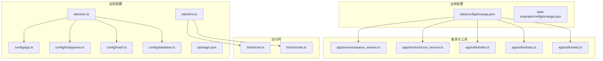
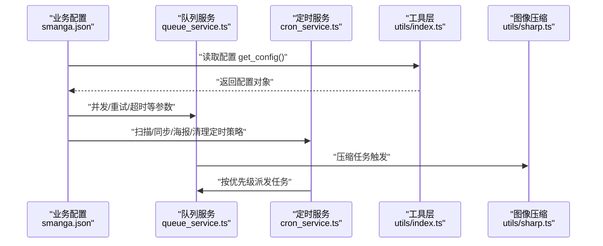
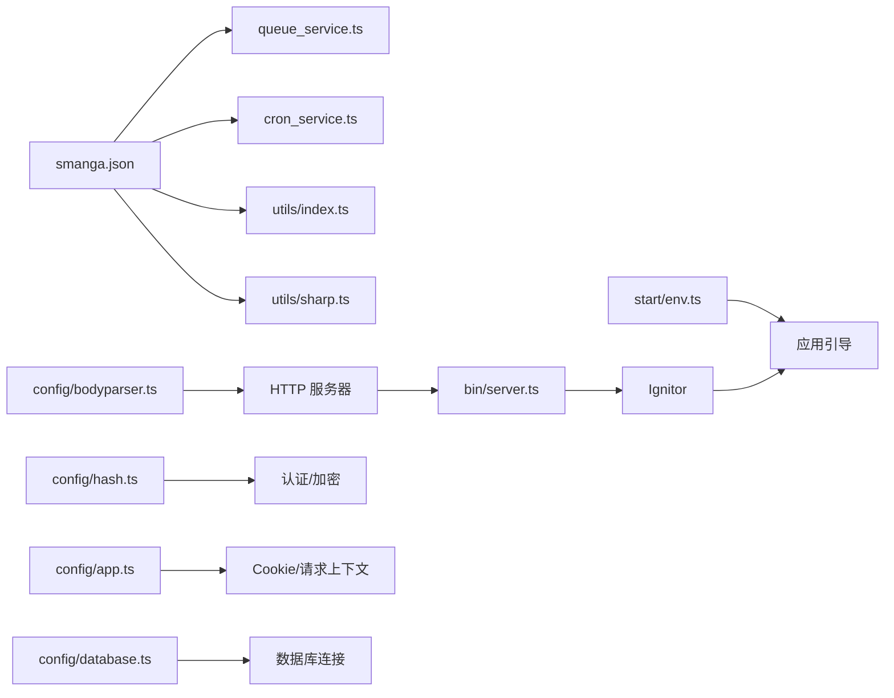

# 系统配置

<cite>
**本文引用的文件**
- [smanga.json（示例）](file://data-example/config/smanga.json)
- [smanga.json（实际）](file://data/config/smanga.json)
- [bodyparser.ts](file://config/bodyparser.ts)
- [hash.ts](file://config/hash.ts)
- [app.ts](file://config/app.ts)
- [database.ts](file://config/database.ts)
- [env.ts](file://start/env.ts)
- [adonisrc.ts](file://adonisrc.ts)
- [package.json](file://package.json)
- [queue_service.ts](file://app/services/queue_service.ts)
- [cron_service.ts](file://app/services/cron_service.ts)
- [index.ts（工具）](file://app/utils/index.ts)
- [sharp.ts（图像压缩）](file://app/utils/sharp.ts)
- [meta.ts（元数据转换）](file://app/utils/meta.ts)
- [server.ts](file://bin/server.ts)
- [console.ts](file://bin/console.ts)
</cite>

## 目录
1. [简介](#简介)
2. [项目结构与配置位置](#项目结构与配置位置)
3. [核心配置总览](#核心配置总览)
4. [架构概览](#架构概览)
5. [详细配置解析](#详细配置解析)
6. [依赖关系分析](#依赖关系分析)
7. [性能与资源调优](#性能与资源调优)
8. [故障排查指南](#故障排查指南)
9. [结论](#结论)
10. [附录：配置项对照表](#附录配置项对照表)

## 简介
本文件面向 SManga Adonis 的系统管理员与开发者，系统性梳理并解释以下配置主题：
- smanga.json 中的系统参数、漫画元数据处理、文件处理与图像压缩配置
- 请求体解析（bodyparser）与文件上传限制、MIME 类型处理
- 密码哈希（hash）的安全参数
- 性能调优（内存、并发、队列、定时任务）
- 漫画扫描、图像压缩、缓存策略
- 配置验证、热更新与版本管理的实现思路

## 项目结构与配置位置
- 应用配置（AdonisJS 内核）：config/*.ts
- 运行时环境变量：start/env.ts
- 业务配置（smanga.json）：data/config/smanga.json 或 data-example/config/smanga.json
- 服务与调度：app/services/*
- 工具与压缩：app/utils/*

图表来源
- [app.ts:18-40](file://config/app.ts#L18-L40)
- [bodyparser.ts:3-56](file://config/bodyparser.ts#L3-L56)
- [hash.ts:3-16](file://config/hash.ts#L3-L16)
- [database.ts:4-22](file://config/database.ts#L4-L22)
- [env.ts:21-38](file://start/env.ts#L21-L38)
- [adonisrc.ts:3-35](file://adonisrc.ts#L3-L35)
- [package.json:62-87](file://package.json#L62-L87)
- [server.ts:32-41](file://bin/server.ts#L32-L41)
- [console.ts:34-42](file://bin/console.ts#L34-L42)
- [queue_service.ts:15-28](file://app/services/queue_service.ts#L15-L28)
- [cron_service.ts:5-7](file://app/services/cron_service.ts#L5-L7)
- [index.ts:94-115](file://app/utils/index.ts#L94-L115)
- [sharp.ts:12-89](file://app/utils/sharp.ts#L12-L89)
- [meta.ts:3-34](file://app/utils/meta.ts#L3-L34)

章节来源
- [app.ts:18-40](file://config/app.ts#L18-L40)
- [bodyparser.ts:3-56](file://config/bodyparser.ts#L3-L56)
- [hash.ts:3-16](file://config/hash.ts#L3-L16)
- [database.ts:4-22](file://config/database.ts#L4-L22)
- [env.ts:21-38](file://start/env.ts#L21-L38)
- [adonisrc.ts:3-35](file://adonisrc.ts#L3-L35)
- [package.json:62-87](file://package.json#L62-L87)
- [server.ts:32-41](file://bin/server.ts#L32-L41)
- [console.ts:34-42](file://bin/console.ts#L34-L42)

## 核心配置总览
- smanga.json 系统参数
  - 数据库连接（sql）、图像处理（imagick）、扫描策略（scan）、同步策略（sync）、调试开关（debug）、SSL（ssl）、压缩策略（compress）、队列（queue）
- AdonisJS 内核配置
  - HTTP 服务器、Cookie、BodyParser、Hash、数据库连接等
- 运行时环境变量
  - NODE_ENV、PORT、HOST、LOG_LEVEL、APP_KEY、DB_* 等

章节来源
- [smanga.json（实际）:1-55](file://data/config/smanga.json#L1-L55)
- [smanga.json（示例）:1-54](file://data-example/config/smanga.json#L1-L54)
- [app.ts:18-40](file://config/app.ts#L18-L40)
- [bodyparser.ts:3-56](file://config/bodyparser.ts#L3-L56)
- [hash.ts:3-16](file://config/hash.ts#L3-L16)
- [database.ts:4-22](file://config/database.ts#L4-L22)
- [env.ts:21-38](file://start/env.ts#L21-L38)

## 架构概览
下图展示“业务配置 → 服务层 → 工具层”的数据流与控制流。

图表来源
- [queue_service.ts:15-28](file://app/services/queue_service.ts#L15-L28)
- [cron_service.ts:20-43](file://app/services/cron_service.ts#L20-L43)
- [index.ts:94-115](file://app/utils/index.ts#L94-L115)
- [sharp.ts:12-89](file://app/utils/sharp.ts#L12-L89)

## 详细配置解析

### 一、smanga.json 系统参数与业务配置
- 数据库（sql）
  - client：数据库客户端类型（如 sqlite）
  - host/port/username/password/database：连接参数
  - file：SQLite 文件路径
  - deploy：部署标记
- 图像处理（imagick）
  - memory/map：内存与映射限制
  - density：分辨率
  - quality：质量
- 扫描（scan）
  - auto：自动扫描开关
  - concurrency：扫描并发
  - reloadCover/doNotCopyCover：封面处理策略
  - ignoreHiddenFiles：忽略隐藏文件
  - defaultTagColor：默认标签颜色
  - interval/mediaPosterInterval/createMediaPoster：扫描与媒体封面生成周期
- 同步（sync）
  - interval：同步任务周期
- 调试（debug）
  - dispatchSync：同步执行开关（1=同步）
- SSL（ssl）
  - pem/key：证书路径
- 压缩（compress）
  - auto/sync：自动压缩与同步压缩
  - saveDuration/poster/bookmark：保存时长与尺寸
  - autoClear/limit/clearCron/autoClearInterval：缓存清理策略
- 队列（queue）
  - concurrency/attempts/timeout：并发、重试次数、超时

章节来源
- [smanga.json（实际）:2-11](file://data/config/smanga.json#L2-L11)
- [smanga.json（实际）:12-17](file://data/config/smanga.json#L12-L17)
- [smanga.json（实际）:18-28](file://data/config/smanga.json#L18-L28)
- [smanga.json（实际）:29-31](file://data/config/smanga.json#L29-L31)
- [smanga.json（实际）:32-34](file://data/config/smanga.json#L32-L34)
- [smanga.json（实际）:39-49](file://data/config/smanga.json#L39-L49)
- [smanga.json（实际）:50-54](file://data/config/smanga.json#L50-L54)
- [smanga.json（示例）:2-11](file://data-example/config/smanga.json#L2-L11)
- [smanga.json（示例）:12-17](file://data-example/config/smanga.json#L12-L17)
- [smanga.json（示例）:18-28](file://data-example/config/smanga.json#L18-L28)
- [smanga.json（示例）:29-35](file://data-example/config/smanga.json#L29-L35)
- [smanga.json（示例）:36-45](file://data-example/config/smanga.json#L36-L45)
- [smanga.json（示例）:46-50](file://data-example/config/smanga.json#L46-L50)
- [smanga.json（示例）:51-53](file://data-example/config/smanga.json#L51-L53)

### 二、请求体解析与文件上传（bodyparser）
- 允许方法：POST/PUT/PATCH/DELETE
- 表单解析：application/x-www-form-urlencoded
- JSON 解析：application/json 及若干扩展类型
- multipart/form-data：
  - autoProcess：自动移动上传文件至系统临时目录
  - limit：请求体与文件总大小上限
  - types：识别的多部分类型

章节来源
- [bodyparser.ts:8](file://config/bodyparser.ts#L8)
- [bodyparser.ts:14-17](file://config/bodyparser.ts#L14-L17)
- [bodyparser.ts:22-30](file://config/bodyparser.ts#L22-L30)
- [bodyparser.ts:36-52](file://config/bodyparser.ts#L36-L52)

### 三、密码哈希（hash）
- 默认驱动：scrypt
- 关键参数：
  - cost/blockSize/parallelization/maxMemory：内存与计算强度配置
- 类型推断模块：通过 HashersList 推导可用哈希器列表

章节来源
- [hash.ts:4](file://config/hash.ts#L4)
- [hash.ts:7-12](file://config/hash.ts#L7-L12)
- [hash.ts:22-24](file://config/hash.ts#L22-L24)

### 四、HTTP 与 Cookie（app）
- generateRequestId：启用请求 ID
- cookie：domain/path/maxAge/httpOnly/secure/sameSite
- useAsyncLocalStorage：可选开启

章节来源
- [app.ts:18-40](file://config/app.ts#L18-L40)

### 五、数据库连接（database）
- 连接名：mysql
- 连接参数来自环境变量（DB_HOST/DB_PORT/DB_USER/DB_PASSWORD/DB_DATABASE）

章节来源
- [database.ts:4-22](file://config/database.ts#L4-L22)
- [env.ts:33-37](file://start/env.ts#L33-L37)

### 六、运行时环境变量（env）
- 必填：NODE_ENV、PORT、APP_KEY、HOST、LOG_LEVEL
- 数据库相关：DB_HOST、DB_PORT、DB_USER、DB_PASSWORD、DB_DATABASE

章节来源
- [env.ts:21-38](file://start/env.ts#L21-L38)

### 七、服务注册与预加载（adonisrc）
- providers：应用、哈希、CORS、数据库、认证等
- preloads：路由与内核
- 测试套件：unit/functional

章节来源
- [adonisrc.ts:24-35](file://adonisrc.ts#L24-L35)
- [adonisrc.ts:45](file://adonisrc.ts#L45)
- [adonisrc.ts:56-70](file://adonisrc.ts#L56-L70)

### 八、包与依赖（package.json）
- 核心依赖：@adonisjs/*、bull、node-cron、sharp、mysql2、redis 等
- 导入别名：#config/*、#utils/* 等

章节来源
- [package.json:62-87](file://package.json#L62-L87)
- [package.json:16-36](file://package.json#L16-L36)

### 九、业务配置读取与持久化（工具层）
- get_config：按平台读取 data/config/smanga.json
- set_config：写回 smanga.json
- 其他工具：路径常量、排序、JSON 存储适配、日志、延时、图片枚举等

章节来源
- [index.ts:94-115](file://app/utils/index.ts#L94-L115)
- [index.ts:34-92](file://app/utils/index.ts#L34-L92)

### 十、队列与并发（queue_service）
- 配置来源：queue.concurrency/attempts/timeout
- 任务分发：根据任务名选择队列（scan/sync/compress），带指数退避与最大延迟
- 调试同步执行：debug.dispatchSync=1 时同步执行

章节来源
- [queue_service.ts:18-28](file://app/services/queue_service.ts#L18-L28)
- [queue_service.ts:180-221](file://app/services/queue_service.ts#L180-L221)
- [queue_service.ts:241-262](file://app/services/queue_service.ts#L241-L262)

### 十一、定时任务（cron_service）
- 扫描：按 scan.interval 遍历路径并派发扫描任务
- 同步：按 sync.interval 遍历同步项并派发同步任务
- 媒体封面：按 mediaPosterInterval 生成媒体封面
- 清理压缩缓存：按 clearCron 定期清理

章节来源
- [cron_service.ts:16-43](file://app/services/cron_service.ts#L16-L43)
- [cron_service.ts:45-89](file://app/services/cron_service.ts#L45-L89)
- [cron_service.ts:91-118](file://app/services/cron_service.ts#L91-L118)
- [cron_service.ts:120-141](file://app/services/cron_service.ts#L120-L141)

### 十二、图像压缩（sharp）
- 支持格式：JPEG/PNG/WEBP
- 策略：
  - 基于循环降低质量直至满足大小阈值
  - 预设质量一次性压缩
- 输出：覆盖原文件，删除原始缓存文件

章节来源
- [sharp.ts:12-89](file://app/utils/sharp.ts#L12-L89)
- [sharp.ts:91-167](file://app/utils/sharp.ts#L91-L167)

### 十三、漫画元数据（meta）
- 输入：ComicInfo 或顶层 JSON
- 字段映射：标题、副标题、作者、描述、发布日期、分类、完成状态、标签等
- 标签解析：逗号分隔并去空

章节来源
- [meta.ts:3-34](file://app/utils/meta.ts#L3-L34)

## 依赖关系分析
- 配置到服务
  - smanga.json → queue_service.ts（并发/重试/超时）
  - smanga.json → cron_service.ts（定时策略）
  - smanga.json → utils/index.ts（读取/写入）
  - smanga.json → utils/sharp.ts（压缩参数）
- 配置到内核
  - bodyparser.ts → HTTP 请求体解析
  - hash.ts → 用户密码安全
  - app.ts → Cookie/请求上下文
  - database.ts → 连接池与迁移
  - env.ts → 运行时环境变量
- 启动入口
  - bin/server.ts → 引导 Ignitor 并启动 HTTP 服务器
  - bin/console.ts → 引导 Ignitor 并启动 CLI

图表来源
- [queue_service.ts:15-28](file://app/services/queue_service.ts#L15-L28)
- [cron_service.ts:20-43](file://app/services/cron_service.ts#L20-L43)
- [index.ts:94-115](file://app/utils/index.ts#L94-L115)
- [sharp.ts:12-89](file://app/utils/sharp.ts#L12-L89)
- [bodyparser.ts:3-56](file://config/bodyparser.ts#L3-L56)
- [hash.ts:3-16](file://config/hash.ts#L3-L16)
- [app.ts:18-40](file://config/app.ts#L18-L40)
- [database.ts:4-22](file://config/database.ts#L4-L22)
- [env.ts:21-38](file://start/env.ts#L21-L38)
- [server.ts:32-41](file://bin/server.ts#L32-L41)

章节来源
- [queue_service.ts:15-28](file://app/services/queue_service.ts#L15-L28)
- [cron_service.ts:20-43](file://app/services/cron_service.ts#L20-L43)
- [index.ts:94-115](file://app/utils/index.ts#L94-L115)
- [sharp.ts:12-89](file://app/utils/sharp.ts#L12-L89)
- [bodyparser.ts:3-56](file://config/bodyparser.ts#L3-L56)
- [hash.ts:3-16](file://config/hash.ts#L3-L16)
- [app.ts:18-40](file://config/app.ts#L18-L40)
- [database.ts:4-22](file://config/database.ts#L4-L22)
- [env.ts:21-38](file://start/env.ts#L21-L38)
- [server.ts:32-41](file://bin/server.ts#L32-L41)

## 性能与资源调优
- 队列与并发
  - queue.concurrency：提升 CPU/IO 密集型任务吞吐
  - queue.attempts/backoff：指数退避避免重试风暴
  - queue.timeout：避免任务卡死占用资源
- 图像压缩
  - imagick.memory/map/density/quality：平衡内存占用与质量
  - compress.saveDuration/poster/bookmark：控制缓存体积
  - compress.limit/autoClear/autoClearInterval：定期清理缓存
- 扫描与同步
  - scan.concurrency：控制磁盘 IO 并发
  - scan.interval/mediaPosterInterval：合理安排扫描频率
  - sync.interval：避免频繁网络请求
- 数据库
  - database 连接池参数（由 Lucid 提供）与 SQL 客户端选择（sqlite/mysql2）
- 运行时
  - NODE_ENV=production，减少日志与开发特性
  - Redis/Bull 队列与 node-cron 依赖需稳定运行

章节来源
- [queue_service.ts:18-28](file://app/services/queue_service.ts#L18-L28)
- [queue_service.ts:252-260](file://app/services/queue_service.ts#L252-L260)
- [smanga.json（实际）:12-17](file://data/config/smanga.json#L12-L17)
- [smanga.json（实际）:39-49](file://data/config/smanga.json#L39-L49)
- [smanga.json（实际）:18-28](file://data/config/smanga.json#L18-L28)
- [database.ts:4-22](file://config/database.ts#L4-L22)
- [env.ts:22](file://start/env.ts#L22)

## 故障排查指南
- 配置读取失败
  - 检查 data/config/smanga.json 是否存在且可读
  - Windows/Linux 路径差异，确认 get_config() 逻辑
- 队列任务不执行或堆积
  - 检查 queue.concurrency/attempts/timeout 设置
  - 查看队列事件回调（completed/failed）日志
- 定时任务未触发
  - 检查 scan.interval/sync.interval/mediaPosterInterval/clearCron 格式
  - 确认 node-cron 依赖可用
- 图像压缩异常
  - 检查 imagick.memory/map 与输入格式（JPEG/PNG/WEBP）
  - 观察 sharp 抛错与文件大小阈值
- 认证/加密问题
  - 确认 APP_KEY 设置正确
  - 检查 scrypt 参数是否过高导致内存不足

章节来源
- [index.ts:94-115](file://app/utils/index.ts#L94-L115)
- [queue_service.ts:41-47](file://app/services/queue_service.ts#L41-L47)
- [cron_service.ts:20-43](file://app/services/cron_service.ts#L20-L43)
- [sharp.ts:85-88](file://app/utils/sharp.ts#L85-L88)
- [env.ts:24](file://start/env.ts#L24)
- [hash.ts:7-12](file://config/hash.ts#L7-L12)

## 结论
- smanga.json 是业务配置的核心载体，涵盖扫描、压缩、缓存、队列与定时策略
- AdonisJS 内核配置负责请求体解析、哈希、Cookie、数据库连接等基础能力
- 通过工具层统一读取与持久化配置，结合队列与定时服务实现高可靠的任务编排
- 性能优化应从并发、超时、退避、缓存清理与图像参数等维度综合考虑

## 附录：配置项对照表
- 系统参数
  - sql.client/sql.host/sql.port/sql.username/sql.password/sql.database/sql.file/sql.deploy
  - imagick.memory/imagick.map/imagick.density/imagick.quality
  - scan.auto/scan.concurrency/scan.reloadCover/scan.doNotCopyCover/scan.ignoreHiddenFiles/scan.defaultTagColor/scan.interval/scan.mediaPosterInterval/scan.createMediaPoster
  - debug.dispatchSync
  - ssl.pem/ssl.key
  - compress.auto/compress.sync/compress.saveDuration/compress.poster/compress.bookmark/compress.autoClear/compress.limit/compress.clearCron/compress.autoClearInterval
  - queue.concurrency/queue.attempts/queue.timeout
  - sync.interval
- AdonisJS 内核
  - app.http.cookie.*、app.http.generateRequestId、app.http.useAsyncLocalStorage
  - bodyparser.allowedMethods、bodyparser.form.*、bodyparser.json.*、bodyparser.multipart.*
  - hash.default、hash.list.scrypt.*
  - database.connection、database.connections.mysql.*
  - env.*（NODE_ENV、PORT、APP_KEY、HOST、LOG_LEVEL、DB_*）

章节来源
- [smanga.json（实际）:2-54](file://data/config/smanga.json#L2-L54)
- [app.ts:18-40](file://config/app.ts#L18-L40)
- [bodyparser.ts:8](file://config/bodyparser.ts#L8)
- [bodyparser.ts:14-17](file://config/bodyparser.ts#L14-L17)
- [bodyparser.ts:22-30](file://config/bodyparser.ts#L22-L30)
- [bodyparser.ts:36-52](file://config/bodyparser.ts#L36-L52)
- [hash.ts:4](file://config/hash.ts#L4)
- [hash.ts:7-12](file://config/hash.ts#L7-L12)
- [database.ts:4-22](file://config/database.ts#L4-L22)
- [env.ts:21-38](file://start/env.ts#L21-L38)