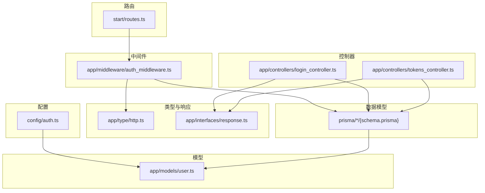
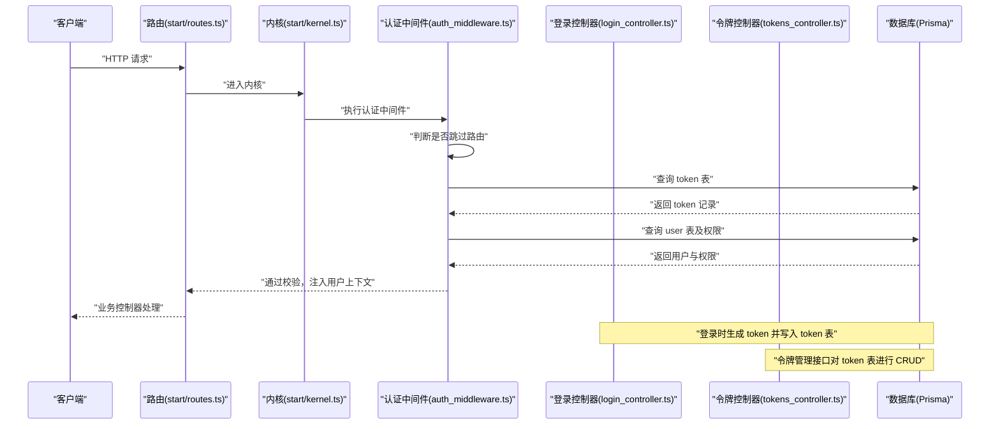
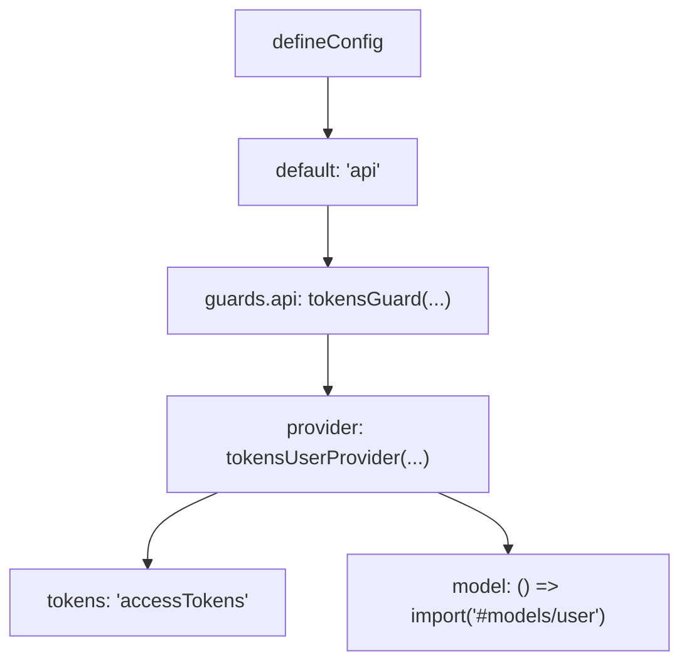
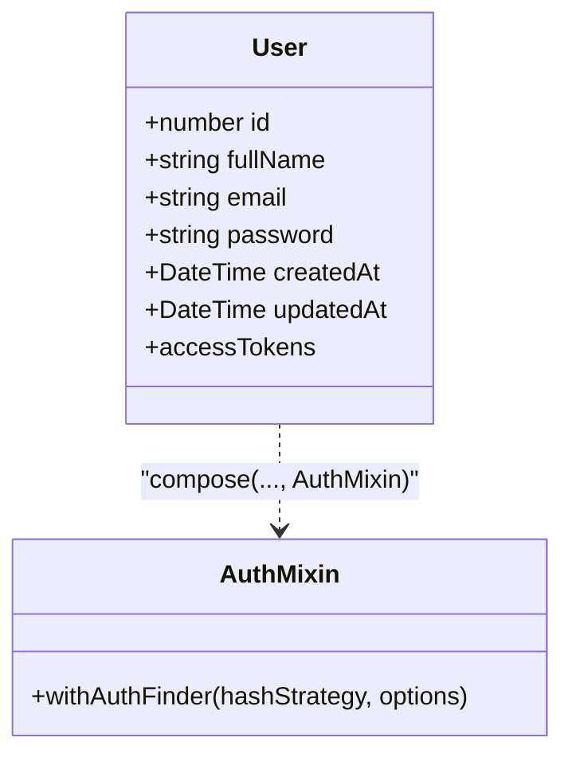
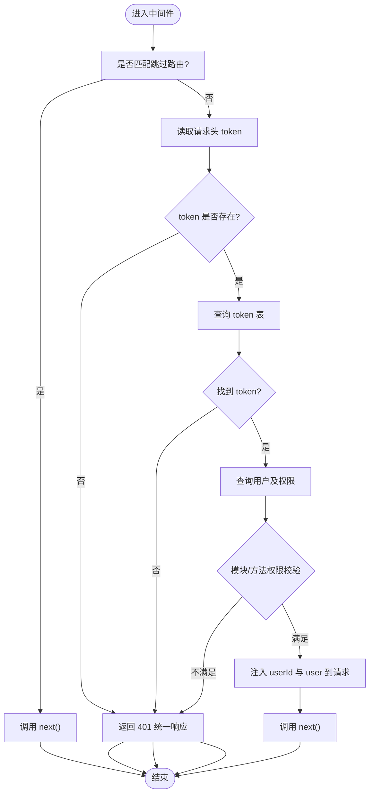
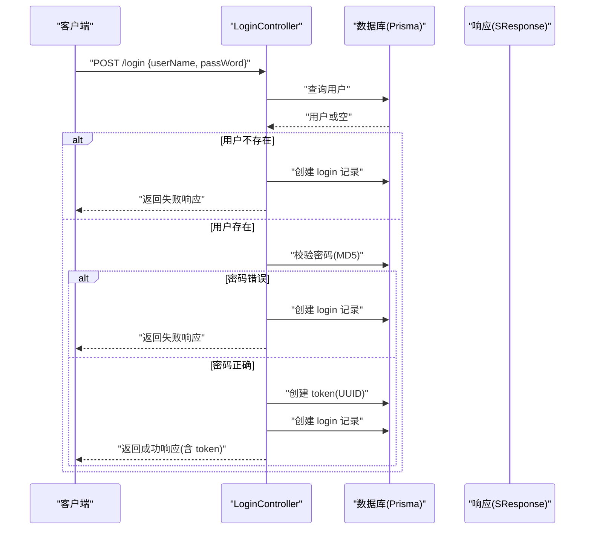
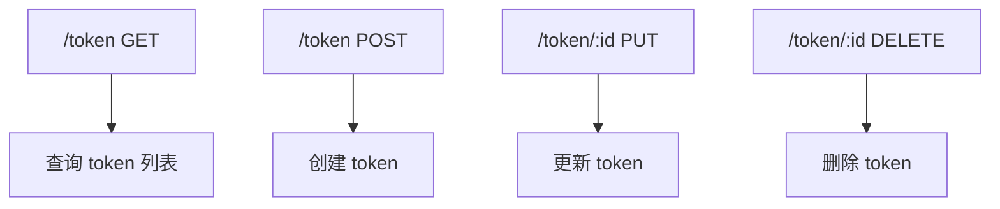
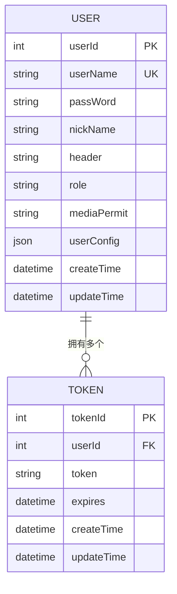
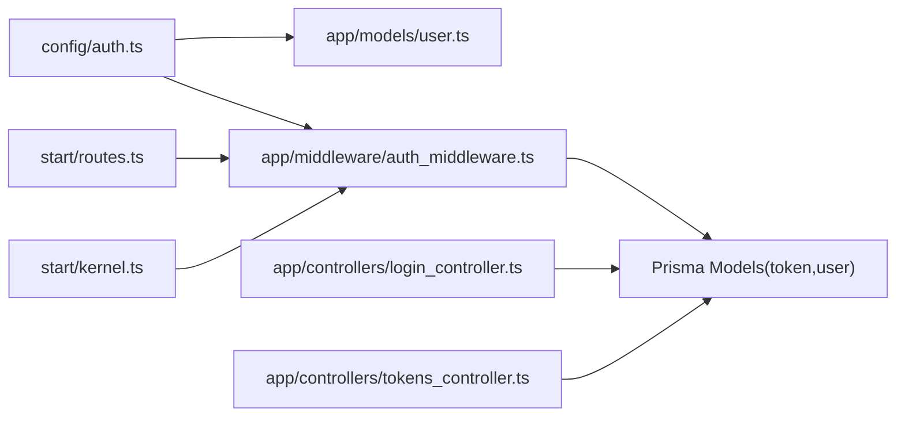

# 认证配置

<cite>
**本文引用的文件**
- [config/auth.ts](file://config/auth.ts)
- [app/models/user.ts](file://app/models/user.ts)
- [app/middleware/auth_middleware.ts](file://app/middleware/auth_middleware.ts)
- [app/controllers/login_controller.ts](file://app/controllers/login_controller.ts)
- [app/controllers/tokens_controller.ts](file://app/controllers/tokens_controller.ts)
- [start/kernel.ts](file://start/kernel.ts)
- [start/routes.ts](file://start/routes.ts)
- [app/type/http.ts](file://app/type/http.ts)
- [app/interfaces/response.ts](file://app/interfaces/response.ts)
- [prisma/sqlite/schema.prisma](file://prisma/sqlite/schema.prisma)
- [prisma/mysql/schema.prisma](file://prisma/mysql/schema.prisma)
- [prisma/pgsql/schema.prisma](file://prisma/pgsql/schema.prisma)
</cite>

## 目录
1. [简介](#简介)
2. [项目结构](#项目结构)
3. [核心组件](#核心组件)
4. [架构总览](#架构总览)
5. [详细组件分析](#详细组件分析)
6. [依赖关系分析](#依赖关系分析)
7. [性能考量](#性能考量)
8. [故障排查指南](#故障排查指南)
9. [结论](#结论)
10. [附录](#附录)

## 简介
本文件面向 SManga Adonis 的认证配置与实现，围绕以下目标展开：  
- 解释认证驱动配置、用户模型绑定、守卫设置等关键参数  
- 详解 JWT 令牌（访问令牌）配置、过期时间设置、刷新机制等认证相关选项  
- 解释认证中间件的工作原理与配置方法  
- 提供用户认证流程、令牌生成与验证机制的技术细节  
- 给出认证安全最佳实践、令牌存储与传输安全建议  
- 覆盖多用户模型支持与自定义认证驱动的配置方法  

本项目采用“基于访问令牌”的认证模式，而非传统 JWT。服务端通过数据库表 token 存储访问令牌，并在请求进入路由后由中间件校验令牌有效性。

## 项目结构
与认证相关的关键文件分布如下：
- 配置层：config/auth.ts 定义认证守卫与用户提供者
- 模型层：app/models/user.ts 使用 withAuthFinder 混入，绑定密码哈希策略与认证字段
- 中间件层：app/middleware/auth_middleware.ts 实现请求拦截、令牌校验与权限控制
- 控制器层：app/controllers/login_controller.ts 负责登录与令牌发放；app/controllers/tokens_controller.ts 提供令牌管理接口
- 路由层：start/routes.ts 定义受保护资源与公开接口
- 类型与响应：app/type/http.ts 扩展 HttpContext 以携带用户上下文；app/interfaces/response.ts 统一响应格式
- 数据层：prisma/*/schema.prisma 定义 token 与 user 表结构，其中 token 表含 expires 字段用于过期控制

图表来源
- [config/auth.ts:1-28](file://config/auth.ts#L1-L28)
- [app/models/user.ts:1-33](file://app/models/user.ts#L1-L33)
- [app/middleware/auth_middleware.ts:1-87](file://app/middleware/auth_middleware.ts#L1-L87)
- [app/controllers/login_controller.ts:1-115](file://app/controllers/login_controller.ts#L1-L115)
- [app/controllers/tokens_controller.ts:1-61](file://app/controllers/tokens_controller.ts#L1-L61)
- [start/routes.ts:1-241](file://start/routes.ts#L1-L241)
- [app/type/http.ts:1-15](file://app/type/http.ts#L1-L15)
- [app/interfaces/response.ts:1-64](file://app/interfaces/response.ts#L1-L64)
- [prisma/sqlite/schema.prisma:357-386](file://prisma/sqlite/schema.prisma#L357-L386)

章节来源
- [config/auth.ts:1-28](file://config/auth.ts#L1-L28)
- [app/models/user.ts:1-33](file://app/models/user.ts#L1-L33)
- [app/middleware/auth_middleware.ts:1-87](file://app/middleware/auth_middleware.ts#L1-L87)
- [app/controllers/login_controller.ts:1-115](file://app/controllers/login_controller.ts#L1-L115)
- [app/controllers/tokens_controller.ts:1-61](file://app/controllers/tokens_controller.ts#L1-L61)
- [start/routes.ts:1-241](file://start/routes.ts#L1-L241)
- [app/type/http.ts:1-15](file://app/type/http.ts#L1-L15)
- [app/interfaces/response.ts:1-64](file://app/interfaces/response.ts#L1-L64)
- [prisma/sqlite/schema.prisma:357-386](file://prisma/sqlite/schema.prisma#L357-L386)

## 核心组件
- 认证配置（config/auth.ts）
  - 默认守卫：api
  - 守卫类型：tokensGuard
  - 用户提供者：tokensUserProvider，绑定令牌存储键名与用户模型
  - 类型推断声明：通过 InferAuthenticators 与 InferAuthEvents 注入类型
- 用户模型（app/models/user.ts）
  - 使用 withAuthFinder 混入，指定 uid 字段为 email，密码列名为 password
  - accessTokens 提供者：DbAccessTokensProvider.forModel(User)，用于 Lucid ORM 与访问令牌集成
- 认证中间件（app/middleware/auth_middleware.ts）
  - 跳过列表：/deploy、/test、/login、/file、/analysis
  - 从请求头读取 token 并查询数据库 token 表
  - 校验失败返回统一响应格式
  - 对特定模块与 DELETE 方法进行角色与权限校验
  - 将用户信息注入 HttpContextWithUserId
- 登录控制器（app/controllers/login_controller.ts）
  - 根据用户名查询用户，校验密码（MD5）
  - 生成 UUID 作为 token 写入 token 表
  - 记录登录日志
- 令牌控制器（app/controllers/tokens_controller.ts）
  - 提供 token 表的增删改查接口
- 路由与内核（start/routes.ts、start/kernel.ts）
  - 路由注册顺序包含 initialize_auth_middleware 与自定义 auth_middleware
  - 统一错误处理与 CORS 中间件

章节来源
- [config/auth.ts:5-15](file://config/auth.ts#L5-L15)
- [app/models/user.ts:8-32](file://app/models/user.ts#L8-L32)
- [app/middleware/auth_middleware.ts:23-85](file://app/middleware/auth_middleware.ts#L23-L85)
- [app/controllers/login_controller.ts:34-93](file://app/controllers/login_controller.ts#L34-L93)
- [app/controllers/tokens_controller.ts:14-60](file://app/controllers/tokens_controller.ts#L14-L60)
- [start/kernel.ts:44-49](file://start/kernel.ts#L44-L49)
- [start/routes.ts:120-126](file://start/routes.ts#L120-L126)

## 架构总览
下图展示从请求到认证与授权的整体流程，包括令牌生成、校验与权限控制。

图表来源
- [start/kernel.ts:44-49](file://start/kernel.ts#L44-L49)
- [app/middleware/auth_middleware.ts:23-85](file://app/middleware/auth_middleware.ts#L23-L85)
- [app/controllers/login_controller.ts:68-93](file://app/controllers/login_controller.ts#L68-L93)
- [app/controllers/tokens_controller.ts:14-60](file://app/controllers/tokens_controller.ts#L14-L60)
- [prisma/sqlite/schema.prisma:357-386](file://prisma/sqlite/schema.prisma#L357-L386)

## 详细组件分析

### 认证配置（config/auth.ts）
- 默认守卫：api
- 守卫类型：tokensGuard
- 用户提供者：tokensUserProvider
  - tokens 键名：accessTokens
  - model 引用：#models/user
- 类型声明：通过 InferAuthenticators 与 InferAuthEvents 推断 Authenticators 与事件类型

图表来源
- [config/auth.ts:5-15](file://config/auth.ts#L5-L15)

章节来源
- [config/auth.ts:5-15](file://config/auth.ts#L5-L15)

### 用户模型与认证混入（app/models/user.ts）
- 使用 withAuthFinder 混入
  - uid：email
  - password 列名：password
- accessTokens 提供者：DbAccessTokensProvider.forModel(User)
- 模型字段：id、fullName、email、password、createdAt、updatedAt

图表来源
- [app/models/user.ts:8-32](file://app/models/user.ts#L8-L32)

章节来源
- [app/models/user.ts:8-32](file://app/models/user.ts#L8-L32)

### 认证中间件（app/middleware/auth_middleware.ts）
- 跳过路由前缀：/deploy、/test、/login、/file、/analysis
- 从请求头读取 token
- 查询 token 表是否存在该令牌
- 查询用户及其权限（媒体权限、模块权限）
- 角色与权限校验：/user 非 admin 拒绝；DELETE 非 admin 拒绝
- 注入 request.userId 与 request.user 到 HttpContextWithUserId
- 返回统一响应格式

图表来源
- [app/middleware/auth_middleware.ts:23-85](file://app/middleware/auth_middleware.ts#L23-L85)
- [app/type/http.ts:12-14](file://app/type/http.ts#L12-L14)
- [app/interfaces/response.ts:18-32](file://app/interfaces/response.ts#L18-L32)

章节来源
- [app/middleware/auth_middleware.ts:23-85](file://app/middleware/auth_middleware.ts#L23-L85)
- [app/type/http.ts:12-14](file://app/type/http.ts#L12-L14)
- [app/interfaces/response.ts:18-32](file://app/interfaces/response.ts#L18-L32)

### 登录流程与令牌生成（app/controllers/login_controller.ts）
- 根据用户名查询用户，若不存在则记录登录尝试
- 校验密码（MD5），失败则记录登录尝试
- 成功时生成 UUID 作为 token，写入 token 表
- 记录登录日志，包含 token、IP、UA 等
- 返回统一响应格式

图表来源
- [app/controllers/login_controller.ts:34-93](file://app/controllers/login_controller.ts#L34-L93)
- [app/interfaces/response.ts:18-32](file://app/interfaces/response.ts#L18-L32)

章节来源
- [app/controllers/login_controller.ts:34-93](file://app/controllers/login_controller.ts#L34-L93)
- [app/interfaces/response.ts:18-32](file://app/interfaces/response.ts#L18-L32)

### 令牌管理（app/controllers/tokens_controller.ts）
- 提供 token 表的列表、详情、创建、更新、删除接口
- 使用 Prisma 类型约束插入与更新数据

图表来源
- [app/controllers/tokens_controller.ts:14-60](file://app/controllers/tokens_controller.ts#L14-L60)
- [prisma/sqlite/schema.prisma:357-365](file://prisma/sqlite/schema.prisma#L357-L365)

章节来源
- [app/controllers/tokens_controller.ts:14-60](file://app/controllers/tokens_controller.ts#L14-L60)
- [prisma/sqlite/schema.prisma:357-365](file://prisma/sqlite/schema.prisma#L357-L365)

### 数据模型与令牌过期（prisma/*/schema.prisma）
- token 表字段：tokenId、userId、token、expires、createTime、updateTime
- user 表字段：userId、userName、passWord、nickName、header、role、mediaPermit、userConfig、createTime、updateTime
- 令牌过期：expires 字段可为空表示永不过期；可通过业务逻辑在查询时判断是否过期

图表来源
- [prisma/sqlite/schema.prisma:357-386](file://prisma/sqlite/schema.prisma#L357-L386)
- [prisma/mysql/schema.prisma:359-367](file://prisma/mysql/schema.prisma#L359-L367)
- [prisma/pgsql/schema.prisma:358-366](file://prisma/pgsql/schema.prisma#L358-L366)

章节来源
- [prisma/sqlite/schema.prisma:357-386](file://prisma/sqlite/schema.prisma#L357-L386)
- [prisma/mysql/schema.prisma:359-367](file://prisma/mysql/schema.prisma#L359-L367)
- [prisma/pgsql/schema.prisma:358-366](file://prisma/pgsql/schema.prisma#L358-L366)

## 依赖关系分析
- 认证配置依赖用户模型与访问令牌提供者
- 中间件依赖 Prisma 查询 token 与 user 表，并依赖 HttpContextWithUserId 注入用户上下文
- 控制器依赖 Prisma 进行 token 与 login 表的 CRUD
- 路由依赖内核注册中间件栈，确保认证中间件在业务控制器之前执行

图表来源
- [config/auth.ts:5-15](file://config/auth.ts#L5-L15)
- [app/models/user.ts:8-32](file://app/models/user.ts#L8-L32)
- [app/middleware/auth_middleware.ts:23-85](file://app/middleware/auth_middleware.ts#L23-L85)
- [app/controllers/login_controller.ts:34-93](file://app/controllers/login_controller.ts#L34-L93)
- [app/controllers/tokens_controller.ts:14-60](file://app/controllers/tokens_controller.ts#L14-L60)
- [start/routes.ts:120-126](file://start/routes.ts#L120-L126)
- [start/kernel.ts:44-49](file://start/kernel.ts#L44-L49)

章节来源
- [config/auth.ts:5-15](file://config/auth.ts#L5-L15)
- [app/models/user.ts:8-32](file://app/models/user.ts#L8-L32)
- [app/middleware/auth_middleware.ts:23-85](file://app/middleware/auth_middleware.ts#L23-L85)
- [app/controllers/login_controller.ts:34-93](file://app/controllers/login_controller.ts#L34-L93)
- [app/controllers/tokens_controller.ts:14-60](file://app/controllers/tokens_controller.ts#L14-L60)
- [start/routes.ts:120-126](file://start/routes.ts#L120-L126)
- [start/kernel.ts:44-49](file://start/kernel.ts#L44-L49)

## 性能考量
- 中间件按需动态引入 Prisma，减少启动时依赖加载开销
- 令牌查询与用户权限查询集中在中间件一次完成，避免重复查询
- 建议对 token 表与 user 表建立合适索引（如 token、userId），提升查询性能
- 对频繁访问的路由可考虑缓存用户权限集合，降低数据库压力

## 故障排查指南
- 401 令牌错误
  - 检查请求头是否包含 token
  - 检查 token 是否存在于 token 表
  - 检查用户是否存在且权限满足
- 权限不足
  - 检查用户角色是否为 admin（/user 模块与 DELETE 方法）
  - 检查用户模块权限与媒体权限映射
- 登录失败
  - 确认用户名存在且密码 MD5 匹配
  - 检查 login 表是否正确记录
- 令牌管理异常
  - 确认 token 表字段完整性（token、userId、expires）

章节来源
- [app/middleware/auth_middleware.ts:32-54](file://app/middleware/auth_middleware.ts#L32-L54)
- [app/middleware/auth_middleware.ts:63-76](file://app/middleware/auth_middleware.ts#L63-L76)
- [app/controllers/login_controller.ts:44-66](file://app/controllers/login_controller.ts#L44-L66)
- [app/controllers/tokens_controller.ts:14-60](file://app/controllers/tokens_controller.ts#L14-L60)

## 结论
本项目采用“基于访问令牌”的认证方案，通过配置层定义守卫与提供者、模型层绑定认证策略、中间件层执行令牌校验与权限控制、控制器层负责登录与令牌管理，形成完整的认证闭环。令牌过期可通过 expires 字段扩展，权限控制覆盖模块与媒体维度。建议结合索引优化与缓存策略进一步提升性能，并遵循安全最佳实践保障令牌与传输安全。

## 附录

### JWT 令牌配置、过期时间与刷新机制说明
- 当前实现为“访问令牌”而非 JWT。若需迁移到 JWT，请参考 AdonisJS 官方文档的 JWT 守卫与提供者配置方式，并在用户模型中启用相应的 JWT 提供者与过期策略。
- 过期时间：可在令牌生成时设置 expires 字段；也可在查询时根据业务逻辑判断是否过期。
- 刷新机制：建议在登录时同时发放短期访问令牌与长期刷新令牌，刷新令牌仅用于换取新的访问令牌，不直接用于业务访问。

### 认证中间件配置方法
- 在内核中注册 initialize_auth_middleware 与自定义 auth_middleware，确保认证中间件在业务路由之前执行
- 路由中可选择性地排除某些路径（如 /login、/deploy、/test 等）以跳过认证

章节来源
- [start/kernel.ts:44-49](file://start/kernel.ts#L44-L49)
- [app/middleware/auth_middleware.ts:23-30](file://app/middleware/auth_middleware.ts#L23-L30)

### 多用户模型与自定义认证驱动
- 多用户模型：可在配置中定义多个守卫（如 api、admin），每个守卫绑定不同的用户提供者与模型
- 自定义认证驱动：可基于 tokensGuard 与 tokensUserProvider 的组合扩展，或参考官方认证扩展包实现自定义提供者

章节来源
- [config/auth.ts:5-15](file://config/auth.ts#L5-L15)