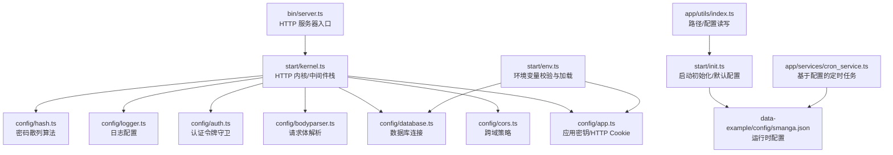
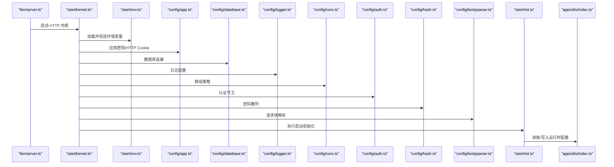

# 配置管理

<cite>
**本文引用的文件**
- [config/app.ts](file://config/app.ts)
- [config/auth.ts](file://config/auth.ts)
- [config/database.ts](file://config/database.ts)
- [config/logger.ts](file://config/logger.ts)
- [config/cors.ts](file://config/cors.ts)
- [config/hash.ts](file://config/hash.ts)
- [config/bodyparser.ts](file://config/bodyparser.ts)
- [start/env.ts](file://start/env.ts)
- [adonisrc.ts](file://adonisrc.ts)
- [package.json](file://package.json)
- [start/kernel.ts](file://start/kernel.ts)
- [start/init.ts](file://start/init.ts)
- [app/utils/index.ts](file://app/utils/index.ts)
- [app/services/cron_service.ts](file://app/services/cron_service.ts)
- [bin/server.ts](file://bin/server.ts)
- [data-example/config/smanga.json](file://data-example/config/smanga.json)
</cite>

## 目录
1. [简介](#简介)
2. [项目结构](#项目结构)
3. [核心组件](#核心组件)
4. [架构总览](#架构总览)
5. [详细组件分析](#详细组件分析)
6. [依赖分析](#依赖分析)
7. [性能考虑](#性能考虑)
8. [故障排除指南](#故障排除指南)
9. [结论](#结论)
10. [附录](#附录)

## 简介
本文件系统性梳理 SManga Adonis 的配置管理体系，覆盖应用配置、认证配置、数据库配置、日志配置、CORS 配置、哈希与请求体解析配置，以及运行时配置与环境变量管理。文档同时给出默认值、推荐设置、不同环境（开发、测试、生产）的差异与部署注意事项，并提供配置验证、故障排除与性能调优建议。

## 项目结构
SManga Adonis 使用 AdonisJS 标准配置组织方式，核心配置位于 config 目录；运行时配置通过 data-example 下的 smanga.json 提供；环境变量由 start/env.ts 统一校验与加载；服务注册与中间件栈在 adonisrc.ts 与 start/kernel.ts 中定义；启动流程在 bin/server.ts 中触发。

图表来源
- [bin/server.ts:1-46](file://bin/server.ts#L1-L46)
- [start/kernel.ts:1-69](file://start/kernel.ts#L1-L69)
- [config/app.ts:1-41](file://config/app.ts#L1-L41)
- [config/cors.ts:1-20](file://config/cors.ts#L1-L20)
- [config/bodyparser.ts:1-56](file://config/bodyparser.ts#L1-L56)
- [config/auth.ts:1-28](file://config/auth.ts#L1-L28)
- [config/database.ts:1-24](file://config/database.ts#L1-L24)
- [config/logger.ts:1-36](file://config/logger.ts#L1-L36)
- [config/hash.ts:1-25](file://config/hash.ts#L1-L25)
- [start/env.ts:1-39](file://start/env.ts#L1-L39)
- [start/init.ts:1-253](file://start/init.ts#L1-L253)
- [app/utils/index.ts:1-313](file://app/utils/index.ts#L1-L313)
- [app/services/cron_service.ts:1-144](file://app/services/cron_service.ts#L1-L144)
- [data-example/config/smanga.json:1-54](file://data-example/config/smanga.json#L1-L54)

章节来源
- [bin/server.ts:1-46](file://bin/server.ts#L1-L46)
- [start/kernel.ts:1-69](file://start/kernel.ts#L1-L69)
- [adonisrc.ts:1-72](file://adonisrc.ts#L1-L72)

## 核心组件
- 应用配置（config/app.ts）
  - 应用密钥用于加密 Cookie、签名 URL 与加密模块；生产环境需妥善保管。
  - HTTP 服务器启用请求 ID 生成，禁用方法伪装；Cookie 默认安全策略随环境变化。
- 认证配置（config/auth.ts）
  - 默认使用 API 令牌守卫，令牌类型为访问令牌，用户模型指向应用内用户模型。
- 数据库配置（config/database.ts）
  - Lucid 连接默认使用 MySQL2 客户端，连接参数来自环境变量；迁移路径固定。
- 日志配置（config/logger.ts）
  - 默认名为 app 的日志器；非生产环境使用控制台输出，生产环境使用文件传输；日志级别与应用名来自环境变量。
- CORS 配置（config/cors.ts）
  - 默认开启，允许常见方法与凭证，暴露头为空，预检缓存 90 秒。
- 哈希配置（config/hash.ts）
  - 默认使用 scrypt，提供成本、块大小、并行度与内存限制等参数。
- 请求体解析（config/bodyparser.ts）
  - 支持表单、JSON 与多部分上传；默认对空字符串转换为 null；多部分上传默认上限 20MB。
- 环境变量（start/env.ts）
  - 校验 NODE_ENV、PORT、APP_KEY、HOST、LOG_LEVEL、DB_* 等关键变量。
- 服务注册（adonisrc.ts）
  - 注册核心、CORS、数据库与认证等提供商；预加载路由与内核；测试套件配置。
- 运行时配置（data-example/config/smanga.json）
  - 包含 SQL 客户端、Imagick 参数、扫描/同步/压缩/队列/调试等配置项。
- 启动初始化（start/init.ts）
  - 跨平台创建数据目录与默认配置文件；创建默认管理员账户；清理缓存与重置任务状态；部署定时任务。

章节来源
- [config/app.ts:1-41](file://config/app.ts#L1-L41)
- [config/auth.ts:1-28](file://config/auth.ts#L1-L28)
- [config/database.ts:1-24](file://config/database.ts#L1-L24)
- [config/logger.ts:1-36](file://config/logger.ts#L1-L36)
- [config/cors.ts:1-20](file://config/cors.ts#L1-L20)
- [config/hash.ts:1-25](file://config/hash.ts#L1-L25)
- [config/bodyparser.ts:1-56](file://config/bodyparser.ts#L1-L56)
- [start/env.ts:1-39](file://start/env.ts#L1-L39)
- [adonisrc.ts:1-72](file://adonisrc.ts#L1-L72)
- [data-example/config/smanga.json:1-54](file://data-example/config/smanga.json#L1-L54)
- [start/init.ts:1-253](file://start/init.ts#L1-L253)

## 架构总览
下图展示配置在启动过程中的加载顺序与相互依赖关系。

图表来源
- [bin/server.ts:1-46](file://bin/server.ts#L1-L46)
- [start/kernel.ts:1-69](file://start/kernel.ts#L1-L69)
- [start/env.ts:1-39](file://start/env.ts#L1-L39)
- [config/app.ts:1-41](file://config/app.ts#L1-L41)
- [config/database.ts:1-24](file://config/database.ts#L1-L24)
- [config/logger.ts:1-36](file://config/logger.ts#L1-L36)
- [config/cors.ts:1-20](file://config/cors.ts#L1-L20)
- [config/auth.ts:1-28](file://config/auth.ts#L1-L28)
- [config/hash.ts:1-25](file://config/hash.ts#L1-L25)
- [config/bodyparser.ts:1-56](file://config/bodyparser.ts#L1-L56)
- [start/init.ts:1-253](file://start/init.ts#L1-L253)
- [app/utils/index.ts:1-313](file://app/utils/index.ts#L1-L313)

## 详细组件分析

### 应用配置（config/app.ts）
- 关键点
  - 应用密钥来源于环境变量，用于 Cookie 加密、签名 URL 与加密模块。
  - HTTP 服务器启用请求 ID，禁用方法伪装；异步本地存储可按需开启。
  - Cookie 默认路径“/”，有效期 2 小时，仅 HTTP，生产环境启用安全标志，SameSite 采用宽松策略。
- 默认值与推荐
  - Cookie 安全标志随环境切换；生产环境务必启用 HTTPS 并确保安全标志生效。
  - 异步本地存储默认关闭，如需全局上下文访问请评估性能影响后开启。
- 章节来源
  - [config/app.ts:13-40](file://config/app.ts#L13-L40)

### 认证配置（config/auth.ts）
- 关键点
  - 默认守卫为 API 令牌；令牌类型为访问令牌；用户提供者绑定至应用用户模型。
- 默认值与推荐
  - 保持 API 令牌作为默认守卫以适配前后端分离场景；如需刷新令牌或会话，请扩展守卫配置。
- 章节来源
  - [config/auth.ts:5-17](file://config/auth.ts#L5-L17)

### 数据库配置（config/database.ts）
- 关键点
  - 默认连接为 MySQL2；连接参数全部来自环境变量；迁移路径固定为 database/migrations。
- 默认值与推荐
  - 生产环境建议使用只读账号执行查询，写操作使用独立账号；开启连接池与超时配置。
- 章节来源
  - [config/database.ts:4-24](file://config/database.ts#L4-L24)

### 日志配置（config/logger.ts）
- 关键点
  - 默认日志器名为 app；非生产环境使用控制台输出，生产环境使用文件传输；日志级别与应用名来自环境变量。
- 默认值与推荐
  - 开发环境建议 debug 或 info；生产环境建议 info 或 warn；避免在生产环境开启过多调试日志。
- 章节来源
  - [config/logger.ts:5-27](file://config/logger.ts#L5-L27)

### CORS 配置（config/cors.ts）
- 关键点
  - 默认开启，允许 GET/HEAD/POST/PUT/DELETE；允许凭证；预检缓存 90 秒。
- 默认值与推荐
  - 生产环境建议明确 origin 白名单，避免使用通配；谨慎开放暴露头列表。
- 章节来源
  - [config/cors.ts:9-19](file://config/cors.ts#L9-L19)

### 哈希配置（config/hash.ts）
- 关键点
  - 默认使用 scrypt；可调整成本、块大小、并行度与最大内存。
- 默认值与推荐
  - 生产环境根据硬件能力适当提高成本，平衡安全与性能；避免使用弱算法。
- 章节来源
  - [config/hash.ts:3-16](file://config/hash.ts#L3-L16)

### 请求体解析（config/bodyparser.ts）
- 关键点
  - 支持表单、JSON 与多部分上传；空字符串统一转换为 null；多部分上传默认上限 20MB。
- 默认值与推荐
  - 大文件上传建议结合前端分片与后端流式处理；严格限制文件类型与大小。
- 章节来源
  - [config/bodyparser.ts:3-56](file://config/bodyparser.ts#L3-L56)

### 环境变量（start/env.ts）
- 关键点
  - 校验 NODE_ENV、PORT、APP_KEY、HOST、LOG_LEVEL、DB_HOST/PORT/USER/PASSWORD/DATABASE。
- 默认值与推荐
  - 必须在部署前补齐所有必需变量；生产环境务必设置安全的 APP_KEY 与只读数据库凭据。
- 章节来源
  - [start/env.ts:21-38](file://start/env.ts#L21-L38)

### 服务注册（adonisrc.ts）
- 关键点
  - 注册核心、CORS、数据库与认证提供商；预加载路由与内核；测试套件配置。
- 默认值与推荐
  - 新增第三方包时注意按需注册，避免不必要的启动开销。
- 章节来源
  - [adonisrc.ts:3-72](file://adonisrc.ts#L3-L72)

### 运行时配置（data-example/config/smanga.json）
- 关键点
  - SQL：客户端、主机、端口、用户名、密码、数据库、SQLite 文件、部署开关。
  - Imagick：内存、映射、密度、质量。
  - Scan：自动扫描、并发、重新加载封面、不复制封面、忽略隐藏文件、默认标签颜色、扫描间隔、媒体封面生成间隔、是否创建媒体封面。
  - Debug：同步派发开关。
  - SSL：证书与私钥路径。
  - Compress：同步开关、自动压缩、保存时长、海报尺寸、书签尺寸、自动清理、缓存上限、清理周期。
  - Queue：并发、重试次数、超时。
  - Sync：同步周期。
- 默认值与推荐
  - Windows 与 Linux 默认路径不同，需按平台正确挂载数据卷；生产环境建议将敏感信息（如数据库密码、SSL 私钥）置于安全位置并通过环境变量注入。
- 章节来源
  - [data-example/config/smanga.json:1-54](file://data-example/config/smanga.json#L1-L54)

### 启动初始化（start/init.ts）
- 关键点
  - 跨平台创建数据目录与默认配置文件；创建默认管理员账户；清理缓存与重置任务状态；部署定时任务。
  - 自动补全运行时配置缺失字段并写回。
- 默认值与推荐
  - 首次启动会自动生成默认配置；生产环境建议在部署前手动校验并固化配置。
- 章节来源
  - [start/init.ts:63-183](file://start/init.ts#L63-L183)

### 工具与服务（app/utils/index.ts、app/services/cron_service.ts）
- 关键点
  - 路径工具：根据操作系统返回数据目录与配置路径；读写运行时配置。
  - 定时任务：基于运行时配置部署扫描、同步、媒体封面生成与压缩缓存清理任务。
- 默认值与推荐
  - 定时任务表达式应结合业务负载合理设置；避免高并发冲突。
- 章节来源
  - [app/utils/index.ts:94-115](file://app/utils/index.ts#L94-L115)
  - [app/services/cron_service.ts:16-141](file://app/services/cron_service.ts#L16-L141)

## 依赖分析
- 配置耦合关系
  - config/app.ts 依赖环境变量（应用密钥、Cookie 安全标志）。
  - config/database.ts 依赖环境变量（数据库主机、端口、用户、密码、库名）。
  - config/logger.ts 依赖环境变量（应用名、日志级别）。
  - start/kernel.ts 串联所有配置并在启动时加载。
  - start/init.ts 与 app/utils/index.ts 协作完成运行时配置的读写与默认值补全。
  - app/services/cron_service.ts 依据运行时配置部署定时任务。
- 外部依赖
  - AdonisJS 核心、CORS、Lucid、Auth、Hash 等包。
- 章节来源
  - [start/kernel.ts:35-49](file://start/kernel.ts#L35-L49)
  - [start/init.ts:112-183](file://start/init.ts#L112-L183)
  - [app/services/cron_service.ts:16-141](file://app/services/cron_service.ts#L16-L141)

## 性能考虑
- 数据库
  - 合理设置连接池大小与超时；生产环境启用只读账号与主从分离。
- 日志
  - 生产环境避免高频 debug 日志；使用异步传输减少阻塞。
- CORS
  - 明确白名单与最小暴露头集合，降低跨域风险与带宽消耗。
- 哈希
  - scrypt 成本应根据 CPU/GPU 能力权衡；避免过度消耗导致认证延迟。
- 请求体解析
  - 控制多部分上传大小与类型；对大文件采用流式处理。
- 定时任务
  - 合理设置 Cron 表达式，避免任务重叠与资源争用。

## 故障排除指南
- 启动失败（环境变量缺失）
  - 症状：启动时报错提示缺少必要环境变量。
  - 排查：确认 NODE_ENV、PORT、APP_KEY、DB_HOST/PORT/USER/PASSWORD/DATABASE 是否齐全。
  - 章节来源
    - [start/env.ts:22-38](file://start/env.ts#L22-L38)
- 数据库连接异常
  - 症状：连接超时或认证失败。
  - 排查：核对 DB_HOST/PORT/USER/PASSWORD/DATABASE；确认网络连通与防火墙策略。
  - 章节来源
    - [config/database.ts:10-15](file://config/database.ts#L10-L15)
- 日志无输出或输出异常
  - 症状：开发环境看不到日志或生产环境日志未落盘。
  - 排查：确认 LOG_LEVEL 与应用名；检查文件传输目标权限与磁盘空间。
  - 章节来源
    - [config/logger.ts:14-22](file://config/logger.ts#L14-L22)
- CORS 跨域失败
  - 症状：浏览器报跨域错误。
  - 排查：确认 origin、credentials 与暴露头设置；生产环境避免使用通配。
  - 章节来源
    - [config/cors.ts:10-17](file://config/cors.ts#L10-L17)
- 认证失败
  - 症状：访问受保护接口返回 401。
  - 排查：确认令牌有效性与用户模型绑定；检查守卫配置。
  - 章节来源
    - [config/auth.ts:7-14](file://config/auth.ts#L7-L14)
- 运行时配置缺失字段
  - 症状：功能异常或默认行为与预期不符。
  - 排查：启动时会自动补全缺失字段；建议手动核对并固化配置。
  - 章节来源
    - [start/init.ts:112-183](file://start/init.ts#L112-L183)

## 结论
SManga Adonis 的配置体系遵循 AdonisJS 标准，结合运行时 JSON 配置实现灵活的功能开关与参数调节。通过严格的环境变量校验、合理的默认值与启动初始化逻辑，系统可在不同环境中稳定运行。建议在生产环境强化安全配置（HTTPS、强密钥、最小权限）、优化日志与数据库性能，并定期审查与固化配置。

## 附录

### 不同环境（开发/测试/生产）配置差异与部署注意事项
- 开发环境
  - NODE_ENV=development；日志级别建议 debug；Cookie 安全标志关闭；允许更多暴露头便于调试。
  - 章节来源
    - [start/env.ts:22](file://start/env.ts#L22)
    - [config/logger.ts:16](file://config/logger.ts#L16)
- 测试环境
  - NODE_ENV=test；可使用内存数据库或专用测试库；日志级别 info；关闭生产特性。
  - 章节来源
    - [start/env.ts:22](file://start/env.ts#L22)
- 生产环境
  - NODE_ENV=production；启用 HTTPS；Cookie 安全标志开启；日志落盘；最小化 CORS 暴露；数据库凭据最小权限。
  - 章节来源
    - [config/app.ts:37](file://config/app.ts#L37)
    - [config/logger.ts:20](file://config/logger.ts#L20)
    - [config/cors.ts:15](file://config/cors.ts#L15)

### 配置验证清单
- 环境变量
  - NODE_ENV、PORT、APP_KEY、HOST、LOG_LEVEL、DB_HOST、DB_PORT、DB_USER、DB_PASSWORD、DB_DATABASE。
  - 章节来源
    - [start/env.ts:22-38](file://start/env.ts#L22-L38)
- 应用配置
  - APP_KEY 有效；Cookie 安全标志与环境匹配。
  - 章节来源
    - [config/app.ts:13](file://config/app.ts#L13)
    - [config/app.ts:37](file://config/app.ts#L37)
- 数据库配置
  - 连接参数正确；网络可达；权限足够。
  - 章节来源
    - [config/database.ts:10-15](file://config/database.ts#L10-L15)
- 日志配置
  - LOG_LEVEL 合理；传输目标存在且可写。
  - 章节来源
    - [config/logger.ts:16](file://config/logger.ts#L16)
    - [config/logger.ts:20](file://config/logger.ts#L20)
- CORS 配置
  - origin 与暴露头符合业务需求；凭证按需开启。
  - 章节来源
    - [config/cors.ts:11](file://config/cors.ts#L11)
    - [config/cors.ts:14](file://config/cors.ts#L14)
- 运行时配置
  - data-example/config/smanga.json 字段完整；路径与权限正确。
  - 章节来源
    - [data-example/config/smanga.json:1-54](file://data-example/config/smanga.json#L1-L54)
    - [start/init.ts:210-218](file://start/init.ts#L210-L218)