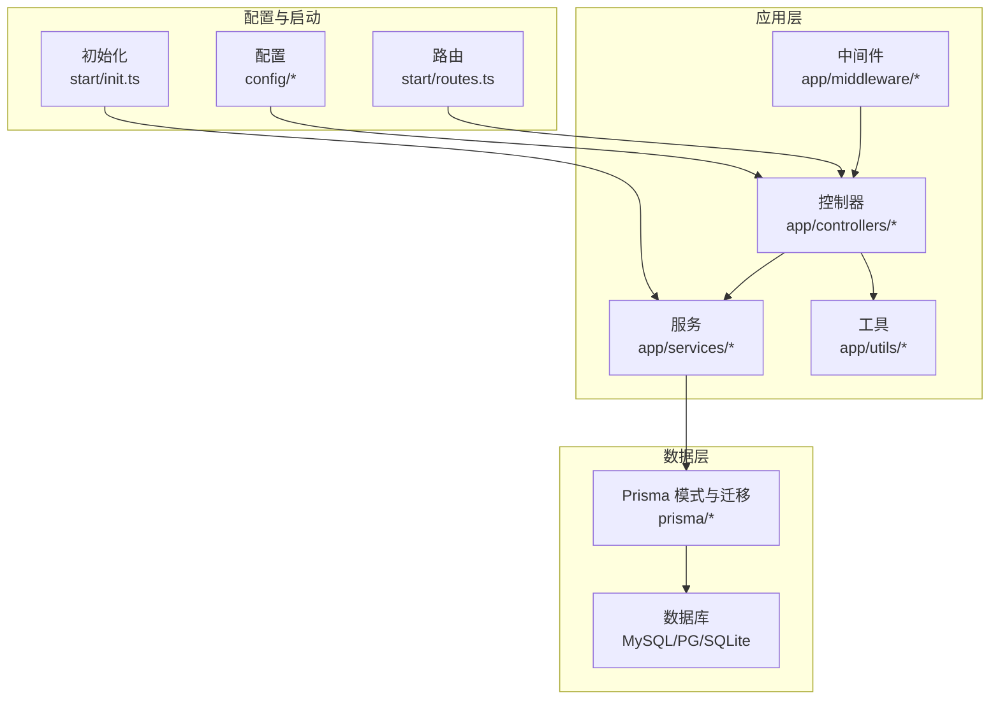
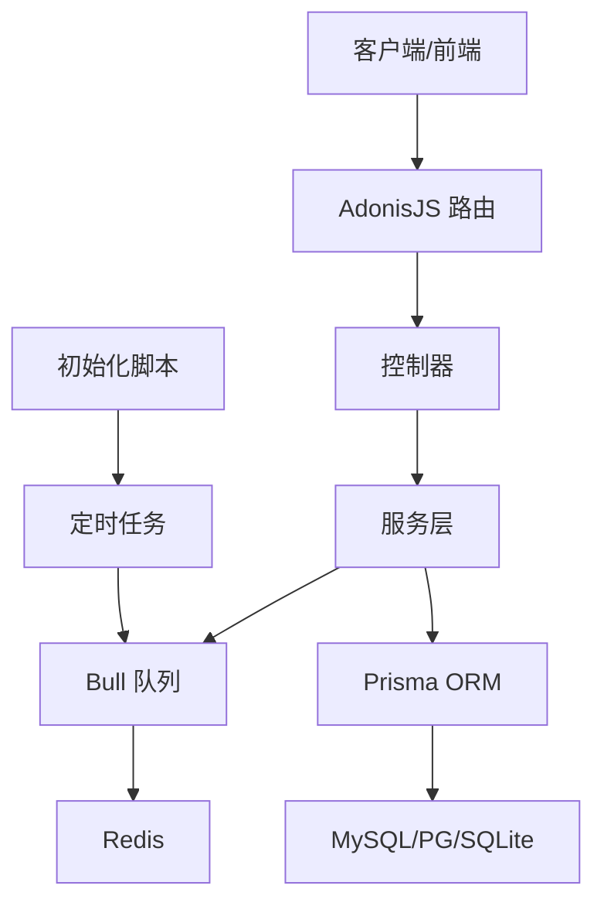
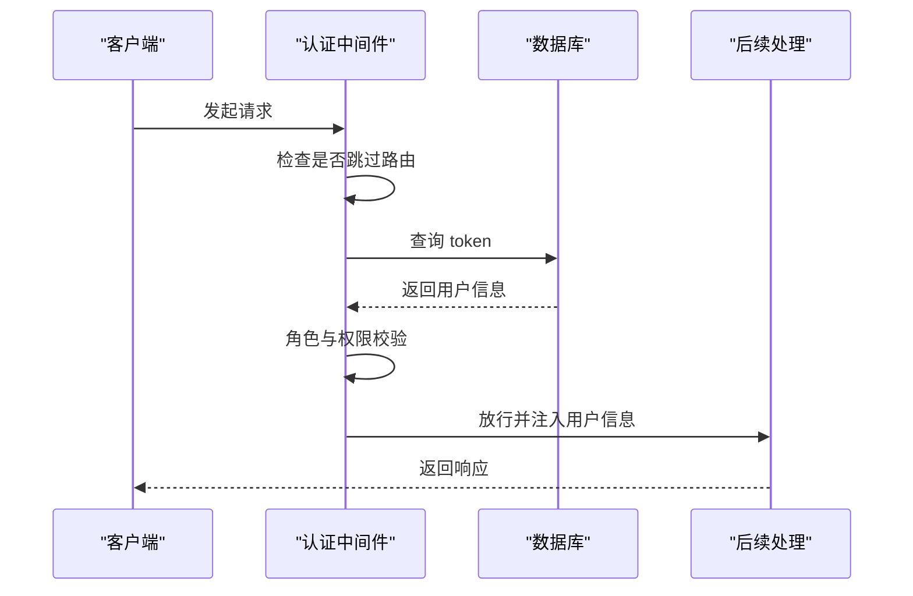
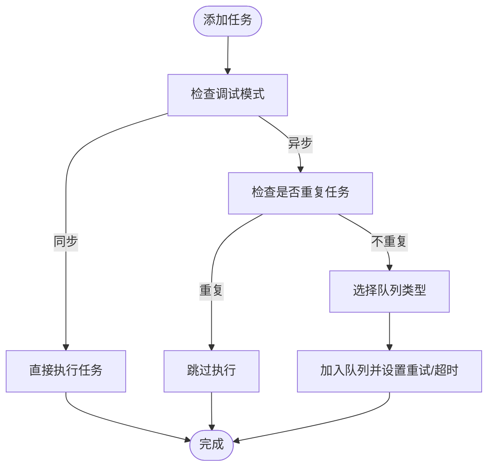
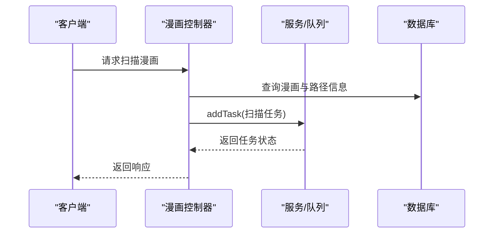
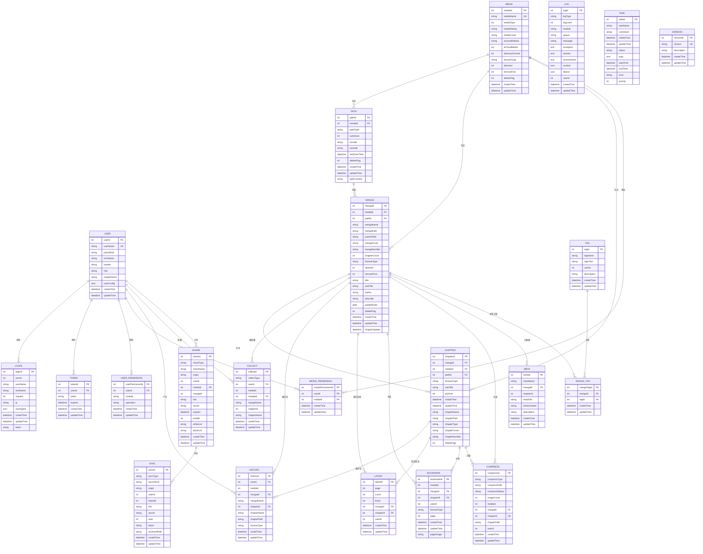
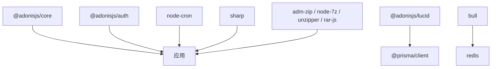

# 项目概述

<cite>
**本文档引用的文件**
- [package.json](file://package.json)
- [adonisrc.ts](file://adonisrc.ts)
- [start/routes.ts](file://start/routes.ts)
- [config/app.ts](file://config/app.ts)
- [prisma/mysql/schema.prisma](file://prisma/mysql/schema.prisma)
- [app/controllers/manga_controller.ts](file://app/controllers/manga_controller.ts)
- [app/controllers/users_controller.ts](file://app/controllers/users_controller.ts)
- [app/services/queue_service.ts](file://app/services/queue_service.ts)
- [app/middleware/auth_middleware.ts](file://app/middleware/auth_middleware.ts)
- [app/services/task_service.ts](file://app/services/task_service.ts)
- [app/utils/index.ts](file://app/utils/index.ts)
- [data-example/config/smanga.json](file://data-example/config/smanga.json)
- [start/init.ts](file://start/init.ts)
</cite>

## 目录
1. [简介](#简介)
2. [项目结构](#项目结构)
3. [核心组件](#核心组件)
4. [架构总览](#架构总览)
5. [详细组件分析](#详细组件分析)
6. [依赖关系分析](#依赖关系分析)
7. [性能考虑](#性能考虑)
8. [故障排查指南](#故障排查指南)
9. [结论](#结论)
10. [附录](#附录)

## 简介
SManga Adonis 是一个基于 AdonisJS 6.x 构建的完整漫画管理系统后端服务。该项目旨在为用户提供统一的漫画资源管理能力，涵盖用户管理、漫画与章节管理、收藏与历史记录、任务调度、文件处理与压缩、媒体库与路径扫描、分享与同步等功能模块。系统采用现代化技术栈，结合 TypeScript、Prisma ORM、Bull 队列与 Redis，确保高可用、可扩展与易维护。

本项目适合以下场景：
- 家庭或小型团队的本地漫画库管理
- 需要自动化扫描、压缩与封面生成的漫画服务器
- 对权限控制与多媒体库隔离有要求的组织环境
- 需要任务调度与异步处理的漫画同步与元数据管理

## 项目结构
项目遵循 AdonisJS 的标准 MVC 结构，并按功能域划分目录：
- app/controllers：HTTP 控制器，负责请求处理与响应封装
- app/models：模型定义（通过 Prisma 管理）
- app/services：业务服务与任务处理器（队列与定时任务）
- app/middleware：中间件（认证、参数处理等）
- app/utils：通用工具函数（路径、日志、文件处理等）
- config：应用配置（HTTP、数据库、认证等）
- prisma：数据库迁移与模式定义（支持 MySQL、PostgreSQL、SQLite）
- start：启动引导、路由注册、初始化逻辑
- data-example：示例配置与测试数据

**图表来源**
- [start/routes.ts:1-241](file://start/routes.ts#L1-L241)
- [app/controllers/manga_controller.ts:1-460](file://app/controllers/manga_controller.ts#L1-L460)
- [app/services/queue_service.ts:1-267](file://app/services/queue_service.ts#L1-L267)
- [prisma/mysql/schema.prisma:1-449](file://prisma/mysql/schema.prisma#L1-L449)

**章节来源**
- [start/routes.ts:1-241](file://start/routes.ts#L1-L241)
- [adonisrc.ts:1-72](file://adonisrc.ts#L1-L72)
- [config/app.ts:1-41](file://config/app.ts#L1-L41)

## 核心组件
- 控制器层：提供 RESTful 接口，覆盖用户、漫画、章节、收藏、历史、标签、媒体库、路径、任务、分享、同步等模块
- 中间件层：统一认证与权限校验，支持跳过特定路由
- 服务层：任务队列（Bull + Redis）、定时任务、文件处理、压缩、扫描、同步等
- 数据访问层：Prisma ORM，支持多数据库后端
- 工具层：跨平台路径管理、日志、文件操作、JSON 序列化/反序列化

**章节来源**
- [app/controllers/manga_controller.ts:1-460](file://app/controllers/manga_controller.ts#L1-L460)
- [app/controllers/users_controller.ts:1-160](file://app/controllers/users_controller.ts#L1-L160)
- [app/services/queue_service.ts:1-267](file://app/services/queue_service.ts#L1-L267)
- [app/middleware/auth_middleware.ts:1-87](file://app/middleware/auth_middleware.ts#L1-L87)
- [app/utils/index.ts:1-313](file://app/utils/index.ts#L1-L313)

## 架构总览
系统采用分层架构与事件驱动设计：
- 表现层：AdonisJS 路由与控制器
- 业务层：服务与任务处理器
- 数据层：Prisma + 多数据库后端
- 异步层：Bull 队列 + Redis，支持扫描、压缩、删除、同步等任务
- 定时层：node-cron + 初始化脚本，自动创建定时任务
- 安全层：JWT 风格 Token 认证与权限中间件

**图表来源**
- [start/routes.ts:1-241](file://start/routes.ts#L1-L241)
- [app/services/queue_service.ts:1-267](file://app/services/queue_service.ts#L1-L267)
- [start/init.ts:1-253](file://start/init.ts#L1-L253)

## 详细组件分析

### 认证与权限中间件
- 支持跳过特定路由（如部署、测试、登录、文件、分析）
- 从请求头读取 token，查询数据库验证有效性
- 注入用户信息与权限列表到请求上下文
- 对用户管理与 DELETE 请求进行角色校验

**图表来源**
- [app/middleware/auth_middleware.ts:23-85](file://app/middleware/auth_middleware.ts#L23-L85)

**章节来源**
- [app/middleware/auth_middleware.ts:1-87](file://app/middleware/auth_middleware.ts#L1-L87)

### 任务队列与异步处理
- 使用 Bull 在 Redis 中维护队列，支持 scan、sync、compress 三类队列
- addTask 根据任务名称与配置选择队列类型，设置优先级、超时与重试策略
- 任务去重：针对路径扫描与删除任务，避免重复执行
- 支持同步调试模式，便于开发阶段快速验证

**图表来源**
- [app/services/queue_service.ts:175-264](file://app/services/queue_service.ts#L175-L264)

**章节来源**
- [app/services/queue_service.ts:1-267](file://app/services/queue_service.ts#L1-L267)

### 漫画管理控制器
- 提供漫画的增删改查、分页与排序、扫描、元数据编辑、标签管理、批量压缩与清理等接口
- 权限控制：非管理员需具备媒体权限才能操作
- 与任务队列集成：删除漫画、扫描漫画、压缩章节等均以任务形式异步执行

**图表来源**
- [app/controllers/manga_controller.ts:217-259](file://app/controllers/manga_controller.ts#L217-L259)

**章节来源**
- [app/controllers/manga_controller.ts:1-460](file://app/controllers/manga_controller.ts#L1-L460)

### 用户管理控制器
- 提供用户列表、详情、创建、更新、删除与用户配置读取
- 密码加密存储，支持媒体权限与模块权限的动态配置

**章节来源**
- [app/controllers/users_controller.ts:1-160](file://app/controllers/users_controller.ts#L1-L160)

### 数据模型与关系
系统使用 Prisma 定义了完整的漫画管理数据模型，涵盖用户、媒体库、路径、漫画、章节、收藏、历史、标签、任务、分享、同步等实体，并建立清晰的关系约束与唯一索引。

**图表来源**
- [prisma/mysql/schema.prisma:1-449](file://prisma/mysql/schema.prisma#L1-L449)

**章节来源**
- [prisma/mysql/schema.prisma:1-449](file://prisma/mysql/schema.prisma#L1-L449)

### 路由与接口概览
系统提供丰富的 RESTful 接口，覆盖用户、漫画、章节、收藏、历史、标签、媒体库、路径、任务、分享、同步、配置、文件等模块。路由采用按功能域分组的方式，便于维护与扩展。

**章节来源**
- [start/routes.ts:1-241](file://start/routes.ts#L1-L241)

### 初始化与配置
- 自动创建数据目录与默认配置文件
- 校验并补齐配置项，保证兼容性
- 重置中断任务状态，恢复队列一致性
- 创建定时任务：扫描、同步、媒体海报生成、压缩清理

**章节来源**
- [start/init.ts:63-110](file://start/init.ts#L63-L110)
- [data-example/config/smanga.json:1-54](file://data-example/config/smanga.json#L1-L54)

## 依赖关系分析
- AdonisJS 核心：提供 HTTP 服务器、路由、中间件、依赖注入等基础设施
- Prisma：数据库抽象层，支持多数据库后端与强类型模型
- Bull + Redis：任务队列与持久化，支持优先级、重试与可视化面板
- node-cron：定时任务调度
- 其他工具库：文件解压、图像处理、加密、UUID、XML 解析等

**图表来源**
- [package.json:62-88](file://package.json#L62-L88)
- [adonisrc.ts:24-35](file://adonisrc.ts#L24-L35)

**章节来源**
- [package.json:1-100](file://package.json#L1-L100)
- [adonisrc.ts:1-72](file://adonisrc.ts#L1-L72)

## 性能考虑
- 任务队列并发与重试：通过配置项控制并发度、最大重试次数与超时时间，避免资源争用与长时间阻塞
- 任务去重：对路径扫描与删除任务进行去重，减少重复 IO
- 分页查询：漫画列表支持分页与排序，降低一次性数据传输压力
- 缓存清理：启动时清理缓存目录，避免磁盘膨胀
- 数据库适配：支持 SQLite、MySQL、PostgreSQL，可根据部署环境选择最优方案

[本节为通用性能建议，无需具体文件分析]

## 故障排查指南
- 认证失败：检查 token 是否存在、是否过期、是否被正确注入到请求上下文
- 权限不足：确认用户角色与媒体权限，以及中间件对特定路由的放行规则
- 任务未执行：检查 Redis 连接、队列配置、任务去重逻辑与调试模式
- 数据库连接：确认 Prisma 连接字符串与数据库可用性
- 日志定位：查看日志文件与队列面板，定位异常任务与错误堆栈

**章节来源**
- [app/middleware/auth_middleware.ts:32-54](file://app/middleware/auth_middleware.ts#L32-L54)
- [app/services/queue_service.ts:34-47](file://app/services/queue_service.ts#L34-L47)
- [app/utils/index.ts:189-199](file://app/utils/index.ts#L189-L199)

## 结论
SManga Adonis 以 AdonisJS 为核心，结合 Prisma、Bull 与 Redis，构建了一个功能完备、可扩展且易于维护的漫画管理系统后端。其模块化设计、完善的权限体系与异步任务机制，使其能够满足从个人到团队的多样化需求。通过合理的配置与定时任务，系统能够在后台高效地完成扫描、压缩、同步等繁重工作，同时保持前端交互的流畅与稳定。

[本节为总结性内容，无需具体文件分析]

## 附录
- 技术栈优势
  - TypeScript：静态类型保障代码质量与可维护性
  - AdonisJS：成熟的 Web 框架，内置认证、路由、中间件等能力
  - Prisma：强类型 ORM，支持多数据库与迁移管理
  - Bull + Redis：可靠的任务队列与可视化管理
  - node-cron：简单可靠的定时任务调度

- 系统特性清单
  - 用户与权限管理
  - 多媒体库与路径扫描
  - 漫画与章节管理
  - 收藏、历史与书签
  - 标签与元数据管理
  - 压缩与缓存清理
  - 分享与同步
  - 任务调度与监控
  - 跨平台文件处理

- 适用场景
  - 家庭/小团队本地漫画库
  - 需要自动化处理的漫画服务器
  - 对权限与数据隔离有要求的组织
  - 需要稳定的异步任务与定时任务的场景

[本节为概念性内容，无需具体文件分析]